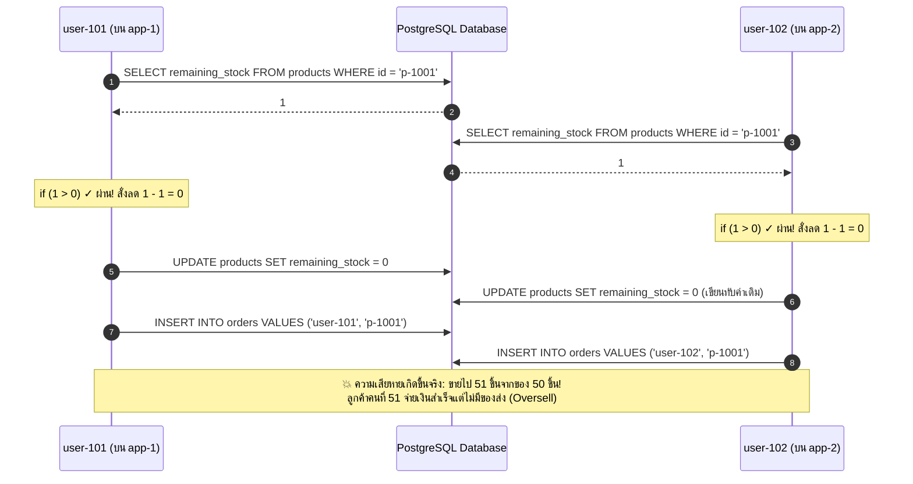
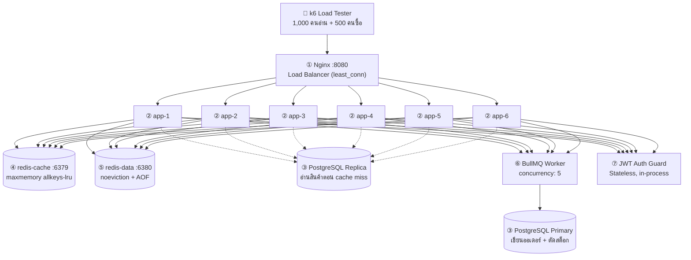
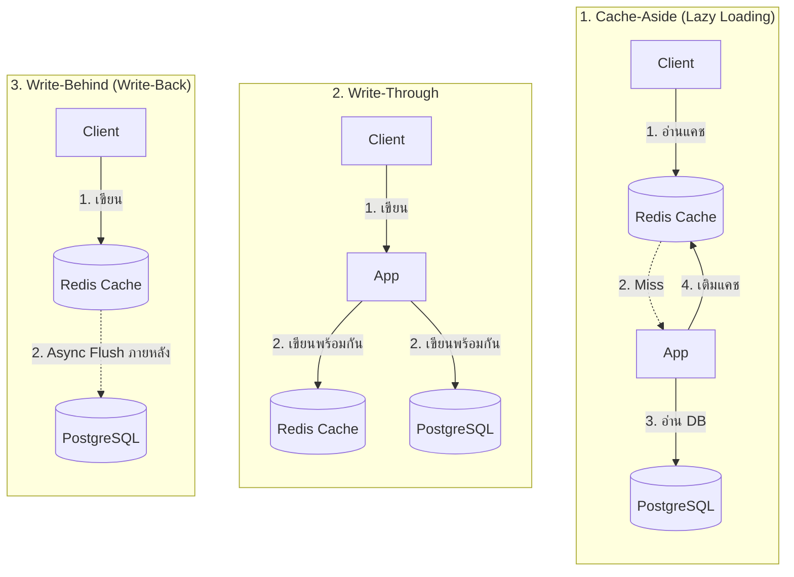
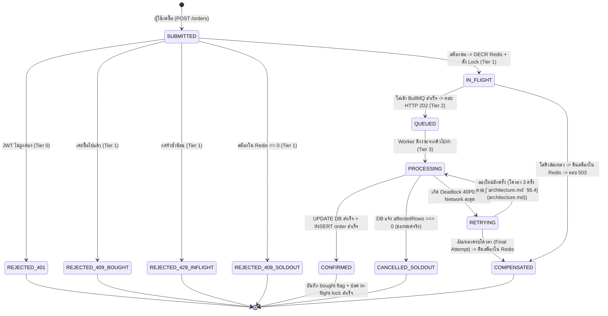

# 🎓 Architecture Primer — ปูพื้นฐาน Flash Sale System ตั้งแต่ศูนย์

> <สัญญาของเอกสาร>
> - **เอกสารนี้ตอบ "ทำไม" ก่อน "อะไรอยู่ตรงไหน"**
> - **ไม่ใช่สเปก** — สเปกอยู่ที่ [`architecture.md`](architecture.md) ถ้าสองไฟล์ขัดกัน **ถือว่า `architecture.md` ถูก**
> - **อ่านจบแล้วต้องทำได้**: อธิบายสถาปัตยกรรม Flash Sale System, เข้าใจแก่นของ Concurrency & Race Conditions, รู้ลึกเทคนิค Locking แต่ละแบบ (Optimistic vs Pessimistic vs Distributed vs Row Lock), เข้าใจกลยุทธ์ Caching & Invalidation (Cache-Aside, Stock Overlay, Single-Flight, Jitter), และตอบได้ว่าทำไมระบบถึงเลือกวิธีนี้
> - **เนื้อหาอ้างอิง**: [`architecture.md`](architecture.md), โค้ดเบสจริงในโฟลเดอร์ `src/`, และบทเรียน `Backend01` ถึง `Backend06`
> </สัญญาของเอกสาร>

> ⚠️ **หมายเหตุการอ้างอิงโค้ดจริง**: โค้ดตัวอย่างในเอกสารนี้ได้รับการปรับปรุงให้ตรงกับโค้ดเบสที่รันจริงทุกจุด (รวมถึงโมดูล `src/observability/` และ `src/redis/lua/`) หากต้องการดูแผนที่โค้ดแบบระบุบรรทัดละเอียด ให้อ่านควบคู่กับ [`../Codebase/Separate/01-codebase-primer.md`](../Codebase/Separate/01-codebase-primer.md)

---

## 🗺️ §0 แผนที่การอ่าน (Reading Map)

| § | หัวข้อ | จำเป็นตอนนี้ไหม |
| :---: | :--- | :---: |
| [§0](#️-0-แผนที่การอ่าน-reading-map) | แผนที่การอ่าน, ขอบเขตความรู้ (FLOOR/FROM_ZERO), และบันไดความรู้ | ⭐ **ต้องอ่าน** |
| [§1](#1--โจทย์นี้ยากตรงไหน--แก่นเดียวของทั้งโปรเจกต์) | โจทย์นี้ยากตรงไหน — แก่นเดียวของทั้งโปรเจกต์ | ⭐ **ต้องอ่าน** |
| [§2](#2--ตัวละคร-7-ตัวในระบบ) | ตัวละคร 7 ตัวในระบบ และศัพท์ประจำตัวละคร | ⭐ **ต้องอ่าน** |
| [§3](#3-️-เส้นทางหลักทั้งสองเส้น-the-two-critical-paths) | เส้นทางหลัก: Read Path (§3.1) และ Write Path (§3.2) | ⭐ **ต้องอ่าน** |
| [§4](#4--เจาะลึกเทคนิค-concurrency--locking--optimistic-vs-pessimistic-vs-distributed-lock-vs-row-lock) | **เจาะลึกเทคนิค Concurrency & Locking**: Optimistic vs Pessimistic vs Distributed vs Row Lock | ⭐ **ต้องอ่าน** |
| [§5](#5--เจาะลึกเทคนิค-caching--cache-invalidation--cache-aside-stampede-avalanche-single-flight-memo) | **เจาะลึกเทคนิค Caching & Cache Invalidation**: Cache-Aside, Stock Overlay, Stampede, Jitter | ⭐ **ต้องอ่าน** |
| [§6](#6--ทำไมต้อง-4-ด่าน-ด่านเดียวไม่พอเหรอ) | ทำไมต้อง 4 ด่าน ด่านเดียวไม่พอเหรอ (หลายชั้น) | ⭐ **ต้องอ่าน** |
| [§7](#7--ชีวิตของ-order-1-ใบ-state-machine) | ชีวิตของ order 1 ใบ (State Machine & Danger State) | ⭐ **ต้องอ่าน** |
| [§8](#8--ตารางรวม-ถ้าทำผิดจะพังยังไง) | ตารางรวม: ถ้าทำผิดจะพังยังไง (พร้อมระดับการรู้ตัว) | อ่านตอนเริ่มเขียนโค้ด / Debug |
| [§9](#9--สิ่งที่เอกสารนี้ตัดออกไป-และทำไม) | สิ่งที่เอกสารนี้ตัดออก (+เหตุผล) | อ่านเสริม |
| [§10](#10--glossary) | Glossary รวมศัพท์จัดหมวดหมู่ | เปิดดูตอนเจอศัพท์ |
| [§11](#11--คำถามทดสอบตัวเอง) | คำถามทดสอบตัวเอง 11 ข้อ (พร้อมเฉลยดักทางผิด) | ⭐ **ทำหลังอ่านจบ** |
| [§12](#12--อ่านอะไรต่อ) | อ่านอะไรต่อ (ตารางเรียงลำดับ & ความสนใจ) | — |

---

### ขอบเขตความรู้เดิมและสิ่งที่จะสอน (Pedagogical Baseline)

- **พื้นฐานที่สมมติว่าคุณมีอยู่แล้ว (FLOOR — เอกสารนี้จะไม่สอนซ้ำ)**:
  1. การเขียน REST API ด้วย TypeScript / Node.js
  2. HTTP Methods (`GET`, `POST`) และ HTTP Status Codes พื้นฐาน (`200 OK`, `400 Bad Request`, `401 Unauthorized`, `404 Not Found`, `500 Internal Server Error`)
  3. คำสั่ง SQL พื้นฐาน (`SELECT`, `INSERT`, `UPDATE`, `WHERE`, `PRIMARY KEY`, `UNIQUE`)
  4. ไวยากรณ์ภาษา TypeScript (`async/await`, `Promise`, `try/catch`, `Map`, `Set`, `JSON.parse`)
  5. พื้นฐาน Node.js Event Loop (Single-threaded execution, Non-blocking I/O)

- **สิ่งที่จะสอนให้ตั้งแต่ศูนย์ (FROM_ZERO — 18 ศัพท์สำคัญ)**:
  1. *Race Condition*, 2. *TOCTOU*, 3. *Lost Update*, 4. *Optimistic Locking*, 5. *Pessimistic Locking*, 6. *Row-level Locking & Contention*, 7. *Deadlock (`40P01`) & Lock Hierarchy*, 8. *Atomic Operation / Decrement*, 9. *Cache-Aside*, 10. *Distributed In-Flight Lock*, 11. *Message Queue & Decoupling (202 Accepted)*, 12. *Stock Overlay Pattern*, 13. *Cache Invalidation*, 14. *Cache Stampede*, 15. *In-Process Single-Flight Promise Memoization*, 16. *Cache Avalanche & TTL Jitter*, 17. *Idempotency & Compensation*, 18. *Write-Through & Write-Behind*

---

### 🪜 ตารางบันไดความรู้ (Knowledge Ladder — กติกา ป1)

ตารางนี้แสดงลำดับการพึ่งพาของศัพท์ทุกตัว เพื่อรับประกันว่า **"ศัพท์ทุกคำจะถูกสอนก่อนถูกนำไปใช้เสมอ"**:

| ลำดับ | ศัพท์ (Term) | ต้องรู้อะไรก่อน (Prerequisites) | สอนที่ (Section) | ใช้ครั้งแรกที่ (First Used) |
| :---: | :--- | :--- | :---: | :---: |
| 1 | **Race Condition** | Node.js Event Loop (FLOOR), Concurrent Traffic (FLOOR) | §1.1 | §1.1 ✅ |
| 2 | **TOCTOU** (Time-of-Check to Time-of-Use) | Race Condition, SQL SELECT / UPDATE (FLOOR) | §1.1 | §1.1 ✅ |
| 3 | **Lost Update** | Race Condition, SQL UPDATE (FLOOR) | §1.1 | §1.1 ✅ |
| 4 | **Optimistic Locking** (`@VersionColumn`) | Lost Update, SQL UPDATE ... WHERE (FLOOR) | §1.4, §4.2 | §1.4 ✅ |
| 5 | **Pessimistic Locking** (`SELECT ... FOR UPDATE`) | TOCTOU, SQL Transaction (FLOOR) | §1.4, §4.3 | §1.4 ✅ |
| 6 | **Row-level Locking & Contention** | Pessimistic Locking, PostgreSQL Row-level Lock | §1.4, §4.3 | §1.4 ✅ |
| 7 | **Deadlock (`40P01`) & Lock Hierarchy** | Row-level Locking, SQL Transaction (FLOOR) | §1.4, §4.6 | §1.4 ✅ |
| 8 | **Atomic Operation / Decrement** | TOCTOU, Lost Update | §1.4, §4.5 | §1.4 ✅ |
| 9 | **Cache-Aside (Lazy Loading)** | REST GET (FLOOR), SQL SELECT (FLOOR) | §2.4, §5.2 | §2.4 ✅ |
| 10 | **Distributed In-Flight Lock** (Redis Mutex) | Race Condition, Node.js Non-blocking I/O (FLOOR) | §2.5, §4.4 | §2.5 ✅ |
| 11 | **Message Queue & Decoupling** (BullMQ) | HTTP Status Codes (FLOOR), Async Processing | §2.6, §3.2 | §2.6 ✅ |
| 12 | **Stock Overlay Pattern** | Cache-Aside, Atomic Operation | §3.1, §5.3 | §3.1 ✅ |
| 13 | **Cache Invalidation** | Cache-Aside, TTL (FLOOR) | §3.1, §5.4 | §3.1 ✅ |
| 14 | **Cache Stampede (Thundering Herd)** | Cache-Aside, Concurrent Requests (FLOOR) | §3.1, §5.4 | §3.1 ✅ |
| 15 | **In-Process Single-Flight Memoization** | Cache Stampede, JS Promise (FLOOR), Event Loop (FLOOR) | §3.1, §5.4 | §3.1 ✅ |
| 16 | **Cache Avalanche & TTL Jitter** | Cache-Aside, Cache Stampede | §3.1, §5.4 | §3.1 ✅ |
| 17 | **Idempotency & Compensation** | Message Queue, SQL UNIQUE constraint (FLOOR) | §3.2, §4.5 | §3.2 ✅ |
| 18 | **Write-Through & Write-Behind** | Cache-Aside, SQL UPDATE (FLOOR) | §5.2 | §5.2 ✅ |

---

## 1. ⭐ โจทย์นี้ยากตรงไหน — แก่นเดียวของทั้งโปรเจกต์

### 1.1 ปัญหา: ลองนึกว่าเขียนแบบธรรมดาที่สุด

สมมติเขียน `POST /api/v1/orders` แบบตรงไปตรงมา — แบบที่ทุกคนเขียนตอนเรียน CRUD ทั่วไป:

```typescript
// ❌ โค้ดแบบธรรมดา — ใช้ในโปรเจกต์นี้ไม่ได้เด็ดขาด
async createOrder(userId: string, productId: string) {
  const product = await this.repo.findOne({ where: { id: productId } });
  if (product.remainingStock > 0) {                      // (1) Check: เช็คว่ามีของไหม
    product.remainingStock = product.remainingStock - 1;  // (2) Modify: ลดค่าใน RAM
    await this.repo.save(product);                        // (3) Use: บันทึกลงฐานข้อมูล
    await this.orderRepo.insert({ userId, productId });
    return { status: 'success' };
  }
  throw new ConflictException('Sold out');
}
```

โค้ดนี้ **ถูกต้อง 100%** ถ้ามีคนกดซื้อทีละคน (Sequential Requests)

แต่โจทย์ของวิชานี้คือ สินค้า `p-1001` (Limited Edition Sneaker) มีของตั้งต้นเพียง **50 ชิ้น** แล้วมี **500 คนกดซื้อพร้อมกันในเสี้ยววินาทีเดียวกัน** (ดู [`products-seed.json`](../Requirement/products-seed.json): `"availableStock": 50`)

นี่คือภาพสิ่งที่เกิดขึ้นจริงในเสี้ยววินาทีที่ของเหลือชิ้นสุดท้าย (`remaining_stock = 1`):



> 📖 **กล่องสอนศัพท์ประจำ §1.1**
> 
> 1. **Race Condition**
>    - *ปัญหาเดิม*: เมื่อผู้ใช้หลายคนส่งคำขอเข้ามาพร้อมกัน ระบบที่อ่าน-ตรวจ-เขียนแบบไม่รัดกุม จะได้ผลลัพธ์ขึ้นกับจังหวะเวลาที่ไม่แน่นอน
>    - *นิยาม*: สภาวะผิดพลาดที่ผลลัพธ์ของระบบขึ้นอยู่กับลำดับหรือเวลาในการทำงานของเหตุการณ์ที่เกิดขึ้นพร้อมกัน
>    - *อุปมา*: ลูกค้าสองคนดูหน้าเว็บพร้อมกัน เห็นสต็อก 1 เท่ากัน จึงกดยืนยันซื้อทั้งคู่ และระบบปล่อยผ่านทั้งคู่
>    - *ในงานจริง*: เกิดขึ้นในโค้ดตัวอย่างข้างบนที่ `app-1` และ `app-2` รันขนานกัน
>    - *กับดัก*: คิดว่า Node.js เป็น Single-threaded แล้วจะไม่มีทางเกิด Race Condition (ลืมไปว่า Node.js สลับงานตอน `await` I/O และเรามีถึง 6 instances)
> 
> 2. **TOCTOU (Time-of-Check to Time-of-Use)**
>    - *ปัญหาเดิม*: การแยกคำสั่งเช็คข้อมูลออกจากคำสั่งใช้งานข้อมูล เปิดช่องว่างให้ข้อมูลเปลี่ยนไปก่อนถูกใช้งานจริง
>    - *นิยาม*: ช่องโหว่เชิงลำดับเวลาที่ข้อมูลในระบบเปลี่ยนไประหว่างจังหวะที่ทำการตรวจสอบ กับจังหวะที่นำผลตรวจนั้นไปใช้
>    - *อุปมา*: บรรทัดที่เช็ค `if (product.remainingStock > 0)` กับบรรทัดที่บันทึก `repo.save(product)` มีเวลาห่างกันไม่กี่มิลลิวินาที แต่ในมิลลิวินาทีนั้นของถูกคนอื่นตัดหน้าไปแล้ว
>    - *ในงานจริง*: ช่องว่างระหว่าง `findOne()` และ `save()` ในโค้ดตัวอย่างข้างบน
>    - *กับดัก*: คิดว่าโค้ดที่เขียนติดกันสองบรรทัดจะทำงานเร็วมากจนไม่มีใครแทรกทัน
> 
> 3. **Lost Update**
>    - *ปัญหาเดิม*: สองคำขออ่านค่าเดียวกันไปคำนวณ แล้วต่างคนต่างเขียนค่าทับลงฐานข้อมูล ทำให้ยอดตัดสต็อกของคำขอแรกสูญหายไป
>    - *นิยาม*: บั๊กความไม่สอดคล้องที่เกิดจากการที่ธุรกรรมหนึ่งบันทึกข้อมูลทับการเปลี่ยนแปลงของอีกธุรกรรมหนึ่งโดยไม่รู้ตัว
>    - *อุปมา*: ของมี 10 ชิ้น A ซื้อ 1 ชิ้น (คิดในใจได้ 9) B ซื้อ 1 ชิ้น (คิดในใจได้ 9) ทั้งคู่ส่งเลข 9 ไปบันทึกใน DB สต็อกจึงลดไปแค่ 1 ทั้งที่ขายได้ 2 ชิ้น
>    - *ในงานจริง*: การส่งค่าสัมบูรณ์ `save(product)` แทนที่จะส่งคำสั่งสัมพัทธ์ `SET remaining_stock = remaining_stock - 1` ให้ฐานข้อมูล

---

### 1.2 เพราะฉะนั้นทั้งโปรเจกต์นี้กำลังตอบคำถามเดียว

> ### 🎯 "ทำยังไงให้ 500 คำขอที่มาพร้อมกัน ตัดสินใจถูกทุกคำขอ **และ** ตอบกลับเร็วด้วย"

ทุกกล่องใน architecture diagram, ทุกคอนฟิกใน Redis, ทุกตารางใน PostgreSQL และทุกบรรทัดของ Lua Script มีอยู่เพื่อตอบคำถามนี้ ไม่มีกล่องไหนใส่มาเพื่อความเท่

---

### 1.3 เกณฑ์ตัดสินคือ SQL 3 บรรทัดนี้ (รันได้จริง)

จาก [`architecture.md` §9.3](architecture.md) — นี่คือสิ่งที่บอกว่าระบบของคุณผ่านการทดสอบหรือไม่ผ่าน (Ground Truth):

```sql
-- 1. ตรวจสอบสต็อกคงเหลือ
SELECT remaining_stock FROM products WHERE id = 'p-1001';
-- ค่าที่ถูกต้องเป๊ะ: ต้องได้ 0 พอดี
--   < 0 (เช่น -1): 💥 OVERSELL (ขายของเกินสต็อกที่มีจริง — ข้อสอบตกทันที!)
--   > 0 (เช่น  3): 💥 UNDERSELL (ขายของไม่หมดทั้งที่คนแย่งซื้อล้นหลาม — สต็อกรั่วหายไปไหน?)

-- 2. ตรวจสอบจำนวนออเดอร์และจำนวนผู้ซื้อ
SELECT COUNT(*), COUNT(DISTINCT user_id) FROM orders WHERE product_id = 'p-1001';
-- ค่าที่ถูกต้องเป๊ะ: ต้องได้ 50, 50 พอดี
--   COUNT(*) = 50: มีออเดอร์สำเร็จครบ 50 ชิ้น
--   COUNT(DISTINCT user_id) = 50: มาจากลูกค้า 50 คนไม่ซ้ำหน้ากัน (ห้ามมีใครได้ของเกิน 1 ชิ้น)
```

**จำ 3 บรรทัดนี้ไว้ให้ดี** — ทุกกลไกวิศวกรรมที่กำลังจะอธิบาย มีเป้าหมายสูงสุดเพียงอย่างเดียวคือทำให้ SQL 3 บรรทัดนี้ออกมาเป็น `(0)` และ `(50, 50)` เสมอ

> 💡 **ไม่ต้องพิมพ์ SQL เองก็ได้**: ระบบของเรามีหน้า Dashboard และ Endpoint อัตโนมัติ `GET /admin/insights` ที่รันคำสั่งตรวจสอบชุดนี้ให้ตลอดเวลา พร้อมเปรียบเทียบกับ Counter ใน Redis ให้แบบเรียลไทม์

---

### 1.4 แล้วใส่ lock ธรรมดาไม่จบเหรอ? (ปูพื้นฐานสู่การตัดสินใจ)

คำถามแรกที่ทุกคนสงสัย: *"ในเมื่อมันเกิด Race Condition ก็แค่สั่งล็อกตารางหรือล็อกแถวไว้ตอนซื้อ ไม่จบเหรอ?"*

คำตอบคือ: **จบเรื่องความถูกต้อง แต่พังเรื่องความเร็ว** (ตามข้อกำหนดและเกณฑ์การทดสอบ Performance P95 ใน [`architecture.md` §9.3](architecture.md)):

| ทางเลือก | ถูกต้อง? (Zero Oversell) | เร็ว? (Latency ต่ำ) | ทำไมถึงใช้ / ไม่ใช้ในระบบนี้ |
| :--- | :---: | :---: | :--- |
| **1. อ่าน-เช็ค-เขียนใน Node.js** | ❌ (Oversell แน่นอน) | ⚡ เร็ว | เกิดช่องว่าง TOCTOU และ Lost Update ชัดเจนตามตัวอย่าง §1.1 |
| **2. Optimistic Locking (`@VersionColumn`)** | ✅ ถูกต้อง | 💥 ช้ามาก / ล่ม | ผู้ใช้ 500 คนอ่านเวอร์ชันเดียวกัน มีคนผ่านแค่ 1 คน อีก 499 คน abort ทันที! เกิด Retry Storm ถล่ม DB พัง (เจาะลึกใน [§4.2](#42--เทคนิคที่-1-optimistic-locking-versioncolumn--ดาบชั้นดีในงาน-crud-ที่หักสะบั้นใน-flash-sale)) |
| **3. Pessimistic Locking (`SELECT ... FOR UPDATE`)** | ✅ ถูกต้อง | 💥 ช้ามาก / Timeout | 500 คนต่อคิวแย่ง Row Lock แถวเดียว Connection Pool ทั้งหมดถูกยึดค้าง คำขออื่นติดขัดจน Nginx ตัด 504 Timeout (เจาะลึกใน [§4.3](#43--เทคนิคที่-2-pessimistic-locking-select--for-update--ถูกต้อง-100-แต่ทำลายระบบบน-synchronous-http)) |
| **4. Database Atomic Decrement (`UPDATE ... WHERE stock > 0`)** | ✅ ถูกต้อง | 🟡 ปานกลาง | ถูกต้องและตัด TOCTOU ได้ แต่ถ้าปล่อย 500 requests วิ่งชน DB พร้อมกันโดยตรง Throughput ของ DB จะตัน (เจาะลึกใน [§4.5](#45--ยุทธศาสตร์ที่เลือกใช้จริง-สถาปัตยกรรมป้องกัน-4-ชั้น-4-tier-defense-architecture)) |
| **5. สถาปัตยกรรม 4-Tier Defense ของเรา** | ✅ **ถูกต้อง 100%** | ⚡ **เร็วที่สุด (~1ms)** | **ใช้ Atomic Redis Lua สกัดคน 450 คนทิ้งตั้งแต่ขอบระบบ**, ส่ง 50 คนเข้าคิว BullMQ ตอบ 202 ทันที, แล้วให้ Worker ไปรัน Atomic UPDATE บน DB อย่างเป็นระเบียบ (เจาะลึกใน [§4.5](#45--ยุทธศาสตร์ที่เลือกใช้จริง-สถาปัตยกรรมป้องกัน-4-ชั้น-4-tier-defense-architecture)) |

> 📖 **กล่องสอนศัพท์ประจำ §1.4 (กลุ่มเทคนิคการควบคุม Concurrency & Locking)**
> 
> 4. **Optimistic Locking (`@VersionColumn`)**
>    - *ปัญหาเดิม*: การอ่าน-ตรวจ-เขียนธรรมดาเปิดช่องให้คำขออื่นแอบเขียนทับข้อมูล (Lost Update) โดยไม่รู้ตัว
>    - *นิยามหนึ่งประโยค*: เทคนิคการควบคุม Concurrency แบบไม่ล็อกแถวในฐานข้อมูล แต่อาศัยการตรวจสอบหมายเลขเวอร์ชันของแถวก่อนบันทึก หากเวอร์ชันเปลี่ยนไปจะถือว่าขัดแย้งและยกเลิกคำขอ
>    - *อุปมา (ยึดกับ FLOOR)*: เหมือนการแก้ไขไฟล์ใน Git แล้วพยายาม push — ถ้าไม่มีใครแตะไฟล์เลยก็ push ผ่านทันที แต่ถ้ามีคน push ตัดหน้าไปก่อน Git จะปฏิเสธและสั่งให้เรา pull เวอร์ชั่นใหม่มาก่อน
>    - *ในงานจริงคือตัวไหน*: การประกาศคอลัมน์ `@VersionColumn() version: number` ใน Entity ของ TypeORM (ดูตัวอย่างโค้ดใน §4.2)
>    - *กับดักของศัพท์นี้*: คิดว่า Optimistic Locking ปลอดภัยเสมอ จึงนำมาใช้กับทุกงาน แต่ใน Flash Sale ที่มีคนแย่งซื้อ 500 คนพร้อมกัน คำขอ 499 คนจะถูกยกเลิก (Abort) ทันที และหากสั่ง Retry จะเกิดพายุ Retry Storm ถล่มจนฐานข้อมูลล่ม
> 
> 5. **Pessimistic Locking (`SELECT ... FOR UPDATE`)**
>    - *ปัญหาเดิม*: ข้อมูลถูกคนอื่นแย่งแก้ไขตัดหน้าในระหว่างที่โปรเซสกำลังทำงาน (TOCTOU)
>    - *นิยามหนึ่งประโยค*: เทคนิคการควบคุม Concurrency โดยการสั่งให้ฐานข้อมูลครอบ Exclusive Lock บนแถวข้อมูลตั้งแต่ตอนอ่าน และบล็อกคนอื่นไม่ให้แก้ไขจนกว่าธุรกรรมจะเสร็จสิ้น
>    - *อุปมา (ยึดกับ FLOOR)*: เหมือนการเดินเข้าห้องน้ำแล้วล็อกประตูด้านใน คนถัดไปที่ต้องการใช้ต้องยืนรอหน้าห้องจนกว่าคนข้างในจะทำธุระเสร็จและปลดกลอน
>    - *ในงานจริงคือตัวไหน*: คำสั่ง `queryRunner.manager.findOne(..., { lock: { mode: 'pessimistic_write' } })` ซึ่งส่ง SQL `SELECT ... FOR UPDATE` ไปยัง PostgreSQL (ดูตัวอย่างโค้ดใน §4.3)
>    - *กับดักของศัพท์นี้*: คิดว่าล็อกแถวแล้วระบบจะถูกต้องและจบ แต่การสั่งล็อกบน Synchronous HTTP Path จะทำให้ Connection Pool ของฐานข้อมูลหมดเกลี้ยง (Pool Starvation) จนระบบล่มและตอบ 504 Gateway Timeout
> 
> 6. **Row-level Locking & Contention**
>    - *ปัญหาเดิม*: เมื่อหลายคำขอพยายามเข้าถึงหรือแก้ไขข้อมูลในตารางเดียวกัน ระบบต้องการกลไกจำกัดสิทธิ์ในระดับแถว ไม่ให้กระทบแถวอื่นที่ไม่เกี่ยวข้องกัน
>    - *นิยามหนึ่งประโยค*: กลไกภายในของฐานข้อมูล (เช่น PostgreSQL) ที่ล็อกเฉพาะแถว (Row) ที่กำลังถูกกระทำ และสภาวะการแย่งชิง (Contention) ที่เกิดขึ้นเมื่อมีหลายคำขอต้องการล็อกแถวเดียวกันในเวลาเดียวกัน
>    - *อุปมา (ยึดกับ FLOOR)*: เหมือนตู้ล็อกเกอร์ฝากของที่มีหลายสิบช่อง คนสองคนที่เปิดตู้คนละช่องสามารถทำพร้อมกันได้ทันที แต่ถ้าคน 500 คนต้องการเปิดใช้ช่องเบอร์ 1 ช่องเดียวกัน จะเกิดการเบียดแย่งชิง (Contention) จนแถวติดขัด
>    - *ในงานจริงคือตัวไหน*: กลไก Tuple Locks ใน PostgreSQL เมื่อทำงานกับตาราง `products` แถว `p-1001` (ดู [`architecture.md` §6.5](architecture.md))
>    - *กับดักของศัพท์นี้*: คิดว่าการล็อกเฉพาะแถว (Row Lock) ดีกว่าล็อกทั้งตาราง (Table Lock) เสมอ แต่ถ้าทุกคำขอในระบบพุ่งเป้าไปที่ "สินค้าชิ้นเดียวกันตัวเดียว" Row Lock ตัวนั้นจะกลายเป็นคอขวดที่หนักหน่วงไม่ต่างจาก Table Lock เลย
> 
> 7. **Deadlock (`40P01`) & Lock Hierarchy**
>    - *ปัญหาเดิม*: เมื่อสองธุรกรรมที่ทำงานพร้อมกัน ต่างฝ่ายต่างถือ Lock ทรัพยากรคนละชิ้น แล้วต่างคนต่างรอให้อีกฝ่ายปล่อย Lock เพื่อทำงานต่อ ทำให้ติดค้างตลอดกาล (Circular Wait)
>    - *นิยามหนึ่งประโยค*: สภาวะชะงักงันสมบูรณ์ที่คำขอตั้งแต่ 2 รายการขึ้นไปรอคอย Lock ของกันและกันเป็นวงกลม จนฐานข้อมูลต้องสั่งทำลายธุรกรรมหนึ่งทิ้งด้วย Error Code `40P01`
>    - *อุปมา (ยึดกับ FLOOR)*: รถสองคันขับสวนกันเข้ามาในตรอกแคบ คัน A รอให้คัน B ถอย คัน B ก็รอให้คัน A ถอย ไม่มีใครยอมถอย จนกระทั่งเจ้าหน้าที่จราจร (PostgreSQL Deadlock Detector) ต้องสั่งยกรถคันหนึ่งออกไป
>    - *ในงานจริงคือตัวไหน*: ข้อผิดพลาด `40P01` ใน PostgreSQL เมื่อ Transaction แย่งล็อกระหว่างแถวในตาราง `products` และแถวในตาราง `orders` แก้ไขได้ด้วยการจัดลำดับ Lock (Lock Hierarchy: อัปเดต `products` ก่อน `orders` เสมอ ตาม [`architecture.md` §6.5](architecture.md))
>    - *กับดักของศัพท์นี้*: คิดว่า Deadlock เกิดจากการเขียนโค้ดช้า แต่ความจริงเกิดจาก "ลำดับการขอ Lock ไม่ตรงกัน" ต่อให้โค้ดทำงานเร็วระดับไมโครวินาที ก็เกิด Deadlock ได้หากลำดับการเข้าถึงทรัพยากรขัดแย้งกัน
> 
> 8. **Atomic Operation / Decrement**
>    - *ปัญหาเดิม*: การอ่านค่ามาคำนวณใน RAM แล้วเขียนกลับ (Read-Modify-Write) เกิดช่องว่างเวลาให้ข้อมูลสูญหาย (Lost Update / TOCTOU)
>    - *นิยามหนึ่งประโยค*: การทำงานที่รวบขั้นตอนการตรวจสอบและปรับปรุงข้อมูลให้เสร็จสิ้นในคำสั่งเดียวอย่างเบ็ดเสร็จ โดยไม่มีจังหวะเวลาแทรกแซงจากคำขออื่นได้เลย
>    - *อุปมา (ยึดกับ FLOOR)*: เหมือนเครื่องกดเงิน ATM ที่หักยอดเงินในบัญชีและพ่นธนบัตรออกมาในจังหวะกลไกเดียว ไม่มีการแยกกระบวนการนับเงินออกจากกระบวนการตัดยอด
>    - *ในงานจริงคือตัวไหน*: คำสั่ง SQL `UPDATE products SET remaining_stock = remaining_stock - 1 WHERE id = $1 AND remaining_stock > 0` ใน PostgreSQL (Tier 3) และคำสั่ง `DECR` / Lua Script ใน `redis-data` (Tier 1) ตาม [`architecture.md` §6.1](architecture.md)
>    - *กับดักของศัพท์นี้*: คิดว่าการใช้คำสั่ง Atomic Operation บนฐานข้อมูลหลักเพียงอย่างเดียวจะเพียงพอกับโหลดระดับ Flash Sale แต่ความจริงฐานข้อมูลมีขีดจำกัดด้าน I/O และ Connection Pool จึงต้องมี Atomic Gatekeeper บน Redis คอยสกัดโหลดไว้ที่ขอบระบบก่อน

---

## 2. ⭐ ตัวละคร 7 ตัวในระบบ



---

### ① Nginx (Port 8080) — นายทวารแจกบัตรคิว
- **ปัญหาเดิม**: มี NestJS รันอยู่ 6 instances แต่ผู้ใช้ภายนอกมี URL เดียว ถ้าไม่มีตัวกลางกระจายงาน จะมี instance เดียวที่รับงานจนน็อค ขณะที่อีก 5 ตัวว่างงาน
- **มันคืออะไร**: Reverse Proxy และ Load Balancer ที่กระจาย Traffic ขาเข้าด้วยอัลกอริทึม `least_conn` (ส่งงานให้เครื่องที่มีงานค้างน้อยที่สุด)
- **ในงานจริง**: คอนฟิกอยู่ที่ `nginx.conf` ตั้งค่า `keepalive 768`, `proxy_http_version 1.1`, และปิด failover ช้าด้วย `max_fails=0`

---

### ② NestJS Application Cluster (`app-1` ถึง `app-6`) — ผู้ประมวลผลไร้สถานะ
- **ปัญหาเดิม**: รัน Node.js instance เดียว ใช้ CPU ได้แค่ 1 core เต็มที่ ถ้าคำขอทะลักเข้ามา Event Loop จะหน่วง
- **มันคืออะไร**: แอปพลิเคชันเซิร์ฟเวอร์แบบ Modular Monolith จำนวน 6 instances รันบน Docker Containers
- **ในงานจริง**: รันจากโค้ดในโฟลเดอร์ `src/` กำหนด environment แยก instance ผ่าน `INSTANCE_ID=app-1` ถึง `app-6` ใน `docker-compose.yml`
- **กฎเหล็ก**: **ห้ามเก็บสถานะไว้ในหน่วยความจำของ Process เด็ดขาด (Stateless)** เพราะคำขอแรกอาจเข้า `app-1` แต่คำขอกดเบิ้ลอาจวิ่งเข้า `app-5` ข้อมูลทุกอย่างต้องแชร์ผ่าน Redis และ PostgreSQL เท่านั้น

---

### ③ PostgreSQL (Primary & Replica) — สมุดบัญชีตัวจริง (Source of Truth)
- **ปัญหาเดิม**: หน่วยความจำชั่วคราวอย่าง RAM ข้อมูลสูญหายได้เมื่อไฟดับ ระบบต้องมีที่เก็บข้อมูลถาวรที่มีคุณสมบัติ ACID อย่างสมบูรณ์
- **มันคืออะไร**: ฐานข้อมูลเชิงสัมพันธ์ (RDBMS) ที่เป็นเจ้าของข้อมูลตัวจริง ประกอบด้วย Primary (สำหรับเขียน) และ Replica (สำหรับอ่าน)
- **ในงานจริง**: ตาราง `products` และ `orders` ใน `src/database_config/migrations/` จัดการ Connection Pool แยกฝั่ง Master (Pool 8) และ Replica (Pool 8) ผ่าน `src/database_config/database.module.ts`

---

### ④ `redis-cache` (Port 6379) — กระดานข่าวสาร (Read Cache)
- **ปัญหาเดิม**: การยิง SQL `SELECT` ดูรายการสินค้าทุกครั้งทำให้ PostgreSQL ล่มเมื่อมีคนอ่าน 1,000 คน
- **มันคืออะไร**: Redis Instance ที่ทำหน้าที่แคชก้อนข้อมูล JSON ของหน้ารายการสินค้า (`catalog:page:P:limit:L`)
- **ในงานจริง**: คอนฟิกใน `redis/redis-cache.conf` ตั้งค่านโยบายหน่วยความจำแบบ **`allkeys-lru`** (เมื่อ RAM เต็ม ให้ลบหน้าที่คนเปิดดูน้อยที่สุดทิ้งอัตโนมัติ) และข้อมูลมี TTL กำกับเสมอ
- **ศัพท์ประจำตัว**:
  > 📖 **Cache-Aside (Lazy Loading)**
  > - *ปัญหาเดิม*: การให้อ่าน DB ตรงๆ ตลอดเวลาทำให้ DB ล่มเมื่อมีคนอ่าน 1,000 คน
  > - *นิยาม*: รูปแบบการแคชที่แอปพลิเคชันจะเช็คข้อมูลในแคชก่อน ถ้าไม่เจอ (Miss) ค่อยไปดึงจาก DB มาใส่แคชแล้วส่งกลับ
  > - *อุปมา*: ดูข้อมูลในกระดาษโพสต์อิทบนโต๊ะก่อน ถ้าไม่มีค่อยเดินไปเปิดสมุดตู้เอกสาร แล้วจดสรุปใส่โพสต์อิทไว้ดูรอบหน้า
  > - *ในงานจริง*: เมธอด `listProducts()` ใน `src/products/products.service.ts`
  > - *กับดักของศัพท์นี้*: คิดว่าแคชมีหน้าที่เพียง "ทำให้เร็ว" จึงแคชข้อมูลทุกอย่างรวมถึงสต็อกสด (remainingStock) ไว้ในก้อนเดียวกัน ส่งผลให้ทุกครั้งที่มีการซื้อ แคชต้องถูกล้างทิ้ง จนเกิด Cache Stampede ถล่มฐานข้อมูล (ระบบเราจึงแยกแก้ด้วย Stock Overlay Pattern ซึ่งจะได้เรียนละเอียดใน §3.1 และ [`architecture.md` §5.1](architecture.md))

---

### ⑤ `redis-data` (Port 6380) — ตู้เซฟควบคุมสิทธิ์และสต็อกความเร็วแสง ⭐
- **ปัญหาเดิม**: การตัดสต็อกและเช็คการซื้อซ้ำใน PostgreSQL ช้าเกินไปสำหรับจังหวะ Write Burst 500 คำขอพร้อมกัน
- **มันคืออะไร**: Redis Instance ที่ทำหน้าที่เก็บ **Atomic Stock Counter** (`stock:flash_sale:p-1001`), **In-Flight Lock กันกดรัว**, และ **สิทธิ์ผู้ซื้อ** (`bought:p-1001:u-101`)
- **ในงานจริง**: คอนฟิกใน `redis/redis-data.conf` บังคับนโยบาย **`noeviction`** (ห้ามลบข้อมูลทิ้งเด็ดขาด ถ้ารหัสหน่วยความจำเต็มให้โยน Error ดีกว่าสต็อกหาย) และเปิดใช้ persistence แบบ AOF
- **ศัพท์ประจำตัว**:
  > 📖 **Distributed In-Flight Lock**
  > - *ปัญหาเดิม*: ลูกค้ามือลั่นกดย้ำปุ่มซื้อ 3 ครั้งในเสี้ยววินาที อาจหลุดเข้าไปในคิวทั้ง 3 อัน
  > - *นิยาม*: กลไกล็อกชั่วคราวบน Redis เพื่อรับประกันว่าจะมีเพียงคำขอเดียวของผู้ใช้รายนั้นที่กำลังอยู่ระหว่างการประมวลผล
  > - *อุปมา*: บัตรคิวประจำตัวชั่วคราว ตราบใดที่ถือบัตรคิวนี้อยู่ ถ้าพยายามกดขอใหม่จะโดนสกัดทันทีด้วย HTTP 429
  > - *ในงานจริง*: คีย์ `lock:order:{userId}:{productId}` จัดการผ่าน `src/redis/lua/gatekeeper.lua` และปลดล็อกด้วย `src/redis/lua/release-lock.lua`
  > - *กับดักของศัพท์นี้*: ปลดล็อกด้วยคำสั่ง `DEL` ตรงๆ เพราะหากคำขอทำงานช้าจน Lock หมดอายุ (TTL Expired) คำขออื่นจะได้ Lock ใหม่ไป แล้วคำขอแรกกลับมาสั่ง `DEL` จะกลายเป็นการ "แอบลบล็อกของคนอื่น" ระบบเราจึงบังคับใช้ Lua Script (`release-lock.lua`) ทำ Compare-and-Delete ร่วมกับ Token สุ่มเฉพาะคำขอเสมอ (ตาม [`architecture.md` §6.1](architecture.md))

---

### ⑥ BullMQ Queue & Worker — สายพานลำเลียงออเดอร์
- **ปัญหาเดิม**: หากคำสั่งซื้อต้องรอผลการเขียนลงดิสก์ของ PostgreSQL ถึงจะตอบ HTTP ได้ ผู้ใช้จะต้องรอนานหลายวินาที และขัดกับข้อกำหนดโจทย์ที่ต้องการ HTTP 202
- **มันคืออะไร**: ระบบ Message Queue ที่สร้างบน Redis ทำหน้าที่รับรายการออเดอร์ไปต่อแถว แล้วตอบรับคำขอทันที จากนั้น Background Worker จะค่อยๆ หยิบงานไปเขียนลง PostgreSQL อย่างเป็นระเบียบ
- **ในงานจริง**: นิยามคิวใน `src/orders/orders.module.ts` และประมวลผลงานใน `src/orders/orders.processor.ts` โดยตั้งค่า `concurrency: 5` เพื่อไม่ให้แย่ง Connection Pool ของฐานข้อมูล
- **ศัพท์ประจำตัว**:
  > 📖 **Message Queue & Decoupling (202 Accepted)**
  > - *ปัญหาเดิม*: การทำงานแบบ Synchronous (รอ DB เขียนเสร็จ) ผูก HTTP Client ไว้กับความเร็วของ Disk I/O
  > - *นิยาม*: การแยกส่วนรับคำขอออกจากส่วนประมวลผลข้อมูลจริง โดยรับเรื่องแล้วตอบ 202 Accepted ทันทีก่อนนำงานไปทำเบื้องหลัง
  > - *อุปมา*: เคาน์เตอร์รับคำสั่งซื้ออาหาร พนักงานยื่นใบเสร็จให้คุณแล้วบอกว่า "รับออเดอร์แล้วนะ ไปนั่งรอได้เลย" โดยไม่ต้องยืนรอให้เชฟทำอาหารเสร็จตรงหน้าเคาน์เตอร์
  > - *ในงานจริง*: คำสั่ง `ordersQueue.add()` ใน `src/orders/orders.service.ts`
  > - *กับดักของศัพท์นี้*: คิดว่าการตอบ 202 Accepted แปลว่าสินค้าถูกบันทึกสำเร็จลงฐานข้อมูลแล้ว แต่แท้จริงมันคือสัญญาว่า "รับเรื่องเข้าคิวแล้ว จะดำเนินการให้เบื้องหลัง" หาก Worker บันทึกล้มเหลวถาวร ระบบจำเป็นต้องมีกลไกชดเชยคืนสต็อก (Compensation — ซึ่งจะได้เรียนละเอียดใน §3.2) เสมอ (ตาม [`architecture.md` §6.1](architecture.md))

---

### ⑦ JWT Authentication Guard — การ์ดตรวจบัตรแบบ Zero-I/O
- **ปัญหาเดิม**: ถ้าระบบใช้ระบบ Session แบบดั้งเดิมที่ต้องคอย Query ฐานข้อมูลหรือ Redis ทุกครั้งที่ผู้ใช้ส่ง request เข้ามา ฐานข้อมูลจะล่มตั้งแต่ขั้นตอนตรวจสิทธิ์
- **มันคืออะไร**: กลไกยืนยันตัวตนแบบ Stateless ด้วย JSON Web Token (HS256) ตรวจสอบความถูกต้องของลายเซ็นดิจิทัลได้ภายในหน่วยความจำของ Process เองทันที
- **ในงานจริง**: `src/auth/jwt-auth.guard.ts` ตรวจสอบ Token แล้วดึง `sub` มาเป็น `userId` ส่งต่อให้ Controller โดยไม่มี Network Call แม้แต่เสี้ยวครั้งเดียว

---

## 3. 🛣️ เส้นทางหลักทั้งสองเส้น (The Two Critical Paths)

---

### 3.1 เส้นทางที่ 1: Read Path (`GET /api/v1/products`)

เป้าหมายคือรองรับคนอ่าน **1,000 Read VUs** ได้ต่อเนื่อง พร้อมการันตีว่า **ตัวเลขสต็อกคงเหลือต้องถูกต้องเสมอ**:

> 📖 **กล่องสอนศัพท์ประจำ §3.1 (กลุ่ม Caching & High-Traffic Resilience)**
> 
> 12. **Stock Overlay Pattern**
>     - *ปัญหาเดิม*: การรวมข้อมูล Metadata ของสินค้า (ชื่อ, ราคา) เข้ากับตัวเลขสต็อกคงเหลือสด (Dynamic Stock) ไว้ในแคชก้อนเดียวกัน ทำให้ทุกครั้งที่มีการซื้อของ แคชต้องถูกทำลายทิ้ง ส่งผลให้ฐานข้อมูลถูกรุมถล่ม
>     - *นิยามหนึ่งประโยค*: รูปแบบการออกแบบแคชที่แยกชิ้นส่วนข้อมูลที่อยู่นิ่ง (Metadata) ไปเก็บไว้ใน Read Cache (`redis-cache`) ต่างหากจากตัวเลขสต็อกที่เปลี่ยนตลอดเวลาใน Fast Data Store (`redis-data`) แล้วนำมาผสานข้อมูลกันในหน่วยความจำก่อนตอบกลับลูกค้า
>     - *อุปมา (ยึดกับ FLOOR)*: เหมือนเมนูอาหารในร้าน — รายชื่ออาหารและรูปภาพพิมพ์ลงแผ่นเคลือบแข็งแบบถาวร (Metadata Cache) ส่วนจำนวนจานที่เหลือในแต่ละวันใช้กระดาษโน้ตแปะทับไว้ (Stock Overlay) ไม่ต้องพิมพ์เมนูใหม่ทั้งเล่มทุกครั้งที่อาหารหมดไป 1 จาน
>     - *ในงานจริงคือตัวไหน*: โค้ดใน `src/products/products.service.ts` ที่ดึง `catalog:page:P:limit:L` จาก `redis-cache` แล้วใช้ `redis.getStocks()` ดึง `stock:flash_sale:productId` จาก `redis-data` มาประกอบร่างกัน (ดู [`architecture.md` §5.1](architecture.md))
>     - *กับดักของศัพท์นี้*: คิดว่าตัวเลขสต็อกที่อ่านได้จาก Read Path ต้องตรงกับฐานข้อมูล PostgreSQL ทุกมิลลิวินาที (Strict Real-time) แต่แท้จริง Read Path ยอมรับ Eventual Consistency ในระดับเสี้ยววินาทีเพื่อแลกกับ Throughput การอ่าน 1,000 VUs
> 
> 13. **Cache Invalidation**
>     - *ปัญหาเดิม*: เมื่อข้อมูลต้นฉบับในฐานข้อมูลเปลี่ยนแปลง แต่ข้อมูลในแคชยังเป็นค่าเดิม ผู้ใช้จะเห็นข้อมูลที่ผิดพลาดและล้าสมัย
>     - *นิยามหนึ่งประโยค*: กระบวนการลบหรืออัปเดตข้อมูลในแคชทิ้ง เพื่อบังคับให้คำขอถัดไปเดินทางไปดึงข้อมูลที่ถูกต้องล่าสุดจากแหล่งต้นฉบับ (PostgreSQL)
>     - *อุปมา (ยึดกับ FLOOR)*: การลบกระดานดำหน้าห้องเรียนเมื่อมีประกาศใหม่ เพื่อไม่ให้นักเรียนอ่านประกาศเก่าที่ยกเลิกไปแล้ว
>     - *ในงานจริงคือตัวไหน*: การลบคีย์ `catalog:index` และหน้ารายการสินค้าผ่าน `src/products/products.service.ts` เมธอด `invalidateCatalog()` และ `CATALOG_FLUSH_MIN_INTERVAL_MS` (ดู [`architecture.md` §5.4](architecture.md))
>     - *กับดักของศัพท์นี้*: สั่ง Invalidate แคชทุกครั้งที่มีคำสั่งซื้อใน Flash Sale (ถ้าซื้อ 50 ชิ้นใน 0.3 วินาที แคชจะถูกลบ 50 ครั้ง ทำให้ผู้อ่าน 1,000 คนเจอ Cache Miss รัวๆ) หรือใช้คำสั่ง `KEYS *` ใน Redis ซึ่งเป็นคำสั่ง $O(N)$ ที่บล็อกการทำงานทั้งระบบ
> 
> 14. **Cache Stampede (Thundering Herd)**
>     - *ปัญหาเดิม*: เมื่อแคชของข้อมูลยอดนิยมหมดอายุพร้อมกัน คำขอคู่ขนานจำนวนมหาศาลจะทะลักไปที่ฐานข้อมูลพร้อมกันจนระบบล่ม
>     - *นิยามหนึ่งประโยค*: สภาวะวิกฤตที่คำขออ่านจำนวนมากพบว่าแคชหมดอายุ (Cache Miss) ในเสี้ยววินาทีเดียวกัน แล้วต่างคนต่างยิง Query ไปยังฐานข้อมูลเพื่อสร้างแคชใหม่พร้อมๆ กัน
>     - *อุปมา (ยึดกับ FLOOR)*: เหมือนประตูห้างเปิดตอน 10:00 น. คน 1,000 คนที่ยืนอออยู่หน้าประตูพร้อมใจกันวิ่งกรูเข้าไปที่เคาน์เตอร์แจกของแถมจุดเดียว จนเคาน์เตอร์พังถล่ม
>     - *ในงานจริงคือตัวไหน*: สภาวะที่อาจเกิดขึ้นกับ `GET /api/v1/products` เมื่อคนอ่าน 1,000 VUs พบว่าแคชหน้าแรกหมดอายุ (ดู [`architecture.md` §5.5](architecture.md))
>     - *กับดักของศัพท์นี้*: คิดว่าการตั้งเวลา TTL ของแคชให้นานขึ้นจะแก้ปัญหาได้ถาวร แต่เมื่อใดก็ตามที่ TTL สิ้นสุดลง วิกฤต Stampede ก็จะเกิดขึ้นอยู่ดี
> 
> 15. **In-Process Single-Flight Promise Memoization**
>     - *ปัญหาเดิม*: แม้จะใช้ Cache-Aside แต่ถ้าแคชหมดอายุ คำขอ 1,000 คำขอบน NestJS เดียวกันจะสร้าง 1,000 Promises ยิงไปที่ PostgreSQL ซ้ำซ้อนกัน
>     - *นิยามหนึ่งประโยค*: เทคนิคในหน่วยความจำของ Node.js ที่รวมคำขอที่เข้ามาพร้อมกันและต้องการข้อมูลเดียวกัน ให้ร่วมกันรอผลลัพธ์จาก `Promise` เพียงตัวเดียวที่ยิงไปยังฐานข้อมูลเพียงครั้งเดียว
>     - *อุปมา (ยึดกับ FLOOR)*: เพื่อน 10 คนนั่งอยู่ในห้องเดียวกัน อยากรู้ผลบอล แทนที่ทุกคนจะหยิบมือถือขึ้นมากดดูพร้อมกัน 10 เครื่อง ให้คนคนหนึ่งเป็นตัวแทนเปิดดู แล้วหันมาบอกผลให้ทุกคนในห้องฟังพร้อมกัน
>     - *ในงานจริงคือตัวไหน*: Map `flightMap` ใน `src/products/products.service.ts` ที่ทำหน้าที่เก็บ Promise ของ `fetchCatalogPage()` ในระหว่างที่กำลังรอผลจาก DB Replica (ดู [`architecture.md` §5.5](architecture.md))
>     - *กับดักของศัพท์นี้*: สับสนระหว่าง In-Process Memoization (แชร์ภายใน 1 Node instance) กับ Distributed Lock (แชร์ข้ามหลายเซิร์ฟเวอร์) — Single-Flight ไม่จำเป็นต้องพึ่งพา Redis จึงทำงานได้เร็วกว่าและไม่มี Network Overhead
> 
> 16. **Cache Avalanche & TTL Jitter**
>     - *ปัญหาเดิม*: หากข้อมูลในแคชทั้งหมดถูกตั้งค่าให้หมดอายุที่เวลาเดียวกันเป๊ะ (เช่น 60 วินาทีพอดีทุกคีย์) คำขอทั้งหมดจะชน DB พร้อมกันเป็นระลอกคลื่นหิมะถล่ม (Avalanche)
>     - *นิยามหนึ่งประโยค*: ปรากฏการณ์ที่แคชจำนวนมากหมดอายุพร้อมกันจนฐานข้อมูลรับโหลดไม่ไหว (Avalanche) และการป้องกันด้วยการสุ่มเวลาบวกเพิ่มเล็กน้อยเข้าไปใน TTL (TTL Jitter) เพื่อกระจายจังหวะการหมดอายุไม่ให้ตรงกัน
>     - *อุปมา (ยึดกับ FLOOR)*: ไฟแดงสี่แยกที่ปล่อยรถพร้อมกันทุกเลนจะทำให้ถนนข้างหน้าติดขัดอย่างหนัก แต่ถ้าทยอยปล่อยรถสลับเหลื่อมเวลากันทีละไม่กี่วินาที การจราจรจะไหลลื่น
>     - *ในงานจริงคือตัวไหน*: สูตรสุ่ม TTL ใน `src/products/products.service.ts`: `const ttl = 30 + Math.floor(Math.random() * 30)` (ช่วง 30–60 วินาที ตาม [`architecture.md` §5.3](architecture.md))
>     - *กับดักของศัพท์นี้*: ตั้งค่า TTL เป็นตัวเลขคงที่ (Fixed Constant) เช่น `SETEX key 60 value` ซึ่งดูเรียบร้อยดี แต่จะก่อให้เกิดคลื่น Avalanche ถล่มระบบเป็นจังหวะทุกๆ 60 วินาทีอย่างหลีกเลี่ยงไม่ได้
> 
> ---
> 
> #### นวัตกรรม: Stock Overlay Pattern (แยกของนิ่ง ออกจากของวิ่ง)
> ในระบบอีคอมเมิร์ซทั่วไป มักทำพลาดด้วยการแคชข้อมูลสินค้าทั้งก้อน:
> ```json
> // ❌ แคชแบบเดิมที่รวมทุกอย่างไว้ด้วยกัน
> { "id": "p-1001", "name": "รองเท้า", "price": 2990, "remainingStock": 50 }
> ```
> ถ้าทำแบบนี้ พอมีคนซื้อของ 1 ชิ้น แคชทั้งก้อนต้องถูกลบทิ้ง (Invalidate) ทำให้ผู้ใช้ 1,000 คนที่กำลังเปิดดูอยู่เจอ **Cache Miss** พร้อมกัน แล้วรุมถล่ม PostgreSQL จนล่ม (**Cache Stampede**)!
> 
> **ระบบของเราแก้ด้วย Stock Overlay**:
> 1. แคชเฉพาะข้อมูลที่อยู่นิ่ง (ชื่อ, ราคา, รายละเอียด, availableStock) ไว้ใน `redis-cache` (Key: `catalog:page:1:limit:10`) — แคชก้อนนี้อยู่นาน 30–60 วินาที ไม่ต้องลบทิ้งตอนมีคนซื้อ! (ดู [`architecture.md` §5.1](architecture.md))
> 2. สต็อกคงเหลือจริงที่วิ่งตลอดเวลา (`remainingStock`) เก็บแยกไว้ใน `redis-data` เป็นตัวนับโดดๆ
> 3. เมื่อมีคำขออ่านเข้ามา: ดึงก้อน Metadata จาก `redis-cache` (1 รอบ) + ดึงสต็อกสดทุกชิ้นด้วยคำสั่ง `MGET` จาก `redis-data` (1 รอบ) แล้วนำมาประกอบร่างกัน (Merge) ใน RAM ของ NestJS ก่อนตอบกลับลูกค้า!

```mermaid
sequenceDiagram
    autonumber
    participant VU as 1,000 Read VUs
    participant Nest as ProductsService
    participant RC as redis-cache :6379
    participant RD as redis-data :6380
    participant DB as PostgreSQL Replica

    VU->>Nest: GET /api/v1/products?page=1&limit=10

    rect rgb(30, 45, 60)
    Note over Nest,RC: 1. อ่าน Metadata (Cache-Aside)
    Nest->>RC: GET catalog:page:1:limit:10
    alt Cache HIT (ความถี่ > 90%)
        RC-->>Nest: คืนค่าก้อนข้อมูลสินค้า 10 ชิ้น
    else Cache MISS (เพิ่งสตาร์ท หรือหมดอายุ)
        Note over Nest: Single-Flight Memo: แชร์ Promise เดียวกัน
        Nest->>DB: SELECT * FROM products LIMIT 10 OFFSET 0
        DB-->>Nest: ข้อมูลจาก DB
        Nest->>RC: SETEX catalog:page:1:limit:10 (TTL 30-60s Jitter)
    end
    end

    rect rgb(60, 45, 30)
    Note over Nest,RD: 2. อ่านสต็อกสดแบบ Real-time
    Nest->>RD: MGET stock:flash_sale:p-1001 ... p-1010 (1 roundtrip)
    RD-->>Nest: ["48", "15", "0", ...]
    end

    Note over Nest: 3. ประกบร่าง (Overlay Merge ใน RAM)
    Nest-->>VU: 200 OK (สต็อกตรงเป๊ะ และแคช Metadata ไม่แตกเลย!)
```



---

### 3.2 เส้นทางที่ 2: Write Path (`POST /api/v1/orders`)

เป้าหมายคือรองรับคนแย่งซื้อ **500 Write VUs พร้อมกัน** โดยที่ **สต็อก 50 ชิ้นไม่ขาดไม่เกิน และตอบกลับ 202 ภายในเสี้ยววินาที** (ตาม [`architecture.md` §6](architecture.md)):

> 📖 **กล่องสอนศัพท์ประจำ §3.2 (กลุ่ม Reliability & Distributed Saga)**
> 
> 17. **Idempotency & Compensation**
>     - *ปัญหาเดิม*: ในระบบกระจายศูนย์ เครือข่ายอาจล่มหรือคำขออาจถูกส่งซ้ำ (Network Retry) หากไม่มีการควบคุม การรันคำสั่งเดิมซ้ำจะทำให้ตัดสต็อกซ้ำซ้อน และหากขั้นตอนเบื้องหลังล้มเหลว สต็อกที่ถูกตัดไปล่วงหน้าจะหายไปถาวร
>     - *นิยามหนึ่งประโยค*: **Idempotency** คือคุณสมบัติที่การประมวลผลคำสั่งเดิมซ้ำหลายครั้งจะให้ผลลัพธ์เทียบเท่ากับการประมวลผลเพียงครั้งเดียว; **Compensation** คือกระบวนการชดเชยคืนสภาพทรัพยากร (เช่น คืนสต็อกใน Redis) เมื่อการทำงานในขั้นตอนถัดไปล้มเหลวโดยไม่อาจแก้ไขได้
>     - *อุปมา (ยึดกับ FLOOR)*: Idempotency เหมือนสวิตช์เปิดไฟ กดกี่ครั้งผลลัพธ์ก็คือไฟเปิดอยู่ดี (ต่างจากสวิตช์สลับไฟที่กดซ้ำแล้วไฟจะดับ); Compensation เหมือนการจองโรงแรมแล้วหักเงินไปก่อน แต่ถ้าระบบตรวจพบว่าห้องพักเต็มจริง จะสั่งโอนเงินคืนเข้าบัญชีลูกค้าโดยอัตโนมัติ
>     - *ในงานจริงคือตัวไหน*: Idempotency รับประกันด้วย SQL Constraint `uq_user_product_order` ในตาราง `orders` และคีย์ `bought:{productId}:{userId}` ใน Redis; ส่วน Compensation จัดการผ่าน Lua Script `src/redis/lua/compensate-once.lua` และฟังก์ชัน `compensateIfReserved()` ใน `src/orders/orders.service.ts` (ดู [`architecture.md` §6.1](architecture.md))
>     - *กับดักของศัพท์นี้*: สั่งคืนสต็อก (Compensate) ทุกครั้งที่โค้ดเกิดข้อผิดพลาด (Catch Error) — หากข้อผิดพลาดนั้นเป็น Transient Error ชั่วคราว เช่น Deadlock `40P01` ซึ่ง Worker กำลังจะลองใหม่ (Retry) หากสั่งคืนสต็อกไปล่วงหน้า จะทำให้สต็อกใน Redis บวมเกินจริง (ดู §4.6, §7 และ §8)

```mermaid
sequenceDiagram
    autonumber
    participant Buyer as ผู้ซื้อ (500 VUs)
    participant API as OrdersController
    participant Lua as redis-data (gatekeeper.lua)
    participant Queue as BullMQ Queue
    participant Worker as OrdersProcessor
    participant DB as PostgreSQL Master

    Buyer->>API: POST /api/v1/orders { productId } + Bearer JWT
    Note over API: Tier 0: ตรวจ JWT ใน RAM สำเร็จ

    rect rgb(40, 50, 40)
    Note over API,Lua: Tier 1: ตัดสินใจระดับไมโครวินาทีที่ Edge
    API->>Lua: evalsha gatekeeper.lua (userId, productId, requestToken)
    alt ของหมด (สต็อก <= 0)
        Lua-->>API: คืนค่า -3 (Sold Out)
        API-->>Buyer: 💥 409 Conflict (450 คนถูกเตะออกที่นี่ใน 1ms!)
    else กดรัวซ้ำซ้อน
        Lua-->>API: คืนค่า -2 (In-flight lock)
        API-->>Buyer: ⚠️ 429 Too Many Requests
    else ผ่านเกณฑ์
        Lua-->>API: คืนค่า 1 (ตัดสต็อกใน Redis แล้ว + ตั้ง In-flight lock)
    end
    end

    rect rgb(30, 45, 60)
    Note over API,Queue: Tier 2: ฝากงานเข้าสายพาน ตอบลูกค้ารวดเร็ว
    API->>Queue: ordersQueue.add({ userId, productId, requestToken })
    API-->>Buyer: 🟢 HTTP 202 Accepted (ลูกค้าได้คำตอบทันที ไม่รอ DB!)
    end

    rect rgb(60, 40, 40)
    Note over Queue,DB: Tier 3: ทยอยลงบันทึกบัญชีถาวรใน PostgreSQL
    Queue->>Worker: หยิบงานไปประมวลผล (concurrency: 5)
    Worker->>DB: BEGIN Transaction
    Worker->>DB: UPDATE products SET remaining_stock = remaining_stock - 1<br/>WHERE id = $1 AND remaining_stock > 0
    Worker->>DB: INSERT INTO orders (user_id, product_id, status) VALUES (...)
    Worker->>DB: COMMIT Transaction
    end

    rect rgb(30, 50, 50)
    Note over Worker,Lua: ปลดล็อกและบันทึกสิทธิ์ถาวร
    Worker->>Lua: SET bought:{productId}:{userId} = 1
    Worker->>Lua: release-lock.lua (ปลด In-flight lock ปลอดภัย)
    Worker->>Lua: invalidateCatalogCache() (Debounced ล้างแคช)
    end
```



---

## 4. 🔒 เจาะลึกเทคนิค Concurrency & Locking — Optimistic vs Pessimistic vs Distributed Lock vs Row Lock

> 📚 **เชื่อมโยงวิชา Backend02 (Transactions & ACID) และ Backend03 (Database Engineering: Locking & Concurrency)**:
> สไลด์อาจารย์สอนเทคนิคการคุม Concurrency ไว้ 2 สำนักหลัก: **Optimistic Locking** (`@VersionColumn`) และ **Pessimistic Locking** (`SELECT ... FOR UPDATE`) 
> หัวข้อนี้จะชำแหละให้เห็นจริงว่าทำไมระบบ Flash Sale ของเราถึงไม่เลือกใช้สองตัวนี้บนเส้นทาง HTTP ปกติ!

---

### 4.1 ปูพื้นฐาน: Concurrency ใน Web Server และความวิบัติของ Race Condition

หลายคนมักท่องจำว่า *"Node.js เป็น Single-threaded แปลว่ามันทำงานทีละอย่าง จึงไม่มีทางเกิด Concurrency ภายในแอปพลิเคชัน"* — **นี่คือความเข้าใจผิดที่อันตรายที่สุด!**

ความจริงคือ:
1. **Multi-Instance ขนานกันจริง**: ระบบของเรามี Nginx กระจายโหลดไปยัง NestJS ทั้งหมด **6 instances (`app-1` ถึง `app-6`)** รันแยกโปรเซสขนานกันบน CPU จริง
2. **Asynchronous I/O ใน Node.js เดียวกัน**: ต่อให้มีเพียง 1 instance เมื่อมีคำสั่ง I/O (`await repo.findOne()`) Node.js จะสลับให้ Event Loop ไปหยิบ HTTP request อื่นขึ้นมาทำงานสลับกัน (Interleaved Execution) ทันที คำขอซื้อ 500 รายการจึงเข้ามาปะปนกันในช่วงเวลาเสี้ยววินาที
3. **Database รองรับ Multi-Connection**: PostgreSQL เป็น Multi-Process RDBMS ที่รองรับคำสั่ง SQL จากหลายสิบ Connection พร้อมๆ กัน

เมื่อคำขอ 500 รายการยิงเข้ามาอ่านยอดสต็อก 50 ในเวลาเดียวกัน ข้อมูลที่อ่านไปจะเก่าทันที และหากเขียนทับลงไปตรงๆ สต็อกจะพังพินาศจากปรากฏการณ์ **Lost Update** และ **TOCTOU** ตามที่พิสูจน์ใน §1.1

---

### 4.2 🛡️ เทคนิคที่ 1: Optimistic Locking (`@VersionColumn`) — ดาบชั้นดีในงาน CRUD ที่หักสะบั้นใน Flash Sale

#### 1. กลไกการทำงาน (Mechanism)
แนวคิดของ Optimistic Locking คือ *"เชื่อว่าโอกาสที่คำขอจะชนกันมีน้อยมาก ดังนั้นไม่ต้องไปเสียเวลาล็อกแถวในฐานข้อมูลให้คนอื่นต้องรอ"*
- อาศัยการเพิ่มคอลัมน์ `version` เข้าไปในตาราง
- ตอนอัปเดต จะส่งคำสั่ง SQL:
  ```sql
  UPDATE products 
  SET remaining_stock = remaining_stock - 1, version = version + 1 
  WHERE id = :id AND version = :expectedVersion;
  ```
- ถ้ามีคนอื่นชิงอัปเดตไปก่อน `version` จะขยับหนีไปแล้ว ทำให้ `affected rows = 0` และ TypeORM จะโยน `OptimisticLockVersionMismatchError`

```typescript
// โค้ดตัวอย่างที่ใช้ Optimistic Lock ใน TypeORM
@Entity('products')
export class Product {
  @PrimaryColumn() id: string;
  @Column() remainingStock: number;
  @VersionColumn() version: number; // 👈 TypeORM เช็คเวอร์ชันให้อัตโนมัติ
}
```

#### 2. ทำไมคนถึงชอบใช้ในงาน Normal CRUD?
- **Zero Lock Overhead**: ไม่มีการค้าง Connection หรือค้าง Lock ไว้ในฐานข้อมูลเลย คนอื่นยังอ่านข้อมูลได้ตลอดเวลา
- **เหมาะมากกับ Human Workflow**: เช่น ระบบ CMS หรือแก้ไขข้อมูลลูกค้า ที่แอดมินเปิดหน้าจอค้างไว้ 10 นาทีเพื่อพิมพ์ฟอร์ม ใครกดบันทึกทีหลังจะได้รับการเตือนว่าข้อมูลถูกแก้ไปแล้ว โดยไม่ต้องล็อกตารางค้างไว้ 10 นาที

#### 3. 💥 ทำไม Optimistic Locking ถึงล้มเหลวอย่างย่อยยับใน Flash Sale?

ลองดูคณิตศาสตร์แห่งความพินาศเมื่อ 500 VUs แย่งของ 50 ชิ้น:
1. วินาทีที่ 0.000: สินค้าอยู่ที่ `version = 1`
2. คำขอซื้อ 500 คำขอ วิ่งเข้ามาถึง NestJS พร้อมกัน และอ่านค่าได้ `version = 1` ออกมาเหมือนกันหมดทั้ง 500 คำขอ!
3. ทั้ง 500 คำขอ พยายามยิงคำสั่ง `UPDATE ... WHERE version = 1`
4. **ผลลัพธ์**: 
   - มีเพียง **1 คำขอแรกสุดเท่านั้น** ที่ UPDATE สำเร็จ (`version` กลายเป็น 2)
   - อีก **499 คำขอที่เหลือ ล้มเหลวทันที (`affected = 0`)** และโยน Version Mismatch Error!
5. **วิกฤต Retry Storm**: หากระบบเขียนโค้ดให้ลองใหม่อัตโนมัติ (Retry):
   - ทั้ง 499 คำขอจะวนกลับมายิง SELECT เวอร์ชัน 2 ใหม่ แล้วแย่งกัน UPDATE รอบที่สอง
   - รอบที่สอง: สำเร็จ 1 คำขอ, ล้มเหลว 498 คำขอ!
   - จำนวน Query จะระเบิดขึ้นเป็น: $500 + 499 + 498 + \dots \approx 125,000\text{ queries}$!
   - ภายใน 2 วินาที CPU ของ PostgreSQL จะพุ่งแตะ 100%, Connection Pool เต็ม และคำขอ 90% จบลงด้วย Timeout!

> 🛑 **บทสรุป**: Optimistic Locking เหมาะสำหรับ **Low Contention** เท่านั้น ห้ามนำมาใช้กับเหตุการณ์ **High Contention** อย่าง Flash Sale เด็ดขาด

---

### 4.3 🔒 เทคนิคที่ 2: Pessimistic Locking (`SELECT ... FOR UPDATE`) — ถูกต้อง 100% แต่ทำลายระบบบน Synchronous HTTP

#### 1. กลไกการทำงาน (Mechanism)
แนวคิดคือ *"เชื่อว่าชนกันแน่นอน ดังนั้นใครจะแตะต้องแถวนี้ ต้องล็อกกุญแจไว้ก่อน ห้ามใครเข้ามายุ่งจนกว่าฉันจะเสร็จ"*:
- ใช้คำสั่ง `SELECT * FROM products WHERE id = $1 FOR UPDATE;`
- PostgreSQL จะทำการครอบ **Exclusive Row Lock** บนแถวนั้น
- คำขออื่นที่พยายามจะ UPDATE หรือขอ FOR UPDATE บนแถวเดียวกัน จะต้อง **หยุดรอเข้าแถว (Block & Wait)** จนกว่าคนแรกจะ COMMIT

> 📖 **PostgreSQL Lock Fact**: ตามหลัก MVCC ของ PostgreSQL คำสั่ง `SELECT ... FOR UPDATE` **ไม่บล็อก Plain SELECT ธรรมดา** คนที่เข้ามาเปิดดูสินค้าทั่วไป (`GET /products`) ยังคงอ่านข้อมูลได้ตามปกติ แต่จะบล็อกเฉพาะคนที่ต้องการแก้ไขหรือขอ Lock เหมือนกัน

#### 2. โค้ดตัวอย่าง TypeORM กับ QueryRunner
```typescript
await queryRunner.startTransaction();
const product = await queryRunner.manager.findOne(Product, {
  where: { id: productId },
  lock: { mode: 'pessimistic_write' }, // 👈 ส่ง SQL: SELECT ... FOR UPDATE
});
product.remainingStock -= 1;
await queryRunner.manager.save(product);
await queryRunner.commitTransaction(); // 👈 ปลดล็อกแถวให้คนถัดไป
```

#### 3. 💥 ทำไมถึง "ทำให้ระบบพิการ" เมื่ออยู่บน Synchronous HTTP Path?
ในเมื่อมันรับประกันความถูกต้อง 100% ทำไมเราถึงไม่ใช้บน Controller?
คำตอบคือ **Connection Pool Starvation (วิกฤติตาน้ำฐานข้อมูลแห้งผาก)**:
1. ระบบของเรามี 6 instances กำหนดขนาด Pool ไว้ที่ instance ละ 8 connections → **ทั้งระบบมี Connection รวมกันเพียง 48 connections**!
2. เมื่อ 500 คำขอพุ่งเข้ามาพร้อมกัน:
   - 48 คำขอแรก ได้ Connection ไปครอง และเริ่มเปิด Transaction
   - อีก 452 คำขอที่เหลือ **ต้องเข้าคิวรอ Connection ว่างอยู่ในหน่วยความจำ**
3. ในบรรดา 48 รายการที่ได้ Connection ไป:
   - มีเพียง **1 Transaction เดียว** ที่ได้ถือ Row Lock บนสินค้า `p-1001`
   - อีก **47 Transactions ถือ Connection ค้างไว้ แต่ทำอะไรไม่ได้เลย เพราะยืนรอคิว Row Lock เดียวกันนั้น!**
4. **ความพินาศลามทั้งระบบ**:
   - Connection ทั้ง 48 ตัวถูกจองค้างไว้หมด
   - คำขออ่านรายการสินค้าทั่วไป (`GET /api/v1/products`) และแม้แต่ Healthcheck (`GET /health`) ไม่สามารถหา Connection ว่างได้
   - Latency พุ่งทะลุ 10–15 วินาที จน Nginx ตัดการเชื่อมต่อกลายเป็น **504 Gateway Timeout** ทั้งระบบ!

---

### 4.4 🔑 เทคนิคที่ 3: Distributed Mutex Lock ใน Redis (`SET NX PX`)

- **กลไก**: ใช้คำสั่ง `SET lock:key token NX PX 30000` บน Redis เพื่อสร้างป้ายจองสิทธิ์ใน RAM
- **กับดักของการปลดล็อก**: ห้ามใช้ `DEL lock:key` ตรงๆ เพราะถ้าคำขอแรกทำงานช้าจน Lock หมดอายุ คำขอที่สองจะได้ Lock ไป แล้วคำขอแรกกลับมาสั่ง DEL จะกลายเป็นการ **ลบล็อกของคำขอที่สองทิ้ง**!
  ระบบเราจึงใช้ Lua script (`release-lock.lua`) เพื่อทำ **Compare-and-Delete** (ตรวจว่า token ตรงกับผู้ถือครองเดิมหรือไม่ก่อนลบ)
- **การนำไปใช้จริงในระบบนี้**: 
  - ❌ **ไม่ใช้เป็น Global Product Lock**: เพราะจะทำให้ Redis กลายเป็นคอขวดที่ต้องคอยตอบ poll ซ้ำๆ
  - ✅ **ใช้เป็น In-Flight Per-User Lock**: ตั้งคีย์ `lock:order:{userId}:{productId}` เพื่อดักจับลูกค้าที่มือลั่นกดเบิ้ล 2 ครั้งติดกัน และตอบกลับด้วย **`429 Too Many Requests` ในเวลา ~1ms**

---

### 4.5 🏆 ยุทธศาสตร์ที่เลือกใช้จริง: สถาปัตยกรรมป้องกัน 4 ชั้น (4-Tier Defense Architecture)

> 📌 **"Tier 1–2 คือ Performance (ทำให้เร็ว) · Tier 3–4 คือ Correctness (ทำให้ถูก)"**

1. **Tier 1: Redis Lua Gatekeeper (`gatekeeper.lua`) — Edge Defense**
   - รันใน RAM แบบ Single-threaded Atomic: ตรวจสิทธิ์ซื้อซ้ำ, ตรวจ In-flight lock, และลดสต็อกด้วย `DECR`
   - **450 คนที่มาตอนของหมด จะโดนเตะออกที่นี่ทันที ตอบ 409 ภายใน ~1ms โดยไม่ต้องแตะ Database แม้แต่ตัวเดียว!**
2. **Tier 2: BullMQ Queue — Traffic Shaping & Decoupling**
   - นำ 50 คนที่ผ่านด่าน 1 เข้าคิว และ **ตอบกลับ HTTP 202 Accepted ทันที** ลูกค้าไม่ต้องรอเขียนดิสก์
3. **Tier 3: PostgreSQL Atomic Decrement — The Ultimate Row Lock**
   - Background Worker ดึงงานมารันคำสั่ง SQL Atomic บรรทัดเดียว:
     ```sql
     UPDATE products SET remaining_stock = remaining_stock - 1 
     WHERE id = $1 AND remaining_stock > 0;
     ```
   - ไม่ใช้ `SELECT` นำหน้า จึงไม่มีช่องว่าง TOCTOU
   - PostgreSQL จะครอบ Row Exclusive Lock (`FOR NO KEY UPDATE`) บนแถวนั้นเพียงเสี้ยววินาทีของการรัน SQL Statement แล้วปล่อยทันที
4. **Tier 4: Database Constraints — Mathematical Guarantee**
   - `CONSTRAINT chk_positive_stock CHECK (remaining_stock >= 0)` (การันตีสต็อกไม่ติดลบ)
   - `CONSTRAINT uq_user_product_order UNIQUE (user_id, product_id)` (การันตี 1 คนได้ 1 ชิ้น)
   - ต่อให้โค้ดมีบั๊ก หรือ Redis พัง ฐานข้อมูลจะไม่มีวันยอมให้ข้อมูลผิดเพี้ยนเด็ดขาด

---

### 4.6 🔄 ภาวะ Deadlock (`40P01`) และกฎการจัดลำดับ Lock (Lock Ordering Discipline)

#### 1. Deadlock และ Circular Wait
เกิดเมื่อ Transaction 2 ตัวต่างถือของที่อีกฝ่ายต้องการและรอคอยซึ่งกันและกัน จน PostgreSQL ต้องตัดวงจรด้วยการฆ่าทิ้ง 1 ตัวพร้อมโยน Error: **`40P01` (deadlock_detected)**

#### 2. กับดัก Deadlock จาก Foreign Key ที่ซ่อนอยู่
ในระบบเรา `orders.product_id` ชี้ไปยัง `products.id`
- ถ้าโค้ดเผลอรัน `INSERT INTO orders` ก่อน: PostgreSQL จะแอบครอบล็อกแบบ **`KEY SHARE`** บนตาราง `products` เพื่อตรวจ Foreign Key
- จากนั้นพอสั่ง `UPDATE products`: จะขอเปลี่ยนเป็นล็อกแบบ **`FOR NO KEY UPDATE`**
- ถ้ามี 2 Workers ทำสลับกันในจังหวะนี้ จะเกิด Deadlock ชนกันเองทันที!

#### 3. กฎการจัดลำดับ Lock (Lock Ordering Discipline)
ระบบของเราจึงวางกฎเหล็กอย่างเข้มงวด:
> ⚖️ **"ต้องสั่ง UPDATE products ก่อนเสมอ แล้วจึงค่อยสั่ง INSERT INTO orders"**

เพราะเมื่อ Worker รัน `UPDATE products` ก่อน มันจะได้ถือ `FOR NO KEY UPDATE` ไปครอง เมื่อทำ `INSERT INTO orders` ทีหลัง ล็อกแบบ `KEY SHARE` ของ Foreign Key จะเข้ากันได้พอดี ไม่เกิดการแย่งล็อกข้ามตาราง และหากเกิดเหตุสุดวิสัยเจอ `40P01` Worker จะทำการ **Retry ด้วย Exponential Backoff + Jitter** โดยจะชดเชยคืนสต็อก (`compensateOnce`) เฉพาะเมื่อล้มเหลวใน Final Attempt เท่านั้น

---

## 5. ⚡ เจาะลึกเทคนิค Caching & Cache Invalidation — Cache-Aside, Stampede, Avalanche, Single-Flight Memo

> 📚 **เชื่อมโยงวิชา Backend04 (Redis: Caching & Atomic Operations)**:
> การแคชข้อมูลเป็นเรื่องจำเป็นอย่างยิ่งในการรองรับ 1,000 Read VUs แต่การแคชที่ไม่เข้าใจกลไกจะนำไปสู่หายนะที่ร้ายแรงยิ่งกว่าการไม่แคช!

---

### 5.1 ปูพื้นฐานความเร็ว: Latency Hierarchy

ลองดูตารางเปรียบเทียบความเร็วของฮาร์ดแวร์คอมพิวเตอร์ หากเปรียบ 1 CPU Cycle (0.5 ns) เท่ากับเวลา 1 วินาทีในชีวิตมนุษย์ (อ้างอิง: สถิติ Latency Numbers Every Programmer Should Know โดย Peter Norvig และบทเรียนวิชา `Backend04 - Redis.pdf` §1.2):

| อุปกรณ์ | เวลาจริงในระบบ | เวลาเปรียบเทียบมนุษย์ | อุปมาในชีวิตจริง |
| :--- | :---: | :---: | :--- |
| **CPU L1 Cache** | 0.5 ns | 1 วินาที | ก้มมองกระดาษโน้ตบนโต๊ะทำงาน |
| **RAM (Redis)** | 100 ns | **~3 นาที** | ลุกเดินไปหยิบแฟ้มเอกสารที่ตู้หนังสือท้ายห้อง |
| **NVMe SSD (Disk I/O)** | 50 µs | **~19 วัน** | ขับรถไปค้นเอกสารที่คลังเก็บของต่างจังหวัด |
| **PostgreSQL Query** | 5 ms | **~5 เดือน** | ทำเรื่องเบิกเอกสารข้ามกระทรวง รอนายอำเภอเซ็น |
| **Internet Roundtrip** | 50 ms | **~4 ปี** | ส่งเรือสำเภาข้ามมหาสมุทรไปกลับเพื่อส่งจดหมาย |

> 💡 **สรุป**: การอ่านข้อมูลจาก **RAM (Redis)** เร็วกว่าการอ่านจาก **Disk (PostgreSQL)** ราวๆ **10,000 ถึง 50,000 เท่า!** การพึ่งพา Redis จึงเป็นทางรอดเดียวของ 1,000 Read VUs

---

### 5.2 วิเคราะห์ Caching Patterns 3 รูปแบบ



> 📖 **กล่องสอนศัพท์ประจำ §5.2 (เปรียบเทียบกลยุทธ์ Caching สำหรับ Write Path)**
> 
> 18. **Write-Through & Write-Behind**
>     - *ปัญหาเดิม*: Cache-Aside มีไว้สำหรับงานอ่าน แต่สำหรับงานเขียน ถ้าต้องการให้แคชและฐานข้อมูลสอดคล้องกันตลอดเวลา จำเป็นต้องมีกลยุทธ์ว่าจังหวะการเขียนลงแคชกับเขียนลงฐานข้อมูลควรทำอย่างไร
>     - *นิยามหนึ่งประโยค*: **Write-Through** คือการเขียนข้อมูลลงแคชและฐานข้อมูลพร้อมกันในจังหวะเดียว; **Write-Behind (Write-Back)** คือการเขียนลงแคชในหน่วยความจำทันทีก่อน แล้วค่อยนำข้อมูลในแคชไปทยอยเขียนลงฐานข้อมูลเบื้องหลังในภายหลัง
>     - *อุปมา (ยึดกับ FLOOR)*: Write-Through เหมือนการจดบันทึกใส่สมุดฉบับร่างพร้อมกับพิมพ์ลงโปรแกรมคอมพิวเตอร์ไปพร้อมกันทีละประโยค; Write-Behind เหมือนการจดใส่สมุดร่างอย่างรวดเร็วก่อน แล้วตอนสิ้นวันค่อยเอาสมุดร่างมาพิมพ์ลงคอมพิวเตอร์รวดเดียว
>     - *ในงานจริงคือตัวไหน*: ระบบ Flash Sale ของเรา **ปฏิเสธทั้งคู่สำหรับสต็อก** (ดูเหตุผลด้านล่าง และ [`architecture.md` §5.5](architecture.md)) แต่ใช้หลักการ Write-Behind เฉพาะกับระบบเก็บสถิติใน `src/observability/metrics.service.ts` (นับใน RAM แล้ว flush ลง Redis ทุก 1 วินาที)
>     - *กับดักของศัพท์นี้*: ใช้ Write-Behind กับข้อมูลการเงินหรือสต็อกสินค้า Flash Sale เพราะหากเครื่องเซิร์ฟเวอร์ไฟดับหรือโปรเซสดับกะทันหัน ข้อมูลที่รอเขียนลงฐานข้อมูลจะสูญหายทันที

1. **Cache-Aside (Lazy Loading) — ✅ ทางเลือกของเราสำหรับ Catalog Metadata**:
   - อ่านแคชก่อน ถ้าไม่เจอ (Miss) ค่อยไปอ่าน DB แล้วเขียนใส่แคช (ตาม [`architecture.md` §5.1](architecture.md))
   - **ข้อดี**: ประหยัด RAM (แคชเฉพาะหน้าที่คนเปิดดู), ถ้า Redis ล่ม แอปยัง Fallback อ่าน DB ตรงๆ ได้
2. **Write-Through — ❌ ไม่ใช้ในระบบนี้**:
   - เขียน DB และเขียนแคชพร้อมกันทุกครั้งที่ข้อมูลเปลี่ยน
   - **เหตุผลที่ไม่ใช้**: ในช่วง Flash Sale มีคนซื้อ 500 VUs การสั่งอัปเดตแคชหน้า Catalog ทุกหน้าที่เกี่ยวข้องจะถ่วง Write Path ให้ช้าลงอย่างมาก
3. **Write-Behind (Write-Back) — ❌ ห้ามใช้กับสต็อกและเงินเด็ดขาด**:
   - เขียนลงแคชอย่างเดียว แล้วค่อยตั้งเวลาทยอยเขียนลง DB ภายหลัง
   - **เหตุผลที่ปฏิเสธ**: หากเซิร์ฟเวอร์ไฟดับหรือ Redis Crash ข้อมูลคำสั่งซื้อและเงินของลูกค้าที่ค้างอยู่ใน RAM จะ **สูญหายถาวรทันที**!

---

### 5.3 หัวใจของสถาปัตยกรรม: Stock Overlay Pattern

#### หายนะของการแคชทั้งก้อน (Monolithic Caching Disaster)
ถ้าเราแคชข้อมูลสินค้าทั้งก้อนรวม `remainingStock` ไว้ด้วยกัน แล้วกำหนดว่า *"เมื่อมีคนซื้อ ให้ลบแคชทิ้งเพื่อความสดใหม่"*:
- มีคนซื้อของ 50 ชิ้นสำเร็จภายในเวลา 300 มิลลิวินาที
- แคชจะถูกสั่งลบทิ้งติดต่อกันถึง **50 ครั้งใน 0.3 วินาที!**
- ในจังหวะนั้น คนดูสินค้า 1,000 คนที่กำลังยิงเข้ามาจะเจอ Cache Miss ติดกัน 50 รอบรวด
- เกิดปรากฏการณ์ **Thundering Herd / Cache Stampede** คน 1,000 คนจะรุมยิง SQL ถล่ม PostgreSQL รวมกันถึง $1,000 \times 50 = 50,000$ คำขอในเสี้ยววินาที จน Database Crash ทันที!

#### ทางแก้: แยกข้อมูลนิ่ง ออกจากข้อมูลวิ่ง (Dual-Redis Architecture)
ระบบของเราจึงแบ่ง Redis ออกเป็น 2 โลกชัดเจน (ดู [`architecture.md` §5.1](architecture.md)):
- **`redis-cache` (Port 6379)**: ตั้งค่านโยบาย `allkeys-lru` เก็บเฉพาะ Metadata (ชื่อ, รูป, ราคา) ของหน้าสินค้า มี TTL 30–60 วินาที **เมื่อมีคนซื้อ ไม่ต้องแตะต้องแคชก้อนนี้เลย!**
- **`redis-data` (Port 6380)**: ตั้งค่านโยบาย `noeviction` เก็บตัวเลขนับสต็อกโดดๆ แบบ Real-time
- **Stock Overlay**: เมื่อมีคำขอ `GET /products` เข้ามา แอปพลิเคชันจะดึง Metadata จาก `redis-cache` แล้วดึงสต็อกสดผ่านคำสั่ง `MGET` จาก `redis-data` เพียง 1 Roundtrip แล้วนำมาประกบร่างกันในหน่วยความจำ RAM ของ NestJS ก่อนตอบกลับลูกค้า ทำให้สต็อกสดใหม่เสมอ แต่แคชไม่เคยแตก!

---

### 5.4 กลยุทธ์ Cache Invalidation & การป้องกันระบบล่ม

1. **ลำดับการ Invalidate ที่ถูกต้อง**:
   - ต้องทำ **UPDATE DB ให้เสร็จก่อน แล้วค่อย DEL Cache** (ห้าม DEL ก่อน เพราะถ้ามีคนอ่านแทรกกลางจังหวะนั้น จะดึงค่าเก่าจาก DB ไปใส่แคชคืน ทำให้แคชค้างค่าเก่าถาวร ตาม [`architecture.md` §5.4](architecture.md))
2. **❌ ข้อห้ามระดับสากล: ห้ามใช้ `KEYS pattern` เด็ดขาด**:
   - คำสั่ง `KEYS` ใน Redis ทำงานแบบ $O(N)$ และ Redis เป็น Single-threaded คำสั่งนี้จะล็อกการทำงานของ Redis ทั้งเซิร์ฟเวอร์จนระบบหยุดตอบสนอง
   - ระบบเราใช้ **Catalog Index Set** (`catalog:index`) เพื่อจดจำรายชื่อคีย์แคชไว้ใน Set ทำให้ตอนล้างแคชสามารถสั่งลบตรงๆ ได้ทันทีโดยไม่ต้องสแกนหา (ตาม [`architecture.md` §5.4](architecture.md))
3. **Debounced / Throttled Invalidation**:
   - เมื่อสินค้าหมดและต้องล้างแคช Metadata เพื่อปิดปุ่มซื้อ ระบบมีการครอบ **Distributed Throttle ไม่เกิน 1 ครั้งต่อวินาที** (`CATALOG_FLUSH_MIN_INTERVAL_MS = 1000` ตามที่กำหนดใน [`architecture.md` §5.4](architecture.md) และ `src/products/products.service.ts`) ป้องกันการล้างแคชซ้ำซ้อนในจังหวะ Write Burst
4. **การป้องกัน Cache Stampede ด้วย Single-Flight Promise Memoization**:
   - เมื่อแคชหมดอายุและมีคนอ่าน 1,000 คนเข้ามาพร้อมกัน ในระดับ Process ของ NestJS จะมีตัวแปร `flightMap = new Map<string, Promise>()` ใน `src/products/products.service.ts`
   - คำขอแรกจะเป็นผู้ยิง Query เข้า DB ส่วนอีก 999 คำขอที่เหลือจะ **เกาะรอผลลัพธ์จาก Promise ตัวเดียวกันใน RAM**
   - **ลดโหลดลง Database จาก 1,000 queries เหลือเพียง 1 query ต่อ Instance** (ดู [`architecture.md` §5.5](architecture.md)) โดยไม่ละเมิดกฎ Stateless เพราะ Promise จะถูกลบทิ้งทันทีในบล็อก `finally` เมื่องานเสร็จสิ้น
5. **การป้องกัน Cache Avalanche ด้วย TTL Jitter**:
   - หากแคชทุกหน้าถูกสร้างพร้อมกันด้วย TTL 60s เท่ากันทั้งหมด เมื่อครบ 60s แคชทุกหน้าจะดับลงพร้อมกันทำให้ DB รับโหลดกะทันหัน
   - ระบบเราใช้สูตร: `const ttl = 30 + Math.floor(Math.random() * 30)` วินาที (ตาม [`architecture.md` §5.3](architecture.md) และ `src/products/products.service.ts:109`) ทำให้เวลาหมดอายุกระจายตัวสม่ำเสมอตลอดช่วง 30–60 วินาที

---

## 6. ⭐ ทำไมต้อง 4 ด่าน ด่านเดียวไม่พอเหรอ

คำถามที่ถูกต้อง เพราะจริงๆ แล้ว **Tier 3 (Atomic SQL) + Tier 4 (DB Constraints) อย่างเดียวก็ป้องกัน oversell ได้ครบแล้ว**

| ด่าน | ป้องกันอะไร | ถ้าตัดด่านนี้ทิ้ง จะเกิดอะไรขึ้น |
| :--- | :--- | :--- |
| **Tier 0 — JWT** | สวมสิทธิ์ / บัญชีผี | ผู้ใช้คนเดียวกวาดซื้อของไปคนเดียวทั้ง 50 ชิ้น |
| **Tier 1 — Redis Lua Gatekeeper** | **ภาระของ Database** | ยังไม่ oversell แต่คำขอ 500 รายการจะวิ่งถึง DB ทั้งที่ 450 อันจะโดนปฏิเสธอยู่แล้ว → Connection Pool เต็ม, p95 พุ่งกระฉูด |
| **Tier 2 — BullMQ Queue** | **เวลาตอบกลับ HTTP** | ยังถูกต้อง แต่ลูกค้าต้องรอให้ Disk ของ DB เขียนเสร็จถึงจะได้คำตอบ → ตอบ 202 ไม่ได้ และ Latency แย่ลง |
| **Tier 3 — PostgreSQL Atomic Decrement** | **การขายของเกิน (Oversell)** | ❌ **Oversell ทันที** เพราะไม่มีการหักสต็อกแบบ Atomic ในระดับฐานข้อมูล |
| **Tier 4 — Database Constraints** | **ความผิดพลาดของโค้ดเอง** | ถ้าวันหนึ่งโปรแกรมเมอร์เขียนโค้ดบั๊กหลุดเข้ามา จะไม่มีปราการด่านสุดท้ายคอยกัก ข้อมูลจะพังอย่างเงียบๆ |

> ### 📌 สรุปเป็นประโยคเดียว (สำหรับใส่ในรายงาน)
> **"Tier 1–2 คือ *performance* (ทำให้เร็ว) · Tier 3–4 คือ *correctness* (ทำให้ถูก)"**
> ด่าน 1 และ 2 มีไว้เพื่อไม่ให้ Traffic ส่วนเกินหลุดไปถึง Database ส่วนด่าน 4 คือสิ่งที่รับประกันว่าต่อให้ทุกอย่างข้างบนพัง ข้อมูลก็ยังคงถูกต้องตามหลักคณิตศาสตร์เสมอ

---

## 7. 🔄 ชีวิตของ order 1 ใบ (State Machine)



### ตารางวิเคราะห์สถานะและความปลอดภัย

| สถานะ | เข้าสู่เมื่อไหร่ | ออกไปไหนได้ | ใครเป็นคนเปลี่ยน |
| :--- | :--- | :--- | :--- |
| `SUBMITTED` | ลูกค้าส่งคำขอ `POST /api/v1/orders` | `REJECTED_*`, `IN_FLIGHT` | Nginx / NestJS Controller |
| **`IN_FLIGHT`**<br/>*(⚠️ สถานะอันตราย)* | สต็อกใน Redis ถูกหักลดแล้ว แต่ยังเอาของใส่คิวไม่สำเร็จ | `QUEUED`, `COMPENSATED` | Lua Script (`gatekeeper.lua`) |
| `QUEUED` | เอา Job ใส่คิว BullMQ สำเร็จแล้ว | `PROCESSING` | OrdersService |
| `PROCESSING` | Worker กำลังเปิด Transaction บน PostgreSQL | `CONFIRMED`, `CANCELLED_SOLDOUT`, `RETRYING` | OrdersProcessor |
| `CONFIRMED` | บันทึกลงตาราง `orders` และตัดสต็อกใน DB สำเร็จ | `[*]` (จบงานสมบูรณ์) | PostgreSQL Commit |
| `COMPENSATED` | การทำงานล้มเหลวถาวร ต้องคืนสต็อกใน Redis | `[*]` (จบงานสมบูรณ์) | `compensateOnce` Lua Script |

> 🛡️ **การพิสูจน์สถานะอันตราย (`IN_FLIGHT`)**:
> สถานะ `IN_FLIGHT` คือจุดเสี่ยงที่สุด เพราะสต็อกใน Redis ถูกตัดไปแล้ว 1 ชิ้น แต่ยังไม่ได้บันทึกลง DB หากระบบตายตรงนี้ สต็อกจะหายไปเฉยๆ (Undersell)
> **การรับประกัน**: ทุกเส้นทางออกจาก `IN_FLIGHT` จะต้องจบที่ **`QUEUED` (ไปต่อจนสำเร็จ)** หรือ **`COMPENSATED` (เรียก Lua Script ไป `INCR` คืนสต็อกทันที)** เท่านั้น **ไม่มีทางตันที่ทำให้สต็อกค้างเติ่งเด็ดขาด!** (ดูบทพิสูจน์ใน [`architecture.md` §7](architecture.md))

---

## 8. 💥 ตารางรวม: ถ้าทำผิดจะพังยังไง

ระดับการรู้ตัว: ❌ เงียบสนิท (น่ากลัวที่สุด) · 🟡 เห็นอาการแต่หาสาเหตุยาก · ✅ พังทันทีรู้เลย · ✅(สาย) รู้ตัวตอนสายไปแล้ว

| ถ้าคุณ... | ผลที่เกิดจริง | **รู้ตัวไหม** | กลไกและเหตุผลที่ไม่มีใครสังเกตเห็น |
| :--- | :--- | :---: | :--- |
| **ลืมใส่ `noeviction` ใน `redis-data`** | ออเดอร์ของลูกค้าหายไปเฉยๆ ลูกค้าได้ 202 แต่ไม่มีของ | ❌ **เงียบสนิท** | Redis จะแอบเตะ Job ของ BullMQ หรือสต็อกทิ้งเงียบๆ เมื่อ RAM เต็ม โดยไม่มี Exception โยนออกมาในแอป |
| **ใช้ `SELECT` แล้วค่อย `save()` ใน Worker** | ขายของเกินสต็อก (Oversell) เกิด Lost Update | ❌ **เงียบสนิท** | โค้ดรันผ่านฉลุย ไม่มี Error โค้ดตอบ 200/202 ปกติ แต่วันรุ่งขึ้นตอนแพ็คของส่ง ลูกค้าคนที่ 51 โทรมาด่าว่าไม่ได้ของ |
| **สั่ง Invalidate แคชก่อน UPDATE DB** | แคชค้างค่าเก่าไปตลอดกาลจนกว่า TTL จะหมด | ❌ **เงียบสนิท** | มีคำขออ่านแทรกเข้ามาจังหวะกึ่งกลาง แล้วเอาค่าเก่าจาก DB ไปเขียนใส่แคชทับอีกรอบ |
| **คืนสต็อก (`compensate`) ทุกครั้งที่ Worker Catch** | สต็อกใน Redis จะสูงกว่า DB ถาวร | ❌ **เงียบสนิท** | เมื่อเกิด Deadlock `40P01` ในรอบแรก ระบบคืนสต็อกไปแล้ว พอรอบสองรันซ้ำผ่าน สต็อกใน Redis จะบวกเกินจริง 1 หน่วยเงียบๆ |
| **สั่ง `SELECT ... FOR UPDATE` บน Controller** | Connection Pool เต็ม คำขออ่านและ Healthcheck พังหมด | 🟡 **เห็นอาการแต่หายาก** | หน้าซื้อขายดูเหมือนทำงานถูก แต่หน้าอื่นหมุนค้าง และ Nginx พ่น 504 นึกว่าเน็ตล่ม |
| **ใส่ `@VersionColumn` บนสินค้า Flash Sale** | คำขอ 90%+ ล้มเหลว เกิด Retry Storm ถล่ม CPU 100% | 🟡 **เห็นอาการแต่หายาก** | ฐานข้อมูล CPU ทะลุเพดาน Latency พุ่งเป็นนาที ผู้ใช้นึกว่าเซิร์ฟเวอร์สเปกไม่พอ ทั้งที่เป็นบั๊กทางสถาปัตยกรรม |
| **เอาคำสั่ง `markBought` ไปไว้ใน `try` บล็อกเดียวกับ DB Transaction** | สต็อกใน Redis ถูกคืนทั้งที่ของขายไปแล้วจริง | 🟡 **เห็นอาการแต่หายาก** | หาก Redis สะดุดตอนท้าย มันจะกระโดดเข้า catch ไปคืนสต็อกใน Redis ทั้งที่ DB commit ไปแล้ว ทำให้เกิด Oversell ในรอบถัดไป |
| **ลืมดักจับ Error Code `23505` ใน Worker** | BullMQ จะมองว่า Job ล้มเหลว แล้วพยายามรันซ้ำ | ✅(สาย) **รู้ตอนสาย** | ออเดอร์สำเร็จไปแล้วตั้งแต่รอบแรก แต่ระบบสั่ง retry ซ้ำจนกระทั่งทราฟฟิกบวม |
| **ไม่ส่ง Header Authorization (JWT)** | คำขอถูกปฏิเสธทันทีที่ Gateway | ✅ **พังทันทีรู้เลย** | `JwtAuthGuard` โยน `401 Unauthorized` ออกมาอย่างชัดเจนตั้งแต่ด่านแรก |

---

## 9. 📦 สิ่งที่เอกสารนี้ตัดออกไป และทำไม

| สิ่งที่ตัดออก | ทำไมถึงตัดออก | ถ้าจะอ่านต่อ อ่านที่ไหน |
| :--- | :--- | :--- |
| **การ Implement ระบบจ่ายเงิน (Payment Gateway)** | โจทย์กำหนดให้จำลองคำสั่งซื้อเสร็จสมบูรณ์ทันทีที่ตัดสต็อก ไม่มี Webhook จากธนาคาร | ยังไม่มีเอกสารรองรับ (อยู่นอก Scope การบ้าน) |
| **การตั้งค่า Nginx SSL/TLS และ Let's Encrypt** | ระบบทดสอบบน Internal Docker Network ผ่านพอร์ต 8080 | [`architecture.md` §2](architecture.md) |
| **อัลกอริทึม Probabilistic Early Expiration (XFetch)** | สูตร $-β \cdot δ \cdot \ln(\text{rand}())$ ไม่จำเป็นสำหรับ TTL ระดับ 60 วินาที และพิสูจน์ยาก | [`architecture.md` §5.3](architecture.md) |
| **Distributed Lock แบบ Redlock ข้ามหลาย Redis Nodes** | ระบบใช้ Redis Instance เดี่ยวสำหรับข้อมูล Data การทำ Redlock เพิ่มความซับซ้อนเกินจำเป็น | วิชา `Backend04 - Redis.pdf` |

---

## 10. 📖 Glossary (ดัชนีคำศัพท์จัดหมวดหมู่ — ครบทั้ง 18 คำ)

### หมวด Concurrency & Database
- **Race Condition**: สภาวะที่ผลลัพธ์ของระบบขึ้นอยู่กับลำดับเวลาที่คำขอคู่ขนานวิ่งมาถึง (สอนใน §1.1, §4.1)
- **TOCTOU**: ช่องว่างเวลาระหว่างจังหวะที่ตรวจเช็คความถูกต้อง กับจังหวะที่นำผลไปใช้งานจริง (สอนใน §1.1)
- **Lost Update**: การที่ธุรกรรมหนึ่งบันทึกข้อมูลทับการเปลี่ยนแปลงของอีกธุรกรรมหนึ่งโดยไม่รู้ตัว (สอนใน §1.1)
- **Optimistic Locking**: การคุม Concurrency โดยตรวจเลขเวอร์ชันตอนบันทึก เหมาะกับ Low Contention (สอนใน §1.4, §4.2)
- **Pessimistic Locking**: การสั่งล็อกแถวข้อมูลทันทีที่อ่านเพื่อห้ามคนอื่นแตะ ป้องกันได้ 100% แต่เสี่ยง Pool Starvation บน HTTP (สอนใน §1.4, §4.3)
- **Row-level Locking & Contention**: กลไกล็อกเฉพาะแถวในตารางของฐานข้อมูล และสภาวะแย่งชิงแถวเดียวกัน (สอนใน §1.4, §4.3)
- **Deadlock (`40P01`) & Lock Hierarchy**: สภาวะรอคอยล็อกซึ่งกันและกันเป็นวงกลม และการแก้ปัญหาด้วยการจัดลำดับการล็อกทรัพยากร (สอนใน §1.4, §4.6)
- **Atomic Operation / Decrement**: คำสั่งที่รวมการตรวจและแก้ไขไว้ในหนึ่งเดียวโดยไม่มีใครแทรกกลางได้ (สอนใน §1.4, §4.5)

### หมวด Caching & Performance
- **Cache-Aside (Lazy Loading)**: รูปแบบการอ่านแคชก่อน ถ้าไม่พบจึงไปอ่านฐานข้อมูลมาเติมแคช (สอนใน §2.4, §5.2)
- **Stock Overlay Pattern**: สถาปัตยกรรมแยกแคช Metadata ออกจากตัวนับสต็อกสดเพื่อไม่ให้แคชแตกตอนขายของ (สอนใน §3.1, §5.3)
- **Cache Invalidation**: กระบวนการลบหรืออัปเดตข้อมูลในแคชทิ้งเพื่อให้ข้อมูลถูกต้องตรงกับฐานข้อมูล (สอนใน §3.1, §5.4)
- **Cache Stampede (Thundering Herd)**: ปรากฏการณ์ที่คำขอมหาศาลวิ่งทะลุแคชที่หมดอายุพร้อมกันไปถล่มฐานข้อมูล (สอนใน §3.1, §5.4)
- **In-Process Single-Flight Memoization**: การแชร์ Promise การอ่านฐานข้อมูลร่วมกันใน Process เดียวกันเพื่อกัน Stampede (สอนใน §3.1, §5.4)
- **Cache Avalanche & TTL Jitter**: การสุ่มค่าเวลาหมดอายุของแคชเพื่อไม่ให้แคชดับลงพร้อมกันเป็นระลอกคลื่น (สอนใน §3.1, §5.4)
- **Write-Through & Write-Behind**: กลยุทธ์การเขียนข้อมูลลงแคชพร้อมฐานข้อมูล หรือเขียนลงแคชก่อนแล้วค่อยทยอยเขียนลงฐานข้อมูล (สอนใน §5.2)

### หมวด Messaging & Reliability
- **Distributed In-Flight Lock**: กุญแจชั่วคราวบน Redis ประจำตัวผู้ใช้เพื่อดักจับการกดเบิ้ลซ้ำซ้อน (สอนใน §2.5, §4.4)
- **Message Queue & Decoupling (202 Accepted)**: การแยกขั้นตอนรับคำขอออกจากขั้นตอนบันทึกจริงเพื่อตอบกลับผู้ใช้ทันที (สอนใน §2.6, §3.2)
- **Idempotency & Compensation**: คุณสมบัติที่คำสั่งรันซ้ำแล้วได้ผลเท่าเดิม และการคืนสภาพทรัพยากรเมื่อขั้นตอนถัดไปล้มเหลว (สอนใน §3.2, §4.5, §7)

---

## 11. 🧠 คำถามทดสอบตัวเอง (Self-Test Questions)

<details>
<summary><b>1. ในเมื่อ Optimistic Lock ปลอดภัยและทันสมัย ทำไมเราถึงห้ามใส่ @VersionColumn ใน Entity สินค้า Flash Sale?</b></summary>

**คำตอบ**: เพราะใน Flash Sale มีคน 500 คนแย่งของ 50 ชิ้นพร้อมกัน หากใช้ Optimistic Lock ผู้ใช้ทั้ง 500 คนจะอ่านได้เวอร์ชันเดียวกัน จะมีเพียง **1 คนแรกเท่านั้นที่บันทึกสำเร็จ** อีก **499 คนจะล้มเหลวทันที (Version Mismatch)** และหากมีระบบ Retry อัตโนมัติ ทั้ง 499 คนจะวนกลับมายิง DB ซ้ำพร้อมกัน เกิดเป็น **Retry Storm** ถล่มจน CPU ฐานข้อมูลแตะ 100% และ Connection เต็มทั้งระบบ

📍 *ชี้กลับไปที่: [§4.2](#42--เทคนิคที่-1-optimistic-locking-versioncolumn--ดาบชั้นดีในงาน-crud-ที่หักสะบั้นใน-flash-sale)*
</details>

<details>
<summary><b>2. ในเมื่อ Pessimistic Lock (SELECT FOR UPDATE) ป้องกัน Oversell ได้ 100% ทำไมถึงห้ามนำมาครอบบน HTTP Controller?</b></summary>

**คำตอบ**: เพราะ Connection Pool ของฐานข้อมูลมีจำกัด (ในระบบเรามี 48 connections รวมทั้งคลัสเตอร์) หาก 500 คำขอพุ่งเข้า Controller แล้วเปิด Transaction รอ Row Lock แถวเดียวกัน คำขอ 48 รายการแรกจะยึด Connection ทั้งหมดไปค้างรอคิว ทำให้คำขออ่านสินค้าทั่วไป (`GET /products`) และคำขอตรวจสุขภาพ (`GET /health`) ไม่สามารถหา Connection ว่างได้ จนกระทั่ง Nginx ตัดการเชื่อมต่อกลายเป็น **504 Gateway Timeout** ทั้งระบบ

📍 *ชี้กลับไปที่: [§4.3](#43--เทคนิคที่-2-pessimistic-locking-select--for-update--ถูกต้อง-100-แต่ทำลายระบบบน-synchronous-http)*
</details>

<details>
<summary><b>3. ทำไมการแคชข้อมูลสินค้าแบบเดิม (เก็บทั้งก้อนรวม remainingStock ไว้ด้วยกัน) ถึงทำให้ระบบล่มตอน Flash Sale?</b></summary>

**คำตอบ**: เพราะเมื่อมีคนซื้อของสำเร็จ สต็อกจะลดลง ทำให้ระบบต้องสั่งลบแคช (Invalidate) ทิ้ง และเนื่องจากของ 50 ชิ้นถูกซื้อหมดใน 300ms แคชจะถูกลบทิ้งถึง 50 ครั้งใน 0.3 วินาที ผู้ใช้ 1,000 คนที่กำลังเปิดดูสินค้าจะเจอ Cache Miss ติดต่อกัน 50 รอบรวด และรุมยิง SQL Query รวมกัน 50,000 ครั้งไปยังฐานข้อมูลจน Database Crash ทันที (**Thundering Herd**)

📍 *ชี้กลับไปที่: [§5.3](#53--หัวใจของสถาปัตยกรรม-stock-overlay-pattern)*
</details>

<details>
<summary><b>4. Single-Flight Promise Memoization ขัดต่อกฎ "Stateless" ของระบบหรือไม่? ทั้งที่มีการเก็บตัวแปร Map ในหน่วยความจำ</b></summary>

**คำตอบ**: **ไม่ขัดเลย 100%** เพราะ Single-Flight Memoization จดจำเฉพาะ **In-Flight Requests** (คำขอที่กำลังรอคำตอบจากฐานข้อมูล ณ เสี้ยววินาทีนั้น) เมื่องานเสร็จสิ้น มันจะลบ Promise ทิ้งทันทีในบล็อก `finally` มัน**ไม่ได้เก็บข้อมูล (State) ค้างไว้ข้ามคำขอ** หากมีคำขอใหม่เข้ามาในวินาทีถัดไป มันก็จะทำงานใหม่ตามปกติ

📍 *ชี้กลับไปที่: [§5.4 ข้อ 4](#54-กลยุทธ์-cache-invalidation--การป้องกันระบบล่ม)*
</details>

<details>
<summary><b>5. ทำไมการปลด Distributed Lock ใน Redis ถึงห้ามใช้คำสั่ง redis.del() ตรงๆ?</b></summary>

**คำตอบ**: เพราะหากคำขอแรกทำงานช้ามากจนเวลาของ Lock หมดอายุ (TTL Expired) คำขอที่สองจะเข้ามาคว้า Lock ไปครองได้ หากคำขอแรกเพิ่งฟื้นกลับมาแล้วสั่ง `DEL` มันจะกลายเป็นการ **ลบล็อกของคำขอที่สองทิ้ง** ทำให้คำขอที่สามหลุดเข้ามาทำงานซ้อนได้ จึงต้องใช้ Lua Script เพื่อตรวจสอบว่า Token ยังตรงกับของตนเองหรือไม่ก่อนลบเสมอ (Compare-and-Delete)

📍 *ชี้กลับไปที่: [§4.4](#44--เทคนิคที่-3-distributed-mutex-lock-ใน-redis-set-nx-px)*
</details>

<details>
<summary><b>6. ใน Worker ทำไมคำสั่งอัปเดตสต็อกและบันทึกออเดอร์ ต้องเรียงลำดับ Product ก่อน Order เสมอ?</b></summary>

**คำตอบ**: เพื่อป้องกันภาวะ **Deadlock (`40P01`)** จาก Foreign Key! หากบันทึก `Order` ก่อน PostgreSQL จะครอบล็อกแบบ `KEY SHARE` บนตาราง `Product` เมื่อพยายามสั่ง `UPDATE Product` ทีหลัง ล็อกทั้งสองตัวจะขัดแย้งกันเองหากมี Worker สองตัวรันพร้อมกัน การสั่ง `UPDATE Product` ก่อนจะทำให้ได้ถือครอง Exclusive Lock ตั้งแต่ต้นอย่างเป็นระเบียบ

📍 *ชี้กลับไปที่: [§4.6](#46--ภาวะ-deadlock-40p01-และกฎการจัดลำดับ-lock-lock-ordering-discipline)*
</details>

<details>
<summary><b>7. ทำไมคำสั่งล้างแคชใน Redis ถึงห้ามใช้คำสั่ง redis.keys('catalog:*') เด็ดขาด?</b></summary>

**คำตอบ**: เพราะคำสั่ง `KEYS` มี Time Complexity เป็น $O(N)$ และ Redis ประมวลผลคำสั่งแบบ Single-threaded คำสั่งนี้จะทำการสแกนคีย์ทุกตัวในหน่วยความจำและ **หยุดการทำงานของ Redis ทั้งเซิร์ฟเวอร์** ทำให้คำสั่งตัดสต็อกของคำขออื่นค้างตามไปด้วย ระบบเราจึงใช้การเก็บรายชื่อคีย์ไว้ใน Redis Set (`catalog:index`) เพื่อลบตรงๆ แทน

📍 *ชี้กลับไปที่: [§5.4 ข้อ 2](#54-กลยุทธ์-cache-invalidation--การป้องกันระบบล่ม)*
</details>

<details>
<summary><b>8. ใน Worker เมื่อเกิดข้อผิดพลาดขึ้น ทำไมเราถึงห้ามสั่งคืนสต็อก (compensate) ในทุกครั้งที่ catch?</b></summary>

**คำตอบ**: เพราะหากข้อผิดพลาดนั้นเป็น Transient Error ชั่วคราว เช่น Deadlock `40P01` ระบบจะทำการ Retry ใหม่อีกครั้ง หากเราคืนสต็อกไปตั้งแต่รอบแรก แล้วในรอบถัดไปคำสั่งซื้อดันทำงานสำเร็จ สต็อกใน Redis จะถูกบวกเกินจริง 1 หน่วยอย่างถาวร จึงต้องคืนสต็อกเฉพาะเมื่อเป็น **Final Attempt** ที่หมดโควตาลองใหม่แล้วจริงๆ เท่านั้น

📍 *ชี้กลับไปที่: [§4.6](#46--ภาวะ-deadlock-40p01-และกฎการจัดลำดับ-lock-lock-ordering-discipline) และ [§8](#8--ตารางรวม-ถ้าทำผิดจะพังยังไง)*
</details>

<details>
<summary><b>9. ทำไมระบบเราถึงไม่เลือกใช้ Write-Through หรือ Write-Behind ในการอัปเดตสต็อกสินค้า Flash Sale?</b></summary>

**คำตอบ**: **Write-Through** จะไปถ่วง Write Path ของคำขอซื้อ 500 VUs ให้ช้าลงอย่างมาก เพราะต้องคอยเขียนลงแคชหน้าสินค้าทุกหน้าที่เกี่ยวข้อง ส่วน **Write-Behind** มีความเสี่ยงร้ายแรงต่อความถูกต้องของข้อมูลสต็อกและเงิน เพราะหากเซิร์ฟเวอร์ไฟดับหรือ Redis ดับกะทันหัน ข้อมูลคำสั่งซื้อที่ค้างอยู่ใน RAM จะสูญหายถาวรทันที ระบบเราจึงเลือกใช้ **Stock Overlay Pattern** ที่แยกแคช Metadata ออกจากตัวนับสต็อกสดแทน

📍 *ชี้กลับไปที่: [§5.2](#52-วิเคราะห์-caching-patterns-3-รูปแบบ) และ [§5.3](#53--หัวใจของสถาปัตยกรรม-stock-overlay-pattern)*
</details>

<details>
<summary><b>10. ใน Worker ทำไมคำสั่ง UPDATE products ต้องมีเงื่อนไข WHERE remaining_stock > 0 ด้วย ทั้งที่มี CHECK constraint ในฐานข้อมูลอยู่แล้ว?</b></summary>

**คำตอบ**: เพื่อให้ระบบสามารถแยกแยะระหว่าง **"ของหมดตามปกติ (Business Outcome)"** กับ **"ความผิดพลาดระดับวิกฤต (System Exception)"** ออกจากกันได้อย่างนุ่มนวล! หากไม่มี `WHERE remaining_stock > 0` คำสั่ง `UPDATE` จะไปชน `CHECK (remaining_stock >= 0)` ของฐานข้อมูล แล้วโยน Error Code `23514` ออกมา ทำให้ Transaction ล้มเหลวและ Worker มองว่าเป็น Error ที่ต้อง Rollback แต่เมื่อใส่ `WHERE remaining_stock > 0` หากของหมด คำสั่งจะคืนค่า `affectedRows === 0` ทำให้ Worker ทราบได้ทันทีว่าของหมด และจบงานได้อย่างสง่างามโดยไม่ต้อง Rollback

📍 *ชี้กลับไปที่: [§4.5](#45--ยุทธศาสตร์ที่เลือกใช้จริง-สถาปัตยกรรมป้องกัน-4-ชั้น-4-tier-defense-architecture) และ [§6](#6--ทำไมต้อง-4-ด่าน-ด่านเดียวไม่พอเหรอ)*
</details>

<details>
<summary><b>11. ทำไมจึงต้องใส่ TTL Jitter สุ่มค่า 30–60 วินาทีในแคช Metadata แทนที่จะใช้เวลา 60 วินาทีคงที่?</b></summary>

**คำตอบ**: เพื่อป้องกันปรากฏการณ์ **Cache Avalanche**! หากแคชหน้ารายการสินค้าทั้งหมดถูกสร้างขึ้นพร้อมกันด้วย TTL 60 วินาทีคงที่ เมื่อเวลาผ่านไปครบ 60 วินาที แคชทุกหน้าจะหมดอายุลงพร้อมกันเป๊ะ ส่งผลให้คำขอจากผู้อ่าน 1,000 คนพร้อมใจกันยิงทะลุไปถล่ม PostgreSQL ในเสี้ยววินาทีเดียวกัน การใส่ Jitter ด้วยสูตร `30 + Math.floor(Math.random() * 30)` จะช่วยเกลี่ยเวลาหมดอายุให้เหลื่อมล้ำกันอย่างสม่ำเสมอตลอดช่วง 30–60 วินาที ฐานข้อมูลจึงทำงานราบรื่นต่อเนื่อง

📍 *ชี้กลับไปที่: [§5.4 ข้อ 5](#54-กลยุทธ์-cache-invalidation--การป้องกันระบบล่ม)*
</details>

---

## 12. 📚 อ่านอะไรต่อ

### ตารางที่ 1: เรียงลำดับตามขั้นตอนการทำงานจริง
| ลำดับ | สิ่งที่ควรอ่าน | สิ่งที่คุณจะได้รับ |
| :---: | :--- | :--- |
| **1** | [📖 `architecture.md`](architecture.md) | สเปกทางสถาปัตยกรรมฉบับเต็มของระบบ สัญญาทางเทคนิคทุกข้อที่ต้องปฏิบัติตาม |
| **2** | [🗺️ `01-codebase-primer.md`](../Codebase/Separate/01-codebase-primer.md) | แผนที่โค้ดเบส เจาะลึกระดับชื่อไฟล์และบรรทัดจริงของทุกโมดูลในระบบ |
| **3** | [🧪 `LOADTEST_AND_SCALING_REPORT.md`](../LOADTEST_AND_SCALING_REPORT.md) | ผลการทดสอบ k6 จริง และบทวิเคราะห์พฤติกรรมของระบบภายใต้โหลด 1,500 VUs |

### ตารางที่ 2: เลือกอ่านตามประเด็นที่สนใจ
| ประเด็นที่สนใจ | เอกสารแนะนำ |
| :--- | :--- |
| **เบื้องหลังการตัดสินใจทางสถาปัตยกรรม** | [`architecture-rationale.md`](architecture-rationale.md) |
| **การปรับแต่งประสิทธิภาพและสิทธิ์บนเซิร์ฟเวอร์** | [`../../handoff_log/handoff_31_08_2026_right-size-to-4core-vm.md`](../../handoff_log/handoff_31_08_2026_right-size-to-4core-vm.md) |
| **สรุปคำสอนและ Best Practices ของอาจารย์** | [`../Summary_Best_Practice/architecture_BP_Checklist.md`](../Summary_Best_Practice/architecture_BP_Checklist.md) |
