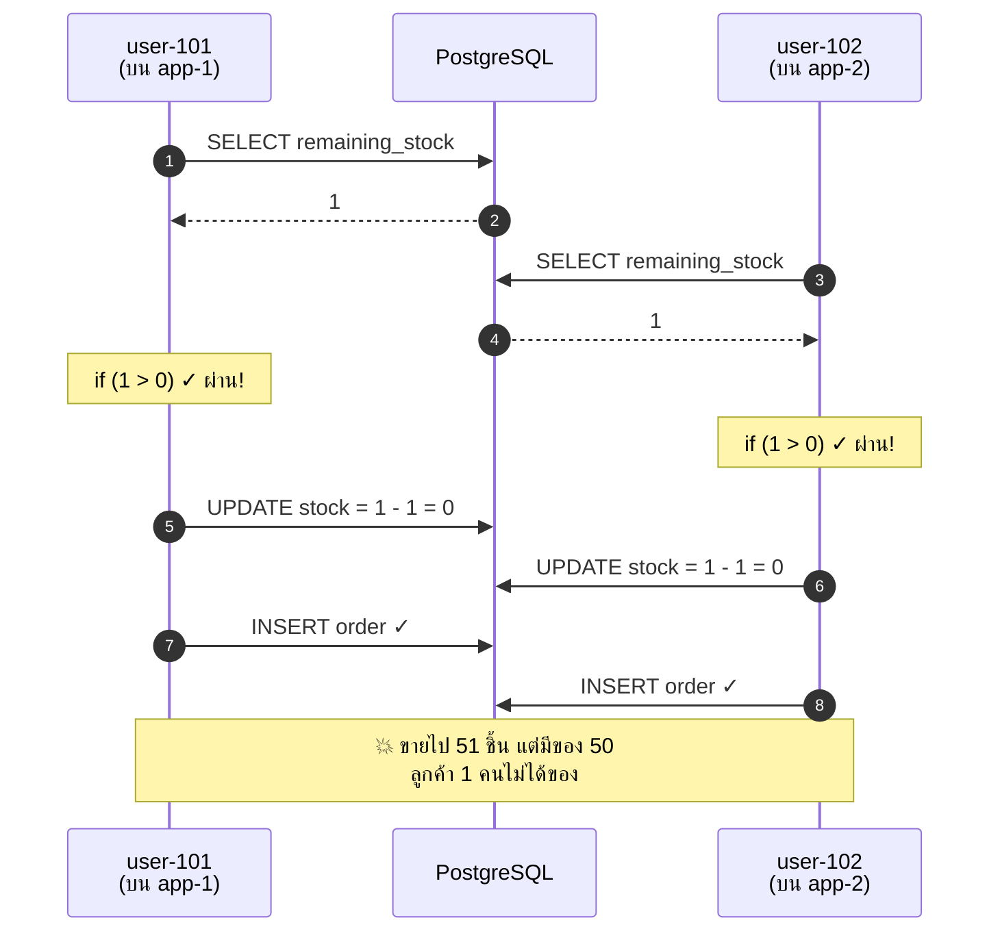
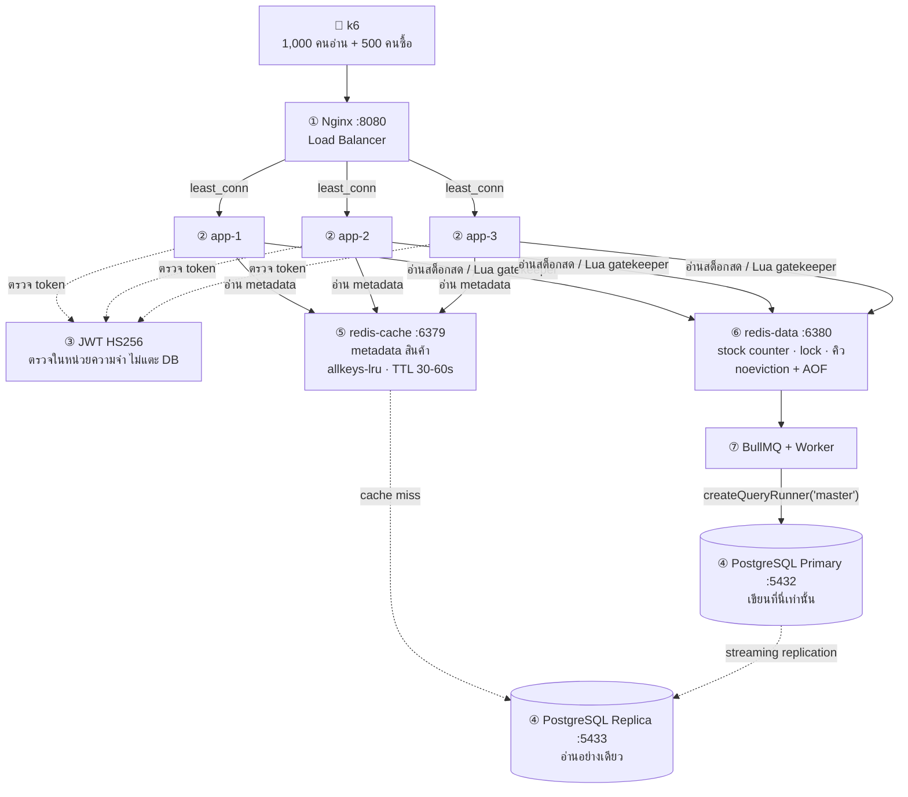
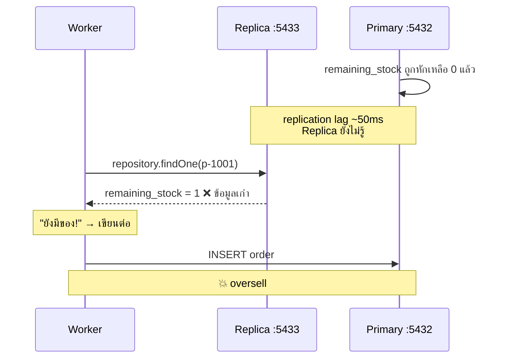
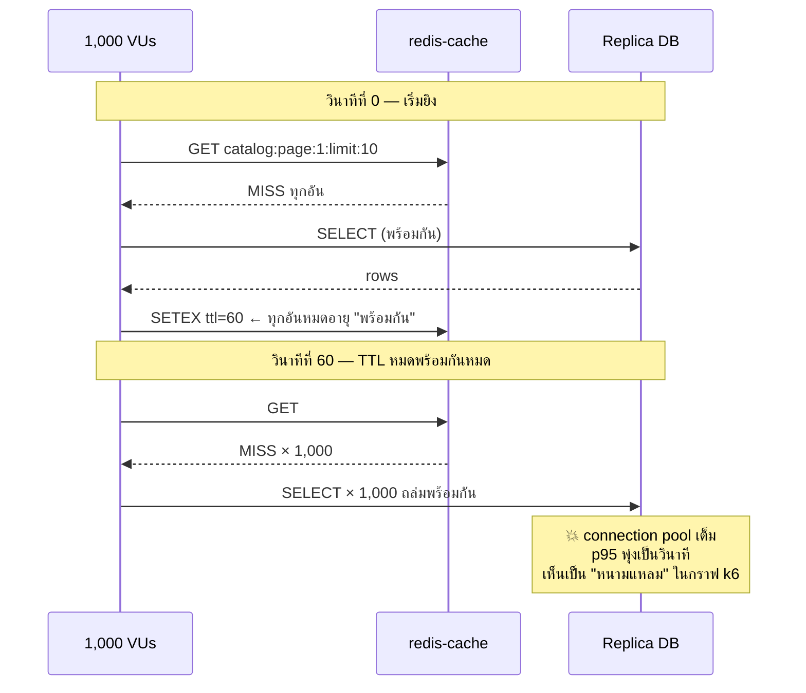
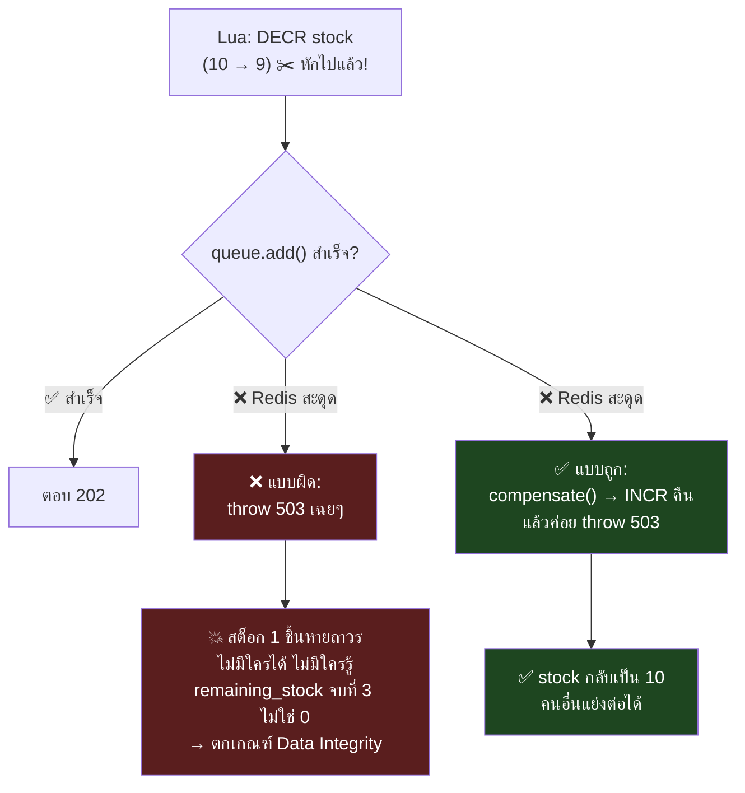
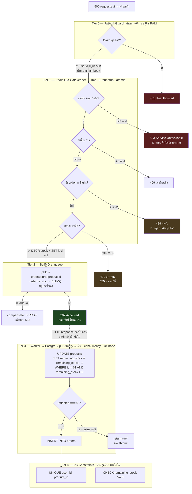
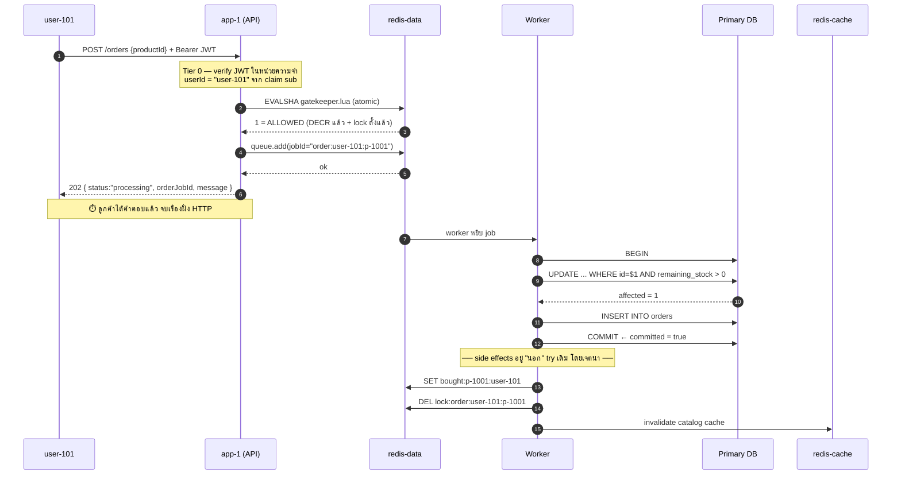
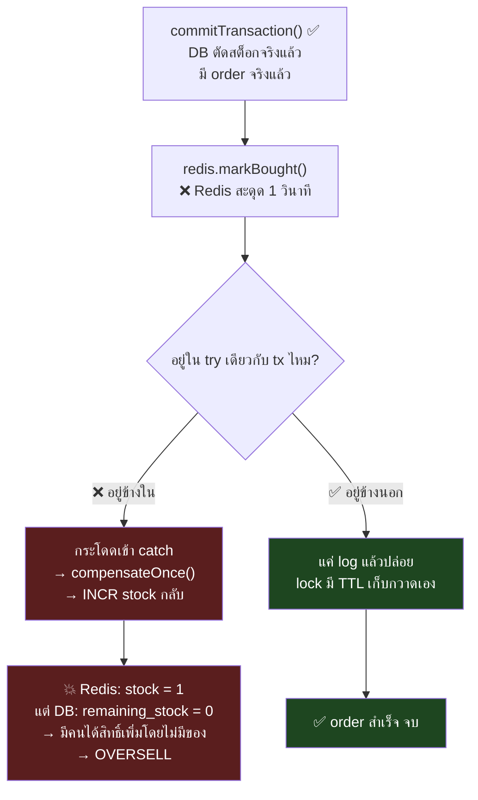
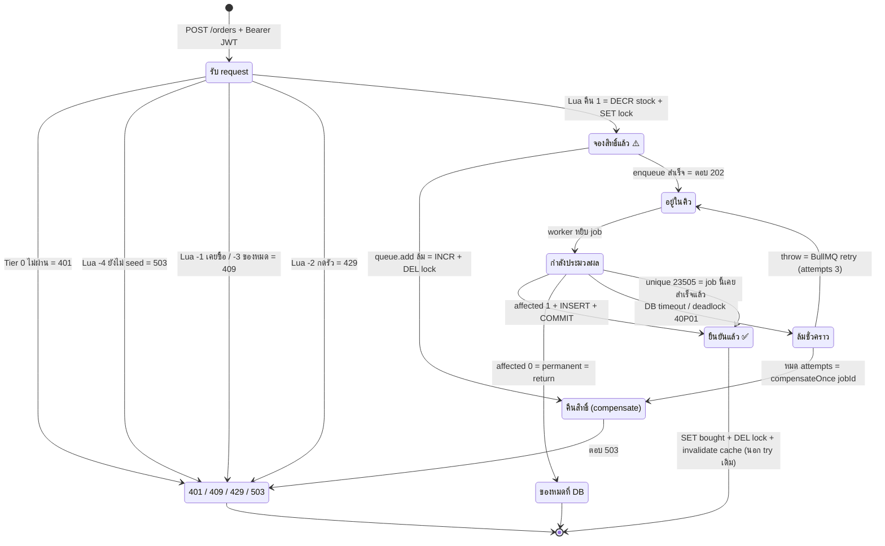

# 🎓 Architecture Primer — ปูพื้นฐาน Flash Sale System ตั้งแต่ศูนย์

> **เอกสารนี้คืออะไร**: ฉบับ *ปูพื้นฐาน* สำหรับคนที่อ่าน [`architecture.md`](architecture.md) แล้วยังไม่เห็นภาพ
> อธิบายว่า **ทำไม**ระบบต้องมีของเยอะขนาดนี้ ก่อนจะไปดูว่า**อะไร**อยู่ตรงไหน
> **ไม่ใช่สเปก** — สเปกอยู่ที่ [`architecture.md`](architecture.md) ถ้าสองไฟล์ขัดกัน **ถือว่า `architecture.md` ถูก**
>
> **อ่านเอกสารนี้ก่อน แล้วค่อยไปอ่าน [`architecture.md`](architecture.md)**

> ⚠️ **หมายเหตุ (2026-08-26)** — เอกสารนี้เขียนขึ้น**ก่อนจะมีโค้ดจริง** จึงเป็นฉบับ *ปูพื้นแนวคิด* เท่านั้น
> โค้ดตัวอย่างในนี้ถูกไล่แก้ให้ตรงกับ `src/` ที่มีอยู่จริงแล้ว แต่ถ้าเจอจุดไหนขัดกัน
> **ให้ยึด [`architecture.md`](architecture.md) และ [`../Codebase/Separate/01-codebase-primer.md`](../Codebase/Separate/01-codebase-primer.md) เป็นหลัก**
> (อันหลังอ้าง `file:line` ของโค้ดจริง)

---

## 🗺️ แผนที่การอ่าน

| § | หัวข้อ | จำเป็นตอนนี้ไหม |
| :--- | :--- | :--- |
| [1](#1--โจทย์นี้ยากตรงไหน--แก่นเดียวของทั้งโปรเจกต์) | โจทย์นี้ยากตรงไหน — แก่นเดียวของทั้งโปรเจกต์ | ⭐ **ต้องอ่าน** |
| [2](#2--ตัวละคร-7-ตัวในระบบ) | ตัวละคร 7 ตัวในระบบ | ⭐ **ต้องอ่าน** |
| [3](#3--เส้นทางที่-1-read-path--get-apiv1products) | เส้นทางที่ 1: Read Path (คนดูสินค้า) | ⭐ **ต้องอ่าน** |
| [4](#4--เส้นทางที่-2-write-path--post-apiv1orders) | เส้นทางที่ 2: Write Path (คนสั่งซื้อ) | ⭐ **ต้องอ่าน** |
| [5](#5--ทำไมต้อง-4-ด่าน-ด่านเดียวไม่พอเหรอ) | ทำไมต้อง 4 ด่าน ด่านเดียวไม่พอเหรอ | ⭐ **ต้องอ่าน** |
| [6](#6--ชีวิตของ-order-1-ใบ-state-machine) | ชีวิตของ order 1 ใบ (State Machine) | ⭐ **ต้องอ่าน** |
| [7](#7--ตารางรวม-ถ้าทำผิดจะพังยังไง) | ถ้าทำผิดจะพังยังไง | อ่านตอนเริ่มเขียนโค้ด |
| [8](#8-️-สิ่งที่เอกสารนี้ตัดออกไป-และทำไม) | สิ่งที่เอกสารนี้ตัดออก (+เหตุผล) | อ่านทีหลังได้ |
| [9](#9--glossary) | Glossary | เปิดดูตอนเจอศัพท์ไม่รู้จัก |
| [10](#10--คำถามทดสอบตัวเอง) | คำถามทดสอบตัวเอง 11 ข้อ | ⭐ ทำหลังอ่านจบ |
| [11](#11--อ่านอะไรต่อ) | อ่านอะไรต่อ | — |

**พื้นฐานที่เอกสารนี้สมมติว่าคุณมี**: เขียน REST API + ต่อฐานข้อมูลเป็น, เข้าใจ HTTP status code
**สิ่งที่จะอธิบายให้ตั้งแต่ต้น**: Redis, Message Queue, Load Balancer, Replication, Concurrency

---

## 1. ⭐ โจทย์นี้ยากตรงไหน — แก่นเดียวของทั้งโปรเจกต์

### 1.1 ปัญหา: ลองนึกว่าเขียนแบบธรรมดาที่สุด

สมมติเขียน `POST /api/v1/orders` แบบตรงไปตรงมา — แบบที่ทุกคนเขียนตอนเรียน:

```typescript
// ❌ โค้ดแบบธรรมดา — ใช้ในโปรเจกต์นี้ไม่ได้
async createOrder(userId: string, productId: string) {
  const product = await this.repo.findOne({ where: { id: productId } });
  if (product.remainingStock > 0) {                      // (1) เช็ค
    product.remainingStock = product.remainingStock - 1;  // (2) ลด
    await this.repo.save(product);                        // (3) เซฟ
    await this.orderRepo.insert({ userId, productId });
    return { status: 'success' };
  }
  throw new ConflictException('Sold out');
}
```

โค้ดนี้ **ถูกต้อง 100%** ถ้ามีคนกดซื้อทีละคน

แต่โจทย์คือ `p-1001` (Limited Edition Sneaker) มีของ **50 ชิ้น** แล้วมี **500 คนกดพร้อมกัน**
— ดู [`products-seed.json`](../Requirement/products-seed.json): `"availableStock": 50`

นี่คือสิ่งที่เกิดขึ้นจริง ตอนของเหลือชิ้นสุดท้าย:



ช่องว่างระหว่าง **"ตอนที่เช็ค"** กับ **"ตอนที่ใช้ผลของการเช็ค"** คือรูรั่ว
ระหว่างไม่กี่มิลลิวินาทีนั้น ข้อมูลที่เช็คไป *เก่าไปแล้ว* แต่โค้ดไม่รู้

> 📖 **ศัพท์ที่จะเจอ**
> | คำ | ความหมาย |
> | :--- | :--- |
> | **Race Condition** | บั๊กที่ผลลัพธ์ขึ้นกับว่า "ใครวิ่งถึงก่อน" ซึ่งควบคุมไม่ได้ |
> | **TOCTOU** (Time-Of-Check to Time-Of-Use) | ชื่อเฉพาะของรูรั่วอันนี้: ช่องว่างระหว่างเวลาที่เช็ค กับเวลาที่ใช้ผล |
> | **Oversell** | ขายเกินของที่มี (คำที่โจทย์ใช้: *Zero Overselling*) |
> | **Concurrent** | เกิดขึ้น *พร้อมกัน* ไม่ใช่ต่อคิวกัน |

### 1.2 เพราะฉะนั้นทั้งโปรเจกต์นี้กำลังตอบคำถามเดียว

> ### 🎯 "ทำยังไงให้ 500 คำขอที่มาพร้อมกัน ตัดสินใจถูกทุกคำขอ **และ** ตอบกลับเร็วด้วย"

ทุกกล่องใน architecture diagram มีอยู่เพื่อตอบคำถามนี้ ไม่มีกล่องไหนใส่มาเพราะเท่

### 1.3 เกณฑ์ตัดสินคือ SQL 3 บรรทัดนี้

จาก [`architecture.md` §9.3](architecture.md) — นี่คือสิ่งที่บอกว่างานผ่านหรือไม่ผ่าน:

```sql
SELECT remaining_stock FROM products WHERE id = 'p-1001';
-- ต้องได้ 0 พอดี
--   -1 = oversell (ขายเกิน)
--    3 = undersell (ขายไม่หมดทั้งที่คนแย่งกัน = สต็อกหายไปไหน?)

SELECT COUNT(*), COUNT(DISTINCT user_id) FROM orders WHERE product_id = 'p-1001';
-- ต้องได้ 50, 50 พอดี  (50 ออเดอร์ จาก 50 คนไม่ซ้ำ)
```

**จำ 3 บรรทัดนี้ไว้** ทุกอย่างที่อธิบายต่อจากนี้ คือความพยายามทำให้ 3 บรรทัดนี้ผ่าน

### 1.4 แล้วใส่ lock ธรรมดาไม่จบเหรอ?

จบเรื่อง*ความถูกต้อง* แต่ไม่จบเรื่อง*ความเร็ว* — ซึ่งเป็นครึ่งหนึ่งของคะแนน:

| ทางเลือก | ถูกต้อง? | เร็ว? | ปัญหา |
| :--- | :---: | :---: | :--- |
| `SELECT` แล้ว `if` ใน JS | ❌ | ✅ | oversell (ตัวอย่าง §1.1) |
| `SELECT ... FOR UPDATE` (ล็อกแถวใน DB) | ✅ | ❌ | 500 คนต่อคิวล็อกแถวเดียวกัน → คนที่ 500 รอนานมาก, connection pool เต็ม |
| `UPDATE ... WHERE stock > 0` (atomic) | ✅ | 🟡 | ถูกต้องแล้ว แต่ 500 requests ยังวิ่งถึง DB หมด → p95 พุ่ง |
| **สถาปัตยกรรมนี้** | ✅ | ✅ | กรอง 450 คนออกที่ Redis (~1ms) เหลือ 50 คนถึง DB |

**นี่คือเหตุผลที่ระบบมีของเยอะ** — ไม่ใช่เพราะความถูกต้องอย่างเดียว แต่เพราะต้องถูก *และ* เร็วพร้อมกัน

---

## 2. ⭐ ตัวละคร 7 ตัวในระบบ



ต่อไปนี้อธิบายทีละตัว แต่ละตัวตอบ 4 คำถาม: **ปัญหาเดิม → มันคืออะไร → ในงานเราคือตัวไหน → ศัพท์**

---

### 2.1 ① Nginx (Load Balancer)

| | |
| :--- | :--- |
| **ปัญหาเดิม** | Node.js 1 process ใช้ CPU ได้แค่ 1 core ต่อให้เครื่องมี 8 core. 1,000 คนอ่าน + 500 คนซื้อพร้อมกัน → process เดียวรับไม่ไหว |
| **มันคืออะไร** | โปรแกรมที่ยืนอยู่หน้าสุด รับ request ทุกอันแล้ว *กระจาย* ไปให้ backend หลายตัวที่ทำงานเหมือนกันเป๊ะ |
| **ในงานเรา** | container `nginx` ฟังที่ `:8080` → กระจายไป `app-1`, `app-2`, `app-3` (แต่ละตัว `:3000`). k6 ยิงมาที่ `:8080` เท่านั้น ไม่เคยรู้จัก app-1/2/3 เลย |
| **ศัพท์** | **Reverse Proxy** (ตัวกลางที่รับแทน backend) · **Upstream** (backend ที่มันกระจายไปหา) · **`least_conn`** (ส่งให้ตัวที่มีงานค้างน้อยสุด ต่างจาก round-robin ที่ส่งวนไปเรื่อยๆ ไม่สนว่าใครยุ่ง) · **Keepalive** (ใช้ TCP connection เดิมซ้ำ ไม่ handshake ใหม่ทุกครั้ง) |

**💥 ถ้าทำผิดจะพังยังไง**
ใน `nginx.conf` ถ้าใส่ `keepalive 64` แต่ **ลืม** 2 บรรทัดนี้:

```nginx
proxy_http_version 1.1;
proxy_set_header Connection "";
```

Nginx จะคุยกับ app-1/2/3 ด้วย HTTP/1.0 ซึ่งปิด connection ทุกครั้ง → `keepalive 64` **ไม่ทำงานเลยแม้แต่นิดเดียว** → ทุก request เสีย TCP handshake ใหม่ (~1–3ms) × 1,000 VUs

[`architecture.md` §2](architecture.md) เรียกอันนี้ว่า **"ตัวฉุด p95 อันดับ 1"** — คือจะเห็นตัวเลขแย่ในรายงานโดยไม่รู้สาเหตุ

---

### 2.2 ② NestJS 3 instances + Stateless

| | |
| :--- | :--- |
| **ปัญหาเดิม** | พอมี 3 ตัว: `user-101` login ที่ app-1 (app-1 จำไว้ใน RAM ว่าใครคือใคร) แต่ request ถัดไป Nginx ส่งไป app-2 ซึ่ง **ไม่รู้จัก** user-101 → หลุด login |
| **มันคืออะไร** | **Stateless** = แต่ละ instance ไม่เก็บอะไรที่ต้องใช้ร่วมกันไว้ใน RAM ตัวเอง ทุกตัวเหมือนกันเป๊ะ แลกกันได้ ตายไปตัวหนึ่งไม่มีอะไรหาย |
| **ในงานเรา** | `app-1/2/3` เป็น NestJS ตัวเดียวกันเป๊ะ (image เดียวกัน) — state ที่ต้องแชร์ถูกย้ายออกไปอยู่ Redis กับ Postgres หมด |
| **ศัพท์** | **Instance / Replica** (สำเนาของแอปที่รันพร้อมกัน) · **Horizontal Scaling** (เพิ่มจำนวนเครื่อง ไม่ใช่เพิ่มสเปกเครื่องเดียว) · **Modular by domain** (แบ่งโฟลเดอร์ตามเรื่อง `auth/`, `products/`, `orders/` ไม่ใช่ตามชั้น `controllers/`, `services/`) |

**💥 ถ้าทำผิดจะพังยังไง**
[`CLAUDE.md` §6](../../CLAUDE.md) ห้าม "L1 in-memory cache ที่มี `remainingStock`" ไว้ชัดเจน สมมติ optimize ด้วยการเก็บผลลัพธ์ `GET /products` ไว้ใน RAM 2 วินาที:

```
วินาทีที่ 10: app-1 cache ไว้ remainingStock = 30
วินาทีที่ 11: มีคนซื้อไป 20 ชิ้น → ของจริงเหลือ 10
วินาทีที่ 11: user A ถาม → Nginx ส่งไป app-1 → ตอบ 30  ❌
วินาทีที่ 11: user B ถาม → Nginx ส่งไป app-2 → ตอบ 10  ✓
```

ลูกค้า 2 คนเห็นสต็อกไม่ตรงกัน ที่วินาทีเดียวกัน — ผิด **"เงื่อนไขสำคัญ"** ที่โจทย์ระบุไว้ตรงๆ

---

### 2.3 ③ JWT (Stateless Auth)

| | |
| :--- | :--- |
| **ปัญหาเดิม** | ต่อจาก §2.2 — ถ้าไม่เก็บ session ใน RAM แล้วจะรู้ได้ไงว่าคนที่ส่ง request มาคือใคร? ถ้าไปถาม DB/Redis ทุก request = เพิ่ม I/O หลายร้อยครั้งต่อวินาที **ก่อนเริ่มทำงานจริงด้วยซ้ำ** |
| **มันคืออะไร** | บัตรผ่านที่ **ลูกค้าถือเอง** ข้างในเขียนว่า "ฉันคือ user-101" พร้อม **ลายเซ็นดิจิทัล** ที่ปลอมไม่ได้ (ต้องรู้ `JWT_SECRET` ถึงจะเซ็นได้) server แค่ตรวจลายเซ็นด้วยคณิตศาสตร์ในหน่วยความจำ — **ไม่ต้องแตะ DB เลย** |
| **ในงานเรา** | `POST /api/v1/auth/token` ส่ง `{"userId":"user-999"}` → ได้ token กลับมา (endpoint นี้ *จำลอง* login ไม่เช็ครหัสผ่าน และโจทย์บอกว่า **ไม่วัด performance**) จากนั้นทุกครั้งที่ `POST /api/v1/orders` ต้องแนบ `Authorization: Bearer <token>` |
| **ศัพท์** | **Claim** (ข้อมูลใน token) · **`sub`** (subject = ชื่อ claim มาตรฐานที่เก็บ userId) · **HS256** (อัลกอริทึมเซ็นแบบใช้ secret ร่วม — ทั้ง 3 instance ใช้ secret เดียวกันจึงตรวจข้าม instance ได้) · **Zero-I/O verify** (ตรวจโดยไม่ยิงไปที่ไหนเลย) · **Bearer** (คำนำหน้าใน header แปลว่า "ผู้ถือบัตรนี้") |

**💥 ถ้าทำผิดจะพังยังไง**
นี่คือ invariant ข้อ 2 ใน [`CLAUDE.md` §4](../../CLAUDE.md) — **`userId` ต้องมาจาก JWT claim `sub` เท่านั้น ห้ามรับจาก request body**

ถ้าเขียน `POST /api/v1/orders` แบบรับ `{ userId, productId }` จาก body:

- ส่ง `{"userId":"user-1"}` แล้วก็ `{"userId":"user-2"}`, `{"userId":"user-3"}`... จากเครื่องเดียว
- กลไกกันซื้อซ้ำทุกชั้นใช้ `userId` เป็นกุญแจ → **พังทั้งระบบ** เพราะคนเดียวกวาดของ 50 ชิ้นได้หมด
- และ `COUNT(DISTINCT user_id) = 50` **ยังผ่านอยู่!** → จะไม่มีทางรู้เลยว่ามีรู

---

### 2.4 ④ PostgreSQL Primary + Replica

| | |
| :--- | :--- |
| **ปัญหาเดิม** | 1,000 คนอ่านสินค้า + คนเขียนออเดอร์ ยิงเข้า DB ตัวเดียว → การอ่านไปแย่งทรัพยากรกับการเขียน ทั้งที่คนอ่าน "แค่ดูรายการสินค้า" ไม่จำเป็นต้องได้ข้อมูลสดวินาทีต่อวินาที |
| **มันคืออะไร** | **Replication** = มี DB 2 ตัว: **Primary** รับเขียน แล้วส่งการเปลี่ยนแปลงไปให้ **Replica** อัตโนมัติ. Replica รับแต่ *อ่าน* — และข้อมูลตามหลัง Primary อยู่นิดหน่อย (10–100 มิลลิวินาที) |
| **ในงานเรา** | Primary `:5432` (worker เขียนออเดอร์ที่นี่) · Replica `:5433` (อ่าน catalog ตอน cache miss). TypeORM ตั้งค่าที่ `src/config/database.config.ts` แล้ว route ให้อัตโนมัติ |
| **ศัพท์** | **Read-Write Split** (แยกทางอ่าน/ทางเขียน) · **Replication Lag** (ความช้าที่ Replica ตามหลัง) · **Streaming Replication** (วิธี sync ของ Postgres) · **Connection Pool** (ถังเก็บ connection ที่เปิดค้างไว้ใช้ซ้ำ เพราะเปิด connection ใหม่แพงมาก) |

**💥 ถ้าทำผิดจะพังยังไง**
[`architecture.md` §6.3](architecture.md) เรียกอันนี้ว่า **"จุดที่พลาดกันบ่อยที่สุด"**

`repository.findOne()` ใน TypeORM จะวิ่งไป **Replica อัตโนมัติ** — ซึ่งดูสมเหตุสมผลมาก จนกระทั่ง worker ทำแบบนี้:



เพราะฉะนั้น **invariant ข้อ 3**: worker **ต้อง** ใช้ `dataSource.createQueryRunner('master')` เท่านั้น

บั๊กนี้เจ็บเพราะมัน **ผ่านตอนเทสในเครื่องตัวเอง** (ไม่มี lag) แล้วพังตอนยิงโหลดจริง

---

### 2.5 ⑤ `redis-cache` :6379 — แคช metadata

| | |
| :--- | :--- |
| **ปัญหาเดิม** | 1,000 คนถาม `GET /api/v1/products` ทุกวินาที = 1,000 SQL queries ต่อวินาที ทั้งที่ **ชื่อสินค้ากับราคาไม่เคยเปลี่ยน** ระหว่าง flash sale |
| **มันคืออะไร** | **Cache** = ที่เก็บของชั่วคราวในหน่วยความจำ อ่านเร็วกว่า DB ~100 เท่า · **Cache-Aside** = แพตเทิร์นการใช้: ดูในแคชก่อน → เจอ (**hit**) ใช้เลย → ไม่เจอ (**miss**) ค่อยไปถาม DB แล้วเอามาใส่แคชไว้ |
| **ในงานเรา** | key `catalog:page:1:limit:10` เก็บ metadata ของสินค้าหน้านั้น อายุ **30–60 วินาที + jitter** |
| **ศัพท์** | **TTL** (Time To Live = อายุของ key ก่อนหายไปเอง) · **Jitter** (สุ่มบวกอายุนิดหน่อยไม่ให้หมดพร้อมกัน) · **`allkeys-lru`** (ถ้า RAM เต็ม ให้ลบ key ที่ไม่ได้ใช้นานสุดทิ้ง) · **Hit Ratio** (สัดส่วนที่เจอในแคช — โจทย์อยากเห็น ≥ 90%) |

**💥 ถ้าทำผิดจะพังยังไง — Cache Stampede**



ทางแก้ในเอกสารมี **2 ชั้น**:

| ทางแก้ | ทำอะไร | แก้ปัญหาอะไร |
| :--- | :--- | :--- |
| **TTL jitter** | `ttl = 30 + random(0..30)` วินาที | key หมดอายุกระจายกัน ไม่พร้อมกัน (avalanche) |
| **Single-flight** | ใน 1 process ถ้ามี 200 requests miss หน้าเดียวกันพร้อมกัน ให้แชร์ Promise เดียว | query DB **ครั้งเดียว** แทน 200 ครั้ง |

> **single-flight ไม่ผิดกฎ stateless** เพราะมันเก็บ *in-flight request* (คำขอที่กำลังวิ่งอยู่ตอนนี้) ไม่ใช่เก็บ *ผลลัพธ์* ไว้ข้ามคำขอ

---

### 2.6 ⑥ `redis-data` :6380 — stock counter + lock ⭐ ตัวสำคัญที่สุด

นี่คือตัวที่ทำให้สถาปัตยกรรมนี้ต่างจากที่คนอื่นเขียน **อ่านช้าๆ**

| | |
| :--- | :--- |
| **ปัญหาเดิม** | 500 คนวิ่งเข้า Postgres พร้อมกันเพื่อแย่งของ 50 ชิ้น = **450 คนวิ่งไปเพื่อโดนปฏิเสธ** ทำให้ DB ทำงานหนักเปล่าๆ 90% |
| **มันคืออะไร** | Redis เก็บ **ตัวนับสต็อก** แยกอีกที่หนึ่ง แล้วให้มัน "ตัดสินก่อน" ว่าใครมีสิทธิ์เดินต่อ — คนที่ไม่มีสิทธิ์ถูกปฏิเสธที่นี่ในเวลา ~1ms โดยไม่แตะ DB เลย |
| **ในงานเรา** | 3 กลุ่ม key: `stock:flash_sale:p-1001` (ตัวนับ) · `lock:order:{userId}:{productId}` (กันกดรัว) · `bought:{productId}:{userId}` (ธงว่าซื้อสำเร็จแล้ว) |
| **ศัพท์** | **Atomic** (ทำทั้งชุดหรือไม่ทำเลย ไม่มีใครแทรกกลางได้) · **Lua script** (โปรแกรมเล็กๆ ที่ส่งไปรันในตัว Redis) · **Mutex / Lock** (ป้ายจองว่า "ฉันกำลังทำอยู่ ห้ามแทรก") · **`noeviction`** (RAM เต็มก็ห้ามลบอะไรทิ้ง ให้ error แทน) |

#### ทำไมต้องเป็น Lua ไม่ใช่หลายคำสั่งเรียงกัน?

Redis เป็น **single-threaded** — ทำทีละคำสั่ง เพราะฉะนั้น `DECR` คำสั่งเดียวไม่มีทาง race กัน ✅
แต่ถ้าเขียนแบบนี้ใน JavaScript:

```typescript
// ❌ ผิด — TOCTOU กลับมาอีกแล้ว แค่ย้ายที่เกิดเหตุจาก DB มา Redis
const stock = await redis.get('stock:flash_sale:p-1001');   // ← ได้ 1
if (Number(stock) > 0) {                                     // ← ระหว่างนี้คนอื่นแทรกได้!
  await redis.decr('stock:flash_sale:p-1001');               // ← ทั้งคู่ decr → -1
}
```

ระหว่างบรรทัด 1 กับ 3 มี **network roundtrip** คั่นอยู่ คนอื่นแทรกได้สบายๆ

**Lua script แก้ตรงนี้** — Redis รับสคริปต์ทั้งก้อนไปรันรวดเดียว และ **ไม่รับคำสั่งอื่นเลยจนกว่าจะรันจบ** → เช็ค 4 อย่าง + เขียน 2 อย่าง กลายเป็นการกระทำเดียวที่แบ่งแยกไม่ได้

สคริปต์จริง ([`architecture.md` §6.1](architecture.md)) แบบย่อ:

```lua
local raw = redis.call('GET', KEYS[2])                     -- stock:flash_sale:p-1001
if raw == false then return -4 end                         -- ยังไม่ seed        → 503
if redis.call('EXISTS', KEYS[3]) == 1 then return -1 end   -- เคยซื้อแล้ว        → 409
if redis.call('EXISTS', KEYS[1]) == 1 then return -2 end   -- กำลังทำอยู่ (กดรัว) → 429
if tonumber(raw) <= 0 then return -3 end                   -- ของหมด            → 409
redis.call('DECR', KEYS[2])                                -- ✂️ จองสิทธิ์
redis.call('SET', KEYS[1], ARGV[2], 'PX', ARGV[1])         -- 🔒 ตั้ง lock
return 1                                                   -- ผ่าน              → 202
```

#### 💥 `-4` ที่ดูเหมือนไม่จำเป็น แต่สำคัญมาก

โค้ดที่คนเขียนกันทั่วไปคือ `tonumber(redis.call('GET', k) or '0')` ซึ่งแปลว่า *"ไม่มี key ก็ถือว่าสต็อก 0"*

ทีนี้ถ้า `redis-data` restart แล้วลืมรัน `pnpm run seed:redis`:

- key `stock:flash_sale:p-1001` หายไป → ระบบตอบ **"ของหมด" (409)** ให้ทุกคน **ตลอดกาล**
- ไม่มี error, ไม่มี log, dashboard เขียว, ยิง k6 แล้วเห็น 409 เยอะ ก็นึกว่าถูกแล้ว
- จะนั่งงงเป็นชั่วโมงว่าทำไม `remaining_stock` ใน DB ยังเป็น 50

การแยก `-4` → **503 Service Unavailable** ทำให้ปัญหานี้ *โผล่ขึ้นมาทันที* แทนที่จะเงียบ
นี่คือความต่างระหว่าง **"ของหมด" (ปกติ)** กับ **"ระบบพัง" (ผิดปกติ)**

#### 💥 ทำไมต้องแยก Redis เป็น 2 ตัว?

| | `redis-cache` :6379 | `redis-data` :6380 |
| :--- | :--- | :--- |
| เก็บอะไร | metadata สินค้า | stock counter, lock, **BullMQ jobs** |
| หายได้ไหม | **ได้** — miss แล้วไปอ่าน DB ใหม่ | **ไม่ได้เด็ดขาด** |
| `maxmemory-policy` | `allkeys-lru` (ลบตัวเก่าทิ้งได้) | **`noeviction`** |
| Persistence | ไม่ต้อง | **AOF** (จดทุกคำสั่งลงดิสก์) |

ถ้ารวมเป็นตัวเดียวแล้วตั้ง `allkeys-lru`: ตอน RAM ใกล้เต็มกลาง load test Redis จะ **ลบ key ที่ไม่ได้ใช้นานสุดทิ้ง** ซึ่งอาจเป็น BullMQ job ของ user-250

→ user-250 ได้ **202 "ออเดอร์คุณเข้าคิวแล้ว"** แต่ไม่มีออเดอร์เกิดขึ้นจริง **ไม่มี error ที่ไหนเลย**

---

### 2.7 ⑦ BullMQ Queue + Worker

| | |
| :--- | :--- |
| **ปัญหาเดิม** | ต่อให้ Redis กรองเหลือ 50 คน การเขียน DB ก็ยังใช้เวลา ~20–50ms และโจทย์บังคับว่า controller **ห้ามเขียน DB แบบรอ** (invariant ข้อ 1) — ต้องตอบ HTTP กลับให้เร็ว |
| **มันคืออะไร** | **Message Queue** = กล่องรับงาน คนที่รับ request แค่ **หย่อนใบสั่งงานลงกล่อง** แล้วตอบลูกค้าไปเลยว่า *"รับเรื่องแล้ว"* ส่วนงานจริงมี **Worker** มาหยิบไปทำทีหลัง |
| **ในงานเรา** | `orders.service.ts` หย่อน job แล้ว return `202` ทันที · `orders.processor.ts` (worker) หยิบ job ไปเขียน Postgres Primary — worker รันอยู่ใน process เดียวกับ API คือ app-1/2/3 แต่ละตัวเป็นทั้ง API และ worker |
| **ศัพท์** | **Producer** (คนหย่อนงาน = controller) · **Consumer / Worker** (คนหยิบไปทำ) · **Job** (ใบสั่งงาน 1 ใบ) · **`jobId`** (เลขที่ใบสั่งงาน) · **Async processing** (ทำทีหลัง ไม่ให้ลูกค้ารอ) · **At-least-once** (คิวรับประกันว่างานจะถูกทำ *อย่างน้อย* 1 ครั้ง — อาจซ้ำได้) · **Idempotent** (ทำซ้ำกี่ครั้งผลก็เท่าเดิม) |

#### ทำไมต้องเป็น 202 ไม่ใช่ 200/201?

| Status | ความหมาย | เหมาะกับ |
| :--- | :--- | :--- |
| `200 OK` | "ทำเสร็จแล้ว นี่ผลลัพธ์" | `GET /products` |
| `201 Created` | "สร้างของเรียบร้อยแล้ว" | ถ้าเขียน DB เสร็จแล้วจริงๆ |
| **`202 Accepted`** | **"รับเรื่องแล้ว กำลังทำ ยังไม่รู้ผล"** | **`POST /orders` ของเรา** |

`202` เป็นการ **พูดความจริง** — ตอนที่ตอบกลับ ออเดอร์ยังไม่ได้เขียนลง DB จริงๆ

#### 💥 invariant ข้อ 6 — ทุก path ที่หักสต็อกแล้วต้องมีทางคืน



โค้ดจริง:

```typescript
try {
  await this.ordersQueue.add('process-order', { userId, productId }, { jobId, ... });
} catch (err) {
  await this.redis.compensate(userId, productId);   // ← INCR คืน + DEL lock (Lua, atomic)
  throw new ServiceUnavailableException('Queue unavailable');
}
```

> 📖 **ศัพท์: Compensation / Compensating Transaction** — เมื่อทำงานข้ามระบบ (Redis + Postgres) เรา rollback ข้ามระบบไม่ได้ จึงต้องเขียน "การกระทำที่ย้อนผลของอีกอันหนึ่ง" ไว้เอง

---

## 3. ⭐ เส้นทางที่ 1: Read Path — `GET /api/v1/products`

### 3.1 ปัญหา: แคชกับสต็อกขัดกันเอง

โจทย์ระบุเป็น **"เงื่อนไขสำคัญ"** ว่า `remainingStock` ต้องถูกต้องเสมอ แต่ก็อยากได้ cache hit ratio สูงๆ ด้วย — **สองอย่างนี้ขัดกันโดยตรง**

```
ถ้าแคชทั้งก้อน (metadata + remainingStock อยู่ด้วยกัน):
  วินาทีที่ 0.0: แคชไว้ { name: "Sneaker", price: 2990, remainingStock: 50 }
  วินาทีที่ 0.1: มีคนซื้อ → ต้อง invalidate (ลบแคชทิ้ง)
  วินาทีที่ 0.2: มีคนซื้อ → ต้อง invalidate อีก
  ...ระหว่าง flash sale มีคนซื้อทุกๆ ไม่กี่มิลลิวินาที
  → แคชโดนลบตลอดเวลา → hit ratio เกือบ 0% → แคชไม่มีประโยชน์เลย
```

### 3.2 ทางออก: แยกของ 2 ชนิดออกจากกัน ⭐

**นี่คือไอเดียที่ฉลาดที่สุดในสถาปัตยกรรมนี้ และเป็นสิ่งที่ต้องเขียนอธิบายในรายงาน**

| ชนิด | ฟิลด์ | เก็บที่ | TTL | เปลี่ยนบ่อยแค่ไหน |
| :--- | :--- | :--- | :--- | :--- |
| **Metadata** | `productId`, `name`, `price`, `availableStock`, `isFlashSaleActive` | `redis-cache`<br/>`catalog:page:{p}:limit:{l}` | 30–60s + jitter | แทบไม่เปลี่ยนเลย |
| **Stock** | `remainingStock` | `redis-data`<br/>`stock:flash_sale:{productId}` | **ไม่มี TTL** | เปลี่ยนตลอดเวลา |

> ⚠️ **อย่าสับสน 2 ฟิลด์นี้**
> `availableStock` = ของตั้งต้น (50, คงที่ตลอด, มาจาก seed)
> `remainingStock` = เหลือจริง (นับถอยหลัง 50 → 0)
> Response ต้องมี **ทั้งคู่**

### 3.3 ลำดับเวลาจริง

```mermaid
sequenceDiagram
    autonumber
    participant VU as k6 VU
    participant N as Nginx
    participant A as app-2
    participant RC as redis-cache
    participant RD as redis-data
    participant DB as Replica DB

    VU->>N: GET /api/v1/products?page=1&limit=10
    N->>A: least_conn

    rect rgb(40,50,70)
    Note over A,DB: ① metadata — cache-aside
    A->>RC: GET catalog:page:1:limit:10
    alt HIT (ปกติ ≥90%)
        RC-->>A: metadata[]
    else MISS
        Note over A: single-flight — ถ้ามีคนกำลังถามอยู่แล้ว รอคนนั้น
        A->>DB: SELECT ... LIMIT 10 OFFSET 0
        DB-->>A: rows
        A->>RC: SETEX ttl = 30 + rand(0..30)
    end
    end

    rect rgb(60,45,30)
    Note over A,RD: ② stock — อ่านสดทุก request
    A->>RD: MGET stock:flash_sale:p-1001 ... (10 key, 1 roundtrip)
    RD-->>A: ["30","12","500",...]
    end

    Note over A: ③ merge: { ...metadata, remainingStock: Number(v) }
    A-->>N: 200 OK
    N-->>VU: { status, data[], meta{total,page,limit,totalPages} }
```



**ขั้นตอน ② และ ③ คือคำตอบของ "เงื่อนไขสำคัญ"**
metadata นอนอยู่ในแคชได้เป็นนาทีโดยไม่ต้อง invalidate เลยแม้มีคนซื้อรัวๆ ขณะที่ `remainingStock` อ่านสดทุก request ด้วยต้นทุนแค่ **1 `MGET`** (คำสั่งเดียว ดึงหลาย key พร้อมกัน)

### 3.4 แล้วเมื่อไหร่ถึงต้อง invalidate?

| เหตุการณ์ | ต้องลบแคชไหม | เพราะ |
| :--- | :---: | :--- |
| มีคนซื้อ (สต็อกลด) | **ไม่ต้อง** | `remainingStock` ไม่ได้อยู่ในแคชตั้งแต่แรก |
| แอดมินแก้ชื่อ/ราคาสินค้า | ✅ ต้อง | metadata เปลี่ยนจริง |
| สินค้าเปลี่ยน `isFlashSaleActive` | ✅ ต้อง | worker ส่ง invalidate หลังตัดสต็อกสำเร็จ |

**💥 ถ้าทำผิดจะพังยังไง**

1. ลำดับต้องเป็น **update DB ก่อน → แล้วค่อย `DEL` cache** ถ้าทำกลับกัน (DEL ก่อน) จะมีช่องว่างที่ request อื่นเข้ามาอ่านค่า *เก่า* จาก DB แล้วเอาไปใส่แคชใหม่ → แคชค้างค่าเก่าจนกว่า TTL หมด
2. ❌ **ห้ามใช้ `redis.keys('catalog:*')`** เพื่อล้างแคช — คำสั่งนี้ scan ทุก key ในฐาน และ Redis เป็น single-threaded แปลว่ามัน **บล็อกทุกคน** รวมถึง gatekeeper ของ 500 คนที่กำลังแย่งของอยู่ → ใช้ `SCAN` หรือคำนวณ key ตรงๆ แทน

---

## 4. ⭐ เส้นทางที่ 2: Write Path — `POST /api/v1/orders`

### 4.1 ปัญหา: 500 คนแย่ง 50 ชิ้น พร้อมกัน

ทางเดียวที่จะทั้งเร็วและถูกคือ **กรองเป็นชั้นๆ** — เอาคนออกให้ได้มากที่สุดตั้งแต่ชั้นที่ถูกที่สุด

### 4.2 ภาพรวม 5 ด่าน + จำนวนคนที่เหลือรอด



### 4.3 ลำดับเวลา: 202 ออกไปก่อน DB เขียนเสร็จ



### 4.4 จุดที่ต้องเข้าใจให้ขาด 3 จุด

#### จุดที่ 1 — `UPDATE ... WHERE remaining_stock > 0` ทำไมถึงปลอดภัย

```sql
UPDATE products SET remaining_stock = remaining_stock - 1
WHERE id = 'p-1001' AND remaining_stock > 0;
```

คำสั่งนี้ **เช็คและเขียนในคำสั่งเดียว** — Postgres ล็อกแถวให้ระหว่างรัน ไม่มีใครแทรกได้

- ถ้า `remaining_stock` เป็น 0 อยู่แล้ว → เงื่อนไข `WHERE` ไม่ตรง → **ไม่อัปเดตอะไรเลย** → `result.affected === 0`
- ไม่มีช่องว่างระหว่าง "เช็ค" กับ "ใช้ผล" อีกต่อไป → **TOCTOU หายไป**

เทียบกับตัวอย่างใน §1.1 ที่ `SELECT` แยกจาก `UPDATE` — **นี่คือความต่างทั้งหมด**

> ⚠️ **ห้าม `SELECT` มาเช็คใน JS ก่อน** (invariant ข้อ 4) — นั่นคือการเอา TOCTOU กลับมาใส่เอง

#### จุดที่ 2 — `jobId` เป็นสูตรตายตัว

```
jobId = order:{userId}:{productId}      เช่น  order:user-101:p-1001
```

BullMQ **ปฏิเสธ job ที่ id ซ้ำโดยอัตโนมัติ** เพราะฉะนั้นต่อให้ user-101 กดรัว 3 ครั้ง (ซึ่ง k6 ทำจริง — `iterations: 3`) แล้วหลุด Redis lock มาได้ ก็ยังมี BullMQ เป็นด่านที่สองปฏิเสธให้อยู่ดี

#### จุดที่ 3 — `committed` flag กับ side effect หลัง commit ⚠️

จุดนี้ [`architecture.md`](architecture.md) ย้ำ 2 รอบ และเป็นบั๊กที่หายากที่สุด

```typescript
    await queryRunner.commitTransaction();
    committed = true;              // ◄── หมุดชี้ขาดของทุก branch ข้างล่าง
  } catch (err) {
    if (!committed) await queryRunner.rollbackTransaction();
    // ...
    // คืนสต็อกเฉพาะ attempt สุดท้าย และ **ไม่คืน** ตอน sold-out (ดูสเปก §6.3)
    if (isFinalAttempt) {
      await this.redis.compensateOnce(job.id, userId, productId, requestToken);
    }
  }

  // ── ออกมา "นอก" try เดิม โดยเจตนา ──
  try {
    await this.redis.markBought(productId, userId);
    await this.redis.releaseInFlightLock(userId, productId, requestToken);
    await this.redis.invalidateCatalogCache();
  } catch (e) {
    this.logger.error({ ... });   // กลืน error ทิ้ง — order สำเร็จไปแล้วจริง
  }
```

**ถ้าเอา `markBought` ไปไว้ใน try เดิม จะพังแบบนี้:**



**หลักการ**: หลัง `commit` สำเร็จ ออเดอร์ถือว่าจบแล้ว งานที่เหลือล้มก็แค่ log แล้วปล่อย

### 4.5 ตารางแมป: สถานการณ์ → status code

จาก [`CLAUDE.md` §3](../../CLAUDE.md) — **ห้ามเปลี่ยนเด็ดขาด** เพราะกลุ่มอื่นเอา k6 มายิงระบบเรา

| สถานการณ์ | Status | เกิดที่ | ทำไมต้องเป็นค่านี้ |
| :--- | :---: | :--- | :--- |
| เข้าคิวสำเร็จ | **202** | Tier 2 | ยังไม่เสร็จจริง แค่รับเรื่อง |
| ไม่มี/ผิด JWT | 401 | Tier 0 | |
| เคยซื้อแล้ว | 409 | Lua `-1` | ขัดกับสถานะปัจจุบัน |
| ของหมด | 409 | Lua `-3` | ขัดกับสถานะปัจจุบัน |
| กดรัวขณะมี order ค้าง | **429** | Lua `-2` | **พฤติกรรมที่ถูกต้อง ไม่ใช่ error** |
| stock ยังไม่ seed | **503** | Lua `-4` | ระบบผิดปกติ ≠ ของหมด |

> ⚠️ ตอนตั้ง threshold ใน k6 **ห้ามนับ 409/429 เป็น error**
> มันคือหลักฐานว่าระบบป้องกันทำงาน — ถ้านับเป็น error จะเห็น error rate ~90% แล้วนึกว่าระบบพัง ทั้งที่มันทำงานถูกเป๊ะ

---

## 5. ⭐ ทำไมต้อง 4 ด่าน ด่านเดียวไม่พอเหรอ

คำถามที่ถูกต้อง เพราะจริงๆ แล้ว **Tier 3 + Tier 4 อย่างเดียวก็ป้องกัน oversell ได้ครบแล้ว**

| ด่าน | ป้องกันอะไร | ถ้าตัดด่านนี้ทิ้ง จะเกิดอะไร |
| :--- | :--- | :--- |
| Tier 0 — JWT | สวมสิทธิ์ | 1 คนกวาดของ 50 ชิ้นได้ |
| **Tier 1 — Redis Lua** | **ภาระของ DB** | ยังไม่ oversell แต่ 500 requests วิ่งถึง DB ทั้งที่ 450 อันจะโดนปฏิเสธอยู่แล้ว → connection pool เต็ม, p95 พุ่ง |
| **Tier 2 — BullMQ** | **เวลาตอบ HTTP** | ยังถูกต้อง แต่ลูกค้าต้องรอ DB เขียนเสร็จ → ผิด invariant ข้อ 1 และตอบ 202 ไม่ได้ |
| **Tier 3 — Atomic SQL** | **oversell จริงๆ** | ❌ **oversell ทันที** |
| **Tier 4 — Constraints** | **ความผิดพลาดของโค้ดเอง** | ถ้าโค้ดมีบั๊ก ไม่มีอะไรจับได้ ข้อมูลเสียถาวร |

> ### 📌 สรุปเป็นประโยคเดียว (เอาไปใส่รายงานได้เลย)
> **Tier 1–2 คือ *performance* (ทำให้เร็ว) · Tier 3–4 คือ *correctness* (ทำให้ถูก)**
> ทุกอย่างข้างบนคือความพยายาม *ไม่ให้ traffic ไปถึง Tier 4* — ส่วน Tier 4 คือสิ่งที่รับประกันว่าต่อให้ทุกอย่างข้างบนพัง ข้อมูลก็ยังถูก

Tier 4 พิเศษตรงที่มัน **ไม่พึ่งความถูกต้องของโค้ดเราเลย** — ต่อให้ Redis ล่ม, worker มีบั๊ก, หรือมีใครเปิด pgAdmin มา `INSERT` มือ ฐานข้อมูลก็ยังปฏิเสธ

---

## 6. ⭐ ชีวิตของ order 1 ใบ (State Machine)



**อ่าน state machine นี้แล้วสังเกต 3 อย่าง:**

1. **"จองสิทธิ์แล้ว" เป็นสถานะอันตราย** — สต็อกถูกหักไปแล้วแต่ยังไม่มีใครได้ของ ทุกทางออกจากสถานะนี้ต้องจบที่ "ยืนยันแล้ว" หรือ "คืนสิทธิ์" เท่านั้น **ห้ามมีทางที่ค้างอยู่ตรงนี้**
2. **`23505` (ซ้ำ) ไปที่ "ยืนยันแล้ว" ไม่ใช่ "ล้มเหลว"** — เพราะมันแปลว่า job นี้เคยสำเร็จไปแล้ว นี่คือ **idempotency**
3. **"ของหมดที่ DB" กับ "ล้มชั่วคราว" แยกกันคนละทาง** — อันแรก `return` (permanent, retry ไม่มีทางสำเร็จ) อันหลัง `throw` (transient, retry มีโอกาส)

---

## 7. 🔥 ตารางรวม: ถ้าทำผิดจะพังยังไง

สรุปจาก [`architecture.md` §7 Failure Matrix](architecture.md) — **อ่านซ้ำตอนเริ่มเขียนโค้ด**

| ถ้าคุณ... | ผลที่เกิด | เห็น error ไหม |
| :--- | :--- | :---: |
| ใช้ `repository.findOne()` ใน worker | อ่านสต็อกเก่าจาก Replica → race condition | ❌ |
| ลืม compensate ตอน `queue.add()` ล้ม | สต็อกหายถาวร → `remaining_stock` ไม่ถึง 0 | ❌ |
| เอา side effect ไว้ใน try เดิม | คืนสต็อกทั้งที่ขายไปแล้ว → oversell | ❌ |
| compensate โดยไม่ guard ด้วย `jobId` | BullMQ retry 3 ครั้ง → คืนสต็อก 3 เท่า | ❌ |
| compensate ทุกครั้งที่ catch (ไม่ดูว่า attempt สุดท้ายหรือยัง) | attempt 1 คืน แล้ว attempt 2 สำเร็จ → Redis สูงกว่า DB ถาวร | ❌ |
| compensate ตอน `affected = 0` (sold out) | Redis สูงกว่า DB อยู่แล้ว การคืนทำให้ปล่อยคนถัดไปเข้ามาแล้วตายซ้ำ **วนไม่จบ** | ❌ |
| ใช้ `jobId` เป็น token ของ lock | `jobId` ซ้ำทุกครั้งที่คนเดิมขอของเดิม → compare-and-delete แยกการถือครองไม่ออก | ❌ |
| เทียบ `job.data` ที่ `queue.add()` คืนมา | BullMQ ไม่เคยอ่าน `data` กลับจาก Redis → เทียบยังไงก็ตรงเสมอ = เช็คตาย | ❌ |
| ตีความ `nil` ว่าสต็อก 0 (ไม่มี `-4`) | ตอบ "ของหมด" ตลอดกาลอย่างเงียบสนิท | ❌ |
| รวม Redis เป็นตัวเดียว + LRU | job หายกลางคัน ลูกค้าได้ 202 แต่ไม่มีของ | ❌ |
| ลืม `proxy_http_version 1.1` | p95 แย่ลงมาก หาสาเหตุยาก | 🟡 |
| `throw` แทน `return` ตอนของหมด | retry 3 ครั้งเปล่าๆ, Failed jobs รกใน dashboard | 🟡 |
| ตั้ง worker concurrency > pool size | job รอ connection จนหมดเวลา | ✅ |
| เปิด `synchronize: true` | TypeORM DROP column ได้เอง = ข้อมูลหายถาวร | ✅ (สาย) |

> ### ⚠️ สังเกตว่าเกือบทั้งหมดเป็น ❌
> บั๊ก concurrency **แทบไม่เคยแสดงตัวเป็น error** มันแสดงตัวเป็น **ตัวเลขที่ไม่ตรง** ตอนรัน SQL ตรวจตอนจบเท่านั้น
> นี่คือเหตุผลที่ [Data Integrity Proof (§9.3)](architecture.md) สำคัญกว่าที่คิด

---

## 8. ✂️ สิ่งที่เอกสารนี้ตัดออกไป (และทำไม)

| ตัดอะไร | ทำไม | อ่านเมื่อไหร่ |
| :--- | :--- | :--- |
| Connection Pool sizing (`3 × (1+1) × 10 = 60`) | เป็นการจูนตัวเลข ไม่ใช่ความเข้าใจโครงสร้าง | ตอนเขียน `database.config.ts` → [§8](architecture.md) |
| `nginx.conf` ทั้งไฟล์ | ก็อปจากเอกสารได้เลย | ตอนเขียน `docker-compose.yml` → [§2](architecture.md) |
| k6 scenarios / thresholds | เขียนทีหลัง หลังระบบขึ้นแล้ว | ตอนทำ `loadtest.js` → [§9.2](architecture.md) |
| Bull-Board, health checks, structured logging | เป็น deliverable แต่ไม่ใช่แก่นของ concurrency | ตอนใกล้ส่งงาน → [§9](architecture.md) |
| Probabilistic early expiration (XFetch) | เอกสารระบุเองว่า **ไม่ใช้ในการส่งงาน** | ข้ามได้ |

---

## 9. 📖 Glossary

| คำ | คำอธิบายบรรทัดเดียว |
| :--- | :--- |
| **Concurrent** | เกิดขึ้นพร้อมกันจริงๆ ไม่ใช่ต่อคิว |
| **Race Condition** | บั๊กที่ผลลัพธ์ขึ้นกับว่าใครวิ่งถึงก่อน ซึ่งควบคุมไม่ได้ |
| **TOCTOU** | ช่องว่างระหว่าง "ตอนเช็ค" กับ "ตอนใช้ผลของการเช็ค" |
| **Atomic** | ทำทั้งชุดหรือไม่ทำเลย ไม่มีใครแทรกกลางได้ |
| **Oversell / Undersell** | ขายเกินของที่มี / ขายไม่หมดทั้งที่มีคนแย่ง |
| **Idempotent** | ทำซ้ำกี่ครั้งผลลัพธ์ก็เท่าเดิม |
| **Stateless** | ไม่เก็บข้อมูลที่ต้องแชร์ไว้ใน RAM ของ process ตัวเอง |
| **Instance** | สำเนาของแอปที่รันพร้อมกัน (เรามี 3 ตัว: app-1/2/3) |
| **Load Balancer / Reverse Proxy** | ตัวหน้าที่รับ request แล้วกระจายไปยัง instance |
| **`least_conn`** | กระจายให้ instance ที่มีงานค้างน้อยที่สุด |
| **Keepalive** | ใช้ TCP connection เดิมซ้ำ ไม่ handshake ใหม่ทุก request |
| **JWT** | บัตรผ่านที่ลูกค้าถือเอง มีลายเซ็นที่ปลอมไม่ได้ |
| **Claim / `sub`** | ข้อมูลใน JWT / ชื่อ claim มาตรฐานที่เก็บ userId |
| **HS256** | อัลกอริทึมเซ็น JWT แบบใช้ secret ร่วมกัน |
| **Zero-I/O verify** | ตรวจ token โดยไม่ยิงไป DB/Redis เลย |
| **Cache-Aside** | ดูแคชก่อน miss แล้วค่อยไป DB แล้วเอามาใส่แคช |
| **Cache Hit / Miss** | เจอในแคช / ไม่เจอ |
| **TTL** | อายุของ key ก่อนหายไปเอง |
| **Jitter** | สุ่มบวกอายุนิดหน่อย ไม่ให้ key หมดอายุพร้อมกัน |
| **Cache Stampede / Avalanche** | แคชหมดอายุพร้อมกัน → DB โดนถล่มพร้อมกัน |
| **Single-flight** | หลาย request ที่ถามเรื่องเดียวกันตอน miss ให้แชร์การ query ครั้งเดียว |
| **Cache Invalidation** | การลบแคชเมื่อข้อมูลจริงเปลี่ยน |
| **`allkeys-lru` / `noeviction`** | RAM เต็มแล้วลบตัวเก่าทิ้ง / ห้ามลบอะไรทั้งนั้น |
| **AOF** | Redis จดทุกคำสั่งลงดิสก์ เปิดใหม่แล้วข้อมูลไม่หาย |
| **Lua script** | โปรแกรมเล็กๆ ที่รันในตัว Redis แบบ atomic |
| **`MGET`** | ดึงหลาย key ในคำสั่งเดียว (1 roundtrip) |
| **Mutex / Lock** | ป้ายจองว่า "ฉันกำลังทำอยู่ ห้ามแทรก" |
| **Compensation** | การกระทำที่ย้อนผลของอีกการกระทำหนึ่ง (rollback ข้ามระบบ) |
| **Message Queue** | กล่องรับใบสั่งงาน ให้ worker มาหยิบไปทำทีหลัง |
| **Producer / Consumer (Worker)** | คนหย่อนงาน / คนหยิบงานไปทำ |
| **`jobId`** | เลขที่ใบสั่งงาน — ถ้าซ้ำ BullMQ ปฏิเสธเอง |
| **At-least-once** | คิวรับประกันงานถูกทำอย่างน้อย 1 ครั้ง (อาจซ้ำ → จึงต้อง idempotent) |
| **Permanent / Transient failure** | ล้มแบบ retry ไม่มีทางสำเร็จ (ของหมด) / ล้มชั่วคราว retry มีโอกาส (DB timeout) |
| **Replication / Replica** | ก็อป DB ไว้อีกตัวสำหรับอ่านอย่างเดียว |
| **Replication Lag** | ความช้าที่ Replica ตามหลัง Primary (10–100ms) |
| **Read-Write Split** | แยกทางอ่าน (Replica) ออกจากทางเขียน (Primary) |
| **Connection Pool** | ถังเก็บ DB connection ที่เปิดค้างไว้ใช้ซ้ำ |
| **Constraint (UNIQUE / CHECK)** | กฎที่ DB บังคับเอง ต่อให้โค้ดมีบั๊กก็ทะลุไม่ได้ |
| **`23505`** | รหัส error ของ Postgres = ละเมิด UNIQUE |
| **p95 / p99** | เวลาตอบสนองของคนที่ช้าที่สุด 5% / 1% (ไม่ใช่ค่าเฉลี่ย) |
| **VU (Virtual User)** | ผู้ใช้จำลอง 1 คนใน k6 |
| **Graceful shutdown** | ปิดแอปโดยรอให้งานที่ค้างอยู่จบก่อน |

---

## 10. 🧠 คำถามทดสอบตัวเอง

ลองตอบในหัวก่อนกดดูเฉลย **ถ้าตอบไม่ได้ 3 ข้อขึ้นไป กลับไปอ่าน § ที่เกี่ยวข้อง**

<details>
<summary><b>1. ทำไม <code>SELECT stock</code> แล้ว <code>if (stock > 0)</code> ใน JavaScript ถึงใช้ไม่ได้ ทั้งที่ตรรกะดูถูกต้อง?</b></summary>

เพราะระหว่าง `SELECT` กับ `UPDATE` มีช่องว่างเวลาอยู่ ระหว่างนั้น request อื่นบน instance อื่นอ่านค่าเดิมไปแล้วเช็คผ่านเหมือนกัน → ทั้งคู่คิดว่าตัวเองได้ของ = **TOCTOU**

ทางแก้คือรวม "เช็ค" กับ "เขียน" เป็นการกระทำเดียวที่แทรกไม่ได้:
`UPDATE ... WHERE id = $1 AND remaining_stock > 0` แล้วดู `affected === 0`

📍 §1.1, §4.4 จุดที่ 1
</details>

<details>
<summary><b>2. ทำไมถึงต้องแยก <code>remainingStock</code> ออกจาก metadata แทนที่จะแคชทั้ง object แล้ว invalidate ตอนมีคนซื้อ?</b></summary>

เพราะระหว่าง flash sale มีคนซื้อทุกๆ ไม่กี่มิลลิวินาที ถ้า invalidate ทุกครั้ง แคชจะถูกลบตลอดเวลา → hit ratio เกือบ 0% → แคชไม่มีประโยชน์เลย และ DB โดนถล่มจาก 1,000 readers

การแยก 2 อย่างทำให้ metadata (ที่ไม่เคยเปลี่ยน) นอนในแคชได้เป็นนาที ส่วน `remainingStock` อ่านสดจาก counter ด้วยต้นทุน 1 `MGET` แล้ว merge ตอน serialize — **ได้ทั้ง hit ratio สูงและสต็อกสดตลอด**

📍 §3.1–3.2
</details>

<details>
<summary><b>3. Redis เป็น single-threaded อยู่แล้ว ทำไมยังต้องใช้ Lua script? <code>DECR</code> เฉยๆ ไม่พอเหรอ?</b></summary>

`DECR` คำสั่งเดียวปลอดภัยจริง แต่ gatekeeper ต้องทำ **6 อย่าง**: เช็ค key มีจริง → เช็คเคยซื้อ → เช็ค in-flight → เช็คสต็อก → `DECR` → `SET` lock

ถ้าแยกเป็น 6 คำสั่งจาก Node.js จะมี network roundtrip คั่นระหว่างทุกคำสั่ง → request อื่นแทรกได้ = TOCTOU กลับมาอีกรอบ แค่ย้ายที่เกิดเหตุจาก DB มา Redis

Lua ทำให้ทั้ง 6 อย่างเป็น **การกระทำเดียว** ที่ Redis ไม่รับคำสั่งอื่นเลยจนกว่าจะจบ

📍 §2.6
</details>

<details>
<summary><b>4. ทำไม "stock counter ยังไม่ถูก seed" ต้องตอบ 503 ไม่ใช่ 409 ทั้งที่ผลลัพธ์กับผู้ใช้เหมือนกัน (ซื้อไม่ได้)?</b></summary>

เพราะสองอย่างนี้ **สาเหตุต่างกันโดยสิ้นเชิง**:
- `409` "ของหมด" = ระบบทำงานถูกต้อง เป็นเรื่องปกติ
- `503` "ยังไม่ seed" = **ระบบพัง** ต้องมีคนไปแก้

ถ้าเขียน `tonumber(GET(k) or '0')` ระบบจะกลืน "ไม่มี key" เป็น "สต็อก 0" → หลัง Redis restart ระบบจะตอบว่าของหมดตลอดกาลอย่างเงียบสนิท ไม่มี log ไม่มี alert ทั้งที่ `remaining_stock` ใน DB ยังเป็น 50

การแยก error code ทำให้ปัญหา **โผล่ขึ้นมาให้เห็น** แทนที่จะซ่อน

📍 §2.6
</details>

<details>
<summary><b>5. ถ้า <code>queue.add()</code> ล้มเหลว ทำไมแค่ throw 503 ให้ผู้ใช้เฉยๆ ถึงไม่พอ?</b></summary>

เพราะ Lua **หัก stock ไปแล้ว** ก่อนหน้านั้น ถ้าไม่ `INCR` คืน สต็อก 1 ชิ้นจะหายจากระบบถาวร — ไม่มีใครได้ ไม่มีใครรู้

ผลคือตอนจบ load test `remaining_stock` จะเหลือ 3 แทนที่จะเป็น 0 → **ตกเกณฑ์ Data Integrity Proof** ทั้งที่ไม่มี oversell เลยแม้แต่ชิ้นเดียว

หลักการ: **ทุก path ที่หักสต็อกแล้ว ต้องมีทางชดเชยเสมอ** (invariant ข้อ 6)

📍 §2.7
</details>

<details>
<summary><b>6. ทำไม <code>markBought</code> / <code>releaseLock</code> / <code>invalidateCache</code> ต้องอยู่ <i>นอก</i> try/catch ของ transaction?</b></summary>

เพราะถ้าอยู่ใน try เดิม แล้ว Redis สะดุดหลัง `commitTransaction()` สำเร็จ → โค้ดจะกระโดดเข้า `catch` → เรียก `compensateOnce()` → **`INCR` คืนสต็อกทั้งที่ DB ตัดไปแล้วและมี order จริงแล้ว**

Redis จะบวกเกินจริง → มีคนได้สิทธิ์เพิ่มโดยไม่มีของ → **oversell**

หลัง commit สำเร็จ ออเดอร์ถือว่าจบแล้ว งานที่เหลือล้มก็แค่ log แล้วปล่อย (lock มี TTL เก็บกวาดให้เอง)

📍 §4.4 จุดที่ 3
</details>

<details>
<summary><b>7. ทำไม <code>SoldOutError</code> ต้อง <code>return</code> ไม่ใช่ <code>throw</code>?</b></summary>

BullMQ ตีความ `throw` ว่า "งานล้มเหลว ลองใหม่" แล้วจะ retry ตาม `attempts: 3`

แต่ "ของหมด" เป็น **permanent failure** — ลองอีกกี่ครั้งสต็อกก็ไม่กลับมา retry มีแต่เปลือง attempt, กิน worker slot, และทำให้ Failed jobs ใน Bull-Board รกจนแยกไม่ออกว่าอันไหนคือ failure จริงที่ควรสนใจ

ต่างจาก DB connection หลุด ซึ่งเป็น **transient** — อันนั้น `throw` ถูกแล้ว

📍 §6 State Machine
</details>

<details>
<summary><b>8. ทำไม <code>userId</code> ต้องมาจาก JWT claim <code>sub</code> ห้ามรับจาก request body?</b></summary>

เพราะกลไกกันซื้อซ้ำทุกชั้นใช้ `userId` เป็นกุญแจ: `bought:{p}:{u}`, `lock:order:{u}:{p}`, `jobId = order:{u}:{p}`, `UNIQUE(user_id, product_id)`

ถ้ารับจาก body ก็ส่ง `user-1`, `user-2`, `user-3`... จากเครื่องเดียวแล้วกวาดของ 50 ชิ้นได้หมด

และที่แย่ที่สุดคือ **`COUNT(DISTINCT user_id) = 50` ยังผ่านอยู่** → จะไม่มีทางรู้เลยว่ามีรู

JWT ปลอมไม่ได้เพราะต้องรู้ `JWT_SECRET` ถึงจะเซ็นได้

📍 §2.3
</details>

<details>
<summary><b>9. ทำไม worker ห้ามใช้ <code>repository.findOne()</code> ทั้งที่มันคือวิธีมาตรฐานของ TypeORM?</b></summary>

เพราะโปรเจกต์นี้ตั้ง TypeORM replication ไว้ → `findOne()` จะถูก route ไป **Replica** อัตโนมัติ ซึ่งตามหลัง Primary อยู่ 10–100ms

worker จะอ่านเจอสต็อกเก่า แล้วตัดสินใจผิด → race condition

ต้องบังคับ `dataSource.createQueryRunner('master')`

บั๊กนี้อันตรายเป็นพิเศษเพราะมัน **ผ่านตอนเทสในเครื่องตัวเอง** (ไม่มี lag) แล้วพังตอนยิงโหลดจริง

📍 §2.4
</details>

<details>
<summary><b>10. Tier 3 (atomic SQL) + Tier 4 (constraints) ก็กัน oversell ได้ครบแล้ว แล้วจะมี Tier 1 (Redis) กับ Tier 2 (queue) ไปทำไม?</b></summary>

**เพราะโจทย์ไม่ได้วัดแค่ความถูกต้อง แต่วัด performance ด้วย**

- ตัด Tier 1 ทิ้ง → ยังไม่ oversell แต่ 500 requests วิ่งถึง DB ทั้งหมด ทั้งที่ 450 อันจะโดนปฏิเสธอยู่แล้ว → connection pool เต็ม, p95 พุ่ง
- ตัด Tier 2 ทิ้ง → ยังถูกต้อง แต่ลูกค้าต้องรอ DB เขียนเสร็จก่อนได้ response → ผิด invariant ข้อ 1 และตอบ 202 ไม่ได้

สรุป: **Tier 1–2 = performance · Tier 3–4 = correctness** ทั้งสองอย่างเป็นเกณฑ์ให้คะแนน

📍 §5
</details>

<details>
<summary><b>11. ทำไม 429 ถึงไม่ใช่ "error" และห้ามนับใน k6 threshold?</b></summary>

`iterations: 3` ใน k6 คือการ **จำลองคนกดรัว** ตามที่โจทย์ระบุ — คาดหวังว่า 1 ครั้งได้ 202 อีก 2 ครั้งได้ 429/409

429 ที่โผล่มาคือ **หลักฐานว่า in-flight lock ทำงาน** ถ้าไม่มี 429 เลยต่างหากที่น่ากลัว (แปลว่า lock ไม่ทำงาน)

ถ้านับ 429/409 เป็น error จะเห็น error rate ~90% แล้วสรุปว่าระบบพัง ทั้งที่มันทำงานถูกเป๊ะ — ให้แยก `check()` เป็น tag ต่างหากแทน

📍 §4.5
</details>

---

## 11. 📚 อ่านอะไรต่อ

### ถ้าจะอ่านเรียงลำดับเดียว

| ลำดับ | อ่านอะไร | ได้อะไร |
| :--- | :--- | :--- |
| 1 | [`architecture.md` §1](architecture.md) (diagram รวม) | เห็นภาพรวมอีกรอบ ตอนนี้จะอ่านรู้เรื่องแล้ว |
| 2 | [`architecture.md` §5–6](architecture.md) (Read + Write Path) | รายละเอียดของ §3–4 ในเอกสารนี้ |
| 3 | [`architecture.md` §7](architecture.md) (Failure Matrix) | ตารางบั๊กที่จะเจอ |
| 4 | [`CLAUDE.md` §4](../../CLAUDE.md) (11 invariants) | เช็คลิสต์ตอนเขียนโค้ด |
| 5 | [`diagrams.md`](diagrams.md) | DFD / CSPEC / State Machine — **เอาไปใส่รายงานตรงๆ ได้** |
| 6 | [`architecture-rationale.md`](architecture-rationale.md) | **ทำไมถึงเลือกแบบนี้** + ข้อดีข้อเสีย + บันทึกการถกเถียงของ reviewer 3 มุมมอง |

### ถ้าสนใจแค่มุมใดมุมหนึ่ง

| อยากรู้เรื่อง | อ่าน |
| :--- | :--- |
| แคชอย่างเดียว | [`architecture.md` §5](architecture.md) + [`For_human/Backend04.md`](../Summary_Best_Practice/For_human/Backend04.md) |
| คิว / worker อย่างเดียว | [`architecture.md` §6.2–6.3](architecture.md) + [`For_human/Backend05.md`](../Summary_Best_Practice/For_human/Backend05.md) |
| DB / transaction / constraint | [`architecture.md` §6.3–6.4, §8](architecture.md) + [`For_human/Backend03.md`](../Summary_Best_Practice/For_human/Backend03.md) |
| จะเริ่มเขียน `docker-compose.yml` | [`architecture.md` §1 หมายเหตุ, §2, §8](architecture.md) |
| จะเขียน `loadtest.js` | [`architecture.md` §9.2–9.3](architecture.md) |
| จะเขียนรายงาน | [`architecture.md` §10](architecture.md) (ตาราง Naive vs นี่) + §9.3 + [`diagrams.md`](diagrams.md) |

