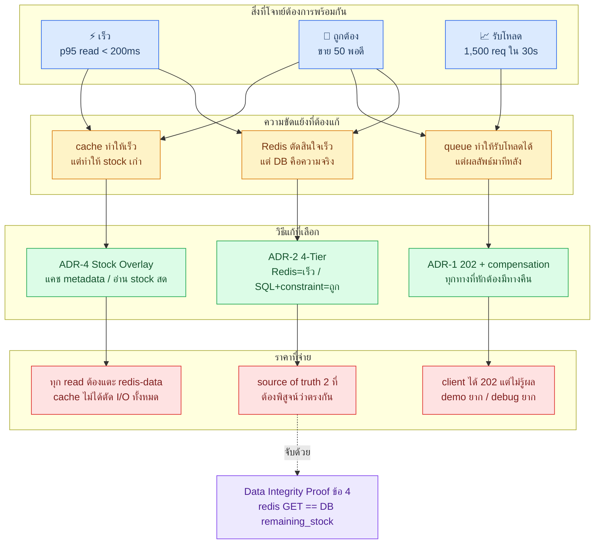
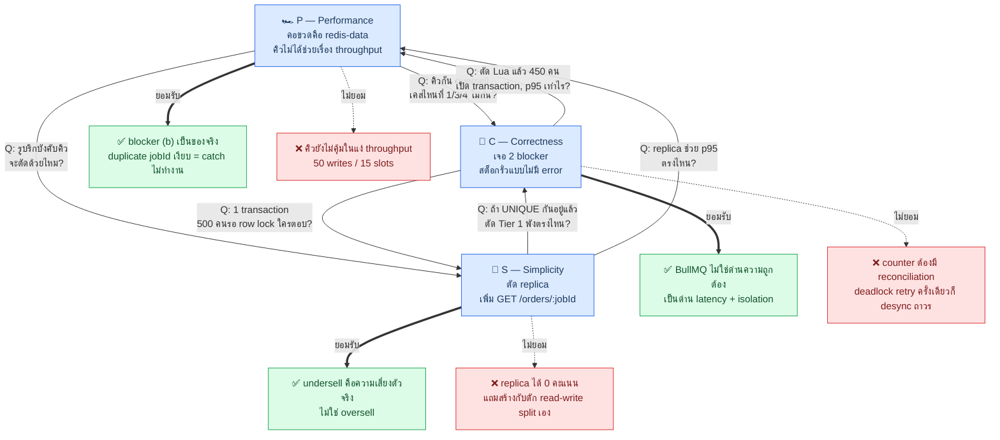

# 🧭 Architecture Rationale — ทำไมถึงเลือกสถาปัตยกรรมนี้

> **เอกสารนี้คืออะไร**: บันทึก **เหตุผลเบื้องหลังการตัดสินใจ** (Decision Record) + **ข้อดี/ข้อเสียแบบตรงไปตรงมา** + **บันทึกการถกเถียง** ระหว่าง reviewer 3 มุมมองที่ถูกส่งไป scrutinize แบบเดียวกับที่ทำกันจริงในทีม
> **ไม่ใช่สเปก** — สเปกอยู่ที่ [`architecture.md`](./architecture.md) ถ้าสองไฟล์ขัดกัน **ถือว่า `architecture.md` ถูก**
> **ใช้ตอนไหน**: เขียนหัวข้อ "เหตุผลการออกแบบ" ในรายงาน · ตอบคำถามอาจารย์ว่า *"ทำไมไม่ทำแบบง่ายกว่านี้"* · ตอนจะแก้ดีไซน์แล้วอยากรู้ว่าของเดิมเลือกแบบนั้นเพราะอะไร

| อ่านอะไร | ไปที่ |
| :--- | :--- |
| ไม่เข้าใจว่าระบบทำงานยังไง | [`architecture-primer.md`](./architecture-primer.md) |
| อยากได้สเปกไปเขียนโค้ด | [`architecture.md`](./architecture.md) |
| อยากได้รูปไปใส่รายงาน | [`diagrams.md`](./diagrams.md) |
| **อยากรู้ว่าทำไมเลือกแบบนี้ ← เอกสารนี้** | ด้านล่าง |

---

## 1. 🎯 สรุปการตัดสินใจใน 1 ย่อหน้า

โจทย์นี้มีคำถามเดียวคือ **"500 คนกดพร้อมกันแย่งของ 50 ชิ้น ทำยังไงให้ขายได้ 50 พอดี ไม่ขาดไม่เกิน และเร็วด้วย"**
สถาปัตยกรรมนี้ตอบด้วยหลักการเดียว: **แยก "การตัดสินใจ" ออกจาก "การบันทึก"**

- **การตัดสินใจ** (ใครได้ ใครไม่ได้) เกิดที่ **Redis + Lua** — atomic, in-memory, ~1 ms, ตัด 450 จาก 500 คนออกไปโดยไม่แตะฐานข้อมูลเลย
- **การบันทึก** (สร้าง order จริง หักสต็อกจริง) เกิดที่ **PostgreSQL ผ่าน BullMQ worker** — ช้ากว่าแต่ทนทาน มี transaction มี constraint และถูกจำกัดจำนวนไว้ที่ระดับที่ DB รับไหว

ผลคือ **ความเร็วมาจากด่านหน้า ความถูกต้องมาจากด่านหลัง** และ **ไม่มีด่านไหนต้องแบกทั้งสองอย่างพร้อมกัน**
ราคาที่ต้องจ่ายคือ: **มี source of truth 2 ที่ (Redis counter กับ DB) ที่มีโอกาสไม่ตรงกัน** — ครึ่งหนึ่งของความซับซ้อนทั้งหมดในเอกสารสเปก คือกลไกที่มีไว้ไล่ปิดช่องนั้น

---

## 2. 🔒 อะไรคือ "ข้อบังคับ" อะไรคือ "เราเลือกเอง"

ก่อนจะเถียงว่าออกแบบดีหรือไม่ดี ต้องแยกให้ออกก่อนว่า **ของบางชิ้นเราไม่มีสิทธิ์เลือก**

| องค์ประกอบ | สถานะ | หมายเหตุ |
| :--- | :--- | :--- |
| Nginx + backend ≥ 3 instances | 🔒 **โจทย์บังคับ** | ข้อ 1.1 |
| NestJS modular structure | 🔒 **โจทย์บังคับ** | ข้อ 1.2 |
| PostgreSQL + TypeORM + Connection Pooling | 🔒 **โจทย์บังคับ** | ข้อ 1.3 |
| Redis caching + invalidation | 🔒 **โจทย์บังคับ** | ข้อ 1.4 |
| Message Queue (BullMQ) | 🔒 **โจทย์บังคับ** | ข้อ 1.5 |
| JWT stateless auth | 🔒 **โจทย์บังคับ** | ข้อ 1.6 |
| `POST /api/v1/orders` → **202** | 🔒 **โจทย์บังคับ** | ข้อ 2.3 — ล็อกรูปแบบ async ไว้แล้ว |
| Dashboard (Bull-Board) | 🔒 **โจทย์บังคับ** | ข้อ 1.7 |
| **Redis 2 instance แยก cache/data** | ✳️ **เราเลือกเอง** | ADR-3 |
| **Lua gatekeeper เป็นด่านแรก** | ✳️ **เราเลือกเอง** | ADR-2 |
| **Stock Overlay (แยก metadata ออกจาก stock)** | ✳️ **เราเลือกเอง** | ADR-4 |
| **PostgreSQL read replica** | ✳️ **เราเลือกเอง** | ADR-5 |
| **worker concurrency = 5** | ✳️ **เราเลือกเอง** | ADR-6 |

> 💡 **ประเด็นที่ต้องพูดในรายงาน**: การที่โจทย์บังคับทั้ง *"message queue"* และ *"202 Accepted"* แปลว่า **โจทย์ตัดสินใจแทนเราแล้ว**ว่าจะเป็น async
> คำถามที่เหลือจึงไม่ใช่ *"async หรือ sync ดีกว่า"* แต่เป็น **"เมื่อบังคับให้ async แล้ว จะกันไม่ให้สต็อกรั่วได้ยังไง"** — ซึ่งคือ §6 ทั้งหมดของสเปก

---

## 3. 📋 Decision Records — ทีละข้อ พร้อมข้อเสีย

รูปแบบ: **บริบท → ทางเลือกที่ทิ้งไป → ทำไมถึงเลือก → ✅ ข้อดี → ❌ ข้อเสีย → 🔙 ถ้าจะถอย**

---

### ADR-1 · ตัดสินใจที่ Redis ก่อน แล้วค่อยบันทึกที่ DB ทีหลัง

**บริบท** — 500 VUs × 3 iterations ≈ 1,500 requests เข้ามาในไม่กี่วินาที แต่ของมีแค่ 50 ชิ้น แปลว่า **~97% ของ request รู้ผลได้โดยไม่ต้องแตะ PostgreSQL เลย**

**ทางเลือกที่ทิ้งไป** — ส่งทุก request เข้าคิวแล้วให้ worker ตัดสินทั้งหมด

**ทำไมถึงเลือก** — ถ้าปล่อยทุก request เข้าคิว คิวจะมี 1,500 job ที่ 1,450 job มีชะตากรรมเดียวคือ "ของหมด" คนที่จะได้ของจริงต้องต่อแถวอยู่หลังขยะพวกนั้น → p95 ของ write path ขึ้นกับความยาวคิว ไม่ใช่ความเร็วระบบ

**✅ ข้อดี**
- 450 คนได้คำตอบใน ~1 ms โดยไม่มี DB connection ถูกใช้แม้แต่ตัวเดียว
- คิวมีแต่ job ที่ *มีโอกาสสำเร็จ* → Bull-Board อ่านง่าย ตัวเลขในรายงานสวยและ**อธิบายได้**
- โหลดที่ลงไปถึง PostgreSQL ถูก **จำกัดด้วยจำนวนสต็อก** ไม่ใช่จำนวนคน

**❌ ข้อเสีย (ยอมรับ)**
- **เกิด source of truth ที่ 2** — `stock:flash_sale:*` ใน Redis กับ `products.remaining_stock` ใน DB อาจไม่ตรงกัน ต้องมี compensation ทุกเส้นทาง (invariant §4 ข้อ 6)
- **Redis กลายเป็น SPOF ของ write path** — cache ล่มระบบยังอยู่ แต่ `redis-data` ล่ม = สั่งซื้อไม่ได้เลย
- **Lua เขียนยาก เทสยาก** ไม่มี type ไม่มี debugger ต้องเทสด้วย integration test เท่านั้น
- **ลืม `pnpm run seed:redis` = ระบบตายเงียบ** — จึงต้องมี verdict `-4` → 503 แยกออกจาก "ของหมด" ให้ชัด

**🔙 ถ้าจะถอย** — ตัด Tier 1 ออก ให้ controller enqueue ตรงๆ ระบบยัง **ถูกต้อง** อยู่ (Tier 3 + 4 กันเอง) แต่จะ **ช้าลงมาก** และตัวเลขในรายงานจะอธิบายยาก

---

### ADR-2 · ทำไมต้อง 4 ด่าน ในเมื่อ `UNIQUE` ด่านเดียวก็กันซื้อซ้ำได้

**บริบท** — ด่านสุดท้าย (DB constraint) กันผิดพลาดได้ 100% อยู่แล้ว คำถามคือแล้วอีก 3 ด่านมีไว้ทำไม

**ทำไมถึงเลือก** — เพราะ **แต่ละด่านแก้คนละปัญหา ไม่ได้แก้ปัญหาเดียวกันซ้ำ 4 รอบ**

| ด่าน | หน้าที่จริง | ถ้าตัดออกจะเสียอะไร |
| :--- | :--- | :--- |
| Tier 1 Lua | **กันโหลด** — ตัด 97% ทิ้งแบบ atomic | ยังถูกต้อง แต่ p95 พังและ DB โดนเต็มๆ |
| Tier 2 BullMQ | **กันการล้น** — จำกัด write concurrency + retry ได้ | request แปรผันตรงกับ DB connection → pool หมด |
| Tier 3 Atomic SQL | **กัน TOCTOU** — `WHERE remaining_stock > 0` + เช็ค `affected === 0` | oversell จริงเมื่อ worker หลายตัวชนกัน |
| Tier 4 Constraint | **ตาข่ายสุดท้าย** — `UNIQUE` + `CHECK` | บั๊กที่หลุด 3 ด่านแรกจะกลายเป็นข้อมูลเสียถาวร |

> **ประโยคที่ใช้ตอบอาจารย์ได้เลย**: *ด่าน 3 กับ 4 ทำให้ระบบ **ถูก** ส่วนด่าน 1 กับ 2 ทำให้ระบบ **เร็ว** — ตัดด่าน 1–2 ออกระบบยังถูกอยู่ แต่ตัดด่าน 3–4 ออกเมื่อไหร่คือ oversell ทันที*

**❌ ข้อเสีย** — โค้ดยาวขึ้นมาก, บั๊กหนึ่งตัวอาจซ่อนอยู่หลังอีกด่านหนึ่งจนไม่รู้ตัว (เช่น ถ้า Lua พังแต่ `UNIQUE` กันไว้ เราจะไม่เห็น error เลย) → จึงต้องมี **Data Integrity Proof ข้อ 4** (`redis-cli GET` ต้องตรงกับ DB) เป็นตัวจับ

---

### ADR-3 · แยก Redis เป็น 2 instance

**ทางเลือกที่ทิ้งไป** — Redis ตัวเดียว แล้วตั้ง TTL ให้ดีๆ เอา

**ทำไมถึงเลือก** — `maxmemory-policy` เป็นค่า **ระดับเซิร์ฟเวอร์ ไม่ใช่ระดับ key** ตั้ง `allkeys-lru` เมื่อไหร่ แปลว่า **ทุก key มีสิทธิ์ถูก evict** รวมถึง `stock:flash_sale:*` และ job ของ BullMQ ผลคือ order หายเงียบๆ ทั้งที่ลูกค้าได้ 202 ไปแล้ว — เป็นความพังชนิดที่ log ไม่ขึ้นและ test จับไม่ได้

**✅ ข้อดี** — แยกความเสี่ยงชัด: `redis-cache` ล่ม → fallback ไป DB ได้ (แค่ช้าลง) · `redis-data` ต่างหากที่ห้ามล่ม
**❌ ข้อเสีย** — เพิ่ม 1 container, เพิ่ม config, เพิ่ม connection, กิน RAM มากขึ้น, และเป็นจุดที่ตอน demo มักลืมว่า port ไหนคือตัวไหน (`6379` cache / `6380` data)

**🔙 ถ้าจะถอย** — ใช้ตัวเดียวได้ **แต่ต้องเป็น `noeviction`** แล้วตั้ง TTL ทุก cache key ด้วยมือ ห้ามพลาดแม้แต่ key เดียว — ความเสี่ยงย้ายจาก "ของหาย" ไปเป็น "OOM" ซึ่งอย่างน้อยก็ดังกว่า

---

### ADR-4 · Stock Overlay — คำตอบตรงๆ ของ "เงื่อนไขสำคัญ" ในโจทย์

**บริบท** — โจทย์ระบุว่า `remainingStock` ต้องถูกต้องเสมอ แต่ก็บังคับให้ใช้ cache ด้วย ซึ่งสองข้อนี้ขัดกันโดยธรรมชาติ

**ทางเลือกที่ทิ้งไป**

| ทางเลือก | ทำไมไม่เอา |
| :--- | :--- |
| แคชทั้ง object รวม `remainingStock` แล้ว invalidate ทุกครั้งที่ขาย | ช่วง flash sale = ช่วงที่ขายรัวที่สุด = ช่วงที่ cache ถูกล้างรัวที่สุด → **cache ใช้ไม่ได้พอดีตอนที่ต้องการมันที่สุด** และยังมี race ระหว่าง invalidate กับ read |
| ไม่แคชเลย | ผิดโจทย์ข้อ 1.4 และ read path 1,000 VUs จะถล่ม DB |
| แคชสั้นๆ 1–2 วินาที (L1 in-memory) | 3 instance จะตอบสต็อกไม่ตรงกัน ผิด "เงื่อนไขสำคัญ" และผิดกฎ stateless |

**ทำไมถึงเลือก** — เพราะข้อมูลใน response มี **2 ชนิดที่มีอัตราการเปลี่ยนแปลงต่างกันเป็นพันเท่า** จับมันแยกกันซะ: metadata (`name`, `price`, `availableStock`) แคชได้เป็นนาที · `remainingStock` อ่านสดจาก counter ด้วย **1 `MGET`** แล้ว merge ตอน serialize

**✅ ข้อดี**
- metadata cache hit ratio สูงได้จริง (≥ 90%) **โดยไม่ต้อง invalidate ตอนขายเลยแม้แต่ครั้งเดียว**
- `remainingStock` สดระดับ real-time ทุก request ทุก instance ตรงกันเสมอ
- คำถามที่อาจารย์ระบุไว้ตรงๆ (*"จัดการ remainingStock อย่างไร"*) ตอบได้ด้วยไดอะแกรมรูปเดียว

**❌ ข้อเสีย**
- **cache ไม่ได้ตัด I/O ทั้งหมด** — ทุก read ยังต้องยิง `redis-data` เสมอ (นี่คือประเด็นที่ reviewer สาย performance จับได้ ดู §6 Q3)
- logic ตอน serialize ซับซ้อนขึ้น และมี edge case ว่า **ถ้า stock key หายจะตอบอะไร** (`null`? `0`? 503?)
- ตัวเลข hit ratio ที่รายงานต้องอธิบายให้ชัดว่าเป็นของ *metadata cache* ไม่ใช่ของทั้ง request

---

### ADR-5 · PostgreSQL Read Replica — ข้อที่เราขายไม่เต็มปาก

**ทำไมถึงเลือก** — โจทย์ให้แสดง connection pooling และวิชานี้สอน read-write split; replica ยังทำให้ invariant *"worker ต้องเขียนผ่าน `createQueryRunner('master')`"* **มีความหมายจริง** แทนที่จะเป็นกฎลอยๆ

**❌ ข้อเสีย (พูดตรงๆ)**
- **ประโยชน์เชิง performance ในโหลดนี้ต่ำมาก** — read path ถูก cache กินไปเกือบหมด replica เลยรับแค่ traffic ตอน cache miss
- **แพงที่สุดใน stack เรื่องเวลา setup/debug** — streaming replication ไม่ขึ้นคือปัญหาที่กินเวลาทีมนักศึกษามากที่สุด
- **replication lag เป็นบ่อเกิดบั๊ก** ที่ไม่มีวันเกิดถ้าไม่มี replica ตั้งแต่แรก

**🔙 ถ้าจะถอย** — ถ้าใกล้เดดไลน์แล้ว replica ยังไม่ขึ้น **ให้ตัดทิ้งเป็นอย่างแรก** แล้วชี้ทั้ง master/slave ไป DataSource เดียวกัน ระบบยังถูกต้อง 100% เสียแค่หัวข้อ read-write split ในรายงาน

---

### ADR-6 · worker concurrency = 5 (ไม่ใช่ 50)

**ทำไมถึงเลือก** — ถ้ารัน worker ใน process เดียวกับ API มันคือ **DataSource เดียวกัน = pool เดียวกัน** จะแบ่ง "10 ให้ API + 5 ให้ worker" ไม่ได้ ทั้งคู่แย่ง pool 10 ตัวเดียวกัน ตั้ง concurrency เกิน pool เมื่อไหร่ = job ค้างรอ connection แล้ว timeout

**✅ ข้อดี** — 3 instance × 5 = 15 concurrent writes ซึ่งเกินพอสำหรับของ 50 ชิ้น และ total connection = 3 × (1+1) × 10 = **60 จาก 100** (60%) ปลอดภัย
**❌ ข้อเสีย** — **นี่คือเพดาน throughput ที่แท้จริงของ write path** ถ้าโจทย์เปลี่ยนเป็นของ 50,000 ชิ้น ตัวเลขนี้จะกลายเป็นคอขวดทันที

---

### ADR-7 · JWT HS256 แบบ zero-I/O

**ทำไมถึงเลือก** — โจทย์บังคับ stateless และห้าม session ใน memory; HS256 verify ได้ด้วย CPU ล้วน **ไม่ต้องแตะ DB หรือ Redis เลย** ที่ 1,500 requests การเช็ค session ผ่าน I/O จะกลายเป็นคอขวดเอง

**✅ ข้อดี** — scale ตามจำนวน instance ได้ตรงๆ · `userId` มาจาก claim `sub` เท่านั้น ทำให้ปลอมตัวไม่ได้และ dedup key เชื่อถือได้
**❌ ข้อเสีย** — **revoke token ก่อนหมดอายุไม่ได้** (ต้องมี blacklist ซึ่งจะทำลาย stateless) · secret หลุด = ปลอม token ได้ทั้งระบบ · ในงานจริงต้องมี refresh token ซึ่งโจทย์นี้ไม่ต้องการ

---

## 4. 🗺️ แผนที่ Trade-off — อะไรแลกกับอะไร



---

## 5. ⚖️ ข้อดี–ข้อเสีย ภาพรวม

### ✅ ข้อดี

| ข้อ | รายละเอียด | หลักฐานที่ใช้ในรายงานได้ |
| :--- | :--- | :--- |
| **Zero-oversell พิสูจน์ได้** | กัน 4 ชั้นอิสระ ชั้นสุดท้ายเป็น DB constraint ที่ทะลุไม่ได้ | `SELECT` 3 ข้อใน §9.3 |
| **โหลดไม่ทะลุถึง DB** | 97% ของ request จบที่ Redis ใน ~1 ms | Bull-Board: completed = 50 ไม่ใช่ 1,500 |
| **`remainingStock` สดโดยไม่ทำลาย cache** | Stock Overlay — ตอบ "เงื่อนไขสำคัญ" ตรงๆ | hit ratio ≥ 90% ระหว่างที่ stock เปลี่ยนตลอด |
| **Stateless จริง** | ไม่มี state ใน RAM → เพิ่ม instance ได้ทันที | ยิงผ่าน Nginx แล้วผลตรงกันทุก instance |
| **ล้มแล้วไม่ทำให้ข้อมูลเพี้ยน** | compensation idempotent + side effect อยู่นอก transaction | Failure Matrix §7 (9 สถานการณ์) |
| **มีเอกสารครบชั้น** | primer / spec / diagrams / rationale | ใช้เป็นเนื้อหารายงานได้ตรง |

### ❌ ข้อเสีย

| ข้อ | รายละเอียด | บรรเทายังไง |
| :--- | :--- | :--- |
| **ซับซ้อนเกินตัวโจทย์** | 8 container สำหรับของ 50 ชิ้น | ยอมรับ — เพราะโจทย์บังคับองค์ประกอบไว้เกือบหมด (§2) |
| **source of truth 2 ที่** | Redis counter อาจ drift จาก DB | Data Integrity Proof ข้อ 4 + compensation ทุก path |
| **ไม่มี reconciliation อัตโนมัติ** | ถ้า drift แล้ว ไม่มีอะไรมาซ่อมให้เอง | ⚠️ **ข้อจำกัดที่ยอมรับ** ดู §6 Q5 |
| **client ไม่รู้ผลจริง** | 202 แปลว่า "รับเรื่อง" ไม่ใช่ "ได้ของ" | ต้องมีวิธีให้ grader ตรวจ ดู §6 Q6 |
| **`redis-data` เป็น SPOF** | ล่ม = สั่งซื้อไม่ได้ทั้งระบบ | AOF + `noeviction` + verdict `-4` → 503 (ไม่ใช่ตอบผิดเงียบๆ) |
| **replica ได้ไม่คุ้มเสีย** | ประโยชน์ต่ำ แต่ debug แพง | ตัดทิ้งได้ถ้าเวลาไม่พอ (ADR-5) |
| **เพดาน write = 15 concurrent** | ผูกกับ pool size | พอสำหรับโจทย์นี้ แต่ไม่ scale ถ้าของเยอะขึ้นมาก |

---

## 6. 🗣️ บันทึกการถกเถียง (Design Review Q&A)

เอกสารสเปกถูกส่งไปให้ reviewer 3 คนอ่านแบบ **ไม่เห็นความเห็นกัน** จากนั้นเอาคำถามที่แต่ละคนตั้งไปให้อีกสองคนตอบ (cross-examination) นี่คือบันทึกที่เกิดขึ้นจริง

| Reviewer | จุดยืน | สนใจอะไร |
| :--- | :--- | :--- |
| 🏎️ **P — Performance** | *"ความเร็วเกือบทั้งหมดมาจาก Lua ไม่ใช่จากคิว"* | throughput, p95, คอขวดจริง |
| 🔬 **C — Correctness** | *"oversell กันได้ แต่ undersell ไม่"* | oversell/undersell, สต็อกหาย, drift |
| 🧰 **S — Simplicity** | *"เก็บไว้ทั้งหมด ยกเว้น replica"* | ทีมนักศึกษาสร้างทันไหม แต่ละชิ้นได้คะแนนไหม |

### 🗺️ แผนที่การถกเถียง



---

### Q1 · ทำไมไม่ทำ synchronous ไปเลย จะได้ไม่ต้องมีคิว

> **C ถาม P**: *"ถ้าตัด Lua ทิ้ง แล้วให้ 450 คนที่แพ้เปิด transaction ที่ master กันหมด p95 จะเป็นเท่าไร"*

**P**: 3 instance × pool 10 = **30 slot** สำหรับ ~1,500 request; `UPDATE` ที่ affect 0 แถวใช้ ~2–5 ms → เคลียร์หมดใน ~200–300 ms, **p95 ตกราว 300 ms – 1 s และ Postgres ไม่ล้ม** สรุปคือ gatekeeper ได้ p95 มาจริง แต่ **ไม่ได้กู้ชีวิต DB** ที่สเกลนี้

**S**: ไม่ว่าจะยังไงก็ตัดคิวไม่ได้ — โจทย์บังคับทั้ง message queue และ **202** ผมไม่เคยเสนอให้ตัดคิว รายการที่ผมเสนอให้ตัดมีชิ้นเดียวคือ replica

> ✅ **ข้อสรุป**: async ไม่ใช่ทางเลือกที่เราเลือก — **โจทย์เลือกให้แล้ว** และเหตุผลเชิงเทคนิคที่รองรับคือ p95 + การแยกความล้มเหลว **ไม่ใช่ throughput**

---

### Q2 · ในเมื่อ `UNIQUE` + `CHECK` กัน oversell ได้ 100% แล้ว อีก 3 ด่านมีไว้ทำไม

> **P และ S ถาม C พร้อมกัน**: *"บอกมาสักเคสหนึ่งที่ Tier 2 กันได้แต่ Tier 1/3/4 กันไม่ได้"*

**C**: **ยอมรับ — ไม่มี** การ dedup ด้วย `jobId` ถูกครอบด้วย `UNIQUE(user_id, product_id)` ทั้งหมดอยู่แล้ว **BullMQ ไม่ใช่ด่านความถูกต้อง**

> **S ถามต่อ**: *"งั้นตัด Tier 1 ล่ะ invariant ข้อไหนพัง"*

**C**: **ไม่มี invariant ด้านความปลอดภัยพัง** — แต่สิ่งที่ตายคือ **ข้อผูกพันตามสัญญา** ไม่ใช่ความถูกต้อง: counter ที่ Tier 1 ดูแลอยู่ **คือตัวเดียวกับที่ read path เอาไป overlay** เป็น `remainingStock` และ verdict `-2` (429) กับ `-4` (503) ก็ไม่มีที่อื่นผลิตได้ ตัด Tier 1 ทิ้งเมื่อไหร่ = ต้องตอบ `remainingStock` จาก DB ให้ read VUs 1,000 คน

> ✅ **ข้อสรุป (ประโยคที่ควรใส่ในรายงาน)**: **Tier 3 + 4 ทำให้ระบบถูก · Tier 1 ทำให้ระบบเร็ว *และ* เป็นแหล่งของ `remainingStock` · Tier 2 ทำให้ระบบไม่ล้มพร้อมกันและมาจากรูบริก**

---

### Q3 · คอขวดจริงอยู่ที่ไหน

**P**: **`redis-data`** — thread เดียวรับทั้ง `MGET` ของ read path 1,000 VUs, EVALSHA ของ gatekeeper 1,500 ครั้ง, ทุกคำสั่งของ BullMQ และ AOF fsync พร้อมกัน. §1 อธิบายเหตุผลที่แยก Redis ไว้แค่เรื่อง **eviction policy** ไม่เคยพูดถึง **load isolation** เลย — Node event loop เป็นที่สอง ส่วน Postgres ไม่ใกล้เคียง

**C**: และนี่ไม่ใช่แค่เรื่องช้า — **latency แปลงเป็น drift ได้**: AOF fsync ค้างหรือ `MGET` ก้อนใหญ่บล็อก `redis-data` สามารถดัน worker เลย lock TTL 30 s หรือทำ `queue.add()` timeout ได้ ซึ่ง **ทางออกทั้งสองทางนั้นวิ่งเข้าเส้นทางที่สต็อกรั่วพอดี**

> ✅ **ข้อสรุป**: ในรายงาน ให้ระบุคอขวดเป็น `redis-data` ไม่ใช่ PostgreSQL — และควรวัด `INFO commandstats` ประกอบ

---

### Q4 · replica ควรตัดทิ้งไหม

> **S ถาม P**: *"read path แทบไม่แตะ Postgres หลัง warm-up แล้ว replica ช่วย p95 ตรงไหน"*

**P**: **สนับสนุนให้ตัด** — หลัง warm-up replica รับแค่ single-flight miss ตอน TTL หมด คือไม่กี่ query ต่อนาที การตัดทิ้งยังคืน connection 30 ตัว และ **ลบกับดัก `createQueryRunner('master')` ทิ้งไปด้วย** ซึ่ง `diagrams.md` §8 ระบุเองว่าเป็น invariant ข้อเดียวที่ **ไม่มีชั้นสำรอง**

**S**: replica ไม่มีอยู่ในตาราง traceability ข้อไหนเลย (ข้อ 1.3 เขียนว่า *"PostgreSQL + TypeORM + Connection Pooling"* ไม่มีคำว่า replication) แต่มันสร้าง failure class ขึ้นมาเองทั้งคลาส

> ⚖️ **ยังไม่ตกลง** — 2 เสียงให้ตัด แต่ตัดแล้วเสียหัวข้อ read-write split ในรายงาน **ดู ADR-5: ถ้าใกล้เดดไลน์แล้ว replica ยังไม่ขึ้น ให้ตัดเป็นชิ้นแรก**

---

### Q5 · client ได้ 202 แล้วอาจารย์จะรู้ได้ยังไงว่าสั่งซื้อสำเร็จ

**S**: สัญญา API มีแค่ 3 endpoint และไม่มีใครบริโภค `orderJobId` เลย — grader เห็นแต่ 202 แล้วต้องเชื่อเราอย่างเดียว **นี่คือ blocker ของการ demo ไม่ใช่ของโค้ด**

> 💡 การเพิ่ม `GET /api/v1/orders/:jobId` เป็นการ **เพิ่ม (additive)** ล้วนๆ — ไม่แตะ path/field/status ที่มีอยู่ จึงไม่ทำให้ k6 ของกลุ่มอื่นพัง และ**ไม่นับเป็นการเปลี่ยน API contract**
> ⚠️ ถึงอย่างนั้นก็ยังต้อง**ถามเจ้าของโปรเจกต์ก่อนเพิ่ม** ตาม `CLAUDE.md` §8

---

### Q6 · Redis กับ DB ไม่ตรงกัน มีอะไรมาซ่อมให้ไหม

**C**: **ไม่มีเลย** — `SET ... NX` ตอน seed ถูกออกแบบมาให้ **แก้ค่าที่ผิดอยู่แล้วไม่ได้** โดยเจตนา ส่วน §9.3 ข้อ 4 เป็นแค่ **การตรวจย้อนหลังด้วยมือ ไม่ใช่ loop ที่ซ่อม** และ deadlock retry ครั้งเดียวก็ทำให้ desync ถาวรได้

> ⚠️ **ยอมรับเป็นข้อจำกัดของงานนี้** — สำหรับ flash sale รอบเดียวที่ seed ใหม่ก่อนทดสอบทุกครั้ง การไม่มี reconciliation รับได้ **แต่ต้องเขียนบอกในรายงานว่ารู้ตัว** ไม่ใช่ปล่อยให้ดูเหมือนมองข้าม

---

### Q7 · ทีมมีเวลาจำกัด ทำอะไรก่อน

**S** จัดลำดับ และอีกสองคนไม่ค้าน:

| ลำดับ | งาน | เหตุผล |
| :--- | :--- | :--- |
| **1** | 🚨 แก้ blocker (b) — เช็คค่าที่ `queue.add()` คืนมา | ทำให้ตกเกณฑ์ §9.3 โดยตรง |
| **2** | 🚨 แก้ blocker (a) — compensate เฉพาะตอน attempt สุดท้าย | เป็น *ตัวจุดชนวน* ของ (b) |
| **3** | ย้าย `seed:redis` เข้า bootstrap | ลืมเมื่อไหร่ = 503 ทั้งระบบ + ผิดข้อ "1-click start" |
| **4** | เพิ่ม `GET /orders/:jobId` | ทำให้ demo พิสูจน์ได้ |
| **5** | ตัด replica (ถ้าจะตัด) | ต้องตัดก่อนเขียน compose ไม่งั้นไม่คุ้ม |

**S**: *"ทั้งสอง blocker เป็นการแก้ ~10 บรรทัดในโค้ดที่ยังไม่มีอยู่จริง แก้บนกระดาษตอนนี้เสียเวลาหนึ่งบ่าย ปล่อยไปเจอตอนตี 2 ในรูปของ `remainingStock` ค้างอยู่ที่ 1 เสียทั้งสุดสัปดาห์"*

---

### 📊 สรุปผลการถกเถียง

| ประเด็น | ผล |
| :--- | :--- |
| BullMQ เป็นด่านความถูกต้องไหม | ✅ **ตกลงกันได้** — ไม่ใช่ เป็นด่าน latency + isolation + รูบริก |
| ความเสี่ยงตัวจริงคืออะไร | ✅ **ตกลงกันได้** — **undersell (สต็อกรั่ว)** ไม่ใช่ oversell |
| คอขวด | ✅ **ตกลงกันได้** — `redis-data` |
| Stock Overlay | ✅ **ตกลงกันได้** — ไม่มีใครแตะ เป็นไอเดียที่แข็งที่สุดในดีไซน์ |
| แยก Redis 2 ตัว | ✅ **ตกลงกันได้** — คุ้ม (ราคา ~6 บรรทัดใน compose) |
| blocker (a) + (b) | ✅ **ตกลงกันได้** — ต้องแก้ก่อนยิง load test |
| ตัด replica ไหม | ⚖️ **2 : 1 ให้ตัด** — ยังไม่ชี้ขาด |
| ต้องมี reconciliation ไหม | ⚖️ **ไม่ตกลง** — C ยืนยันว่าต้องมี, อีกสองคนว่ารับความเสี่ยงได้ในงานนี้ |

---

## 7. 🚨 สองข้อที่ต้องแก้ก่อนยิง Load Test

> รอบ review นี้เจอบั๊กจริงในโค้ดอ้างอิงของสเปก **ยังไม่ได้แก้ในสเปก** — บันทึกไว้ตรงนี้ก่อน

### (a) `compensateOnce()` แล้ว `throw` เพื่อ retry = คืนสต็อกเกิน

`architecture.md` §6.3 บรรทัดสุดท้ายของ `catch`:
```typescript
await this.redis.compensateOnce(job.id, userId, productId);
...
throw err;    // ✅ transient → retry
```
**ลำดับที่พัง**: attempt 1 เจอ deadlock `40P01` → คืนสต็อกใน Redis (50) + `DEL` lock → `throw` → attempt 2 สำเร็จ → DB ลงเป็น 49
→ **Redis สูงกว่า DB ถาวร 1 หน่วย ตกเกณฑ์ §9.3 ข้อ 4** และมีคนที่ 51 ได้ 202 ไปโดยที่ job ตายที่ `affected = 0`

`compensated:{jobId}` กันการคืน**ซ้ำ** ได้ แต่ **ไม่ได้กันการคืน job ที่ยังไม่ตาย**

**แก้ขั้นต่ำ**: คืนสต็อกเฉพาะตอนที่ล้มเหลวถาวรจริงเท่านั้น
```typescript
const isFinalAttempt = job.attemptsMade + 1 >= (job.opts.attempts ?? 1);
if (isFinalAttempt || err instanceof SoldOutError) {
  await this.redis.compensateOnce(job.id, userId, productId);
}
```

### (b) `queue.add()` ที่ `jobId` ซ้ำ **ไม่ throw** → `catch` ไม่เคยทำงาน

`architecture.md` §6.2 พึ่ง `try/catch` รอบ `queue.add()` เป็นทางชดเชยเดียว แต่ BullMQ เจอ `jobId` ซ้ำแล้ว **คืน job เดิมเงียบๆ ไม่ throw**
**ลำดับที่พัง**: worker คืนสต็อกไปแล้ว (lock หลุด) → user ยิงใหม่ → Lua ตอบ 1 → `DECR` → `queue.add()` ชนกับ record เดิมที่ยังถูกเก็บไว้ (`removeOnComplete: { count: 5000 }`) → **no-op** → ตอบ 202 → **ไม่มี job ไม่มี compensation สต็อกหาย 1 ชิ้นถาวร**

**แก้ขั้นต่ำ**: ตรวจค่าที่คืนมา อย่าพึ่ง `catch` อย่างเดียว
```typescript
const job = await this.ordersQueue.add(/* ... */);
// BullMQ คืน job เดิมแบบเงียบๆ ถ้า jobId ซ้ำ — ต้องจับเคสนี้เอง
if (!job || (await job.getState()) === 'completed') {
  await this.redis.compensate(userId, productId);
  throw new ConflictException('Order already processed');
}
```

> ⚠️ ทั้งสองข้อแตะ **invariant §4 ข้อ 6 และ 8** ของ `CLAUDE.md` โดยตรง — ต้องได้รับการยืนยันจากเจ้าของโปรเจกต์ก่อนแก้ `architecture.md`

---

## 8. 📌 สรุป

**สถาปัตยกรรมนี้เหมาะกับโจทย์นี้** เพราะเกือบทุกองค์ประกอบถูกโจทย์บังคับมาแล้ว (§2) และส่วนที่เราเลือกเอง — **Stock Overlay** เป็นตัวที่ตอบ *"เงื่อนไขสำคัญ"* ได้ตรงที่สุด และผ่านการ review ทั้ง 3 มุมมองโดยไม่มีใครคัดค้าน

แต่ต้องพูดให้ตรงในรายงานว่า:
- **ความเร็วมาจาก Lua gatekeeper ไม่ใช่จากคิว** — คิวมาจากรูบริก + การแยกความล้มเหลว
- **ความเสี่ยงตัวจริงคือ undersell (สต็อกรั่ว) ไม่ใช่ oversell** — oversell ถูกกันด้วย DB constraint ที่ทะลุไม่ได้
- **คอขวดคือ `redis-data` ไม่ใช่ PostgreSQL**
- **ยังไม่มี reconciliation ระหว่าง Redis กับ DB** — รู้ตัวและยอมรับความเสี่ยงในขอบเขตงานนี้

---

## 📚 อ่านต่อ
- ปูพื้นฐาน: [`architecture-primer.md`](./architecture-primer.md)
- สเปก: [`architecture.md`](./architecture.md)
- ไดอะแกรม: [`diagrams.md`](./diagrams.md)
- กติกา AI agent: [`CLAUDE.md`](../../CLAUDE.md)
