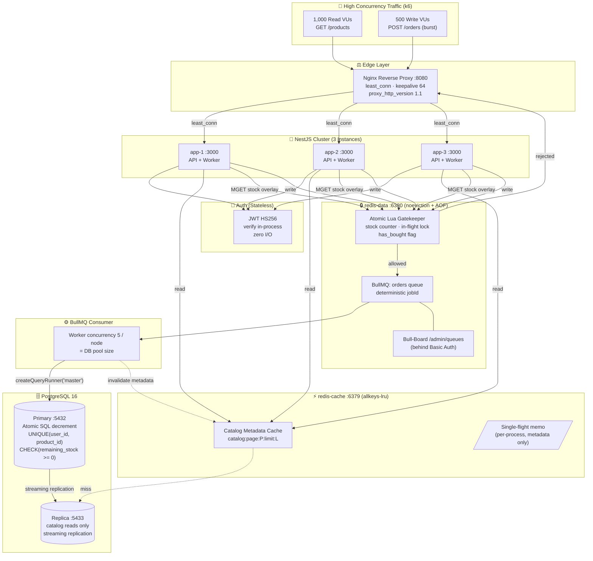

# 🏛️ Flash Sale System — Architecture & Concurrency Blueprint

> **โจทย์**: Mobile Backend Architecture & Performance Testing (Flash Sale System)
> **เป้าหมาย**: Read 1,000 concurrent users + Write burst 500 concurrent users แย่งสินค้า 50 ชิ้น
> **การันตี**: Zero Overselling · 1 ชิ้น / 1 ผู้ใช้ / 1 สินค้า · ตอบ HTTP เร็ว (ไม่มี synchronous DB write ใน controller)

---

## 0. 🎯 Requirement Traceability (โจทย์ → สถาปัตยกรรม)

| # | ข้อกำหนดจากโจทย์ | ที่อยู่ในเอกสารนี้ |
| :-- | :--- | :--- |
| 1.1 | Load Balancer: Nginx → **≥ 3 instances** | §2 |
| 1.2 | Backend: NestJS **Modular structure** | §3 |
| 1.3 | Database: PostgreSQL + TypeORM + **Connection Pooling** | §8 |
| 1.4 | Caching & Invalidation: Redis | §5 |
| 1.5 | Message Queue: **BullMQ** (async order processing) | §6.2 |
| 1.6 | **Stateless Auth: JWT** (ห้าม in-memory session) | §4 |
| 1.7 | Observability Dashboard (Bull-Board) | §9 |
| 2.1 | `POST /api/v1/auth/token` | §4.2 |
| 2.2 | `GET /api/v1/products?page=1&limit=10` + cache invalidation | §5 |
| 2.3 | `POST /api/v1/orders` → **202 Accepted** | §6 |
| 2.3.1 | Limit 1 per user | §6.1 + §6.4 |
| 2.3.2 | Concurrency (API level) — atomic Redis ops | §6.1 |
| 2.3.3 | Concurrency (Worker/DB level) — locking + unique constraint | §6.3 + §6.4 |
| 2.3.4 | Cache Invalidation หลัง worker ตัดสต็อกสำเร็จ | §5.4 |
| 3 | Load Test (k6) + Dashboard + Data Integrity Proof | §9, §10 |

---

## 1. 🏗️ ภาพรวมสถาปัตยกรรม (System Architecture Diagram)



> **หมายเหตุสำคัญ — แยก Redis 2 instance**
> `redis-cache` ตั้ง `maxmemory-policy allkeys-lru` เพราะเป็นแคชล้วน แต่ `redis-data` เก็บ **stock counter + BullMQ jobs** ซึ่งเป็น source of truth ชั่วคราว **ห้ามถูก evict เด็ดขาด** จึงต้อง `noeviction` + เปิด AOF
> ถ้ารวมไว้ตัวเดียว LRU จะลบ job หรือลบ `stock:*` ทิ้งกลางการทดสอบ → ระบบขายไม่ได้ทันที (ดู §7 Failure Matrix)
> *(อ้างอิง: Summary_Best_Practice B04 §ops, B05 §ops)*

---

## 2. ⚖️ Edge Layer: Nginx

```nginx
upstream backend {
    least_conn;                 # กระจายตาม in-flight connection จริง เหมาะกับ burst
    server app-1:3000 max_fails=3 fail_timeout=10s;
    server app-2:3000 max_fails=3 fail_timeout=10s;
    server app-3:3000 max_fails=3 fail_timeout=10s;
    keepalive 64;
}

server {
    listen 80;

    location / {
        proxy_pass http://backend;

        # ⚠️ บังคับ 2 บรรทัดนี้ ไม่งั้น `keepalive 64` ข้างบนไม่ทำงานเลย
        # Nginx จะคุย upstream ด้วย HTTP/1.0 + Connection: close
        # → TCP handshake ใหม่ทุก request (ตัวฉุด p95 อันดับ 1)
        proxy_http_version 1.1;
        proxy_set_header Connection "";

        proxy_set_header Host              $host;
        proxy_set_header X-Real-IP         $remote_addr;
        proxy_set_header X-Forwarded-For   $proxy_add_x_forwarded_for;
        proxy_set_header X-Forwarded-Proto $scheme;

        # กัน upstream ค้างแล้วกิน worker_connections จนหมด
        proxy_connect_timeout 2s;
        proxy_send_timeout    5s;
        proxy_read_timeout    5s;
    }
}
```

> Nginx เวอร์ชันฟรีมีแค่ **passive health check** (`max_fails` / `fail_timeout`) — มันอ่านสถานะ `HEALTHCHECK` ของ Docker/Podman **ไม่ได้** อย่าออกแบบโดยคิดว่ามี active failover *(B06 slide-errata #1, #2)*

---

## 3. 🧱 NestJS Modular Structure

```
src/
├─ main.ts                        # global ValidationPipe, graceful shutdown hooks
├─ app.module.ts
├─ config/
│  ├─ database.config.ts          # TypeORM replication (master/slaves) + pool sizing
│  └─ data-source.ts              # CLI DataSource สำหรับ migration
├─ auth/                          # §4
│  ├─ auth.controller.ts          # POST /api/v1/auth/token
│  ├─ auth.service.ts             # sign JWT (ไม่แตะ DB)
│  ├─ jwt.strategy.ts             # verify only — zero I/O
│  └─ jwt-auth.guard.ts
├─ products/                      # §5
│  ├─ products.controller.ts      # GET /api/v1/products
│  ├─ products.service.ts         # cache-aside + single-flight + stock overlay
│  └─ product.entity.ts
├─ orders/                        # §6
│  ├─ orders.controller.ts        # POST /api/v1/orders → 202
│  ├─ orders.service.ts           # Lua gatekeeper + enqueue (+ compensation)
│  ├─ orders.processor.ts         # BullMQ worker → Primary DB
│  └─ order.entity.ts
├─ redis/
│  ├─ redis.module.ts             # 2 connections: cache / data
│  ├─ redis.service.ts
│  ├─ lua/                        # .lua files โหลดด้วย defineCommand
│  └─ redis.keys.ts               # ⚠️ key-builder รวมศูนย์ ห้ามต่อ string เอง
├─ health/                        # /health/live, /health/ready
└─ common/
   ├─ middleware/trace-id.middleware.ts
   └─ interceptors/logging.interceptor.ts
```

จัดโมดูล **ตาม domain (feature) ไม่ใช่ตาม layer** — controller ทำแค่ HTTP, business logic อยู่ที่ service, ไม่มี DB access ใน controller *(B02)*

---

## 4. 🔐 Stateless Authentication (JWT)

โจทย์บังคับ **JWT + ห้ามใช้ in-memory session** เพราะทั้ง 3 instance ต้อง verify token ได้เองโดยไม่ต้องแชร์ state

### 4.1 หลักการ
- **HS256 + shared secret** จาก `JWT_SECRET` (env) — ทั้ง 3 instance ใช้ secret เดียวกัน จึง verify ข้าม instance ได้
- **Verify แบบ zero-I/O**: ห้าม query DB/Redis ตอน validate token เด็ดขาด ที่ 500 concurrent มันจะกลายเป็นคอขวดทันที
- `userId` ที่ใช้เป็น key ใน Redis (§6.1) และเป็น `orders.user_id` **ต้องมาจาก JWT claim `sub` เท่านั้น** ห้ามรับจาก request body — ไม่งั้นสวมสิทธิ์กันได้และ dedup พังทั้งระบบ
- ข้อจำกัดที่ยอมรับ: JWT **เพิกถอนไม่ได้** จึงตั้ง TTL สั้น (`15m`) พอสำหรับ load test *(B06)*

### 4.2 `POST /api/v1/auth/token`
```jsonc
// Request
{ "userId": "user-999" }

// Response 200
{ "status": "success", "accessToken": "eyJhbGciOiJIUzI1NiIsInR5cCI6..." }
```
เป็นการ **จำลอง** login — ไม่ตรวจรหัสผ่าน, ไม่แตะ DB, แค่ sign token. โจทย์ระบุชัดว่า endpoint นี้ **ไม่ถูกวัด performance**

### 4.3 ใช้กับ Order
`POST /api/v1/orders` ต้องมี `Authorization: Bearer <token>` — `JwtAuthGuard` ปฏิเสธ 401 ก่อนแตะ Redis เสมอ

---

## 5. ⚡ Read Path (1,000 concurrent users)

### 5.1 แยก Metadata ออกจาก Stock — หัวใจของข้อนี้

โจทย์ระบุเป็น **"เงื่อนไขสำคัญ"** ว่า `remainingStock` ต้องถูกต้องเสมอ ถ้าแคชทั้ง object รวม stock ไว้ด้วยกัน จะต้อง invalidate ทุกครั้งที่มีคนซื้อ = แคชพังตลอดเวลาระหว่าง flash sale (hit ratio ตกฮวบ)

| ชนิดข้อมูล | ตัวอย่างฟิลด์ | ที่เก็บ | TTL |
| :--- | :--- | :--- | :--- |
| **Metadata** (แทบไม่เปลี่ยน) | `productId`, `name`, `price`, `availableStock`, `isFlashSaleActive` | `redis-cache` → `catalog:page:{p}:limit:{l}` | 30–60s **+ jitter** |
| **Stock** (เปลี่ยนตลอด) | `remainingStock` | `redis-data` → `stock:flash_sale:{productId}` | ไม่มี TTL (`noeviction`) |

> `availableStock` = สต็อกตั้งต้น (คงที่, มาจาก seed) · `remainingStock` = คงเหลือจริง (นับถอยหลัง) — response ต้องมีทั้งคู่

### 5.2 Read Flow — Cache-Aside + Stock Overlay

```
GET /api/v1/products?page=1&limit=10
  │
  ├─ 1) GET catalog:page:1:limit:10  ────────────► HIT → metadata[]
  │                                   └─ MISS ──► single-flight → Replica DB
  │                                                → SETEX + jitter → metadata[]
  │
  ├─ 2) MGET stock:flash_sale:p-1001 ... (1 roundtrip, N สินค้า)
  │
  └─ 3) merge: { ...metadata, remainingStock: Number(stockValue) }
        → { status, data[], meta{ total, page, limit, totalPages } }
```

**ขั้นตอน (2) และ (3) คือคำตอบของ "เงื่อนไขสำคัญ"** — metadata อยู่ในแคชได้นานเป็นนาทีโดยไม่ต้อง invalidate เลย ขณะที่ `remainingStock` อ่านสดจาก counter ทุก request ด้วยต้นทุน 1 `MGET`

### 5.3 กัน Cache Stampede
- **Single-flight promise memoization** (ใช้จริง): ใน 1 process ถ้ามี request หน้าเดียวกันเข้ามาพร้อมกันตอน cache miss ให้แชร์ Promise เดียวกัน → query DB ครั้งเดียว. **แก้ปัญหาได้ ~90% ด้วยโค้ดสิบกว่าบรรทัด** และเป็น per-process cache ของ *in-flight request* ไม่ใช่การเก็บ state ข้ามคำขอ จึงไม่ผิดกฎ stateless
- **TTL jitter** (ใช้จริง): `ttl = 30 + random(0..30)` วินาที — key ที่ถูกเซ็ตพร้อมกันตอน warm-up จะไม่หมดอายุพร้อมกัน (avalanche) *(B04)*
- **Probabilistic early expiration / XFetch** — *ทางเลือก, ไม่ใช้ในการส่งงาน*: สูตร `−β · δ · ln(rand()) > TTL_remaining` ใช้ refresh ล่วงหน้าใน background. ที่ TTL 60s กับ k6 run ~60s มันแทบไม่ทำงานเลยและพิสูจน์ในรายงานไม่ได้ — เขียนอธิบายไว้ได้แต่ไม่ต้อง implement

> ❌ **ไม่ใช้ L1 in-memory LRU cache** — ถ้าเก็บผลลัพธ์ที่มี `remainingStock` ไว้ใน RAM ของแต่ละ instance นาน 1–2 วินาที ทั้ง 3 instance จะตอบสต็อกไม่ตรงกัน ขัดกับ "เงื่อนไขสำคัญ" ของโจทย์โดยตรง และขัดกฎ stateless *(B06)*

### 5.4 Cache Invalidation
- **Metadata cache**: invalidate เฉพาะตอนแก้ข้อมูลสินค้าจริง (ชื่อ/ราคา) — ไม่ต้องแตะตอนมีคนซื้อ
- **Stock**: ไม่ต้อง invalidate เพราะ worker `DECR` counter ตัวเดียวกันที่ read path อ่าน → เห็นค่าใหม่ทันที
- Worker ยังคงส่ง invalidate metadata หลังตัดสต็อกสำเร็จ (§6.3) เพื่อรองรับกรณีสินค้าเปลี่ยนสถานะ `isFlashSaleActive`
- ลำดับที่ถูก: **update DB → แล้วค่อย DEL cache** (ไม่ใช่ DEL ก่อน) และพึ่ง TTL เป็น safety net เสมอ *(B04)*
- ❌ ห้ามใช้ `KEYS pattern` ในการล้างแคช — เป็น O(N) และบล็อก Redis ทั้งตัว ใช้ `SCAN` หรือ key ที่คำนวณตรงได้ *(B04 slide-errata #1)*

---

## 6. 🛡️ Write Path — 4-Tier Defense (500 VUs แย่ง 50 ชิ้น)

```
POST /api/v1/orders   { productId }   + Bearer JWT
       │
       ▼
┌──────────────────────────────────────────────────────────────┐
│ Tier 0: JwtAuthGuard  → userId = jwt.sub   (401 ถ้าไม่ผ่าน)   │
└───────────────────────────┬──────────────────────────────────┘
                            ▼
┌──────────────────────────────────────────────────────────────┐
│ Tier 1: Redis Lua Gatekeeper  (1 roundtrip, atomic)          │
│  • เคยซื้อสำเร็จแล้ว?      → 409                              │
│  • มี request in-flight?   → 429  (กันกดรัว 2-3 ครั้ง)        │
│  • stock counter <= 0?     → 409  (450 คนจบที่นี่ ~ไม่กี่ ms)  │
│  • ผ่าน: DECR stock + SET in-flight lock                     │
└───────────────────────────┬──────────────────────────────────┘
                            ▼
┌──────────────────────────────────────────────────────────────┐
│ Tier 2: BullMQ  jobId = order:{userId}:{productId}           │
│  • enqueue ล้ม → ชดเชยคืนสต็อกทันที (สำคัญ! ดู §6.2)          │
│  • สำเร็จ → ตอบ 202 Accepted ทันที ไม่รอ DB                   │
└───────────────────────────┬──────────────────────────────────┘
                            ▼
┌──────────────────────────────────────────────────────────────┐
│ Tier 3: Worker → PostgreSQL **Primary เท่านั้น**              │
│  UPDATE ... SET remaining_stock = remaining_stock - 1         │
│  WHERE id = $1 AND remaining_stock > 0     (atomic)          │
└───────────────────────────┬──────────────────────────────────┘
                            ▼
┌──────────────────────────────────────────────────────────────┐
│ Tier 4: DB Constraints (ด่านสุดท้าย ทะลุไม่ได้)                │
│  UNIQUE (user_id, product_id) · CHECK (remaining_stock >= 0)  │
└──────────────────────────────────────────────────────────────┘
```

### 6.1 Tier 1: Atomic Lua Gatekeeper

รวม 3 การตรวจ + 2 การเขียน ไว้ใน **1 roundtrip ที่ atomic** — Redis เป็น single-threaded ระหว่างรัน Lua จึงไม่มีทาง interleave ระหว่าง 500 requests

```lua
-- gatekeeper.lua
-- KEYS[1] lock:order:{userId}:{productId}     in-flight mutex
-- KEYS[2] stock:flash_sale:{productId}        fast stock counter
-- KEYS[3] bought:{productId}:{userId}         committed flag
-- ARGV[1] lock_ttl_ms   (เช่น 30000)
-- ARGV[2] jobId / order token

-- 0) stock counter ต้องมีอยู่จริง ห้ามตีความ nil ว่า 0
--    (nil = ยังไม่ seed หรือถูก evict → ต้องแยกออกจาก "ของหมด")
local raw = redis.call('GET', KEYS[2])
if raw == false then
    return -4            -- STOCK_NOT_INITIALIZED → 503 Service Unavailable
end

-- 1) เคยซื้อสำเร็จไปแล้ว
if redis.call('EXISTS', KEYS[3]) == 1 then
    return -1            -- ALREADY_PURCHASED → 409 Conflict
end

-- 2) มีคำสั่งซื้อกำลังประมวลผลอยู่ (กดรัว)
if redis.call('EXISTS', KEYS[1]) == 1 then
    return -2            -- REQUEST_IN_FLIGHT → 429 Too Many Requests
end

-- 3) ของหมด
if tonumber(raw) <= 0 then
    return -3            -- SOLD_OUT → 409 Conflict
end

-- 4) จองสิทธิ์: หักสต็อก + ตั้ง mutex พร้อมกันแบบ atomic
redis.call('DECR', KEYS[2])
redis.call('SET', KEYS[1], ARGV[2], 'PX', ARGV[1])
return 1                 -- ALLOWED
```

> **ทำไม `-4` ถึงสำคัญ**: โค้ดแบบ `tonumber(redis.call('GET', k) or '0')` จะแปลง "ไม่มี key" เป็น "สต็อก 0" → ถ้า Redis restart หรือ key ถูก evict ระบบจะตอบ *ของหมด* ตลอดกาลโดยไม่มีใครรู้ว่าผิดปกติ. แยก error code ออกมาแล้วตอบ 503 ทำให้ปัญหานี้ปรากฏใน dashboard ทันที

**การ seed stock counter** (ขาดไม่ได้):
- ตอน bootstrap ให้ตั้ง `SET stock:flash_sale:{id} <remaining_stock จาก DB> NX` สำหรับสินค้า flash sale ทุกตัว — `NX` กันไม่ให้ instance ที่ 2 และ 3 เขียนทับค่าที่ถูกหักไปแล้ว
- `redis-data` ต้อง `maxmemory-policy noeviction` + เปิด AOF (§1)

### 6.2 Tier 2: Enqueue + Compensation

```typescript
// orders.service.ts
async createOrder(userId: string, productId: string) {
  const jobId = `order:${userId}:${productId}`;   // deterministic → BullMQ ปฏิเสธซ้ำเอง

  const verdict = await this.redis.gatekeeper(userId, productId, jobId, LOCK_TTL_MS);

  switch (verdict) {
    case -1: throw new ConflictException('You already purchased this product');
    case -2: throw new HttpException('Order already in progress', 429);
    case -3: throw new ConflictException('Sold out');
    case -4: throw new ServiceUnavailableException('Stock not initialized');
  }

  // ⚠️ สต็อกถูกหักใน Redis ไปแล้ว ณ จุดนี้
  // ถ้า enqueue ล้มแล้วไม่ชดเชย = สต็อก 1 ชิ้นหายถาวร
  // → remainingStock จะไม่มีวันลงถึง 0 → ตกเกณฑ์ Data Integrity Proof
  try {
    await this.ordersQueue.add('process-order', { userId, productId }, {
      jobId,
      attempts: 3,
      backoff: { type: 'exponential', delay: 200 },  // + jitter ที่ฝั่ง worker
      removeOnComplete: { count: 5000 },             // ต้องเก็บพอให้ dashboard นับ Completed ได้
      removeOnFail: { count: 5000 },                 // เก็บหลักฐาน job ที่ fail ไว้โชว์
    });
  } catch (err) {
    await this.redis.compensate(userId, productId);  // INCR stock + DEL lock (atomic)
    throw new ServiceUnavailableException('Queue unavailable');
  }

  return { status: 'processing', orderJobId: jobId, message: 'Your order is in the queue.' };
}
```

- `removeOnComplete` ตั้ง `count` ให้มากกว่าจำนวน job ทั้งหมดของการทดสอบ (500) ไม่งั้น Bull-Board จะโชว์ **Completed Jobs** ไม่ครบ ซึ่งเป็นสิ่งที่โจทย์บังคับให้แสดง
- `attempts` มาคู่กับข้อบังคับว่า **handler ต้อง idempotent** เสมอ — BullMQ เป็น at-least-once *(B05)*
- BullMQ **ไม่มี** job option ชื่อ `timeout` (นั่นคือ Bull v4) ถ้าต้องการ ให้ทำเองด้วย `Promise.race` *(B05 slide-errata #2)*

### 6.3 Tier 3: Worker — จุดที่พลาดกันบ่อยที่สุด

> ⚠️ **กับดัก Read-Write Split**: `repository.findOne()` จะวิ่งไป **Replica** โดยอัตโนมัติ ซึ่งมี replication lag 10–100ms → worker อ่านเจอสต็อกเก่า → race condition ทันที
> Worker **ต้อง** ใช้ `dataSource.createQueryRunner('master')` เท่านั้น

```typescript
// orders.processor.ts
@Processor('orders', { concurrency: 5 })   // = ขนาด pool ของ master (§8) ห้ามเกิน
export class OrdersProcessor extends WorkerHost {
  async process(job: Job<OrderJobData>) {
    const { userId, productId } = job.data;
    const queryRunner = this.dataSource.createQueryRunner('master');
    await queryRunner.connect();
    await queryRunner.startTransaction();

    let committed = false;
    try {
      // ── Atomic decrement: ไม่ต้อง SELECT ก่อน จึงไม่มี TOCTOU และไม่ถือ lock นาน ──
      const result = await queryRunner.manager
        .createQueryBuilder()
        .update(Product)
        .set({ remainingStock: () => 'remaining_stock - 1' })
        .where('id = :productId AND remaining_stock > 0', { productId })
        .execute();

      if (result.affected === 0) {
        throw new SoldOutError();     // permanent — ห้าม retry
      }

      await queryRunner.manager.insert(Order, {
        userId, productId, status: OrderStatus.CONFIRMED,
      });

      await queryRunner.commitTransaction();
      committed = true;               // ◄── หมุดชี้ขาดของทุก branch ข้างล่าง
    } catch (err) {
      if (!committed) await queryRunner.rollbackTransaction();

      // 23505 = unique violation → job นี้เคยสำเร็จไปแล้ว (retry ซ้ำ)
      // ถือว่า "สำเร็จ" ไม่ต้องคืนสต็อก ไม่ต้อง retry — นี่คือ idempotency
      if (err.code === '23505') {
        await queryRunner.release();
        return { status: 'already_confirmed' };
      }

      // ล้มจริง และยังไม่ commit → คืนสิทธิ์ให้คนอื่นแย่งต่อ
      // compensate เป็น Lua ที่ INCR stock + DEL lock ในสเต็ปเดียว และ
      // guard ด้วย key `compensated:{jobId}` ไม่ให้คืนซ้ำเมื่อ retry
      await this.redis.compensateOnce(job.id, userId, productId);

      await queryRunner.release();
      if (err instanceof SoldOutError) return { status: 'sold_out' };  // ❌ อย่า throw
      throw err;                                                       // ✅ transient → retry
    } finally {
      if (queryRunner.isReleased === false) await queryRunner.release();
    }

    // ── Side effects หลัง commit — แยกออกมานอก try เดิมโดยเจตนา ──
    // ถ้าโค้ดพวกนี้ throw ต้อง **ห้าม** ไปเข้า catch ข้างบนเด็ดขาด
    // ไม่งั้นจะ "คืนสต็อกใน Redis ทั้งที่ DB ตัดไปแล้ว" → Redis บวกเกินจริง → oversell
    try {
      await this.redis.markBought(productId, userId);       // SET bought:{p}:{u}
      await this.redis.releaseInFlightLock(userId, productId);
      await this.redis.invalidateCatalogCache();
    } catch (e) {
      this.logger.error({ msg: 'post-commit side effect failed', jobId: job.id, err: e });
      // กลืน error ทิ้ง — order สำเร็จไปแล้ว TTL ของ lock จะเก็บกวาดให้เอง
    }

    return { status: 'confirmed' };
  }
}
```

**สามจุดที่ต่างจากโค้ดที่เขียนกันทั่วไป และเป็นจุดชี้ขาด:**
1. **`committed` flag** — กัน `rollbackTransaction()` ถูกเรียกบน transaction ที่ commit ไปแล้ว (TypeORM จะ throw ทับ error เดิม กลบสาเหตุจริง)
2. **Side effect หลัง commit อยู่นอก try เดิม** — ป้องกันเคสที่ Redis สะดุดหลัง DB commit แล้วระบบไป "คืนสต็อก" ทั้งที่ของขายไปแล้วจริง
3. **`compensateOnce` guard ด้วย jobId** — BullMQ retry ได้ 3 ครั้ง ถ้า compensate ทุกครั้งจะคืนสต็อก 3 เท่า
4. **`SoldOutError` → `return` ไม่ใช่ `throw`** — เป็น permanent failure การ retry ไม่มีทางสำเร็จ มีแต่เปลือง attempt *(B05 slide-errata #6, #8)*

### 6.4 Tier 4: Database Constraints

```sql
ALTER TABLE orders
  ADD CONSTRAINT uq_user_product_order UNIQUE (user_id, product_id);

ALTER TABLE products
  ADD CONSTRAINT chk_positive_stock CHECK (remaining_stock >= 0);

CREATE INDEX idx_products_flash_sale ON products (is_flash_sale_active)
  WHERE is_flash_sale_active = true;
```

Constraint คือด่านที่ **ไม่พึ่งความถูกต้องของโค้ดเลย** — ต่อให้ Redis พัง, worker มีบั๊ก, หรือมี process แปลกปลอมเขียนเข้ามา ฐานข้อมูลก็ยังปฏิเสธ. ทุกอย่างข้างบนคือ optimization เพื่อ *ไม่ให้ traffic ไปถึงตรงนี้*, ส่วนตรงนี้คือ *ความถูกต้อง*

Error mapping: `23505` → 409 · `23514` (check) → 400 · `40P01` (deadlock) → retry แบบ exponential + jitter *(B03)*

---

## 7. 🔥 Failure Matrix

| สถานการณ์ | ผลถ้าไม่จัดการ | มาตรการในเอกสารนี้ |
| :--- | :--- | :--- |
| `redis-data` restart / stock key หาย | ตอบ "ของหมด" ตลอดกาลอย่างเงียบๆ | Lua คืน `-4` → 503 + seed ตอน bootstrap ด้วย `NX` (§6.1) |
| Redis LRU evict BullMQ job | order หายไปเฉยๆ ลูกค้าได้ 202 แต่ไม่มีของ | แยก `redis-data` เป็น `noeviction` + AOF (§1) |
| `queue.add()` ล้มหลัง DECR | สต็อกหายถาวร → `remainingStock` ไม่ถึง 0 | compensate ใน `catch` (§6.2) |
| Worker ตายหลัง commit ก่อน `markBought` | คืนสต็อกทั้งที่ขายไปแล้ว → oversell | side effect อยู่นอก try เดิม + `committed` flag (§6.3) |
| BullMQ retry job ที่สำเร็จแล้ว | insert ซ้ำ / คืนสต็อกซ้ำ | `UNIQUE` → จับ `23505` แล้ว return + `compensateOnce` (§6.3) |
| Worker อ่านสต็อกจาก Replica | race condition จาก replication lag | บังคับ `createQueryRunner('master')` (§6.3) |
| Worker concurrency > DB pool | job timeout รอ connection | concurrency 5 = pool 5 (§8) |
| ผู้ใช้กดรัว 2–3 ครั้ง | ได้ของเกิน 1 ชิ้น | in-flight lock + `bought` flag + `UNIQUE` (§6.1, §6.4) |
| Cache หมดอายุพร้อมกันตอน 1,000 VUs | DB โดนถล่ม (stampede/avalanche) | single-flight + TTL jitter (§5.3) |

---

## 8. 🎛️ Connection Pooling & Resource Sizing

**สูตรที่ต้องใช้** *(B06 — เป็นจุดที่สไลด์คำนวณผิด)*:
```
total connections = instances × (1 + replicas) × poolSize   ≤ 80% ของ max_connections
```
TypeORM replication สร้าง pool **แยกต่อ master และต่อ slave แต่ละตัว** ไม่ใช่ pool เดียว

| องค์ประกอบ | ค่า | เหตุผล |
| :--- | :--- | :--- |
| `poolSize` ต่อ DataSource | **10** | 3 instances × (1 master + 1 replica) × 10 = **60 connections** |
| Primary `max_connections` | 100 | ใช้จริง 30 (master pool) → 30% ปลอดภัย |
| Replica `max_connections` | ≥ 100 | ใช้จริง 30 (slave pool) — hot standby ต้อง ≥ ของ primary |
| **Worker concurrency** | **5 / instance** | ⚠️ **ห้ามเกิน poolSize** ของ master. รวม 15 concurrent writes ทั้งคลัสเตอร์ ซึ่งเกินพอสำหรับของ 50 ชิ้น |
| Redis: `redis-cache` | 1 client (multiplexed) | แคชล้วน `allkeys-lru` |
| Redis: `redis-data` | 3 clients | ① คำสั่งทั่วไป/Lua ② BullMQ producer ③ BullMQ worker (blocking `BZPOPMIN` ใช้ connection แยกเสมอ) |
| Nginx | `worker_connections 10240`, `keepalive 64` | ต้องมาคู่กับ `proxy_http_version 1.1` (§2) |

> **ข้อควรระวัง**: ถ้ารัน worker ใน process เดียวกับ API (แบบ `@nestjs/bullmq` ปกติ) มันคือ **DataSource เดียวกัน = pool เดียวกัน** จะแบ่งเป็น "10 สำหรับ API + 5 สำหรับ worker" ไม่ได้ ทั้ง API และ worker แย่ง pool 10 ตัวเดียวกัน — นี่คือเหตุผลที่ concurrency ต้องเป็น 5 ไม่ใช่ 15

---

## 9. 📊 Observability & Load Test (k6)

### 9.1 สิ่งที่ต้องแสดงตามโจทย์

| หมวด | Metric | เป้าหมาย | ดูจากไหน |
| :--- | :--- | :--- | :--- |
| **Cache** | Hit / Miss Ratio | ≥ 90% | `redis-cli INFO stats` → `keyspace_hits` / `keyspace_misses` |
| **Queue** | Waiting / Active / Completed / **Failed** | Completed = 50, Failed = job ของคนที่ของหมด | Bull-Board `/admin/queues` |
| **Throughput** | Req/s, **p95 latency**, Error rate | p95 read < 200ms, error < 0.1% | k6 summary |
| **DB Primary** | Active connections, lock wait | active < 30 | `pg_stat_activity` |
| **DB Replica** | Replication lag | < 1s | `pg_stat_replication` |

> วัด **percentile ไม่ใช่ average** — p95/p99 คือคนที่โกรธที่สุดและมักเป็นคนที่ข้อมูลเยอะที่สุด *(B06)*
> Bull-Board **ต้องมี Basic Auth คลุม** เพราะมันเปิดดู payload และกด retry/remove job ได้ *(B05 slide-errata #10)*

### 9.2 โครงสร้าง `loadtest.js` (k6)

```js
export const options = {
  scenarios: {
    read_heavy: {                       // 1,000 concurrent readers
      executor: 'constant-vus', vus: 1000, duration: '60s',
      exec: 'readProducts', startTime: '5s',
    },
    write_burst: {                      // 500 คนแย่ง 50 ชิ้น พร้อมกัน
      executor: 'per-vu-iterations', vus: 500, iterations: 3,
      exec: 'placeOrder', startTime: '20s', maxDuration: '30s',
    },
  },
  thresholds: {
    'http_req_duration{scenario:read_heavy}':  ['p(95)<200'],
    'http_req_duration{scenario:write_burst}': ['p(95)<300'],
  },
};
```

- **setup()**: วนขอ JWT จาก `/api/v1/auth/token` ให้ `user-1` … `user-500` → เก็บเป็น array ส่งต่อเข้า VU (แต่ละ VU ใช้ token ของตัวเอง **ห้ามซ้ำ**)
- **readProducts**: สุ่ม `page` และ `limit` เพื่อไม่ให้ยิงโดน cache key เดียวตลอด — ไม่งั้น hit ratio ที่วัดได้จะสวยเกินจริง
- **placeOrder**: `iterations: 3` คือการ **จำลองการกดรัว** ตามโจทย์ — คาดหวัง 1 ครั้งได้ 202 อีก 2 ครั้งได้ 429/409 ซึ่งเป็นหลักฐานว่า in-flight lock ทำงาน
- อย่านับ 409/429 เป็น error ใน threshold — มันคือ **พฤติกรรมที่ถูกต้อง** ให้ `check()` แยก tag

### 9.3 Data Integrity Proof (เกณฑ์ตัดสิน)

```sql
-- 1) สต็อกต้องเป็น 0 พอดี ไม่ติดลบ ไม่เหลือ
SELECT id, available_stock, remaining_stock
FROM products WHERE id = 'p-1001';
-- คาดหวัง: available_stock = 50, remaining_stock = 0

-- 2) ต้องมี order 50 แถวพอดี และ user ไม่ซ้ำเลย
SELECT COUNT(*) AS total_orders,
       COUNT(DISTINCT user_id) AS unique_users
FROM orders WHERE product_id = 'p-1001';
-- คาดหวัง: total_orders = 50, unique_users = 50

-- 3) ไม่มีใครได้เกิน 1 ชิ้น (ต้องได้ 0 แถว)
SELECT user_id, COUNT(*) FROM orders
WHERE product_id = 'p-1001'
GROUP BY user_id HAVING COUNT(*) > 1;

-- 4) counter ใน Redis ต้องตรงกับ DB
--    redis-cli GET stock:flash_sale:p-1001  →  ต้องได้ "0"
```
ข้อ 4 ไม่ได้อยู่ในโจทย์ แต่เป็นตัวจับ bug ที่ดีที่สุด: ถ้า Redis ≠ DB แปลว่า compensation logic (§6.2, §6.3) มีรูรั่ว

---

## 10. ⚖️ เปรียบเทียบ: Naive vs สถาปัตยกรรมนี้

| มิติ | Naive Approach | สถาปัตยกรรมนี้ |
| :--- | :--- | :--- |
| **รับ Order** | Query DB ตรงใน controller | Redis Lua pre-filter → BullMQ → **202 ทันที** |
| **กัน Oversell** | `if (stock > 0)` ในแอป (TOCTOU) | **Atomic SQL decrement + `CHECK (stock >= 0)`** |
| **กันซื้อซ้ำ** | `SELECT` หา order เดิมก่อน insert | **Redis in-flight mutex + `bought` flag + `UNIQUE(user_id, product_id)`** |
| **Read-Write Split** | ปล่อย TypeORM route เอง | **บังคับ master connection ใน transaction** |
| **Cache กับ Stock** | แคชทั้ง object → invalidate ทุกครั้งที่ขาย | **แยก metadata (แคชนาน) ออกจาก stock counter (อ่านสด)** |
| **Stampede** | ไม่จัดการ → DB ถล่มตอน TTL หมด | **single-flight + TTL jitter** |
| **Redis** | ตัวเดียวทำทุกอย่าง | **แยก cache (`allkeys-lru`) กับ data/queue (`noeviction` + AOF)** |
| **ชดเชยเมื่อล้มเหลว** | ไม่มี / คืนสต็อกใน catch เดียวกับทุกอย่าง | **compensate แบบ idempotent + แยก side effect ออกจาก tx** |
| **Auth** | ตรวจ session ใน memory | **JWT HS256 verify แบบ zero-I/O** |
| **Load Balancer** | round-robin เปล่าๆ | **`least_conn` + keepalive ที่เปิดใช้งานจริง + timeouts** |

---

## 📚 อ้างอิง
- โจทย์: [`docs/Flash Sale System.pdf`](./Flash%20Sale%20System.pdf)
- ⚠️ ฉบับเก่า (archived, ห้ามใช้เป็นสเปก): [`docs/old_architecture.md`](./old_architecture.md)
- ข้อมูลตั้งต้น: [`docs/products-seed.json`](./products-seed.json)
- สรุปบทเรียน (agent): [`docs/Summary_Best_Practice/agent/INDEX.md`](./Summary_Best_Practice/agent/INDEX.md)
- สรุปบทเรียน (ฉบับอ่าน): [`docs/Summary_Best_Practice/For_human/`](./Summary_Best_Practice/For_human/)
- กติกาสำหรับ AI agent: [`../CLAUDE.md`](../CLAUDE.md)
