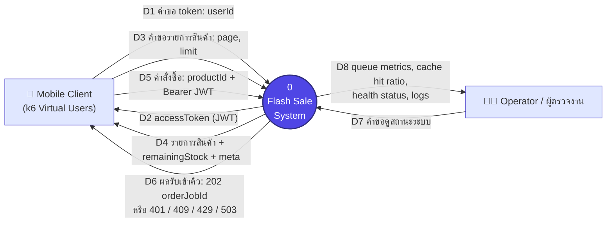
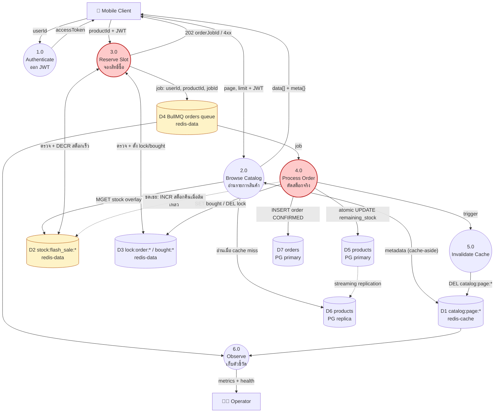
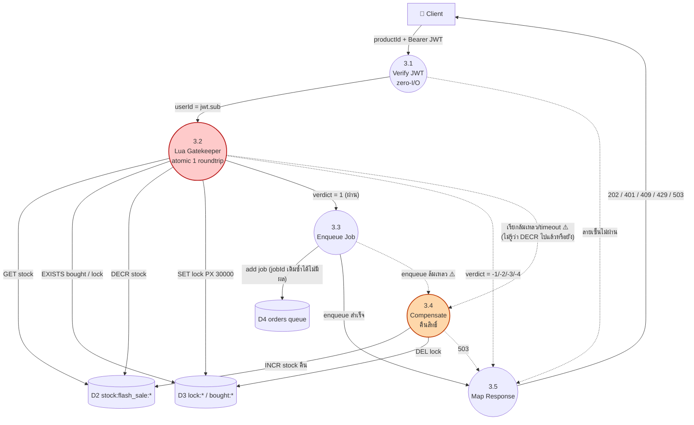
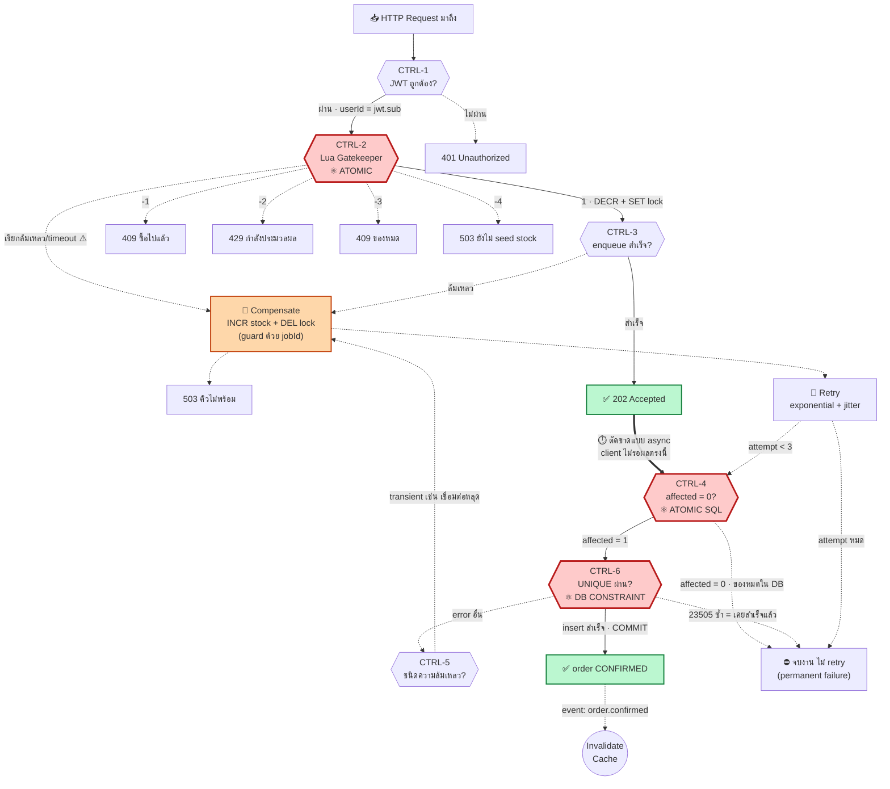
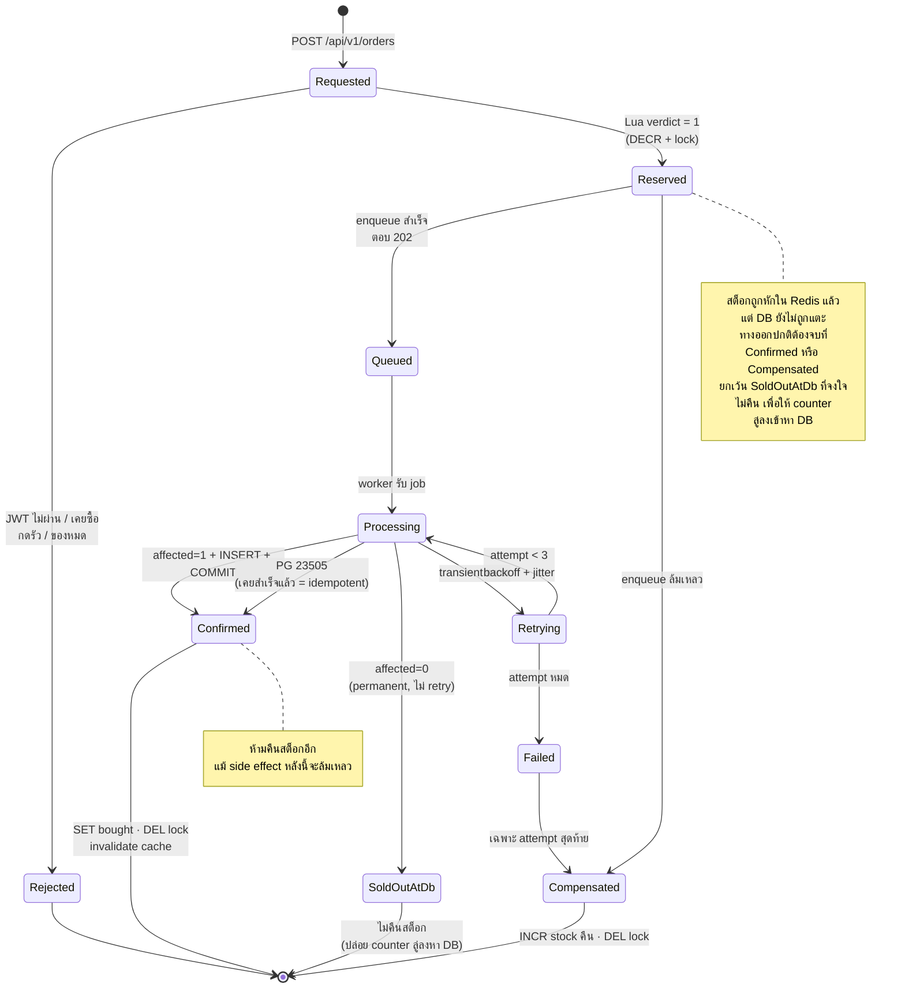
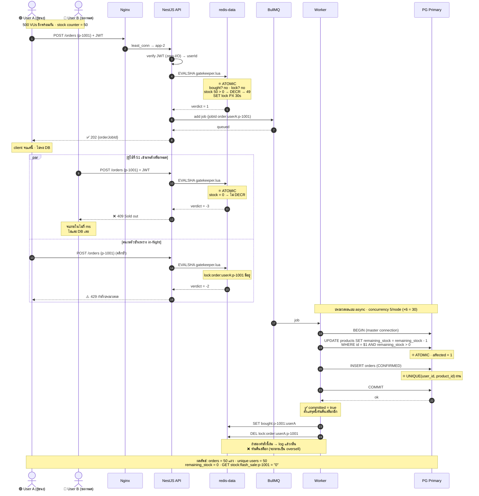

# 📊 Flash Sale System — Data Flow & Control Flow Diagrams

> เอกสารประกอบ [`docs/Architecture/architecture.md`](architecture.md) สำหรับใช้ในรายงาน (Report PDF)
> ใช้สัญกรณ์ **Structured Analysis (Ward–Mellor)**: DFD แสดง *ข้อมูลไหลไปไหน* · CFD/CSPEC แสดง *อะไรเป็นตัวตัดสินใจควบคุม*

| ส่วน | เนื้อหา |
| :--- | :--- |
| §1 | DFD Level 0 — Context Diagram |
| §2 | DFD Level 1 — กระบวนการหลักทั้งระบบ |
| §3 | DFD Level 2 — ขยาย Process 3.0 (Write Path) |
| §4 | Data Dictionary — นิยาม data store และ data flow |
| §5 | CFD Level 1 — Control Flow Diagram |
| §6 | CSPEC — Control Specification (ตารางตัดสินใจ + ตารางเปลี่ยนสถานะ) |
| §7 | Order State Machine |
| §8 | Concurrency Control Map — ใครคุม invariant ข้อไหน |
| §9 | Sequence Diagram — 500 VUs แย่งของ 50 ชิ้น |

**สัญกรณ์ที่ใช้ในไดอะแกรม**

| รูป | ความหมาย |
| :--- | :--- |
| สี่เหลี่ยม `[ ]` | External Entity — ผู้กระทำนอกระบบ |
| วงรี `( )` | Process — หน่วยประมวลผลที่แปลงข้อมูล |
| ทรงกระบอก `[( )]` | Data Store — ที่เก็บข้อมูล |
| เส้นทึบ `──►` | **Data Flow** — ข้อมูลจริงที่ถูกส่ง |
| เส้นประ `╌╌►` | **Control / Event Flow** — สัญญาณควบคุม ไม่ใช่ข้อมูลธุรกิจ |

---

## 1. 🌐 DFD Level 0 — Context Diagram

มองระบบเป็นกล่องเดียว เพื่อกำหนดขอบเขตว่าอะไรอยู่ใน/นอกระบบ



**ขอบเขตระบบ**: Nginx, NestJS ×6, Redis ×2, BullMQ worker, PostgreSQL primary/replica อยู่ **ใน** ระบบทั้งหมด
**นอกระบบ**: k6 (ตัวสร้าง load) และผู้ตรวจงานที่เปิดดู dashboard

---

## 2. 🔀 DFD Level 1 — กระบวนการหลักทั้งระบบ



> 🔴 **Process 3.0 และ 4.0 คือหัวใจของโจทย์** — เป็นสองจุดเดียวที่แตะสต็อก
> 🟡 **D2 และ D4 อยู่บน `redis-data` (`noeviction` + AOF)** ห้ามถูก evict เด็ดขาด ส่วน D1 อยู่บน `redis-cache` (`allkeys-lru`) หายได้ไม่เป็นไร

---

## 3. 🔍 DFD Level 2 — ขยาย Process 3.0 (Write Path)



> ⚠️ **Process 3.4 คือจุดที่ blueprint ฉบับเก่าไม่มี** — ถ้า 3.3 ล้มหลังจาก 3.2 หัก `DECR` ไปแล้วโดยไม่คืน สต็อก 1 ชิ้นจะหายถาวร ทำให้ `remainingStock` ไม่มีวันลงถึง 0 = ตกเกณฑ์ Data Integrity Proof
> ✅ **แก้แล้ว (2026-08-27)**: เส้นทาง 3.2 ล้มเหลว/timeout เอง (ไม่ใช่แค่ 3.3) ก็ต้องผ่าน 3.4 ด้วย — เพราะไม่รู้ว่า Lua รันถึง `DECR` ไปแล้วหรือยัง `compensateIfReserved()` ใช้ค่าใน `lock:order:*` เป็นหลักฐานแทนการเดา (ดู §6.3 แถวสุดท้าย)

---

## 4. 📖 Data Dictionary

### 4.1 Data Stores

| ID | ชื่อ | ที่อยู่จริง | โครงสร้าง | นโยบาย |
| :-- | :--- | :--- | :--- | :--- |
| **D1** | Catalog metadata cache | `redis-cache` | `catalog:page:{p}:limit:{l}` → JSON | TTL 30–60s **+ jitter**, `allkeys-lru` |
| **D2** | Fast stock counter | `redis-data` | `stock:flash_sale:{productId}` → integer | **ไม่มี TTL**, `noeviction` |
| **D3** | Lock & purchase flag | `redis-data` | `lock:order:{u}:{p}` → token (PX 30s)<br/>`bought:{p}:{u}` → "1" | lock มี TTL, flag ไม่มี |
| **D4** | Order job queue | `redis-data` | BullMQ `orders`, `jobId = order:{u}:{p}` | AOF on, `removeOnComplete: {count: 5000}` |
| **D5** | products (เขียน) | PG **primary** | `id, name, description, price, available_stock, remaining_stock, is_flash_sale_active, created_at, updated_at` | `CHECK (remaining_stock >= 0)`<br/>`CHECK (remaining_stock <= available_stock)` |
| **D6** | products (อ่าน) | PG **replica** | เหมือน D5 | read-only, มี lag 10–100ms |
| **D7** | orders | PG **primary** | `id, user_id, product_id, status, created_at` | `UNIQUE (user_id, product_id)` |

> 📐 **type เต็มของ D5/D7 อยู่ที่** [`architecture.md`](./architecture.md) **§3.1** — `price` เป็น `NUMERIC(10,2)` และ `products.id` เป็น `VARCHAR` PK ที่กำหนดเอง ไม่ใช่ uuid

### 4.2 Data Flow — สัญกรณ์: `=` ประกอบด้วย · `+` และ · `{}` ซ้ำได้ · `()` มีหรือไม่มีก็ได้ · `|` เลือกอย่างใดอย่างหนึ่ง

```
คำขอ_token        = userId
accessToken       = header + payload + signature
payload           = sub (userId) + iat + exp

คำขอ_รายการสินค้า  = page + limit + accessToken
รายการสินค้า       = status + {สินค้า} + meta
สินค้า            = productId + name + price + availableStock
                    + remainingStock + isFlashSaleActive
meta              = total + page + limit + totalPages

คำสั่งซื้อ         = productId + accessToken
ผลรับเข้าคิว       = status + orderJobId + message
                  | ข้อผิดพลาด

order_job         = userId + productId + correlationId
verdict           = 1 | -1 | -2 | -3 | -4
```

> **จุดสำคัญ**: `remainingStock` **ไม่ได้** อยู่ใน D1 (metadata cache) แต่ถูกดึงจาก **D2** แล้ว merge ตอน serialize
> นี่คือเหตุผลที่แคชอยู่ได้นาน 30–60 วินาทีโดยไม่ต้อง invalidate ทุกครั้งที่มีคนซื้อ แต่สต็อกยังสดเสมอ — เป็นคำตอบของ *"เงื่อนไขสำคัญ"* ในโจทย์

---

## 5. 🎛️ CFD Level 1 — Control Flow Diagram

CFD ใช้สัญกรณ์เดียวกับ DFD แต่ **ตัดข้อมูลออก เหลือแต่สัญญาณควบคุม (event flow)** เพื่อตอบว่า *อะไรสั่งให้อะไรทำงาน*



**สามจุดที่เป็น atomic boundary จริง** (🔴 กรอบหนา) — ความถูกต้องทั้งระบบวางอยู่บนสามจุดนี้เท่านั้น ที่เหลือคือ optimization เพื่อไม่ให้ traffic ไปถึง:

| จุด | กลไก atomic | ป้องกันอะไร |
| :--- | :--- | :--- |
| **CTRL-2** | Redis single-threaded ระหว่างรัน Lua | 500 requests interleave กันไม่ได้ |
| **CTRL-4** | `UPDATE ... WHERE remaining_stock > 0` ใน 1 statement | TOCTOU (อ่านแล้วค่อยเขียน) |
| **CTRL-6** | `UNIQUE (user_id, product_id)` | ซื้อซ้ำแม้โค้ดข้างบนพังหมด |

**เส้นคู่ `==>` คือจุดตัด synchronous/asynchronous** — client ได้ 202 แล้วจากไป การควบคุมหลังจากนี้อยู่ในมือ worker ทั้งหมด

---

## 6. 📋 CSPEC — Control Specification

### 6.1 Decision Table — CTRL-2 (Lua Gatekeeper)

ตรวจ **ตามลำดับบนลงล่าง** เจอเงื่อนไขแรกที่จริงแล้วหยุดทันที

| ลำดับ | เงื่อนไข | verdict | HTTP | เขียนอะไรลง Redis | เหตุผล |
| :-- | :--- | :--: | :--: | :--- | :--- |
| 1 | `GET stock` คืน `nil` | **-4** | 503 | — | key ยังไม่ seed หรือถูก evict — **ต้องแยกจาก "ของหมด"** ไม่งั้นระบบตอบของหมดตลอดกาลอย่างเงียบๆ |
| 2 | `EXISTS bought:{p}:{u}` | **-1** | 409 | — | เคยซื้อสำเร็จแล้ว (Limit 1 per user) |
| 3 | `EXISTS lock:order:{u}:{p}` | **-2** | 429 | — | มี order in-flight อยู่ = ผู้ใช้กดรัว |
| 4 | `tonumber(stock) <= 0` | **-3** | 409 | — | ของหมดจริง (450 คนจบที่นี่) |
| 5 | นอกเหนือจากนั้น | **1** | 202 | `DECR stock` + `SET lock PX 30000` | จองสิทธิ์สำเร็จ |

> ทั้ง 5 แถวรันอยู่ใน **Lua script เดียว = 1 network roundtrip และ atomic** เพราะ Redis เป็น single-threaded ระหว่างรัน Lua ไม่มีทางที่ request อื่นจะแทรกระหว่างแถว 4 กับ 5 ได้

### 6.2 Decision Table — CTRL-4/5/6 (Worker)

| เงื่อนไข | Retry? | คืนสต็อก? | สถานะสุดท้าย | เหตุผล |
| :--- | :--: | :--: | :--- | :--- |
| `affected = 1` + insert ผ่าน | — | ไม่ | **CONFIRMED** | สำเร็จ |
| `affected = 0` (ของหมดใน DB) | ❌ | ❌ **ไม่คืน** | `sold_out` → **`return`** | permanent — retry ไม่มีทางสำเร็จ · **และการคืนตรงนี้ทำให้ระบบไม่ self-heal** (ดูหมายเหตุใต้ตาราง) |
| PG `23505` (unique ซ้ำ) | ❌ | ❌ | `already_confirmed` → **`return`** | job นี้เคยสำเร็จแล้ว = **idempotency** ห้ามคืนสต็อก |
| PG `23514` (check ติดลบ) | ✅ (เหมือน transient) | เฉพาะ attempt สุดท้าย | retry ก่อน แล้วค่อย `failed` | **โค้ดจริงไม่มี case แยกสำหรับ `23514`** ตกเข้า branch เดียวกับ transient error — **ตั้งใจปล่อยไว้ เพราะ `23514` เข้าไม่ถึงตั้งแต่แรก**: `chk_positive_stock (remaining_stock >= 0)` จะถูกละเมิดได้ก็ต่อเมื่อ `remaining_stock` เป็น 0 แล้วยังถูก -1 ต่อ แต่ UPDATE มี `WHERE remaining_stock > 0` กันไว้แล้ว (`orders.processor.ts:67`) ค่าต่ำสุดที่เป็นไปได้คือ 0 พอดี · `chk_stock_ceiling` ก็ละเมิดไม่ได้เพราะ path นี้มีแต่ลด ไม่เพิ่ม · **ตรวจยืนยันแล้ว 2026-08-29 — ไม่ต้องแก้โค้ด** ถ้าวันหนึ่ง `23514` โผล่ขึ้นมาจริง แปลว่ามีคนแก้ `WHERE` clause หรือมี writer ตัวอื่นนอก worker |
| PG `40P01` (deadlock) | ✅ | เฉพาะ attempt สุดท้าย | retry | exponential backoff **+ jitter** · คืนตอน attempt 1 แล้ว attempt 2 สำเร็จ = Redis สูงกว่า DB ถาวร |
| เชื่อมต่อหลุด / timeout | ✅ | เฉพาะ attempt สุดท้าย | retry | transient — เหตุผลเดียวกับแถวบน |
| **side effect หลัง COMMIT ล้ม** | ❌ | ❌ **ห้ามคืนเด็ดขาด** | **CONFIRMED** | ⚠️ ของขายไปแล้วจริง ถ้าคืนสต็อกตรงนี้ = **oversell** |

> แถวสุดท้ายคือบั๊กที่พบใน blueprint ฉบับเก่า — `markBought` / `invalidateCache` ถูกวางไว้ใน `try` เดียวกับ transaction ทำให้ Redis สะดุดหลัง commit แล้วระบบไปคืนสต็อกทั้งที่ order เกิดขึ้นแล้ว
>
> ⚠️ **แก้ 2026-08-26 — `affected = 0` เปลี่ยนจาก "คืน" เป็น "ไม่คืน"**
> `affected = 0` แปลว่า Redis บอก "ผ่าน" แต่ DB บอก "หมด" = **Redis สูงกว่า DB อยู่ก่อนแล้ว**
> ถ้าคืน จะดัน Redis ขึ้นอีก → ปล่อยคนถัดไปเข้ามา → job ตาย sold-out อีก → คืนอีก **วนไม่จบ**
> `stock:flash_sale:p-1001` จะลู่เข้าหา 1 ไม่มีวันถึง 0 = ตกเกณฑ์ Data Integrity §9.3 ข้อ 4
> การไม่คืนทำให้ counter ลู่ลงเข้าหา DB แล้วหยุดเอง (lock ปล่อยให้ TTL เก็บ)

### 6.3 ตารางกฎการชดเชย (Compensation Rules)

| เกิดที่ | คืนสต็อก | ปลด lock | guard | ทำไม |
| :--- | :--: | :--: | :--- | :--- |
| `gatekeeper()` เรียกล้มเหลว/timeout (§3.2) | ✅ | ✅ CAS | เทียบ `requestToken` ใน `lock:order:*` ก่อนคืน | ไม่รู้ว่า Lua รันถึง `DECR` จริงหรือเปล่า — ใช้ค่าใน lock เป็นหลักฐานแทนการเดา (`compensate-if-reserved.lua`) |
| `queue.add()` ล้ม (§3.3) | ✅ | ✅ CAS | — | ยังไม่มี job ไม่มีใครมาทำต่อ |
| BullMQ dedup jobId ซ้ำ (job ที่เก็บอยู่เป็นของคำขออื่น) | ✅ | ✅ CAS | — | DECR รอบนี้ไม่มีใครกิน — ตรวจด้วย `queue.getJob()` ไม่ใช่ค่าที่ `add()` คืน |
| ตรวจ job ที่เก็บอยู่**ไม่ได้** | ❌ | ❌ | — | ยืนยันไม่ได้ ≠ เป็นของคนอื่น · คืนผิดตอนของขายแล้วแย่กว่าไม่คืน |
| worker ล้ม (transient) **ก่อน** COMMIT — attempt 1–2 | ❌ | ❌ | — | จะ retry ต่อ · คืนแล้ว retry สำเร็จ = Redis สูงกว่า DB ถาวร |
| worker ล้ม (transient) **ก่อน** COMMIT — attempt สุดท้าย | ✅ | ✅ CAS | `compensated:{jobId}` (TTL 300s) | ตายจริงแล้ว ต้องคืนสิทธิ์ให้คนอื่น |
| worker เจอ `affected = 0` (sold out) | ❌ | ❌ | — | Redis สูงกว่า DB อยู่แล้ว การคืนทำให้วนไม่จบ (§6.2) |
| worker เจอ `23505` | ❌ | ❌ | — | job นี้เคยสำเร็จแล้ว = idempotency |
| worker ล้ม **หลัง** COMMIT | ❌ | ❌ | — | ปล่อยให้ lock หมดอายุเอง (TTL 30s) |

> **ปลด lock ทุกครั้งเป็น compare-and-delete** โดยเทียบกับ `requestToken` ที่ gatekeeper เขียนลงไป
> (**ไม่ใช่** `jobId` ซึ่งซ้ำทุกครั้งที่คนเดิมขอของเดิม จน CAS แยกการถือครองไม่ออก — แก้ 2026-08-26)

---

## 7. 🔄 Order State Machine



**Invariant ของ state machine**: ทุกเส้นทางที่ผ่าน `Reserved` ต้องจบที่ `Confirmed` หรือ `Compensated`
**ยกเว้นทางเดียวคือ `SoldOutAtDb`** ซึ่งจงใจไม่คืน เพราะการมาถึงสถานะนั้นแปลว่า Redis สูงกว่า DB อยู่แล้ว
การไม่คืนคือสิ่งที่ทำให้ counter ลู่ลงเข้าหาความจริง (ดู §6.2)

ถ้าเจอเส้นทาง**อื่น**ที่หลุดออกไปโดยไม่ผ่านสองสถานะนี้ แปลว่าสต็อกรั่ว และ `remainingStock` จะไม่ลงถึง 0

---

## 8. 🛡️ Concurrency Control Map

ตารางนี้ตอบว่า *invariant แต่ละข้อของโจทย์ ถูกบังคับใช้ด้วยอะไร ที่ชั้นไหน และขอบเขต atomic แค่ไหน*

| Invariant | ชั้นที่ 1 (เร็ว/กรอง) | ชั้นที่ 2 (ถูกต้องจริง) | ขอบเขต Atomic | ถ้าชั้น 1 พังจะเกิดอะไร |
| :--- | :--- | :--- | :--- | :--- |
| **ไม่ขายเกิน 50 ชิ้น** | `DECR stock:*` ใน Lua | `UPDATE ... WHERE remaining_stock > 0` + `CHECK (>= 0)` | Lua: ทั้ง script<br/>SQL: ทั้ง statement | traffic ทะลุถึง DB มากขึ้น (ช้าลง) แต่ **ยังไม่ oversell** |
| **1 คน 1 ชิ้น** | `EXISTS bought:{p}:{u}` | `UNIQUE (user_id, product_id)` | Lua: ทั้ง script<br/>DB: index | insert ซ้ำถูกปฏิเสธที่ DB → จับ `23505` → ถือว่าสำเร็จ |
| **กดรัวไม่ได้ของ 2 ชิ้น** | `lock:order:{u}:{p}` PX 30s | `jobId` deterministic + `UNIQUE` | Lua: `SET` ใน script เดียว | BullMQ ปฏิเสธ jobId ซ้ำ → ยังกันได้ |
| **ไม่อ่านสต็อกเก่า** | — | `createQueryRunner('master')` | transaction | ถ้าเผลออ่าน replica → **race condition ทันที** (ไม่มีชั้นสำรอง) |
| **retry ไม่ตัดสต็อกซ้ำ** | `compensated:{jobId}` | `UNIQUE` + จับ `23505` | Redis: `SET NX` | คืนสต็อกซ้ำ → Redis บวกเกิน → oversell ที่ชั้น 1 |
| **สต็อกที่ client เห็นถูกต้อง** | — | `MGET stock:*` ทุก request | — | ถ้าเอา `remainingStock` ไปแคช → 6 instance ตอบไม่ตรงกัน |

> **แถวที่ไม่มีชั้นสำรอง (`createQueryRunner('master')`) คือแถวที่อันตรายที่สุด** — พลาดแล้วไม่มีอะไรมาช่วย และจะ reproduce ได้เฉพาะตอน load สูงเท่านั้น

---

## 9. ⏱️ Sequence Diagram — 500 VUs แย่งของ 50 ชิ้น

แสดง 3 กรณีตัวแทน: **ผู้ชนะ** · **ผู้แพ้ (ของหมด)** · **คนกดรัว**



**อ่านไดอะแกรมนี้ยังไง**: 450 คนจาก 500 จบที่ขั้นตอน `verdict = -3` ซึ่ง**ไม่แตะ PostgreSQL เลยแม้แต่ query เดียว** — นี่คือเหตุผลที่ระบบรับ burst 500 คนได้โดย DB ไม่ล่ม โหลดจริงที่ลงไปถึง DB มีแค่ 50 transaction เท่านั้น

---

## 📎 อ้างอิง

- สเปกเต็ม: [`docs/Architecture/architecture.md`](architecture.md)
- กติกาสำหรับผู้พัฒนา / AI agent: [`CLAUDE.md`](../../CLAUDE.md)
- โจทย์ต้นฉบับ: [`docs/Requirement/Flash Sale System.pdf`](../Requirement/Flash%20Sale%20System.pdf)
