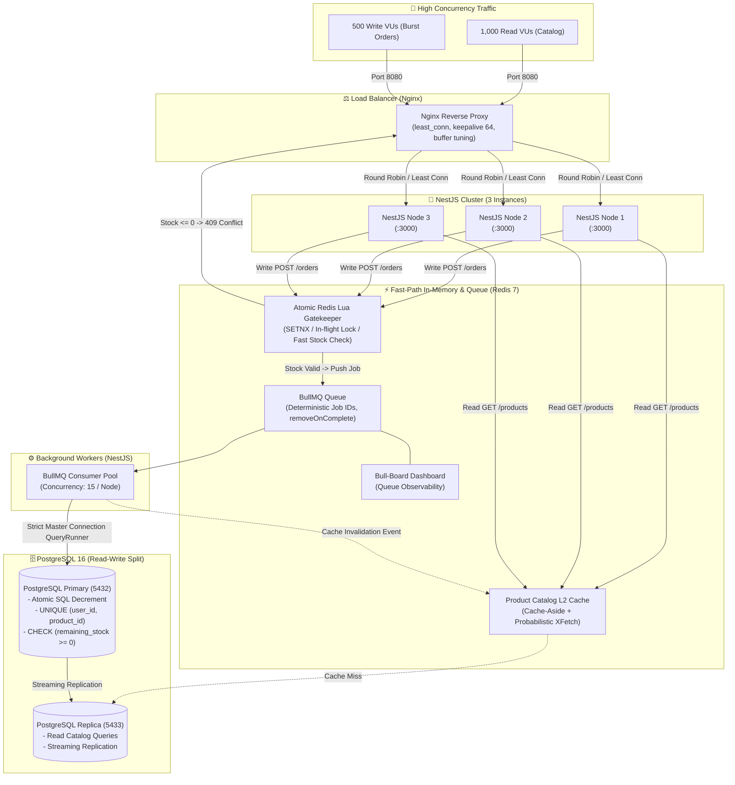

> # ⚠️ เอกสารฉบับเก่า — เก็บไว้เพื่ออ้างอิงเท่านั้น (ARCHIVED)
>
> **ห้ามใช้ไฟล์นี้เป็นสเปกในการเขียนโค้ด** — ฉบับที่ใช้จริงคือ [`docs/architecture.md`](architecture.md)
>
> ฉบับนี้ถูกแทนที่เมื่อ **2026-08-25** หลังการรีวิว โดยพบปัญหาที่แก้ไปแล้วในฉบับใหม่:
>
> | # | ปัญหา | อยู่ตรงไหนในไฟล์นี้ | แก้ที่ |
> | :-- | :--- | :--- | :--- |
> | B1 | **ไม่มี JWT / Authentication เลยทั้งเอกสาร** ทั้งที่โจทย์บังคับ | ไม่ปรากฏ (grep เจอ 0 ครั้ง) | ฉบับใหม่ §4 |
> | B2 | Worker คืนสต็อกใน `catch` เดียวกับ side-effect หลัง `commitTransaction()` → Redis บวกเกินจริง = **oversell** | §3.3 | ฉบับใหม่ §6.3 |
> | B3 | Lua `DECR` ก่อน enqueue แต่ไม่มี compensation ถ้า `queue.add()` ล้ม → สต็อกหายถาวร, `remainingStock` ไม่มีวันถึง 0 | §3.1–3.2 | ฉบับใหม่ §6.2 |
> | B4 | `stock:flash_sale:*` ไม่มีที่มา + `or '0'` ตีความ key หายว่า "ของหมด" + วาง cache/queue ไว้ Redis ตัวเดียว (LRU กิน job) | §3.1, §1 | ฉบับใหม่ §6.1, §1 |
> | B5 | Worker concurrency 15 vs DB pool 5 conn → oversubscribe 3 เท่า | §1, §4 | ฉบับใหม่ §8 |
> | M1 | ไม่ได้บอกว่า `remainingStock` merge เข้า response ยังไง ("เงื่อนไขสำคัญ" ของโจทย์) | §2.1 | ฉบับใหม่ §5.1–5.2 |
> | M2 | L1 in-memory LRU ขัดกฎ stateless ของตัวเอง → 3 instance ตอบสต็อกไม่ตรงกันได้นาน 2 วินาที | §2.1 | ตัดออกในฉบับใหม่ §5.3 |
> | M3 | `keepalive 64` ไม่มี `proxy_http_version 1.1` → keepalive ไม่ทำงานเลย | §4 | ฉบับใหม่ §2 |
> | M4 | Bull-Board ไม่มี auth | §1 | ฉบับใหม่ §9.1 |
> | M5 | ไม่มีแผน k6 ทั้งที่เป็น deliverable | §5 | ฉบับใหม่ §9.2 |
> | N1 | mermaid ใช้ `\n` ในป้าย 14 จุด → render เป็นตัวอักษรจริง ไม่ขึ้นบรรทัดใหม่ | §1 | ฉบับใหม่ §1 (ใช้ `<br/>`) |
>
> เนื้อหาด้านล่างคงไว้ตามต้นฉบับทุกตัวอักษร (git object `eea5647`)
> กู้ฉบับดิบได้ด้วย: `git show eea5647 > docs/old_architecture.md`

---

# 🏛️ Enterprise Flash Sale Architecture & Concurrency Blueprint
*(ออกแบบและผ่านการตรวจสอบโดย Concurrency Specialist & Scalability Architect Agents)*

เอกสารฉบับนี้กำหนดสถาปัตยกรรมและเทคนิคระดับองค์กร (Enterprise Best Practice) สำหรับระบบ **Flash Sale System (High-Throughput & Low Latency)** เพื่อรองรับ **Read Traffic 1,000 Concurrent Users** และ **Write Burst 500 Concurrent Users แย่งชิงสินค้า 50 ชิ้น** โดยการันตี **Zero Overselling**, **Idempotency (1 ชิ้นต่อ 1 ผู้ใช้)** และ **ความเร็วระดับ Sub-15ms p95**

---

## 1. 🏗️ ภาพรวมสถาปัตยกรรมระดับองค์กร (System Architecture Diagram)



---

## 2. ⚡ Read Path Architecture (Read-Heavy 1,000 VUs)

### 2.1 Multi-Tier Caching & Key Topology
สำหรับ API `GET /api/v1/products?page=1&limit=10`:
1. **Decoupled Architecture (แยก Metadata กับ Stock Counter)**:
   - **Catalog Metadata Cache**: เก็บ JSON รายละเอียดสินค้า (`name`, `price`, `images`) ลง Redis Key: `catalog:page:{page}:limit:{limit}` (TTL: 30–60 วินาที)
   - **Real-time Stock Counter**: เก็บเฉพาะตัวเลขคงเหลือแยกต่างหากที่ Redis Key: `stock:flash_sale:{productId}`
2. **Hybrid L1/L2 Cache**:
   - **L1 (Node.js In-Memory LRU)**: ขนาด 500 รายการ TTL 1–2 วินาที บนแต่ละ Instance ลด Network I/O ไปยัง Redis สำหรับหน้าที่ถูกยิงซ้ำๆ
   - **L2 (Redis 7)**: กระจายแคชกลางสำหรับทุก Backend Node

### 2.2 ป้องกันปัญหา Cache Stampede (Thundering Herd)
เมื่อแคชหน้าแรกหมดอายุขณะมี 1,000 Concurrent Users จะเกิดปัญหาแย่งกัน Query Database
- **เทคนิคที่ใช้: Probabilistic Early Expiration (XFetch)**:
  คำนวณความน่าจะเป็นในการ Refresh แคชล่วงหน้าก่อน TTL หมดจริงใน Background:
  $$\text{Recompute if } -\beta \cdot \delta \cdot \ln(\text{rand}()) > \text{TTL}_{\text{remaining}}$$
- **Single-Flight Promise Memoization**: ในระดับ Node.js process หากมี Request หน้าเดียวกันเข้ามาพร้อมกันในเสี้ยววินาที จะแชร์ Promise เดียวกันเพื่อ Query Redis/DB เพียงครั้งเดียว

---

## 3. 🛡️ Write Path & Flash Sale Concurrency Architecture (Write-Heavy 500 VUs)

เพื่อรองรับคน 500 คนแย่งชิงของ 50 ชิ้น โดยไม่ให้ Database ล่มและไม่เกิด Overselling เราใช้ **4-Tier Defense Layer**:

```
[HTTP Request: POST /orders]
       │
       ▼
┌───────────────────────────────────────────────────────────┐
│ Tier 1: Redis Lua Gatekeeper (Pre-filter & In-flight Lock) │
│ - ตรวจสอบ In-flight Lock (ป้องกันยิงเบิ้ล)                       │
│ - ตรวจสอบ Fast Stock Counter ใน Redis                       │
│ - ผลลัพธ์: คัดกรองเหลือเพียง 50 คนที่ผ่านเข้า Queue             │
│   (อีก 450 คน ตอบกลับ 409 Conflict ทันที < 4ms)            │
└─────────────────────────────┬─────────────────────────────┘
                              │
                              ▼
┌───────────────────────────────────────────────────────────┐
│ Tier 2: Message Queue (BullMQ)                            │
│ - Job ID: `order:${userId}:${productId}` (Deduplication)  │
│ - Controller ตอบ HTTP 202 Accepted ทันที (< 15ms)         │
│ - Worker รับงานแบบ Controlled Concurrency (15/Node)       │
└─────────────────────────────┬─────────────────────────────┘
                              │
                              ▼
┌───────────────────────────────────────────────────────────┐
│ Tier 3: PostgreSQL Primary (Strict Read-Write Split Rule) │
│ - บังคับเชื่อมต่อ Master ผ่าน QueryRunner เท่านั้น            │
│ - Atomic SQL Decrement: WHERE remaining_stock > 0        │
└─────────────────────────────┬─────────────────────────────┘
                              │
                              ▼
┌───────────────────────────────────────────────────────────┐
│ Tier 4: Database Constraints (Unbreachable Barrier)       │
│ - `UNIQUE (user_id, product_id)`                          │
│ - `CHECK (remaining_stock >= 0)`                          │
└───────────────────────────────────────────────────────────┘
```

### 3.1 Tier 1: Atomic Redis Lua Script (Fast Gatekeeper)
ก่อนที่จะส่งงานเข้า Queue ให้รัน Lua script เพื่อทำ **In-flight Dedup + Fast Stock Check** ใน **1 Network Roundtrip**:

```lua
-- KEYS[1]: lock:order:user:{userId}:prod:{productId}
-- KEYS[2]: stock:flash_sale:{productId}
-- KEYS[3]: user:has_bought:{productId}:{userId}
-- ARGV[1]: lock_ttl_ms (e.g. 30000)
-- ARGV[2]: order_token / jobId

-- 1. ตรวจสอบว่า User เคยซื้อสำเร็จไปแล้วหรือไม่
if redis.call('EXISTS', KEYS[3]) == 1 then
    return -1 -- ALREADY_PURCHASED (409 Conflict)
end

-- 2. ตรวจสอบว่ากำลังมีคำสั่งซื้อ In-flight อยู่หรือไม่ (ป้องกันกดรัว)
if redis.call('EXISTS', KEYS[1]) == 1 then
    return -2 -- REQUEST_IN_FLIGHT (429 Too Many Requests)
end

-- 3. ตรวจสอบสต็อกเร็วใน Redis
local stock = tonumber(redis.call('GET', KEYS[2]) or '0')
if stock <= 0 then
    return -3 -- SOLD_OUT (409 Conflict)
end

-- 4. หักสต็อกเร็วใน Redis และสร้าง In-flight Mutex Lock
redis.call('DECR', KEYS[2])
redis.call('SET', KEYS[1], ARGV[2], 'PX', ARGV[1])

return 1 -- SUCCESS_ALLOWED
```

### 3.2 Tier 2: BullMQ Queue & Deterministic Job IDs
- **Deterministic Job ID**: ใช้ `jobId = "order:${userId}:${productId}"` เพื่อให้ BullMQ ปฏิเสธ Job ซ้ำซ้อนที่ระดับ Queue
- **Job Retention**: ตั้งค่า `removeOnComplete: { count: 1000, age: 3600 }` และ `removeOnFail: { count: 5000 }` เพื่อประหยัด Memory ใน Redis

### 3.3 Tier 3: Worker Execution & The Read-Write Split Trap
> ⚠️ **ข้อควรระวังสำคัญที่สุดใน Read-Write Split (TypeORM Replication)**:
> หากใช้ `repository.findOne()` ค่าเริ่มต้นจะวิ่งไปที่ **Replica Database** ซึ่งจะมี **Replication Lag (5ms - 500ms)** ทำให้ Worker อ่านเจอสต็อกเก่าและเกิด Race Condition ทันที!

**แนวทางปฏิบัติที่ถูกต้อง**:
Worker ต้องต่อตรงเข้า **Master DB** ผ่าน `dataSource.createQueryRunner('master')` และใช้ **Atomic SQL Update**:

```sql
-- Atomic Decrement: ไม่ต้อง Lock ค้างนาน ปลอดภัยจาก Deadlock
UPDATE products
SET remaining_stock = remaining_stock - 1,
    updated_at = NOW()
WHERE id = $1 
  AND remaining_stock > 0;

-- Insert Order Record
INSERT INTO orders (id, user_id, product_id, status, created_at)
VALUES ($2, $3, $1, 'CONFIRMED', NOW());
```

```typescript
// NestJS Worker Implementation
const queryRunner = this.dataSource.createQueryRunner('master');
await queryRunner.connect();
await queryRunner.startTransaction();

try {
  const result = await queryRunner.manager
    .createQueryBuilder()
    .update(Product)
    .set({ remainingStock: () => 'remaining_stock - 1' })
    .where('id = :productId AND remaining_stock > 0', { productId })
    .execute();

  if (result.affected === 0) {
    throw new SoldOutException('Product out of stock in Database');
  }

  await queryRunner.manager.insert(Order, {
    userId,
    productId,
    status: OrderStatus.CONFIRMED,
  });

  await queryRunner.commitTransaction();

  // Commit Flag & Release In-flight Lock ใน Redis
  await this.redisService.markUserBought(productId, userId);
  await this.redisService.invalidateProductCache(productId);
} catch (err) {
  await queryRunner.rollbackTransaction();
  // คืนสต็อกใน Redis หากเกิดข้อผิดพลาด
  await this.redisService.refundFastStock(productId, userId);
  throw err;
} finally {
  await queryRunner.release();
}
```

### 3.4 Tier 4: Database Integrity Constraints
ตั้ง Constraint ใน PostgreSQL Schema ป้องกันกรณีสุดวิสัยระดับ Hardware/Split-brain:
```sql
ALTER TABLE orders 
ADD CONSTRAINT uq_user_product_order UNIQUE (user_id, product_id);

ALTER TABLE products 
ADD CONSTRAINT chk_positive_stock CHECK (remaining_stock >= 0);
```

---

## 4. 🎛️ Connection Pooling & Resource Sizing

| Component | Target Allocation | คำอธิบาย |
| :--- | :--- | :--- |
| **PostgreSQL Primary Pool** | **10 connections / Node** $\times 3 = 30$ conn<br>+ **5 connections / Worker** $\times 3 = 15$ conn | รวม 45 connections (ปลอดภัยภายใต้ `max_connections = 100`) |
| **PostgreSQL Replica Pool** | **25 connections / Node** $\times 3 = 75$ conn | รองรับ Read Traffic สูงสุด 1,000 VUs |
| **Redis Clients Separation** | • 1 General Multiplexed Client (Cache & Lock)<br>• 1 BullMQ Producer Client<br>• 2 Dedicated Worker Clients (`bpop` + non-blocking) | แยก Client ชัดเจนตามลักษณะการบล็อก I/O ของ Redis |
| **Nginx Reverse Proxy** | `least_conn`, `keepalive 64`, `worker_connections 10240` | กระจายตาม In-flight connection จริง พร้อม reuse TCP connection |

---

## 5. 📊 Observability & ตัวชี้วัดในการทำ Load Test (k6)

### 5.1 Dashboard & Metrics Checklist

| หมวดหมู่ | ตัวชี้วัดที่ต้องแสดง (Metric) | เกณฑ์เป้าหมาย (Target) |
| :--- | :--- | :--- |
| **Edge / Nginx** | Response Latency (p95 / p99) | **p95 < 15ms**, **p99 < 50ms** |
| **Cache (Redis)** | Cache Hit / Miss Ratio | **Hit Ratio $\ge 95\%$** |
| **Queue (BullMQ)** | Completed vs Failed vs Waiting Jobs | Active backlog $< 50$, Failed jobs = 0 |
| **Database Primary** | Active Connections & Lock Wait Time | Active $< 45$, Lock wait $< 5\text{ms}$ |
| **Database Replica** | Replication Lag | **$< 20\text{ms}$** |

### 5.2 เกณฑ์พิสูจน์ความถูกต้องของข้อมูล (Data Integrity Proof)
1. **สต็อกสินค้า `p-1001`**: `remainingStock` ในตาราง `products` ต้องมีค่าเป็น **`0` พอดี** (ไม่มีค่าติดลบ)
2. **ตาราง `orders`**: ต้องมี Record บันทึกคำสั่งซื้อสำเร็จ **50 แถวพอดี** โดยที่ **`userId` ทั้ง 50 คนไม่ซ้ำกันเลย** และไม่มีผู้ใช้คนใดได้ของเกิน 1 ชิ้น

---

## 6. ⚖️ เปรียบเทียบ: สถาปัตยกรรมทั่วไป vs Enterprise Best Practice

| มิติการทำงาน | สถาปัตยกรรมทั่วไป (Naive Approach) | สถาปัตยกรรมนี้ (Enterprise Best Practice) |
| :--- | :--- | :--- |
| **การรับ Order** | Query DB ตรงๆ ใน Controller | **Redis Lua Pre-filter ➔ BullMQ Async ➔ HTTP 202** |
| **การกัน Over-selling** | Read สต็อกแล้ว `if (stock > 0)` ในแอป | **Atomic SQL Decrement + DB `CHECK (stock >= 0)`** |
| **การกันซื้อซ้ำ** | Query ตาราง Order หา `userId` | **Redis In-flight Mutex + DB `UNIQUE(user_id, product_id)`** |
| **Read-Write Split** | ปล่อยให้ TypeORM Route อัตโนมัติ (เสี่ยง Lag) | **บังคับ Master Connection สำหรับ Order Transaction** |
| **Cache Invalidation** | สั่งลบ Cache ทุกครั้งที่มี Request สั่งซื้อ | **Decouple Metadata Cache ออกจาก Real-time Stock Counter** |
| **Load Balancer** | Round Robin ธรรมดา | **`least_conn` + Keepalive Pool + Buffer Tuning** |
