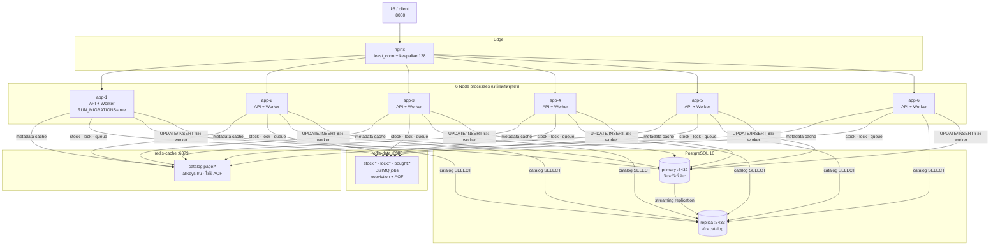
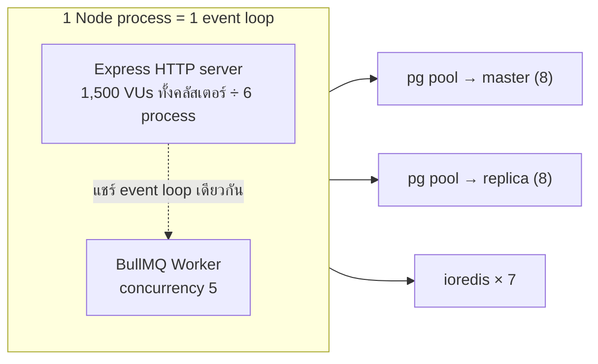
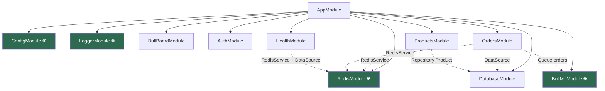
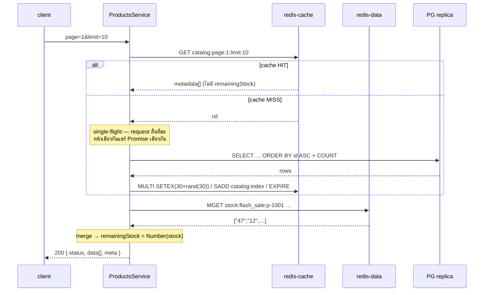
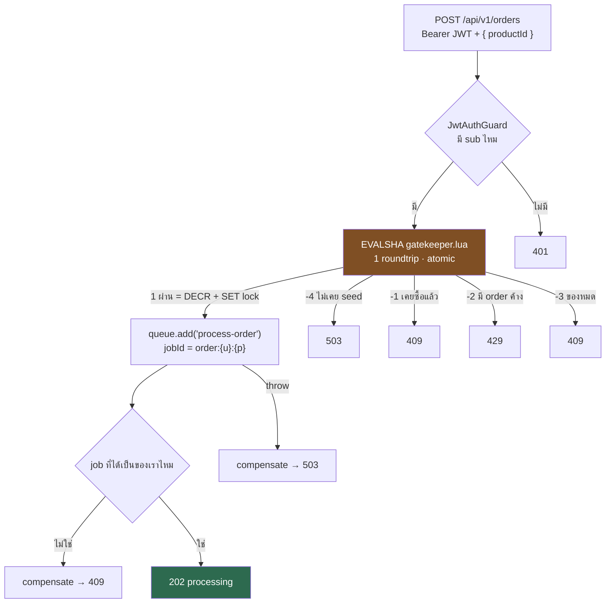
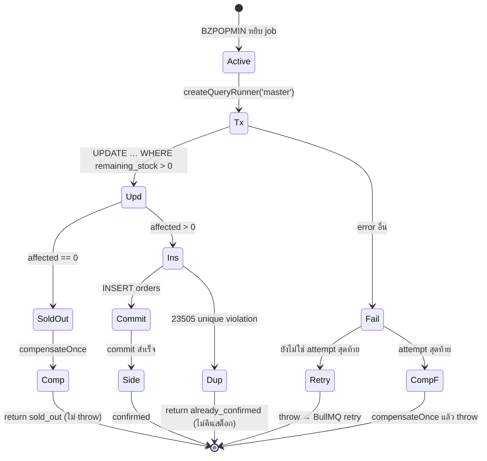
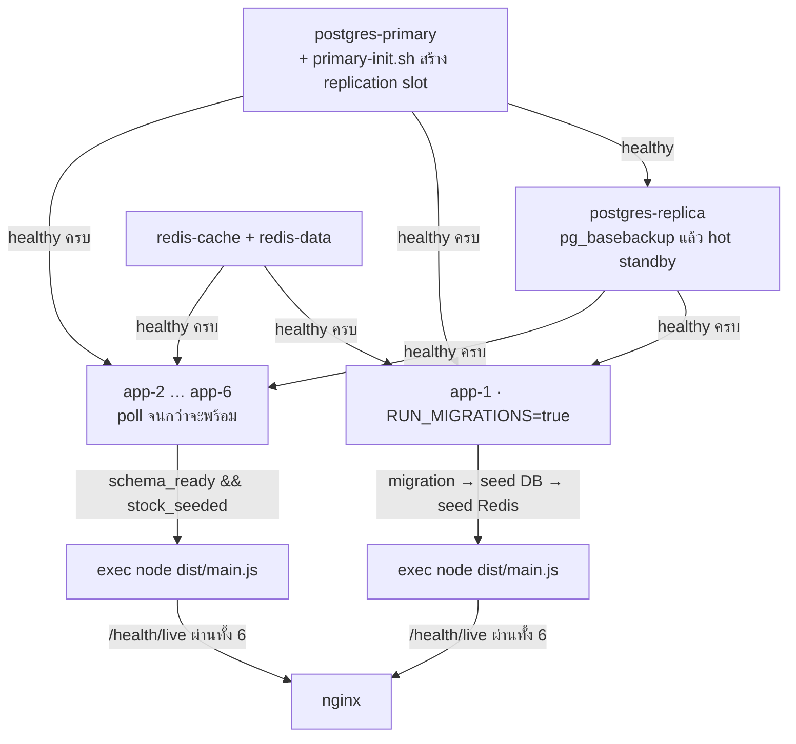

# 📘 Codebase Guide — `flash-sale-backend` (ฉบับรวมไฟล์เดียว)

> ⚠️ **ไฟล์นี้ถูก generate** ห้ามแก้ตรงนี้ — แก้ที่ `Separate/` แล้วรัน `node scripts/build-all-in-one.mjs`
>
> เนื้อหาเหมือน [`Separate/01-codebase-primer.md`](../Separate/01-codebase-primer.md) +
> [`Separate/02-design-review-qa.md`](../Separate/02-design-review-qa.md) ทุกตัวอักษร
>
> **ภาค 1** = โค้ดไฟล์ไหนเรียกไฟล์ไหน · **ภาค 2** = reviewer 3 คนถกดีไซน์อะไรกัน

---

# ภาค 1 — เดินโค้ดจากศูนย์

> **เอกสารนี้ตอบคำถามเดียว**: โค้ดไฟล์ไหนเรียกไฟล์ไหน และ request หนึ่งใบเดินทางผ่านอะไรบ้าง
> ไม่ใช่สเปก (สเปกคือ [`architecture.md`](../../Architecture/architecture.md)) และไม่ใช่การปูพื้นแนวคิด
> (แนวคิดอยู่ที่ [`architecture-primer.md`](../../Architecture/architecture-primer.md) — เขียนตอนยังไม่มีโค้ด)
>
> ทุก `file:line` ในเอกสารนี้อ้างจากโค้ดจริง ณ 2026-08-26

---

### 0. 🚪 30 วินาทีแรก — 5 อย่างที่ต้องรู้ก่อน

1. **มี process จริง 6 ตัว** (app-1 … app-6) — API กับ BullMQ worker **อยู่ใน process เดียวกัน** ไม่ได้แยก
2. **มี Redis 2 ตัวคนละหน้าที่** — `redis-cache` เป็นแคชล้วน (หายได้), `redis-data` เก็บสต็อกกับคิว (หายไม่ได้)
3. **สต็อกมี 2 ที่**: counter ใน Redis (เร็ว ใช้กันคนเข้าคิว) และคอลัมน์ใน PostgreSQL (ช้า เป็นความจริง)
4. **`POST /orders` ไม่แตะ DB เลย** — มันคุยกับ Redis 3 ครั้งแล้วตอบ 202 ส่วน DB เป็นงานของ worker ทีหลัง
5. **`remainingStock` ไม่เคยถูกแคช** — อ่านสดจาก Redis ทุก request แล้วเอาไป merge กับ metadata ที่แคชไว้

---

### 1. 🗺️ กล่องทั้งหมดในระบบ



**กฎที่อ่านจากรูปนี้ได้เลย**: ลูกศรไป `primary` มีเส้นเดียว และมันมาจาก worker เท่านั้น
ถ้าวันหนึ่งมีโค้ดใหม่เขียน DB จากที่อื่น แปลว่าผิด

---

### 2. ⚙️ process จริงมีกี่ตัว — จุดที่คนเข้าใจผิดบ่อยที่สุด

**API และ worker คือ process เดียวกัน** ไม่ได้แยกคนละ container

- `OrdersProcessor` เป็น provider ธรรมดาของ `OrdersModule` (`src/orders/orders.module.ts:17`)
- `@nestjs/bullmq` สร้าง `Worker` ขึ้นมาตอน Nest bootstrap ใน process เดิม
- container รันคำสั่งเดียว: `node dist/main.js` (`Dockerfile:61`)



**ผลที่ตามมาจริง**:
- worker ที่ทำงานหนักจะทำให้ HTTP ช้าลง และกลับกัน
- BullMQ ต่ออายุ lock ของ job ด้วย `setTimeout` ทุก 15 วินาที **บน event loop เดียวกันนี้** — ถ้า event loop ตัน job จะ "stall"
- `WORKER_CONCURRENCY` ถูกอ่านตอน **decorate class** (`src/orders/orders.processor.ts:38`) ซึ่งเกิดก่อน `ConfigService` โหลด `.env` → แก้ใน `.env` ไม่มีผล เห็นเฉพาะ env จริงของ container

---

### 3. 📁 แผนที่ไฟล์ (48 ไฟล์ใน `src/`)

| โฟลเดอร์ | ไฟล์ | หน้าที่ |
| :--- | :--- | :--- |
| **root** | `main.ts` | ตั้ง ValidationPipe, pino, filter, mount Bull-Board, `listen()` |
| | `app.module.ts` | ประกอบ 9 module เข้าด้วยกัน |
| **auth/** | `auth.controller.ts` | `POST /api/v1/auth/token` |
| | `auth.service.ts` | `jwtService.sign({sub: userId})` — ไม่แตะ DB/Redis |
| | `jwt.strategy.ts` | verify token, `validate()` คืน `{userId}` แบบ **zero I/O** |
| | `jwt-auth.guard.ts` | `AuthGuard('jwt')` |
| **products/** | `products.controller.ts` | `GET /api/v1/products` |
| | `products.service.ts` | **หัวใจ read path** — cache-aside + single-flight + stock overlay |
| | `entities/product.entity.ts` | NUMERIC → number transformer |
| **orders/** | `orders.controller.ts` | `POST /api/v1/orders` → 202 |
| | `orders.service.ts` | **Tier 1+2** — Lua gatekeeper แล้ว enqueue |
| | `orders.processor.ts` | **Tier 3** — worker เขียน DB |
| | `errors/sold-out.error.ts` | ตัวบอกว่า "ล้มเหลวถาวร ห้าม retry" |
| **redis/** | `redis.module.ts` | สร้าง client 2 ตัว (cache / data) |
| | `redis.service.ts` | ทุกคำสั่ง Redis ผ่านที่นี่ |
| | `redis.keys.ts` | **สร้าง key ทุกตัวที่นี่ที่เดียว** ห้ามต่อ string เอง |
| | `lua/*.lua` | 4 สคริปต์ atomic |
| **config/** | `database.config.ts` | replication master/slaves + poolSize |
| | `env.validation.ts` | ตรวจ env ตอน boot, พังทันทีถ้าผิด |
| **database/** | `data-source.ts` | DataSource สำหรับ CLI migration (**master อย่างเดียว**) |
| | `migrate-and-seed.ts` | สคริปต์ที่ container เรียกตอน boot |
| | `migrations/…-InitSchema.ts` | DDL ทั้งหมด |
| **seed/** | `seed.ts` | JSON → DB |
| | `seed-redis.ts` | DB → Redis counter (`SET … NX`) |
| **health/** | `health.controller.ts` | `/health/live` (ไม่แตะอะไร), `/health/ready` (เช็ค 4 อย่าง) |
| **common/**, **logger/** | middleware, interceptor, filter, pino | correlation ID + JSON log |
| **bullmq_config/**, **bull_board/** | | ตั้ง queue `orders` + dashboard |

---

### 4. 🔗 Module graph



🌐 = `@Global()` — module อื่นใช้ได้โดยไม่ต้อง `imports` (เส้นประคือ dependency ที่ไม่มี import จริง)

> ⚠️ **`registerQueue('orders')` ถูกเรียก 3 ที่** (`bullmq.module.ts:41`, `bull-board.module.ts:9`, `orders.module.ts:14`)
> Nest 11 แยก dynamic module ด้วย object identity → **ไม่ dedupe** → ได้ `Queue` object 3 ตัว
> = **6 connection ไป redis-data ต่อ container** (36 ทั้งคลัสเตอร์) แทนที่จะเป็น 4

---

### 5. 🎫 เส้นทางที่ 1 — `POST /api/v1/auth/token` (ง่ายที่สุด)

```
nginx → pino genReqId → CorrelationIdMiddleware → ValidationPipe
      → AuthController.createToken  (auth.controller.ts:16)
      → AuthService.issueToken      (auth.service.ts:17)
      → jwtService.sign({sub})      HS256
      → 200 { status:'success', accessToken }
```

**network call: ศูนย์** ไม่มี DB ไม่มี Redis — โจทย์ระบุว่า endpoint นี้ไม่ถูกวัด performance
`userId` อะไรก็ได้ ไม่มีตาราง `users` ในระบบ (ตั้งใจ — ดู `architecture.md` §3.1.4)

---

### 6. 📖 เส้นทางที่ 2 — `GET /api/v1/products` (read path)



#### 3 อย่างที่ต้องเข้าใจตรงนี้

**① แคชเก็บ metadata อย่างเดียว ไม่เก็บ `remainingStock`**
`ProductMetadata` (`products.service.ts:19-26`) มี `productId, name, price, availableStock, isFlashSaleActive, fallbackRemainingStock`
ตัวที่ตอบกลับไปคือ `MGET` สดทุกครั้ง — **นี่คือคำตอบของ "เงื่อนไขสำคัญ" ในโจทย์**
แคชจึงอยู่ได้เป็นนาทีโดยไม่ต้องล้างทุกครั้งที่มีคนซื้อ

**② เรียก Redis 2 ครั้งแบบ serial ไม่ใช่ parallel**
เพราะรายชื่อ `productIds` ที่จะเอาไป `MGET` มาจากผลของ `GET` รอบแรก (`products.service.ts:79-80`)
ต้นทุนจริงประมาณ 0.4–1 ms — ไม่ใช่จุดที่ควรไปปรับ

**③ cache กับ stock ปฏิบัติต่อ error คนละแบบ**

| ล้มเหลว | เกิดอะไร | ที่ |
| :--- | :--- | :--- |
| `redis-cache` ล่ม | กลืน error → ถือว่า miss → ไปอ่าน DB | `redis.service.ts:215-220` |
| `redis-data` ล่ม | **โยน 503** ไม่ยอมตอบเลข | `products.service.ts:114-123` |

ข้อ 2 เป็นประเด็นที่ reviewer เถียงกัน — ดู **ภาค 2 ข้อ 3**

---

### 7. 🛒 เส้นทางที่ 3 — `POST /api/v1/orders` (write path, 6 ทางออก)



#### `gatekeeper.lua` — ทำไมต้องเป็น Lua

Redis เป็น single-thread **ระหว่างรัน Lua** ทั้งสคริปต์จึงเป็นก้อนเดียวที่แทรกไม่ได้

```lua
local raw = redis.call('GET', KEYS[2])
if raw == false then return -4 end            -- ยังไม่ seed ≠ ของหมด
if redis.call('EXISTS', KEYS[3]) == 1 then return -1 end   -- bought
if redis.call('EXISTS', KEYS[1]) == 1 then return -2 end   -- lock
if tonumber(raw) <= 0 then return -3 end                   -- sold out
redis.call('DECR', KEYS[2])
redis.call('SET', KEYS[1], ARGV[2], 'PX', ARGV[1])
return 1
```

ถ้าแยกเป็น 4 คำสั่ง ioredis: request สองใบจะสลับกันระหว่างเช็คกับ `DECR` → TOCTOU

**บรรทัด `if raw == false then return -4`** สำคัญกว่าที่เห็น — ถ้าเขียน `tonumber(GET(k) or '0')` แบบที่เห็นทั่วไป
"ไม่มี key" จะกลายเป็น "สต็อก 0" → Redis restart เมื่อไหร่ ระบบตอบ "ของหมด" ตลอดกาลโดยไม่มีใครรู้

#### ✅ จุดที่เคยเป็นบั๊ก และแก้ไปแล้ว (2026-08-26)

เดิมตรวจว่า job เป็นของเราไหมโดยเทียบ `job.data.requestToken` จากสิ่งที่ `queue.add()` คืนมา
**ซึ่งใช้ไม่ได้** — BullMQ ไม่เคยอ่าน `data` กลับจาก Redis `Job.create()` เขียนกลับแค่ `job.id`
(`node_modules/bullmq/dist/cjs/classes/job.js:124-135`) → เงื่อนไขนั้นเป็น false เสมอ = เช็คตาย

ตอนนี้ `orders.service.ts` **อ่าน job กลับจาก Redis** ด้วย `queue.getJob(jobId)`
(`Job.fromId` → `HGETALL`) แล้วเทียบ token ที่ *เก็บอยู่จริง* — round trip เท่าเดิมกับ `getState()` ที่ถอดออก
และถ้าอ่านกลับไม่ได้ **จะไม่คืนสต็อก** (คืนผิดตอนของขายไปแล้วแย่กว่าไม่คืน)

ที่มาและการถกเถียงอยู่ใน **ภาค 2 ข้อ 1**

---

### 8. ⚙️ เส้นทางที่ 4 — Worker (`orders.processor.ts`)



#### 4 จุดที่ต่างจากโค้ดที่เขียนกันทั่วไป

**① `createQueryRunner('master')`** (`:56`)
`defaultMode: 'slave'` (`config/database.config.ts:47`) แปลว่า repository ธรรมดา**วิ่งไป replica**
ซึ่งมี lag → worker อ่านสต็อกเก่า → race ทันที บรรทัดนี้คือสิ่งเดียวที่กันไว้

**② `UPDATE … WHERE remaining_stock > 0` แล้วเช็ค `affected === 0`** (`:63-71`)
ไม่มี `SELECT` ก่อน จึงไม่มี TOCTOU
PostgreSQL READ COMMITTED จะ **ประเมิน `WHERE` ใหม่** หลังรอ row lock (EvalPlanQual)
คนที่ 51 จึงเห็น `remaining_stock = 0` และได้ `affected = 0`
**นี่คือบรรทัดเดียวที่ทำให้ oversell เป็นไปไม่ได้** โดยมี `CHECK (remaining_stock >= 0)` เป็นพื้นรองอีกชั้น

**③ side effect หลัง commit อยู่นอก try/catch ของ transaction** (`:125-135`)
ถ้าอยู่ข้างใน: Redis สะดุดหลัง DB commit → โค้ดจะไป "คืนสต็อก" ทั้งที่ขายไปแล้ว → **oversell**
และ 3 บรรทัดในนั้นเรียงลำดับสำคัญ (`markBought` → `releaseInFlightLock` → `invalidateCatalogCache`)
แต่ **ไม่มีคอมเมนต์บอกไว้** — สลับ 2 ตัวแรกแล้วจะมีช่องให้ retry เข้ามาเจอ "ไม่มี lock ไม่มี bought แต่ stock > 0"

**④ ล้มเหลวถาวร `return` ไม่ `throw`** (`:92`, `:108`)
`SoldOutError` และ `23505` retry ไปก็ไม่มีทางสำเร็จ มีแต่เปลือง attempt

#### ตารางสรุปว่าใครคืนสต็อกบ้าง

| กรณี | DB | Redis | คืนสต็อก? |
| :--- | :--- | :--- | :--- |
| สำเร็จ | −1 | −1 (จาก gatekeeper) | ไม่ ✅ ตรงกัน |
| ของหมด (`affected=0`) | rollback | −1 | **ไม่คืน** → ปล่อยให้ Redis ลู่ลงเข้าหา DB (ดูหมายเหตุ) |
| `23505` | rollback | −1 | **ไม่คืน** → Redis ต่ำกว่า DB ถาวร ⚠️ |
| ล้ม attempt 1–2 | rollback | −1 | ไม่คืน (จะ retry) ✅ |
| ล้ม attempt 3 | rollback | −1 | **คืน** → ตรงกัน |

> **ทำไม sold-out ถึงไม่คืน**: `affected = 0` แปลว่า Redis บอก "ผ่าน" แต่ DB บอก "หมด"
> = Redis สูงกว่า DB อยู่ก่อนแล้ว ถ้าคืนจะดันขึ้นอีก → ปล่อยคนถัดไป → ตาย sold-out อีก → คืนอีก **วนไม่จบ**
> counter จะลู่เข้าหา 1 ไม่มีวันถึง 0 (ตกเกณฑ์ §9.3 ข้อ 4) การไม่คืนทำให้มันลู่ลงหา DB แล้วหยุดเอง

---

### 9. 🔀 ใครคุยกับ datastore ไหน

#### `redis-cache` (:6379, `allkeys-lru`, ไม่มี AOF)
| คำสั่ง | ใครเรียก |
| :--- | :--- |
| `GET catalog:page:{p}:limit:{l}` | `redis.service.ts:213` |
| `MULTI SETEX + SADD + EXPIRE` | `redis.service.ts:236-242` |
| `SMEMBERS catalog:index` → `DEL` | `redis.service.ts:257-261` (worker เรียกหลังขายสำเร็จ) |

#### `redis-data` (:6380, `noeviction` + AOF)
| คำสั่ง | ใครเรียก |
| :--- | :--- |
| `EVALSHA gatekeeper.lua` | `orders.service.ts` ทุก POST |
| `MGET stock:flash_sale:*` | `products.service.ts` **ทุก GET** ← 99% ของโหลด |
| `EVALSHA compensate*.lua` | service (enqueue ล้ม) / worker (ล้มถาวร) |
| `SET bought:{p}:{u}` (ไม่มี TTL) | worker หลัง commit |
| BullMQ ทั้งหมด | `add`, `BZPOPMIN`, move-to-*, Bull-Board |

#### PostgreSQL
| ไป primary | ไป replica |
| :--- | :--- |
| transaction ของ worker (`createQueryRunner('master')`) | catalog `getManyAndCount()` (2 queries) |
| migration + seed (`data-source.ts` ไม่มี replication เลย) | `/health/ready` ฝั่ง slave |
| `/health/ready` ฝั่ง master | |

---

### 10. 🔌 Connection topology

**ต่อ 1 container:**

| อะไร | จำนวน | ไปไหน |
| :--- | :--- | :--- |
| pg pool (master) | 8 | primary |
| pg pool (slave) | 8 | replica |
| ioredis `REDIS_CACHE_CLIENT` | 1 | redis-cache |
| ioredis `REDIS_DATA_CLIENT` | 1 | redis-data |
| BullMQ `Queue` × 3 | 3 | redis-data |
| BullMQ `Worker` (main + blocking) | 2 | redis-data |

**ทั้งคลัสเตอร์**: `6 × 8 = 48` ไป primary · `6 × 8 = 48` ไป replica · `6 × 6 = 36` ไป redis-data · `6` ไป redis-cache

> ⚠️ สูตรใน `architecture.md` §8 (`instances × (1+replicas) × poolSize ≤ 80% ของ max_connections`)
> **มิติผิด** — มันบวก connection ที่ไปคนละ server แล้วเทียบกับ limit ของ server เดียว
> ค่าที่ถูกคือ 48 บน primary และ 48 บน replica **แยกกัน** (ดู **ภาค 2 ข้อ 6**)

---

### 11. 🚀 ลำดับตอน `podman compose up -d`



**app-1** รัน `dist/database/migrate-and-seed.js` แบบ synchronous ก่อน start server
**app-2..6** วน poll ทุก 2 วิ (สูงสุด 240 วิ) เช็ค 2 อย่าง: ตาราง `products` มีแถว **และ** มี key `stock:flash_sale:*`
(ใช้ `SCAN` ไม่ใช่ `KEYS`) — ข้อสองสำคัญเพราะ seed DB เสร็จก่อน seed Redis ถ้าไม่รอจะมีช่วงที่ตอบ 503

> ⚠️ **ไม่มีทาง reset** — `seed.ts` ใช้ `ON CONFLICT DO UPDATE` ที่ไม่แตะ `remaining_stock`,
> `seed-redis.ts` ใช้ `SET … NX`, `bought:` ไม่มี TTL → **ยิง k6 รอบสองได้ 409 ทั้งหมด**
> ทางเดียวคือ `podman compose down -v` ซึ่งลบ volume ของ Postgres ไปด้วย → replica ต้อง basebackup ใหม่

---

### 12. 📊 ค่าคงที่ที่ต้องรู้

| ค่า | เท่าไหร่ | ที่ | พังยังไงถ้าผิด |
| :--- | :--- | :--- | :--- |
| `jobId` | `order:{userId}:{productId}` | `orders.service.ts:41` | ไม่ deterministic → คนเดียวสั่งได้หลายใบ |
| queue | `orders` | `bullmq.module.ts:5` + `orders.service.ts:36` (ซ้ำ 2 ที่) | คนละชื่อ → job ไม่มีใครกิน |
| catalog TTL | `30 + rand(0..30)` วิ | `redis.service.ts:231` | ไม่มี jitter → key หมดอายุพร้อมกัน |
| lock TTL | 30,000 ms | `env.validation.ts:123` | สั้นไป → ยิงซ้ำได้ก่อน job จบ |
| `compensated:` TTL | 300 วิ | `redis.service.ts` | ต้องครอบ retry chain ของ job เดียว (~2 วิ) เท่านั้น |
| debounce ล้างแคช | 1,000 ms | `redis.service.ts` | ต่ำไป = ล้างแคช 50 ครั้งรวดตอน burst |
| `commandTimeout` | 1,000 ms | `redis.module.ts` | **ไม่มี = คำสั่งค้าง `catch` ไม่ทำงาน → 504** |
| worker concurrency | 5 | `orders.processor.ts:38` | อ่านตอน decorate → `.env` ไม่มีผล |
| pool size | 8 ต่อ pool | `database.config.ts:51` | ที่ 6 instance เกิน ~13 จะชนเพดาน 80% ของ `max_connections=100` |
| BullMQ attempts | 3, backoff exp 200 ms | `orders.service.ts:119` | เป็นตัวกำหนดว่า `isFinalAttempt` เมื่อไหร่ |
| `removeOnComplete` | `{count: 5000}` | `orders.service.ts:121` | ต่ำไป → job เก่าหาย → dedup พัง |
| nginx read timeout | 10 s | `nginx.conf:95` | p99 เกิน 10 วิ กลายเป็น 504 |

#### Lua return code → HTTP

| code | ความหมาย | HTTP |
| :--- | :--- | :--- |
| `1` | ผ่าน (DECR + SET lock แล้ว) | **202** |
| `-1` | เคยซื้อแล้ว | 409 |
| `-2` | มี order ค้างอยู่ (กดรัว) | **429** |
| `-3` | ของหมด | 409 |
| `-4` | ยังไม่เคย seed counter | **503** |

`-3` กับ `-4` ต้องแยกกันให้ชัด: อันหนึ่งคือ "ขายหมดแล้ว" อีกอันคือ "ระบบพัง"

---

### 13. ❓ คำถามที่คนอ่านโค้ดนี้มักงง

**Q: ทำไม `POST /orders` ตอบ 202 ไม่ใช่ 201?**
เพราะ order ยังไม่เกิดขึ้นจริงตอนตอบ — มันแค่เข้าคิว 201 แปลว่า "สร้างแล้ว" ซึ่งจะโกหก
โจทย์บังคับ 202 และ k6 กลุ่มอื่น assert ค่านี้

**Q: `availableStock` กับ `remainingStock` ต่างกันยังไง?**
`availableStock` = สต็อกตั้งต้นจาก seed **ไม่เคยเปลี่ยน** · `remainingStock` = คงเหลือจริง นับถอยหลัง
ตัวแรกมาจากแคช ตัวหลังมาจาก Redis สดๆ

**Q: ถ้า Redis counter กับ DB ไม่ตรงกันจะรู้ได้ยังไง?**
`redis-cli -p 6380 GET stock:flash_sale:p-1001` เทียบกับ `SELECT remaining_stock`
ถ้าไม่เท่ากัน = compensation มีรูรั่ว **ไม่มีอะไรใน runtime จับให้อัตโนมัติ**

**Q: ทำไมไม่มีตาราง `users`?**
`/auth/token` ออก token ให้ `userId` อะไรก็ได้โดยไม่แตะ DB ถ้ามี FK บน `orders.user_id`
จะ INSERT ไม่ผ่านสักใบ (ตั้งใจ — `architecture.md` §3.1.4)

**Q: 429 คือ error หรือเปล่า?**
ไม่ใช่ มันคือหลักฐานว่า in-flight lock ทำงาน โจทย์บอกให้จำลองการกดรัว ห้ามนับเป็น error ใน k6 threshold

**Q: ยิง k6 รอบสองเลยได้ไหม?**
**ไม่ได้** ต้อง `RESET_CONFIRM=yes pnpm run reset` ก่อน — `seed` ใช้ `ON CONFLICT` ที่ไม่แตะ `remaining_stock`,
`seed:redis` ใช้ `SET … NX`, `bought:` ไม่มี TTL → re-seed ซ้ำกี่รอบก็ไม่เปลี่ยนอะไร ได้ 409 ล้วน

**Q: worker ตายกลางทางจะเป็นยังไง?**
BullMQ จะเห็นว่า job "stalled" หลัง 30 วิ แล้วโยนกลับเข้าคิว **แต่ถ้า stall ครั้งที่ 2 มันจะ fail ทันที
โดยไม่เรียก handler เลย** → `compensateOnce` ไม่ถูกเรียก → สต็อกหาย 1 ชิ้น

**Q: อยากดูว่าคิวเป็นยังไงตอน run?**
`http://localhost:8080/admin/queues` (Basic Auth) — แต่**อย่ากดปุ่ม Retry** ระหว่างเก็บผล
มันจะปลุก job ที่คืนสต็อกไปแล้วให้กลับมาสำเร็จ ทำให้ Redis สูงกว่า DB

---

### 14. 📎 อ่านต่อ

| ไฟล์ | เมื่อไหร่ |
| :--- | :--- |
| **ภาค 2** ของไฟล์นี้ | reviewer 3 คนถกอะไรกัน ดีไซน์ตรงไหนยังมีจุดอ่อน |
| [`architecture.md`](../../Architecture/architecture.md) | สเปก (ถ้าโค้ดขัดกับเอกสาร เอกสารถูก) |
| [`architecture-primer.md`](../../Architecture/architecture-primer.md) | ปูพื้นแนวคิด (ไม่ใช่โค้ด) |
| [`CLAUDE.md`](../../../CLAUDE.md) | §4 invariant 11 ข้อ · §0.1 สิ่งที่ยังไม่ได้ทำ |

---

# ภาค 2 — Design Review Q&A

> **วันที่**: 2026-08-26 · **วิธีทำ**: reviewer 3 ตัวอ่านโจทย์ PDF + `Summary_Best_Practice` + เอกสาร Architecture + โค้ดจริง
> แยกกันทำรอบแรกโดยไม่เห็นงานกัน แล้วรอบสองเอาคำถามของแต่ละคนไปให้อีกสองคนตอบ
>
> **นี่คือบทสนทนาจริง ไม่ใช่บทที่แต่งขึ้น** — ตรงไหนมีคนยอมถอย จะเขียนไว้ว่ายอมถอย
>
> ✅ **อัปเดต 2026-08-26** — เจ้าของโปรเจกต์อนุมัติแล้ว และ **10 จาก 11 ข้อถูกแก้ลงโค้ดเรียบร้อย**
> (ข้อ 10 "ตัด PG replica" ไม่ทำ เพราะกระทบ requirement — read-write split เป็นหัวข้อในรายงาน)
> ดูสถานะรายข้อที่ตารางท้ายเอกสาร

| ผู้ร่วมวง | มุมที่ถือ |
| :--- | :--- |
| 🏎️ **PERF** | เร็วพอไหมภายใต้ 1,000 reader + 500 writer |
| 🔒 **CORRECT** | oversell ได้ไหม สต็อกรั่วตรงไหน |
| ✂️ **SIMPLE** | ของชิ้นไหนไม่คุ้มที่จะมี |

---

### 1. Blocker b ที่คิดว่าปิดแล้ว ยังเปิดอยู่

**🔒 CORRECT:** `orders.service.ts:144-146` ถามว่า "BullMQ คืน job เดิมมาหรือเปล่า" โดยเทียบ `job.data.requestToken` — แต่ **BullMQ ไม่เคยอ่าน `data` กลับจาก Redis** `Job.create()` เขียนกลับแค่ `job.id` (`bullmq/classes/job.js:124-135`) และฝั่ง Lua ตอนเจอ jobId ซ้ำก็แค่ `return jobId` ทิ้ง payload ใหม่ (`addStandardJob-9.js:445`) → `isPreexistingJob` **เป็น false เสมอ** เป็น dead code

**🏎️ PERF:** ผมได้ข้อสรุปเดียวกันโดยไม่ได้คุยกัน

**✂️ SIMPLE:** ผมเจอปัญหาคนละมุมแต่มันคือเรื่องเดียวกัน — `if (isPreexistingJob || state === 'completed')` ตัว `||` ทำให้ **job ที่เราเพิ่งสร้างเองแล้ว worker ทำเสร็จภายใน RTT ของ `getState()`** ถูกคืนสต็อกทั้งที่ขายจริง แล้วคนที่ได้ของกลับได้ 409

**🔒 CORRECT:** *(ยอมรับ)* race ของ SIMPLE จริง และผมมองข้ามไป มันแย่กว่าที่เขาบอกด้วย เพราะมันทำให้ Redis สูงกว่า DB ซึ่งไปป้อน attractor ในข้อ 4 — แต่ทางแก้ที่เขาเสนอ ("เชื่อ `isPreexistingJob` อย่างเดียว") เป็นไปไม่ได้ตามที่เพิ่งพิสูจน์

**✂️ SIMPLE:** *(ยอมรับ)* ผมผิด และพอรู้ว่ามันตาย สถานการณ์แย่กว่าที่ผมเขียน — **ทั้ง race ของผมจริง และรูเดิมที่ blocker (b) ตั้งใจปิดก็ยังเปิดอยู่** เพราะสาขาเดียวที่จะจับได้ไม่เคยเป็นจริง

#### ✅ ข้อสรุปที่ทั้งสามคนเห็นตรงกัน

ใช้ `queue.getJob(jobId)` แทน `getState()` — CORRECT ตรวจแล้วว่ามันอ่าน `data` กลับจาก Redis จริง (`Job.fromId` → `HGETALL`)

| กรณี | token ที่เก็บอยู่ | ทำอะไร |
| :--- | :--- | :--- |
| job เดิมยัง `waiting`/`active` (รูเดิมของ blocker b) | ของ request เก่า | ไม่ตรง → คืนสต็อก ✅ |
| job ของเราเองที่เสร็จไปแล้ว (race ของ SIMPLE) | ของเรา | ตรง → **ไม่คืน** ✅ |
| job เดิมที่ `completed`/`failed` | ของ request เก่า | ไม่ตรง → คืนสต็อก ✅ |

round trip เท่าเดิม (`EVALSHA` → `HGETALL`) ปิดได้ 2 รูด้วยการเช็คเดียว
ถ้า `getJob` คืน `null` → **ห้ามคืนสต็อก** ให้ log ดังๆ แล้วตอบ 202 (คืนผิดแย่กว่าไม่คืน)

> ⚠️ `orders.service.spec.ts:222-238` ต้องเขียนใหม่ด้วย — มันปลอม return ของ `add()` เป็นรูปที่ BullMQ ทำไม่ได้
> **CORRECT เรียกมันว่า "artifact ที่อันตรายที่สุดใน repo" เพราะเทสต์เขียวจะทำให้คนถัดไปไม่มาดูตรงนี้อีก**

---

### 2. คอขวดอยู่ตรงไหนกันแน่

**🏎️ PERF:** เอกสารเขียนว่าคอขวดคือ `redis-data` — **ผิดลำดับแบบห่างมาก** write burst ทั้งชุดสร้างภาระให้ `redis-data` แค่ ~2,050 ops ส่วน read path `MGET` คือ 99% ที่เหลือ และรวมกันแล้ว Redis ยังอยู่ที่ **5–10% ของ 1 core**

คอขวดจริงคือ **event loop ของ Node** เพราะ k6 เป็น closed loop ไม่มี `sleep()` → Little's Law บังคับว่า 1,500 VUs ที่ p95 200ms = ต้องได้ ~10,000 rps = **~1,670 rps ต่อ process** (ที่ 6 instance) สำหรับ handler ที่มี 2 Redis hop + JSON parse/stringify + log 2 บรรทัด

**🔒 CORRECT:** ตัวเลขนั้นทำให้ความเสี่ยงของผม **มีโอกาสมากขึ้น ไม่ใช่น้อยลง** — BullMQ ต่ออายุ lock ด้วย `setTimeout` ทุก 15 วิ **บน event loop เดียวกับ API** ถ้า event loop ตัน job จะ stall และ `maxStalledCount: 1` แปลว่า stall ครั้งที่สอง job จะ fail **โดยไม่เรียก handler** → `compensateOnce` ไม่ทำงาน → สต็อกหาย 1 ชิ้น

**🏎️ PERF:** ซึ่งแปลว่าเราอยากได้การเปลี่ยนแปลงเดียวกันด้วยเหตุผลคนละอย่าง

**🔒 CORRECT:** ใช่ — และถ้า Redis อยู่แค่ 5–10% การขยับ `lockDuration` หรือแยก worker ออกไปคนละ process แทบไม่มีต้นทุนในทรัพยากรที่ขาดจริง **นี่คือความเห็นตรงกันแบบที่หนักแน่นที่สุดที่ review นี้จะให้ได้**

**พิสูจน์ได้ด้วยคำสั่งเดียว** ระหว่าง t=20–50s:
```bash
podman stats --no-stream --format 'table {{.Name}} {{.CPUPerc}}'
```
PERF ทำนาย: app แต่ละตัว ≥85% ของ core, redis ทั้งสอง ≤25% — ⚠️ ตั้งสมมติว่า 3 process บนโฮสต์ core เหลือเฟือ บน VM 4 core / 6 process เป็นไปไม่ได้ — **ถ้า `redis-data` กินมากกว่า app แปลว่า PERF ผิด**

---

### 3. Read path ควร 503 หรือ ตอบเลขเก่า

**🏎️ PERF:** `products.service.ts:114-123` โยน 503 เมื่อ `MGET` ล้ม ทั้งที่ `fallbackRemainingStock` นั่งอยู่ในแคชแล้ว — พอ `redis-data` สะดุด reader 1,000 คนจะค้างจนชน `proxy_read_timeout 10s` แล้วได้ **504** ซึ่งไม่อยู่ใน `expectedStatuses` ด้วยซ้ำ เลขเก่านิดหน่อยแย่กว่าอ่านไม่ได้ทั้งระบบจริงเหรอ

**🔒 CORRECT:** *(ยอมรับ)* **PERF ถูก ผมยอม** ผมปกป้อง invariant ที่ไม่มีอยู่จริง — ไม่มีใครซื้อของจาก response ของ `GET` ตัวตัดสินคือ `gatekeeper.lua` การอ่านเลขเก่าไม่ทำให้ oversell, ไม่ทำให้ซื้อซ้ำ, ไม่ทำให้ Redis กับ DB เพี้ยน **read path ไม่ใช่พื้นผิวของความถูกต้อง**

แต่ fallback ก็ไม่ได้สะอาด — `fallbackRemainingStock` คือค่า DB ตอนเติมแคช ระหว่าง burst มันอาจบอก 47 ทั้งที่จริงเป็น 0 **ให้ fallback แต่ทำให้เห็นได้** นับ metric + log ระดับ error เพื่อให้รายงานบอกได้ว่าเสิร์ฟแบบ degraded ไปกี่ใบ

**สิ่งที่ห้ามยุบ**: `gatekeeper.lua:13` ที่แยก "ไม่มี key" ออกจาก "เป็น 0" — อันนั้น load-bearing

---

### 4. `compensated:{jobId}` ทำให้ระบบไม่ self-heal

**🔒 CORRECT:** guard ตัวนี้ทำให้ compensation idempotent ด้วยการทำให้มัน **ย้อนกลับไม่ได้** — พอคืนไปแล้วก็คืนตลอดกาลแม้ job จะสำเร็จทีหลัง ผลคือ Redis สูงกว่า DB → gatekeeper ปล่อยคนที่ 51 → job ตาย sold-out → คืนอีก → **`stock:flash_sale:p-1001` ลู่เข้าหา 1 ไม่มีวันถึง 0** ตกเกณฑ์ §9.3 ข้อ 4 ตรงๆ ควรใส่เพดานใน `compensate-once.lua` ไหม

**🏎️ PERF:** เพดานฟรีอยู่แล้ว สคริปต์ถือ key อยู่ในมือ เพิ่ม 2 op ใส่ไปเถอะ — **แต่มันไม่แก้ loop ที่คุณอธิบาย** เพราะ attractor นั่งอยู่ที่ **1** ส่วนเพดานคือ 50 มันไม่มีวันทำงาน

เครื่องยนต์ของ loop คือ `err instanceof SoldOutError` ที่ `orders.processor.ts:101` — `SoldOutError` เกิดตอน Tier 1 บอกผ่านแต่ DB บอกไม่ผ่าน **นั่นคือสัญญาณว่าเพี้ยนอยู่แล้ว** การคืนตรงนั้นคือการง้างกับดักใหม่ทุกครั้ง **ถ้าไม่คืนตอน `SoldOutError` loop จะกลายเป็นการลู่เข้า** — แต่ละใบยังกิน user ไป 1 คน (ได้ 202 แล้วไม่มีของ) แต่มันดัน Redis ลงหา DB แล้วจบ

**✂️ SIMPLE:** ผมรับ attractor ได้ และ **ไม่เอาเพดานใน Lua** เพราะ Lua ไม่รู้ `available_stock` ต้อง seed key `stock:cap:*` เพิ่ม ซึ่งโปรเจกต์นี้แพ้เรื่อง seed ค้างมาแล้ว และ `SET NX` จะการันตีว่า cap ที่ผิดไม่มีวันถูกแก้ แถม **การ clamp เงียบๆ เปลี่ยน drift ที่ตรวจเจอให้กลายเป็น drift ที่มองไม่เห็น** — ให้ดังแทน: assert `redis GET == DB remaining_stock` ในสคริปต์ verify แล้ว fail ทั้ง run ไปเลย

**✂️ SIMPLE:** *(ยอมรับ)* และข้อนี้ค้านตัวผมเอง — การยุบ `compensate` เข้า `compensateOnce` ตามที่ผมเสนอ ทำให้ทุก path เข้ามาอยู่ใต้ guard = ขยายพื้นที่ของ attractor ผมยังแลก แต่จะไม่แกล้งทำเป็นว่าไม่มีต้นทุน

**เงื่อนไขจริงที่จะจุดชนวน**: ต้องมีคนกด **Retry ใน Bull-Board** — ซึ่งเป็น dashboard ที่โจทย์บังคับให้มี และปุ่มอยู่ตรงนั้นพอดี → **ระหว่างเก็บผล ห้ามกด**

---

### 5. Cache invalidation 50 ครั้งใน 1 วินาที

**✂️ SIMPLE:** ADR-4 เขียนว่าได้ hit ratio ≥90% *"โดยไม่ต้อง invalidate ตอนขายเลยแม้แต่ครั้งเดียว"* แต่ `orders.processor.ts:129` ล้าง **ทุกหน้า** ทุกครั้งที่ขายได้ PERF ทำนาย hit ratio เท่าไหร่ นี่เป็นตัวเลขที่ต้องขึ้น dashboard

**🏎️ PERF:** *(ยอมถอย)* คำถามนี้ทำให้ผมกลับไปคำนวณใหม่ **แล้วผลออกมาอ่อนกว่าที่ผมจัดอันดับไว้** k6 สร้าง cache key แค่ 7 ตัว, 50 wipe เกิดใน window ~300 ms → miss ~900–1,500 ใบ จาก ~180,000 ใบ = **hit ratio ~98%** คำสัญญา ≥90% รอดสบาย **ผมขอลด finding นี้จาก p95 ลงไปเป็น p99 blip**

สองอย่างที่ยังไม่ยอม: (1) ตัวเลขถูกแต่ **ประโยคบรรยายโค้ดที่ไม่มีอยู่จริง** — แก้ประโยคหรือแก้โค้ด อย่าตีพิมพ์ทั้งคู่ (2) เลขจาก `INFO stats` รวม `SMEMBERS` ด้วย ให้เรียกมันว่า "metadata cache GET hit ratio" ไม่ใช่ "cache hit ratio"

**✂️ SIMPLE:** ให้ debounce ≤1 ครั้ง/วินาที แล้วเขียนในรายงานตรงๆ — โจทย์ข้อ 4 ต้องการให้ "GET แสดงสต็อกล่าสุดที่ถูกต้อง" ซึ่ง **overlay ให้ผลนั้นตลอดเวลาโดยไม่มีเงื่อนไข ซึ่งแรงกว่าการ invalidate ด้วยซ้ำ** debounce ยังนับว่า invalidate เกิดขึ้นจริงและถูกกระตุ้นด้วย DB update สำเร็จ

แต่อย่าเดาใจกรรมการ — **ยิงทั้งสองแบบแล้วเอาเลข hit ratio วางคู่กัน** "เรา debounce เพราะ overlay ทำให้ per-sale ไม่จำเป็น นี่คือต้นทุนที่วัดได้ของการทำ per-sale" เป็นสไลด์ที่ดีกว่าเลขเดี่ยวๆ

> เหตุผลที่ต้องล้างทั้งหมด ไม่ใช่เฉพาะสินค้านั้น: แคช key ตาม **หน้า** ไม่ใช่ตามสินค้า
> จะ scope ต่อสินค้าได้ต้องเปลี่ยน key ทั้งระบบ — เขียนไว้ในรายงานสัก 1 ประโยคว่าเป็นต้นทุนที่รู้ตัวของการแคชแบบ page-keyed

---

### 6. Worker กับ API แย่ง connection pool กันจริงไหม

**🏎️ PERF:** `architecture.md` §8 กับ ADR-6 บอกว่า "API กับ worker แย่ง pool 10 ตัวเดียวกัน นั่นคือเหตุผลที่ concurrency ต้องเป็น 5" — **โค้ดไม่ได้ทำแบบนั้น** `replication` + `defaultMode:'slave'` สร้าง pool **แยกต่อ master และต่อ slave** (`PostgresDriver.js:1380`) API อ่าน catalog ไปที่ slave pool ส่วน worker ขอ `createQueryRunner('master')` **ไม่เคยชนกัน** concurrency จะเป็น 8 (เท่า poolSize ปัจจุบัน) ก็ยังปลอดภัย

และสูตร `instances × (1+replicas) × poolSize ≤ 80% ของ max_connections` **มิติผิด** — บวก connection ที่ไปคนละ server แล้วเทียบกับ limit ของ server เดียว ค่าที่ถูกคือ 48 บน primary และ 48 บน replica แยกกัน

เพดานจริงของ write ไม่ใช่ pool ด้วยซ้ำ — 50 update ยิงแถวเดียวกัน มัน serialize ที่ row lock ไม่ว่า concurrency จะเป็น 5 หรือ 50

**พิสูจน์**: `SELECT count(*) FROM pg_stat_activity` ทั้งพอร์ต 5432 และ 5433 ระหว่าง read burst — ถ้า primary ขยับตามโหลดอ่าน แปลว่า PERF ผิด

---

### 7. ตัด PostgreSQL replica ไหม

**✂️ SIMPLE:** ไม่มีในโจทย์เลย (§1.3 พูดถึง connection pooling ไม่ได้พูดถึง replication) read path เป็น cache-first + single-flight → replica รับไม่ถึง 1% ของ read reviewer 2 ใน 3 ในรอบก่อนก็โหวตให้ตัดแล้ว

**🏎️ PERF:** ผลกระทบที่วัดได้จริงคือ **CPU และ fsync แย่งกันบนเครื่องทดสอบเครื่องเดียว** — replica เป็น Postgres เต็มตัวที่มี WAL receiver fsync ตลอดเวลา บนเครื่องที่ต้องปั่น ~6,700 rps ให้ได้ ลองปิดแล้วชี้ `DB_REPLICA_HOST=postgres-primary` แล้ววัดใหม่

อีกอย่างที่คนมองข้าม: `hot_standby_feedback=on` ทำให้ replica ดัน xmin กลับไป **หน่วง vacuum บน primary** — "read replica" จึงไม่ใช่ของที่เพิ่มเข้ามาแบบ read-only มันคือ coupling ในทิศที่ไม่มีใครคาด

**แต่มีกับดัก**: ตัดแล้ว master กับ slave ยุบเป็น pool เดียว → **สร้าง** การแย่ง pool ที่เอกสารอ้าง (ผิด) ว่ามีอยู่แล้ว ต้อง re-derive `WORKER_CONCURRENCY` ก่อน อย่าตัดแล้วปล่อยตัวเลขเดิม

**✂️ SIMPLE:** กับดักจริง และแก้ด้วยบรรทัดเดียว — `DB_POOL_SIZE=13` แล้ว `6 × 13 = 78 ≤ 80` headroom เท่าเดิม (⚠️ เลข 20 ที่เคยเขียนตอน 3 instance ตอนนี้จะเป็น 6 × 20 = 120 > 100 คือ start ไม่ขึ้น) `WORKER_CONCURRENCY=5` ยังอยู่ในของตัวเองจริงๆ **การตัดจึงทำให้เหตุผลของ ADR-6 กลายเป็นเรื่องจริงแทนที่จะเป็นความหวัง — เป็นของแถม ไม่ใช่ต้นทุน**

**🔒 CORRECT:** จากมุมความถูกต้องผม**ไม่คัดค้าน** ขอแค่ `orders.processor.ts:56` ยังเป็น `createQueryRunner('master')` เพื่อให้ invariant รอดจากการ refactor ไม่ใช่กลายเป็นจริงโดยบังเอิญ

---

### 8. in-flight lock จำเป็นไหม ในเมื่อมี UNIQUE อยู่แล้ว

**🔒 CORRECT:** *(ถาม SIMPLE)* ถ้าตัด lock อะไรกัน `stock:flash_sale:p-1001` ไม่ให้รั่วทีละหน่วยเวลาคนกดรัว

**✂️ SIMPLE:** ผมไม่เคยเสนอให้ตัด — ผมจัดมันเป็น "เก็บ" ตั้งแต่รอบแรก แต่กรอบของคุณดีกว่าของผม ขอรับไปใช้: **`UNIQUE` ปกป้อง *order* ส่วน lock ปกป้อง *counter*** กดรัวโดยไม่มี lock = `DECR` สองครั้ง order ใบเดียว ตัวที่สองไม่มีใครกิน และ**ไม่มี path ชดเชยเพราะไม่มีอะไรล้มเหลว** นั่นคือ undersell ซึ่งทั้งสามคนเห็นตรงกันแล้วว่าเป็นความเสี่ยงตัวจริง

มันยังทำให้ข้อสังเกตของผมคมขึ้นด้วย — คุณค่าทั้งหมดของ lock อยู่ในช่องว่างระหว่าง `markBought` กับ `releaseInFlightLock` (`orders.processor.ts:126-128`) **และไม่มีอะไรในโค้ดบอกว่า 2 บรรทัดนั้นห้ามสลับ**

---

### 9. lock token ที่ไม่ unique ทำให้ compare-and-delete เป็นของประดับ

**🔒 CORRECT:** `release-lock.lua` ทำ compare-and-delete ถูกต้องตามหลัก **แต่ token ไม่ unique ต่อการถือครอง** — ค่าใน lock คือ `jobId` = `order:{u}:{p}` ซึ่งเหมือนกันทุกครั้งที่ user คนนี้ขอสินค้าตัวนี้ CAS จึงไม่มีวันปฏิเสธตัวที่ผิดได้

ซ้ำร้าย `compensate.lua:9` ทำ `DEL` แบบไม่มีเงื่อนไข ซึ่งผิดกฎ `CLAUDE.md` §6 ตรงๆ → request B ที่ถูกปฏิเสธจะไปลบ lock ที่กำลังคุ้มครอง job A อยู่ → request C ผ่าน gatekeeper ได้ → รั่วอีกหน่วย **ขยายผลตัวเอง**

`requestToken` ที่สร้างไว้แล้วที่ `orders.service.ts:111` **คือ nonce ที่ต้องการพอดี — แค่ถูกส่งผิดที่** (ไปอยู่ใน job payload แทนที่จะเป็นค่าของ lock)

---

### 10. ไม่มีทาง reset — ปัญหาที่จะเจอก่อนทุกข้อข้างบน

**✂️ SIMPLE:** ยิง k6 จบรอบแรก: `stock:*` = 0, `bought:` 50 key **ไม่มี TTL** ค้างใน AOF, DB `remaining_stock` = 0
`seed.ts` ใช้ `ON CONFLICT DO UPDATE` ที่ไม่แตะ `remaining_stock` · `seed-redis.ts` ใช้ `SET … NX`
→ **restart แล้ว re-seed ไม่เปลี่ยนอะไรเลย รอบสองได้ 409 ล้วน**
ทางเดียวคือ `podman compose down -v` ซึ่ง `CLAUDE.md` §8 บังคับให้ขออนุญาต และลบ volume Postgres ไปด้วย → replica ต้อง basebackup ใหม่ทั้งก้อน

**🔒 CORRECT:** และ deliverable บังคับให้ยิงข้ามกลุ่ม — กลุ่มเพื่อนยิงด้วย `user-1..user-500` **ซึ่งเป็น ID ชุดเดียวกับที่ `loadtest.js` ของเราใช้** ถ้าไม่ล้าง `bought:` ก่อน run ของเขาจะได้ 409 ทั้งหมด

**สคริปต์ `pnpm run reset` ~15 บรรทัด** (`UPDATE products SET remaining_stock = available_stock`, `DELETE FROM orders`, `DEL stock:* bought:* compensated:*`, แล้ว re-seed) — SIMPLE เรียกมันว่า **ของที่ขาดหายซึ่งมีค่าที่สุดใน repo นี้**

---

### 📋 สรุป

#### เห็นตรงกันทั้ง 3 คน
| # | ประเด็น |
| :-- | :--- |
| 1 | `isPreexistingJob` เป็น dead code · blocker (b) ยังเปิดอยู่ · แก้ด้วย `queue.getJob()` |
| 2 | เทสต์ `orders.service.spec.ts:222-238` ปลอมพฤติกรรมที่ BullMQ ทำไม่ได้ ต้องเขียนใหม่ |
| 3 | ไม่มีทาง reset = ปัญหาที่จะเจอก่อนเพื่อน |
| 4 | Stock Overlay เป็นไอเดียที่ดีที่สุดในดีไซน์นี้ ไม่มีใครแตะ |
| 5 | atomic `UPDATE … WHERE remaining_stock > 0` + `UNIQUE` คือที่มาเดียวของการกัน oversell |

#### มีคนยอมถอย
| ใคร | เรื่องอะไร |
| :--- | :--- |
| 🔒 CORRECT | ยอมว่า read path ควร fallback ไม่ควร 503 · ยอมว่า race ของ SIMPLE จริง |
| ✂️ SIMPLE | ยอมว่าทางแก้ที่เสนอเป็นไปไม่ได้ · ยอมว่า compensation machinery เป็นของที่ต้องมี |
| 🏎️ PERF | ยอมว่า cache hit ratio จะได้ ~98% ไม่ใช่ต่ำกว่า 90% ลด finding ตัวเองลงเป็น p99 |

#### ยังเห็นต่าง
| ประเด็น | 🏎️ PERF | 🔒 CORRECT | ✂️ SIMPLE |
| :--- | :--- | :--- | :--- |
| เพดานใน `compensate-once.lua` | เอา (ฟรี) แต่ไม่แก้ loop | เอา | **ไม่เอา** — clamp เงียบๆ ซ่อน drift |
| ตัด PG replica | ตัด | ไม่คัดค้าน | ตัด |
| invalidate ต่อ order | debounce | — | debounce แต่วัดทั้งสองแบบ |

#### สิ่งที่เอกสารเขียนไว้แล้วโค้ดไม่ตรง
1. `architecture.md` §8 — สูตร connection **มิติผิด** และ "API แย่ง pool กับ worker" **ไม่จริง**
2. `architecture-rationale.md` ADR-4 — "ไม่ต้อง invalidate ตอนขายเลย" **ขัดกับ `orders.processor.ts:129`**
3. `architecture-rationale.md` Q3 — "คอขวดคือ `redis-data`" **ผิดลำดับ** คอขวดคือ event loop
4. `CLAUDE.md` §6 — "Redis คือ optimization ไม่ใช่ dependency" **ไม่จริงตอน runtime** เพราะ `maxRetriesPerRequest: null` ไม่มี `commandTimeout` → คำสั่งค้าง ไม่ reject → `catch` ไม่ทำงาน ได้ 504 แทน fallback

#### ที่ต้องตัดสินใจ (ยังไม่ได้แก้)
| # | เรื่อง | ใครหนุน | สถานะ |
| :-- | :--- | :--- | :--- |
| 1 | เปลี่ยน `getState()` → `getJob()` + เทียบ token ที่เก็บอยู่ | ทั้ง 3 | ✅ แก้แล้ว |
| 2 | เขียน `orders.service.spec.ts` เคส duplicate ใหม่ | ทั้ง 3 | ✅ แก้แล้ว (+3 เทสต์เรื่อง lock token) |
| 3 | เพิ่ม `pnpm run reset` | ทั้ง 3 | ✅ `RESET_CONFIRM=yes pnpm run reset` |
| 4 | read path fallback แทน 503 + นับ metric | PERF, CORRECT | ✅ แก้แล้ว (`getDegradedReadCount()`) |
| 5 | ไม่คืนสต็อกตอน `SoldOutError` | PERF | ✅ แก้แล้ว |
| 6 | debounce `invalidateCatalogCache()` | PERF, SIMPLE | ✅ ≤1 ครั้ง/วินาที (trailing) |
| 7 | ใส่ `commandTimeout` ให้ ioredis | PERF | ✅ 1000 ms |
| 8 | `compensated:` TTL 86400 → 300 วิ | PERF | ✅ แก้แล้ว |
| 9 | ย้าย `requestToken` ไปเป็นค่าของ lock (ให้ CAS ทำงานจริง) | CORRECT | ✅ + `compensate*.lua` เป็น compare-and-delete |
| 10 | ตัด PG replica + `DB_POOL_SIZE=13` | SIMPLE, PERF | ❌ **ไม่ทำ** — กระทบ requirement (read-write split เป็นหัวข้อในรายงาน) |
| 11 | แก้เอกสาร 4 จุดที่ไม่ตรงโค้ด | ทั้ง 3 | ✅ §8, ADR-4, Q3, §6 |

> ทั้งหมดแตะ `CLAUDE.md` §8 จึงขออนุมัติก่อน — ได้รับอนุมัติ 2026-08-26
> ตรวจหลังแก้: `build` ✅ · `lint` ✅ · `test` **32/32** ✅ (เดิม 30)
>
> ⚠️ **ยังไม่เคยรันบน container จริง** — ทุกอย่างข้างบนยืนยันด้วย unit test กับการอ่านโค้ดเท่านั้น
> โดยเฉพาะข้อ 1 ที่พึ่งพฤติกรรมของ `queue.getJob()` ควรมี integration test ยืนยันเมื่อมี container runtime

---

### 📎 อ่านต่อ
- **ภาค 1** ของไฟล์นี้ — โค้ดไฟล์ไหนเรียกไฟล์ไหน
- [`architecture-rationale.md`](../../Architecture/architecture-rationale.md) — บันทึก design review รอบก่อน
- [`CLAUDE.md`](../../../CLAUDE.md) §0.1 — สิ่งที่ยังไม่ได้ทำ
