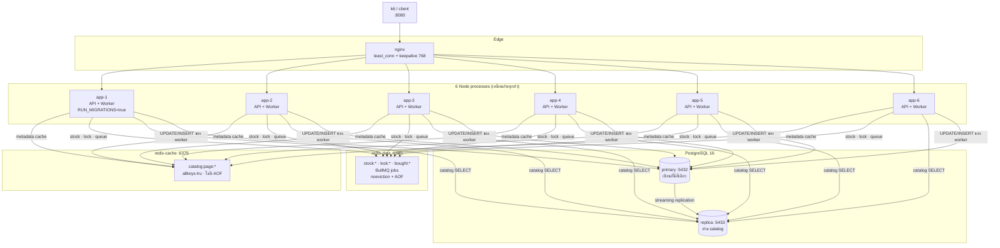
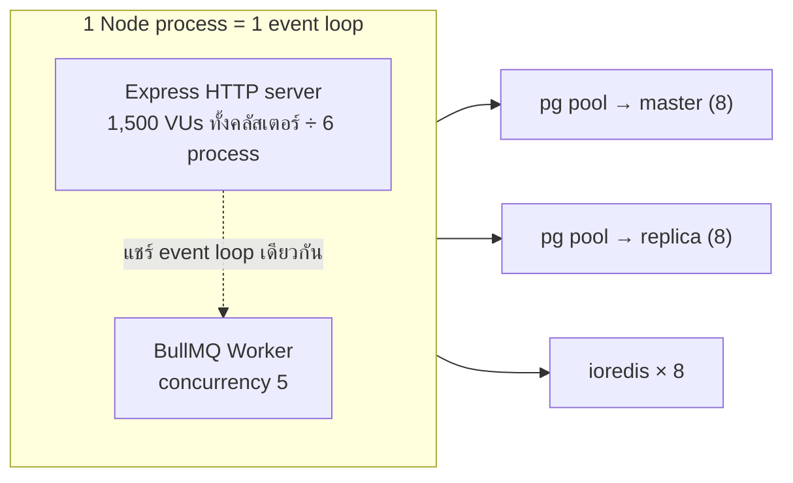
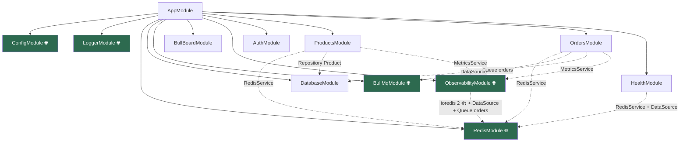
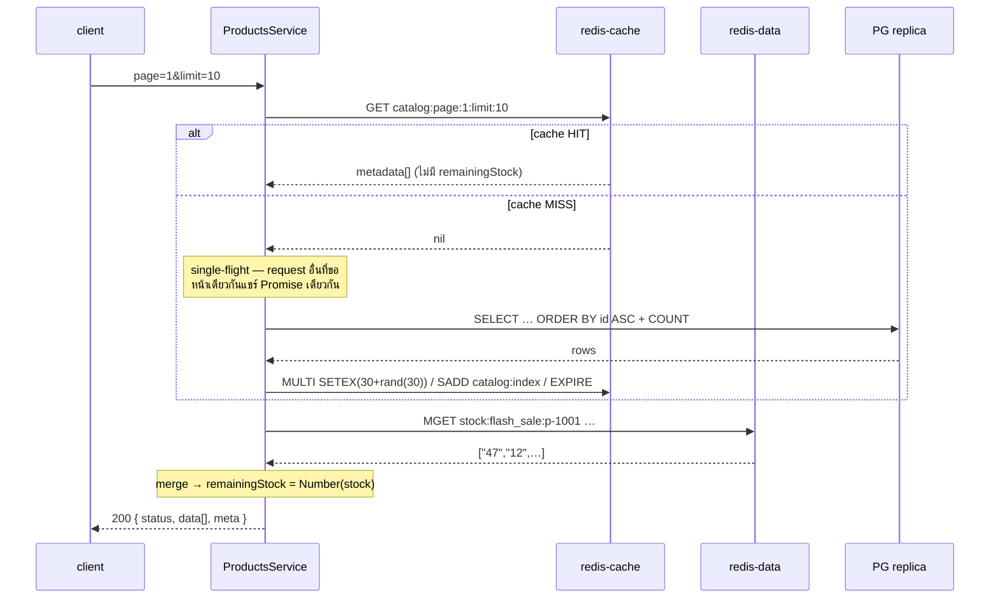
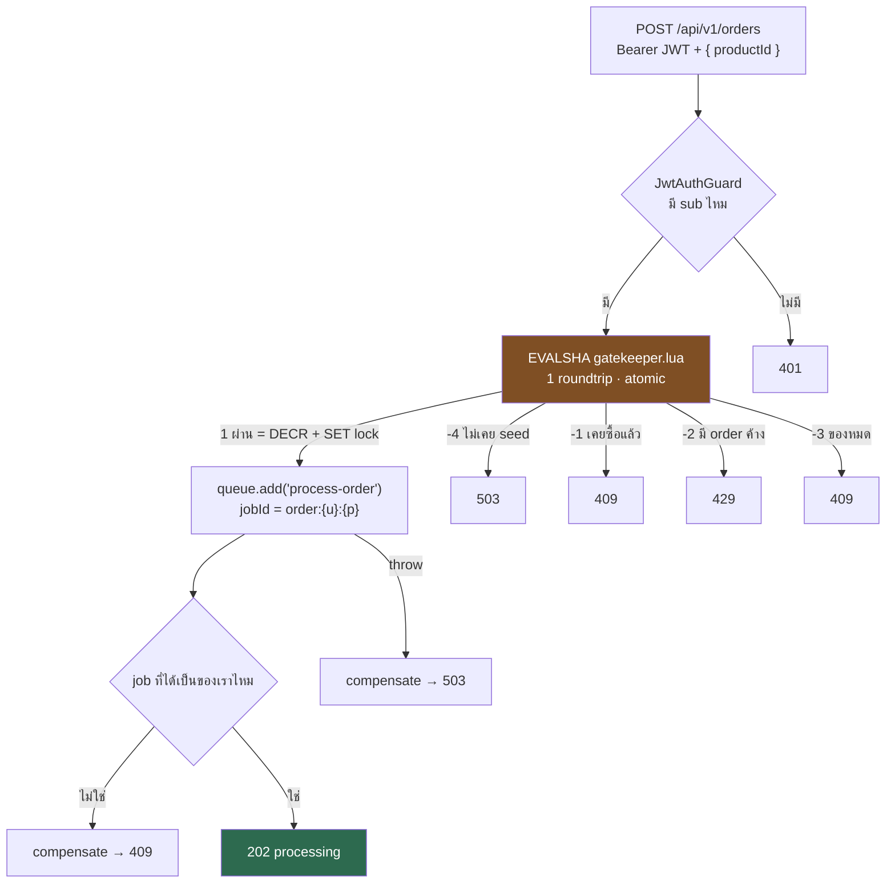
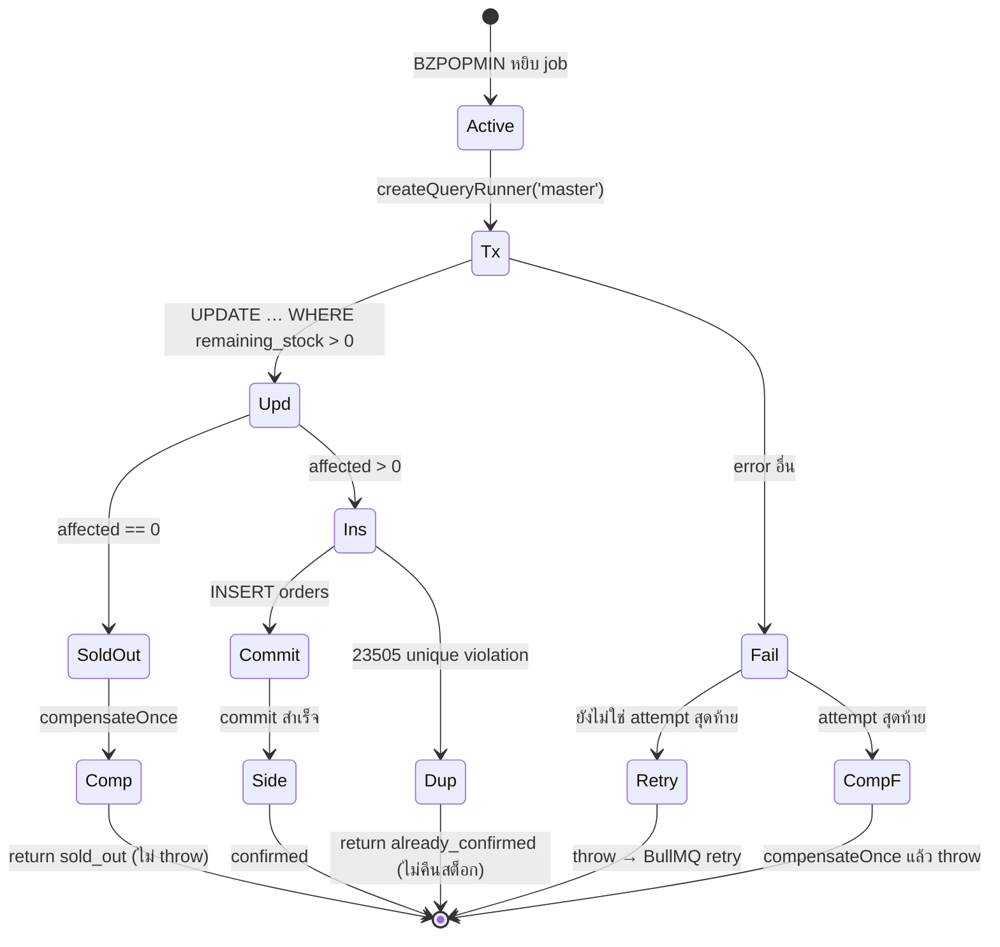

# 🧭 Codebase Primer — เดินโค้ด `flash-sale-backend` จากศูนย์

> **เอกสารนี้ตอบคำถามเดียว**: โค้ดไฟล์ไหนเรียกไฟล์ไหน และ request หนึ่งใบเดินทางผ่านอะไรบ้าง
> ไม่ใช่สเปก (สเปกคือ [`architecture.md`](../../Architecture/architecture.md)) และไม่ใช่การปูพื้นแนวคิด
> (แนวคิดอยู่ที่ [`architecture-primer.md`](../../Architecture/architecture-primer.md) — เขียนตอนยังไม่มีโค้ด)
>
> ทุก `file:line` ในเอกสารนี้อ้างจากโค้ดจริง **ณ 2026-08-30** (ตรวจซ้ำทั้งไฟล์รอบล่าสุดตอนเพิ่ม `src/observability/`)

---

## 0. 🚪 30 วินาทีแรก — 6 อย่างที่ต้องรู้ก่อน

1. **มี process จริง 6 ตัว** (app-1 … app-6) — API กับ BullMQ worker **อยู่ใน process เดียวกัน** ไม่ได้แยก
2. **มี Redis 2 ตัวคนละหน้าที่** — `redis-cache` เป็นแคชล้วน (หายได้), `redis-data` เก็บสต็อกกับคิว (หายไม่ได้)
3. **สต็อกมี 2 ที่**: counter ใน Redis (เร็ว ใช้กันคนเข้าคิว) และคอลัมน์ใน PostgreSQL (ช้า เป็นความจริง)
4. **`POST /orders` ไม่แตะ DB เลย** — มันคุยกับ Redis 3 ครั้งแล้วตอบ 202 ส่วน DB เป็นงานของ worker ทีหลัง
5. **`remainingStock` ไม่เคยถูกแคช** — อ่านสดจาก Redis ทุก request แล้วเอาไป merge กับ metadata ที่แคชไว้
6. **มี `/admin` เป็นหน้าต่างเดียวสำหรับดูของทั้งหมด** — Bull-Board, ตัวนับ metric ข้าม 6 instance และตัวตรวจ Redis↔DB (§9)

---

## 1. 🗺️ กล่องทั้งหมดในระบบ



**กฎที่อ่านจากรูปนี้ได้เลย**: ลูกศรไป `primary` มีเส้นเดียว และมันมาจาก worker เท่านั้น
ถ้าวันหนึ่งมีโค้ดใหม่เขียน DB จากที่อื่น แปลว่าผิด

---

## 2. ⚙️ process จริงมีกี่ตัว — จุดที่คนเข้าใจผิดบ่อยที่สุด

**API และ worker คือ process เดียวกัน** ไม่ได้แยกคนละ container

- `OrdersProcessor` เป็น provider ธรรมดาของ `OrdersModule` (`src/orders/orders.module.ts:17`)
- `@nestjs/bullmq` สร้าง `Worker` ขึ้นมาตอน Nest bootstrap ใน process เดิม
- container รันคำสั่งเดียว: `node dist/main.js` (`Dockerfile:65`)



**ผลที่ตามมาจริง**:
- worker ที่ทำงานหนักจะทำให้ HTTP ช้าลง และกลับกัน
- BullMQ ต่ออายุ lock ของ job ด้วย `setTimeout` ทุก 15 วินาที **บน event loop เดียวกันนี้** — ถ้า event loop ตัน job จะ "stall"
- `WORKER_CONCURRENCY` ถูกอ่านตอน **decorate class** (`src/orders/orders.processor.ts:40`) ซึ่งเกิดก่อน `ConfigService` โหลด `.env` → แก้ใน `.env` ไม่มีผล เห็นเฉพาะ env จริงของ container

---

## 3. 📁 แผนที่ไฟล์ (59 ไฟล์ใน `src/` — 54 `.ts` + 5 `.lua`)

| โฟลเดอร์ | ไฟล์ | หน้าที่ |
| :--- | :--- | :--- |
| **root** | `main.ts` | ตั้ง ValidationPipe, pino, filter, ครอบ Basic Auth ที่ `/admin` แล้ว mount Bull-Board, `listen()` |
| | `app.module.ts` | ประกอบ 10 module เข้าด้วยกัน (นับ `ConfigModule` ด้วยเป็น 11) |
| **auth/** | `auth.controller.ts` | `POST /api/v1/auth/token` |
| | `auth.service.ts` | `jwtService.sign({sub: userId})` — ไม่แตะ DB/Redis |
| | `jwt.strategy.ts` | verify token, `validate()` คืน `{userId}` แบบ **zero I/O** |
| | `jwt-auth.guard.ts` | `AuthGuard('jwt')` |
| **products/** | `products.controller.ts` | `GET /api/v1/products` |
| | `products.service.ts` | **หัวใจ read path** — cache-aside + single-flight + stock overlay |
| | `entities/product.entity.ts` | NUMERIC → number transformer |
| **orders/** | `orders.controller.ts` | `POST /api/v1/orders` → 202 |
| | `orders.service.ts` | **Tier 1+2** — Lua gatekeeper แล้ว enqueue |
| | `orders.processor.ts` | **Tier 3** — worker เขียน DB |
| | `errors/sold-out.error.ts` | ตัวบอกว่า "ล้มเหลวถาวร ห้าม retry" |
| **redis/** | `redis.module.ts` | สร้าง client 2 ตัว (cache / data) |
| | `redis.service.ts` | ทุกคำสั่ง Redis ผ่านที่นี่ |
| | `redis.keys.ts` | **สร้าง key ทุกตัวที่นี่ที่เดียว** ห้ามต่อ string เอง |
| | `lua/*.lua` | 5 สคริปต์ atomic (`gatekeeper`, `release-lock`, `compensate`, `compensate-once`, `compensate-if-reserved`) |
| **config/** | `database.config.ts` | replication master/slaves + poolSize |
| | `env.validation.ts` | ตรวจ env ตอน boot, พังทันทีถ้าผิด |
| **database_config/** | `database.module.ts` | `TypeOrmModule.forRootAsync()` — ผูก `database.config.ts` เข้า Nest (`@Global`) · **คนละโฟลเดอร์กับ `database/`** |
| **database/** | `data-source.ts` | DataSource สำหรับ CLI migration (**master อย่างเดียว**) |
| | `migrate-and-seed.ts` | สคริปต์ที่ container เรียกตอน boot |
| | `migrations/…-InitSchema.ts` | DDL ทั้งหมด |
| **seed/** | `seed.ts` | JSON → DB |
| | `seed-redis.ts` | DB → Redis counter (`SET … NX`) |
| **observability/** | `metrics.service.ts` | ตัวนับที่ buffer ใน RAM แล้ว flush ลง `redis-data` ทุก 1 วิ + heartbeat ราย instance |
| | `metrics.constants.ts` | ชื่อ metric ทุกตัวรวมศูนย์ (เหตุผลเดียวกับ `redis.keys.ts`) |
| | `integrity.service.ts` | **reconciliation Redis ↔ DB แบบอ่านอย่างเดียว** + queue counts + replication lag + `INFO` ของ Redis ทั้งสอง |
| | `observability.controller.ts` | `/admin/insights`, `/admin/insights.json`, `/admin/metrics`, `POST /admin/metrics/reset` |
| | `insights.page.ts` | HTML ของหน้าแดชบอร์ด (string ก้อนเดียว ไม่มี build step) |
| **health/** | `health.controller.ts` | `/health/live` (ไม่แตะอะไร), `/health/ready` (เช็ค 4 อย่าง) |
| **common/**, **logger/** | middleware, interceptor, filter, pino | correlation ID + JSON log |
| **bullmq_config/**, **bull_board/** | | ตั้ง queue `orders` + dashboard (`bull-board.theme.ts` = ธีม/โลโก้ล้วนๆ) |

---

## 4. 🔗 Module graph



🌐 = `@Global()` — module อื่นใช้ได้โดยไม่ต้อง `imports` (เส้นประคือ dependency ที่ไม่มี import จริง)

> ⚠️ **`registerQueue('orders')` ถูกเรียก 4 ที่** (`bullmq.module.ts:41`, `bull-board.module.ts:9`,
> `orders.module.ts:14`, `observability.module.ts:18`)
> Nest 11 แยก dynamic module ด้วย object identity → **ไม่ dedupe** → ได้ `Queue` object 4 ตัว
> = **7 connection ไป redis-data ต่อ container** (42 ทั้งคลัสเตอร์) แทนที่จะเป็น 4
> `ObservabilityModule` เป็นตัวที่ 4 เพราะ `IntegrityService` ต้องอ่าน `getJobCounts()` ของคิวเดียวกัน

> `ObservabilityModule` เป็น `@Global()` เพราะ `MetricsService` ถูกฉีดเข้าไปใน `OrdersService`,
> `OrdersProcessor` และ `ProductsService` — ถ้าไม่ global ต้องไล่ `imports` ทุกโมดูลที่มีเส้นทางร้อน

---

## 5. 🎫 เส้นทางที่ 1 — `POST /api/v1/auth/token` (ง่ายที่สุด)

```
nginx → pino genReqId → CorrelationIdMiddleware → ValidationPipe
      → AuthController.createToken  (auth.controller.ts:16)
      → AuthService.issueToken      (auth.service.ts:17)
      → jwtService.sign({sub})      HS256
      → 200 { status:'success', accessToken }
```

**network call: ศูนย์** ไม่มี DB ไม่มี Redis — โจทย์ระบุว่า endpoint นี้ไม่ถูกวัด performance
`userId` อะไรก็ได้ ไม่มีตาราง `users` ในระบบ (ตั้งใจ — ดู `architecture.md` §3.1.4)

---

## 6. 📖 เส้นทางที่ 2 — `GET /api/v1/products` (read path)



### 3 อย่างที่ต้องเข้าใจตรงนี้

**① แคชเก็บ metadata อย่างเดียว ไม่เก็บ `remainingStock`**
`ProductMetadata` (`products.service.ts:17-24`) มี `productId, name, price, availableStock, isFlashSaleActive, fallbackRemainingStock`
ตัวที่ตอบกลับไปคือ `MGET` สดทุกครั้ง — **นี่คือคำตอบของ "เงื่อนไขสำคัญ" ในโจทย์**
แคชจึงอยู่ได้เป็นนาทีโดยไม่ต้องล้างทุกครั้งที่มีคนซื้อ

**② เรียก Redis 2 ครั้งแบบ serial ไม่ใช่ parallel**
เพราะรายชื่อ `productIds` ที่จะเอาไป `MGET` มาจากผลของ `GET` รอบแรก (`products.service.ts:95-96`)
ต้นทุนจริงประมาณ 0.4–1 ms — ไม่ใช่จุดที่ควรไปปรับ

**③ cache กับ stock ปฏิบัติต่อ error คนละแบบ**

| ล้มเหลว | เกิดอะไร | ที่ |
| :--- | :--- | :--- |
| `redis-cache` ล่ม | กลืน error → ถือว่า miss → ไปอ่าน DB | `redis.service.ts:273-278` |
| `redis-data` ล่ม | **degrade** → ตอบ `fallbackRemainingStock` จากแคช + นับ + log ระดับ error | `products.service.ts:148-167` |

> ⚠️ **แก้จากที่เอกสารรุ่นก่อนเขียนไว้**: ตารางนี้เคยเขียนว่า `redis-data` ล่มแล้ว "โยน 503 ไม่ยอมตอบเลข"
> ซึ่ง**ไม่ตรงกับโค้ดแล้ว** — เปลี่ยนเป็น degrade ตั้งแต่ [Q&A ข้อ 3](02-design-review-qa.md#3-read-path-ควร-503-หรือ-ตอบเลขเก่า)
> ตอนนี้ `readStocks()` catch แล้วคืน `null` ทุกช่อง (`products.service.ts:165`) ให้ตัว merge ใช้ `fallbackRemainingStock`
> พร้อมบวก `catalog_degraded_reads_total` (`products.service.ts:158`) — ตัวเลขนี้อ่านได้ที่ `/admin/insights`

**④ นับ hit/miss ตรงนี้ที่เดียว**
`this.metrics.inc(cached ? CATALOG_CACHE_HITS : CATALOG_CACHE_MISSES)` (`products.service.ts:89-91`)
เป็น **synchronous ไม่มี I/O** จึงไม่เพิ่ม latency ให้ read path ที่กิน 99% ของโหลด (ดู §9)

---

## 7. 🛒 เส้นทางที่ 3 — `POST /api/v1/orders` (write path, 6 ทางออก)



### `gatekeeper.lua` — ทำไมต้องเป็น Lua

Redis เป็น single-thread **ระหว่างรัน Lua** ทั้งสคริปต์จึงเป็นก้อนเดียวที่แทรกไม่ได้

```lua
local raw = redis.call('GET', KEYS[2])
if raw == false then return -4 end            -- ยังไม่ seed ≠ ของหมด
if redis.call('EXISTS', KEYS[3]) == 1 then return -1 end   -- bought
if redis.call('EXISTS', KEYS[1]) == 1 then return -2 end   -- lock
if tonumber(raw) <= 0 then return -3 end                   -- sold out
redis.call('DECR', KEYS[2])
redis.call('SET', KEYS[1], ARGV[2], 'PX', ARGV[1])
return 1
```

ถ้าแยกเป็น 4 คำสั่ง ioredis: request สองใบจะสลับกันระหว่างเช็คกับ `DECR` → TOCTOU

**บรรทัด `if raw == false then return -4`** สำคัญกว่าที่เห็น — ถ้าเขียน `tonumber(GET(k) or '0')` แบบที่เห็นทั่วไป
"ไม่มี key" จะกลายเป็น "สต็อก 0" → Redis restart เมื่อไหร่ ระบบตอบ "ของหมด" ตลอดกาลโดยไม่มีใครรู้

### ✅ จุดที่เคยเป็นบั๊ก และแก้ไปแล้ว (2026-08-26)

เดิมตรวจว่า job เป็นของเราไหมโดยเทียบ `job.data.requestToken` จากสิ่งที่ `queue.add()` คืนมา
**ซึ่งใช้ไม่ได้** — BullMQ ไม่เคยอ่าน `data` กลับจาก Redis `Job.create()` เขียนกลับแค่ `job.id`
(`node_modules/bullmq/dist/cjs/classes/job.js:124-135`) → เงื่อนไขนั้นเป็น false เสมอ = เช็คตาย

ตอนนี้ `orders.service.ts` **อ่าน job กลับจาก Redis** ด้วย `queue.getJob(jobId)`
(`Job.fromId` → `HGETALL`) แล้วเทียบ token ที่ *เก็บอยู่จริง* — round trip เท่าเดิมกับ `getState()` ที่ถอดออก
และถ้าอ่านกลับไม่ได้ **จะไม่คืนสต็อก** (คืนผิดตอนของขายไปแล้วแย่กว่าไม่คืน)

ที่มาและการถกเถียงอยู่ใน [Q&A ข้อ 1](02-design-review-qa.md#1-blocker-b-ที่คิดว่าปิดแล้ว-ยังเปิดอยู่)

---

## 8. ⚙️ เส้นทางที่ 4 — Worker (`orders.processor.ts`)



### 4 จุดที่ต่างจากโค้ดที่เขียนกันทั่วไป

**① `createQueryRunner('master')`** (`:62`)
`defaultMode: 'slave'` (`config/database.config.ts:48`) แปลว่า repository ธรรมดา**วิ่งไป replica**
ซึ่งมี lag → worker อ่านสต็อกเก่า → race ทันที บรรทัดนี้คือสิ่งเดียวที่กันไว้

**② `UPDATE … WHERE remaining_stock > 0` แล้วเช็ค `affected === 0`** (`:69-78`)
ไม่มี `SELECT` ก่อน จึงไม่มี TOCTOU
PostgreSQL READ COMMITTED จะ **ประเมิน `WHERE` ใหม่** หลังรอ row lock (EvalPlanQual)
คนที่ 51 จึงเห็น `remaining_stock = 0` และได้ `affected = 0`
**นี่คือบรรทัดเดียวที่ทำให้ oversell เป็นไปไม่ได้** โดยมี `CHECK (remaining_stock >= 0)` เป็นพื้นรองอีกชั้น

**③ side effect หลัง commit อยู่นอก try/catch ของ transaction** (`:149-160`)
ถ้าอยู่ข้างใน: Redis สะดุดหลัง DB commit → โค้ดจะไป "คืนสต็อก" ทั้งที่ขายไปแล้ว → **oversell**
และ 3 บรรทัดในนั้นเรียงลำดับสำคัญ (`markBought` → `releaseInFlightLock` → `invalidateCatalogCache`)
แต่ **ไม่มีคอมเมนต์บอกไว้** — สลับ 2 ตัวแรกแล้วจะมีช่องให้ retry เข้ามาเจอ "ไม่มี lock ไม่มี bought แต่ stock > 0"

**④ ล้มเหลวถาวร `return` ไม่ `throw`** (`:99` = `already_confirmed`, `:121` = `sold_out`)
`SoldOutError` และ `23505` retry ไปก็ไม่มีทางสำเร็จ มีแต่เปลือง attempt

**⑤ ทุก branch บวก metric ก่อน `return`/`throw`** (เพิ่ม 2026-08-30)
`WORKER_CONFIRMED` (`:169`), `WORKER_ALREADY_CONFIRMED` (`:95`), `WORKER_SOLD_OUT` (`:116`),
`WORKER_TRANSIENT_FAILURES` (`:124`), `STOCK_COMPENSATED` (`:126`), `WORKER_POST_COMMIT_FAILURES` (`:162`)
และ `@OnWorkerEvent('completed')` (`:188`) บวก `WORKER_DURATION_MS_SUM` / `_COUNT` (`:192-196`) จาก `job.processedOn`
ที่ BullMQ ประทับไว้ให้ — **ไม่มีการจับเวลาเองในเส้นทางร้อน**
ตัว decorator ยังเพิ่ม `metrics: { maxDataPoints: MetricsTime.ONE_WEEK }` (`:43`) เพื่อให้แท็บ Metrics
ของ Bull-Board มีกราฟจริงแทนกราฟเปล่า

### ตารางสรุปว่าใครคืนสต็อกบ้าง

| กรณี | DB | Redis | คืนสต็อก? |
| :--- | :--- | :--- | :--- |
| สำเร็จ | −1 | −1 (จาก gatekeeper) | ไม่ ✅ ตรงกัน |
| ของหมด (`affected=0`) | rollback | −1 | **ไม่คืน** → ปล่อยให้ Redis ลู่ลงเข้าหา DB (ดูหมายเหตุ) |
| `23505` | rollback | −1 | **ไม่คืน** → Redis ต่ำกว่า DB ถาวร ⚠️ |
| ล้ม attempt 1–2 | rollback | −1 | ไม่คืน (จะ retry) ✅ |
| ล้ม attempt 3 | rollback | −1 | **คืน** → ตรงกัน |

> **ทำไม sold-out ถึงไม่คืน**: `affected = 0` แปลว่า Redis บอก "ผ่าน" แต่ DB บอก "หมด"
> = Redis สูงกว่า DB อยู่ก่อนแล้ว ถ้าคืนจะดันขึ้นอีก → ปล่อยคนถัดไป → ตาย sold-out อีก → คืนอีก **วนไม่จบ**
> counter จะลู่เข้าหา 1 ไม่มีวันถึง 0 (ตกเกณฑ์ §9.3 ข้อ 4) การไม่คืนทำให้มันลู่ลงหา DB แล้วหยุดเอง

---

## 9. 📈 เส้นทางที่ 5 — Observability (`/admin/*`)

> เพิ่มเข้ามา 2026-08-30 · `src/observability/` 7 ไฟล์ · ไม่มี service ใหม่ใน `docker-compose.yml`
> ทั้งหมดอยู่ใน process เดิม ใช้ Redis/DB connection ที่มีอยู่แล้ว

### ใครทำอะไร

| ไฟล์ | หน้าที่ |
| :--- | :--- |
| `metrics.constants.ts` | ชื่อ metric 24 ตัว (`Metric.*`) — ห้ามพิมพ์ชื่อเป็น string ลอยที่จุดเรียก |
| `metrics.service.ts` | `inc()` บวกใน RAM · flush ลง `redis-data` ทุก 1 วิ · เก็บ heartbeat ราย instance |
| `integrity.service.ts` | `check()` — reconciliation Redis ↔ DB + queue counts + replication lag + `INFO` ของ Redis ทั้งสอง |
| `observability.controller.ts` | 4 route ใต้ `/admin` |
| `insights.page.ts` | HTML ก้อนเดียว (poll `insights.json` ทุก 3 วิ) |
| `observability.module.ts` | `@Global()` + `registerQueue('orders')` เพื่อให้ `IntegrityService` อ่าน job counts ได้ |
| `integrity.service.spec.ts` | 8 เทสต์ — ตัดสิน verdict จาก oversell / ซื้อซ้ำ / drift / คิวว่าง |

### route ที่เปิดออกมา (`observability.controller.ts`)

| route | ตอบอะไร | บรรทัด |
| :--- | :--- | :--- |
| `GET /admin/insights` | หน้า HTML | `:29-37` |
| `GET /admin/insights.json` | `{ counters, instances, integrity }` — `Promise.all` 3 ทาง | `:39-47` |
| `GET /admin/metrics` | Prometheus exposition format (ยังไม่มี Prometheus ในสแตก แต่ `curl` อ่านได้) | `:53-161` |
| `POST /admin/metrics/reset` | ล้างตัวนับก่อนยิง k6 รอบใหม่ — **ไม่แตะ order/stock** | `:164-169` |

⚠️ **ทั้ง 4 route ถูกครอบด้วย Basic Auth ตัวเดียวกับ Bull-Board** — `main.ts:52` ใช้
`app.use('/admin', bullBoard.getAuthMiddleware())` ก่อน `app.use(BULL_BOARD_BASE_PATH, …)` (`main.ts:53`)
ครอบที่ prefix `/admin` ทีเดียวจึงคลุม `/admin/queues`, `/admin/insights`, `/admin/metrics` พร้อมกัน
และ route ใหม่ที่เผลอเพิ่มใต้ `/admin` ทีหลังก็ถูกคลุมอัตโนมัติ
`LoggingInterceptor` ก็ข้าม `/admin` ทั้ง prefix แล้ว (`logging.interceptor.ts:55`) ไม่งั้นหน้า insights
ที่ poll ทุก 3 วิ จะปั๊ม log ทิ้งไว้เต็ม

### `MetricsService.inc()` — ใครเรียก จากตรงไหน

`inc()` เป็น **synchronous ล้วน ไม่มี I/O** (`metrics.service.ts:83-85`) จึงเรียกจาก hot path ได้
โดยไม่เพิ่ม latency และไม่มีทาง throw ใส่ผู้เรียก (การวัดผลห้ามทำให้คำสั่งซื้อล้ม)

| ผู้เรียก | บรรทัด | metric |
| :--- | :--- | :--- |
| `orders.service.ts` | `:74` | `ORDERS_REQUESTS` (ทุกคำขอ) |
| | `:100` | `ORDERS_GATEKEEPER_ERRORS` |
| | `:110` `:113` `:125` `:128` | `ORDERS_REJECTED_DUPLICATE` / `_IN_FLIGHT` / `_SOLD_OUT` / `_NO_COUNTER` |
| | `:159` `:171` | `ORDERS_ENQUEUE_FAILURES` (throw / `job === null`) |
| | `:198` `:204` | `ORDERS_JOB_UNVERIFIED` / `ORDERS_DEDUPED` |
| | `:209` | `ORDERS_ACCEPTED` (202) |
| | `:254` `:262` `:269` | `compensateIfReserved()` — สั่ง / คืนได้จริง / ล้มเหลว |
| | `:283` `:286` `:288` | `compensate()` — สั่ง / คืนได้จริง / ล้มเหลว |
| `orders.processor.ts` | `:95` `:116` `:124` `:126` `:162` `:169` `:192-196` | ดู §8 ข้อ ⑤ |
| `products.service.ts` | `:89-91` | `CATALOG_CACHE_HITS` / `_MISSES` |
| | `:158` | `CATALOG_DEGRADED_READS` |

**ทำไมต้อง buffer แล้วค่อย flush** (`metrics.service.ts:34-46`): ถ้า `HINCRBY` ทุกครั้งที่นับ
ตอนยิง 1,500 rps จะเพิ่มภาระให้ `redis-data` อีก ~1,500 ops/s **บน connection เดียวกับที่ gatekeeper ใช้**
= เครื่องมือวัดไปกวนสิ่งที่กำลังวัด · buffer แล้ว flush 1 ครั้ง/วินาทีด้วย pipeline เหลือ ~1 roundtrip/วินาที/instance

**ไม่ขัดกฎ stateless** (CLAUDE.md §5 ข้อ 1) เพราะแหล่งจริงคือ hash บน `redis-data`
ตัวใน RAM เป็น write-behind buffer อายุ ≤ 1 วินาที · flush ปิดท้ายที่ `onModuleDestroy()`
(`metrics.service.ts:71-77`) ดังนั้น SIGTERM ปกติไม่หาย **แต่ SIGKILL หายได้ ≤ 1 วินาทีสุดท้าย**
ถ้า flush ล้ม จะเอาของกลับเข้า buffer ไม่ทิ้ง (`:159-172`) และ log แค่ 1 ใน 30 ครั้งกัน log storm

### `IntegrityService.check()` — อ่านทั้ง Redis และ DB แล้วเทียบ

`check()` (`integrity.service.ts:122-174`) ยิง 4 อย่างขนานกันด้วย `Promise.all`:

```
checkProducts()        → PG master : SELECT products LEFT JOIN (COUNT/COUNT DISTINCT orders)
                       → redis-data: MGET stock:flash_sale:*   (ตาม id ที่ได้จาก SQL)
readQueueCounts()      → BullMQ getJobCounts(waiting/active/completed/failed/delayed/prioritized)
readReplicationLag()   → PG slave  : pg_last_xact_replay_timestamp()
readRedis() × 2        → INFO ของ redis-cache และ redis-data (hit ratio, evicted_keys, ops/s)
```

⚠️ **`checkProducts()` ใช้ `createQueryRunner('master')`** (`:182`) ตามเหตุผลเดียวกับ worker
(invariant §4 ข้อ 3) — ถ้าอ่าน replica ที่มี lag แล้วเอาไปเทียบกับ Redis ที่สดเสมอ
หน้านี้จะรายงาน drift ปลอมทุกครั้งที่ replica ตามไม่ทัน
ส่วน `readReplicationLag()` ตั้งใจใช้ `createQueryRunner('slave')` (`:311`) เพราะต้องวัดจากฝั่ง replica เอง

**เกณฑ์ตัดสิน** (`buildRow()` `:227-281`) เป็นตัวเดียวกับ §9.3 ของ `architecture.md` เป๊ะๆ:

| เงื่อนไข | verdict |
| :--- | :--- |
| `orders > available_stock` | `critical` — OVERSELL |
| `remaining_stock < 0` | `critical` |
| `orders !== buyers` | `critical` — มีคนซื้อซ้ำ |
| `available_stock − remaining_stock !== orders` | `critical` — DB ไม่สมดุลในตัวเอง |
| `redisRemaining > dbRemaining` | `critical` — Redis สูงกว่า DB = เสี่ยงปล่อยคนที่ 51 |
| ไม่มี key `stock:*` เลย | `warn` — ยังไม่ `seed:redis` |
| `drift < 0` **และคิวว่างแล้ว** | `warn` — สต็อกรั่ว (`:138-147`) |
| `drift < 0` แต่ยังมี job ค้าง | `ok` + note "ปกติ" |

`drift = redisRemaining − dbRemaining` (`:277`) · **ติดลบระหว่างที่มี job ค้าง = ปกติ**
เพราะ Redis จองก่อน DB ตัดทีหลัง แต่ถ้าคิวว่างแล้วยังติดลบ = ของหายจริง

**`check()` ไม่แก้อะไรทั้งสิ้น** (`:104-109`) — การซ่อม drift อัตโนมัติอันตรายกว่าปัญหาเดิม
(`INCR` ลอยๆ = ปล่อยคนที่ 51 เข้ามา) หน้าที่ของมันคือบอกให้คนตัดสินใจ
> ⚠️ นี่ **ไม่ได้ปิด** รู "ไม่มี reconciliation Redis ↔ DB" ใน CLAUDE.md §0.1 ทั้งหมด —
> มันเปลี่ยนจาก "ต้องรัน §9.3 ด้วยมือ" เป็น "มีตัวตรวจให้ดู" เท่านั้น **ยังไม่มีอะไรซ่อมให้อัตโนมัติ**
> และรูอีก 2 ข้อ (`23505` ไม่คืนสต็อก, job stall เกิน `maxStalledCount`) ยังเปิดอยู่เหมือนเดิม

### สิ่งที่ต้องระวัง

- `INSTANCE_ID` มาจาก `docker-compose.yml` (`app-1` … `app-6`) ถ้าไม่ตั้ง จะ fallback เป็น `hostname()`
  (`metrics.service.ts:60`) — ถ้าทั้ง 6 ตัวได้ค่าเดียวกัน field ใน `metrics:instances` จะทับกัน
- instance ที่ heartbeat เก่ากว่า 15 วินาที หน้าเว็บจะขึ้นว่า stale (เกณฑ์นี้ hardcode อยู่ในหน้าเว็บเอง `insights.page.ts:309`)
- `metrics:counters` / `metrics:instances` อยู่บน **`redis-data`** (`redis.keys.ts:46` `:49`) ไม่ใช่ `redis-cache`
  เพราะ `allkeys-lru` จะ evict ตัวนับหายเงียบๆ
- `RESET_CONFIRM=yes pnpm run reset` ล้าง 2 key นั้นให้ด้วยแล้ว (`database/reset.ts:82-85`)
  ไม่งั้นตัวเลขในรายงานจะเป็นผลรวมของหลายรอบ

---

## 10. 🔀 ใครคุยกับ datastore ไหน

### `redis-cache` (:6379, `allkeys-lru`, ไม่มี AOF)
| คำสั่ง | ใครเรียก |
| :--- | :--- |
| `GET catalog:page:{p}:limit:{l}` | `redis.service.ts:269-279` |
| `MULTI SETEX + SADD + EXPIRE` | `redis.service.ts:294-300` |
| `SMEMBERS catalog:index` → `DEL` | `redis.service.ts:371-384` (worker เรียกหลังขายสำเร็จ) |
| `INFO` (hit ratio / evicted_keys / ops/s) | `integrity.service.ts:334-373` (เฉพาะตอนเปิด `/admin/*`) |

### `redis-data` (:6380, `noeviction` + AOF)
| คำสั่ง | ใครเรียก |
| :--- | :--- |
| `EVALSHA gatekeeper.lua` | `orders.service.ts` ทุก POST |
| `MGET stock:flash_sale:*` | `products.service.ts` **ทุก GET** ← 99% ของโหลด |
| `EVALSHA compensate*.lua` | service (enqueue ล้ม) / worker (ล้มถาวร) |
| `SET bought:{p}:{u}` (ไม่มี TTL) | worker หลัง commit |
| BullMQ ทั้งหมด | `add`, `BZPOPMIN`, move-to-*, Bull-Board |
| `HINCRBY metrics:counters` + `HSET metrics:instances` | `metrics.service.ts:143-157` — 1 pipeline/วินาที/instance |
| `HGETALL metrics:*` | `metrics.service.ts:91` `:104` (เฉพาะตอนเปิด `/admin/insights`) |
| `MGET stock:*` (อีกที) + `getJobCounts()` | `integrity.service.ts:218` `:285-292` (เฉพาะตอนเปิด `/admin/*`) |

### PostgreSQL
| ไป primary | ไป replica |
| :--- | :--- |
| transaction ของ worker (`createQueryRunner('master')`) | catalog `getManyAndCount()` (2 queries) |
| migration + seed (`data-source.ts` ไม่มี replication เลย) | `/health/ready` ฝั่ง slave |
| `/health/ready` ฝั่ง master | replication lag ของ `IntegrityService` (`integrity.service.ts:311`) |
| reconciliation ของ `IntegrityService` (`integrity.service.ts:182`) | |

---

## 11. 🔌 Connection topology

**ต่อ 1 container:**

| อะไร | จำนวน | ไปไหน |
| :--- | :--- | :--- |
| pg pool (master) | 8 | primary |
| pg pool (slave) | 8 | replica |
| ioredis `REDIS_CACHE_CLIENT` | 1 | redis-cache |
| ioredis `REDIS_DATA_CLIENT` | 1 | redis-data |
| BullMQ `Queue` × 4 | 4 | redis-data |
| BullMQ `Worker` (main + blocking) | 2 | redis-data |

> `Queue` เพิ่มจาก 3 เป็น 4 ตอนเพิ่ม `ObservabilityModule` (ดู §4) — `MetricsService` และ `IntegrityService`
> **ไม่ได้สร้าง ioredis client ใหม่** ทั้งคู่ฉีด `REDIS_DATA_CLIENT` / `REDIS_CACHE_CLIENT` ที่มีอยู่แล้ว

**ทั้งคลัสเตอร์**: `6 × 8 = 48` ไป primary · `6 × 8 = 48` ไป replica · `6 × 7 = 42` ไป redis-data · `6` ไป redis-cache

> ⚠️ สูตรใน `architecture.md` §8 (`instances × (1+replicas) × poolSize ≤ 80% ของ max_connections`)
> **มิติผิด** — มันบวก connection ที่ไปคนละ server แล้วเทียบกับ limit ของ server เดียว
> ค่าที่ถูกคือ 48 บน primary และ 48 บน replica **แยกกัน** (ดู [Q&A ข้อ 6](02-design-review-qa.md#6-worker-กับ-api-แย่ง-connection-pool-กันจริงไหม))

---

## 12. 🚀 ลำดับตอน `podman compose up -d`


**app-1** รัน `dist/database/migrate-and-seed.js` แบบ synchronous ก่อน start server
**app-2..6** วน poll ทุก 2 วิ (สูงสุด 240 วิ) เช็ค 2 อย่าง: ตาราง `products` มีแถว **และ** มี key `stock:flash_sale:*`
(ใช้ `SCAN` ไม่ใช่ `KEYS`) — ข้อสองสำคัญเพราะ seed DB เสร็จก่อน seed Redis ถ้าไม่รอจะมีช่วงที่ตอบ 503

> ⚠️ **boot ซ้ำไม่ reset ให้** — `seed.ts` ใช้ `ON CONFLICT DO UPDATE` ที่ไม่แตะ `remaining_stock`,
> `seed-redis.ts` ใช้ `SET … NX`, `bought:` ไม่มี TTL → **restart แล้วยิง k6 รอบสองได้ 409 ทั้งหมด**
> ตั้งแต่ 2026-08-26 มี `RESET_CONFIRM=yes pnpm run reset` (`src/database/reset.ts`) ที่ล้าง `orders`,
> `stock:*` / `bought:*` / `lock:*` / `compensated:*` และ (ตั้งแต่ 2026-08-30) `metrics:*` แล้ว seed ใหม่ให้
> — ใช้อันนี้แทน `podman compose down -v` ซึ่งลบ volume ของ Postgres ไปด้วย → replica ต้อง basebackup ใหม่
> ⚠️ `reset` **ไม่ล้าง BullMQ job** · `jobId` เป็น deterministic จึงชนกับรอบใหม่ได้ ต้องล้างเองด้วย
> `redis-cli --scan --pattern 'bull:orders:*' | xargs redis-cli DEL` (CLAUDE.md §0.1)

---

## 13. 📊 ค่าคงที่ที่ต้องรู้

| ค่า | เท่าไหร่ | ที่ | พังยังไงถ้าผิด |
| :--- | :--- | :--- | :--- |
| `jobId` | `order:{userId}:{productId}` | `orders.service.ts:44` | ไม่ deterministic → คนเดียวสั่งได้หลายใบ |
| queue | `orders` | `bullmq.module.ts:5` + `orders.service.ts:40` (ซ้ำ 2 ที่) | คนละชื่อ → job ไม่มีใครกิน |
| catalog TTL | `30 + rand(0..30)` วิ | `redis.service.ts:289-291` | ไม่มี jitter → key หมดอายุพร้อมกัน |
| lock TTL | 30,000 ms | `env.validation.ts:123` | สั้นไป → ยิงซ้ำได้ก่อน job จบ |
| `compensated:` TTL | 300 วิ | `redis.service.ts:83` | ต้องครอบ retry chain ของ job เดียว (~2 วิ) เท่านั้น |
| debounce ล้างแคช | 1,000 ms | `redis.service.ts:86` | ต่ำไป = ล้างแคช 50 ครั้งรวดตอน burst |
| `commandTimeout` | 1,000 ms | `redis.module.ts:33` | **ไม่มี = คำสั่งค้าง `catch` ไม่ทำงาน → 504** |
| worker concurrency | 5 (default ในโค้ด) · `docker-compose.yml` ทับเป็น **1** | `orders.processor.ts:40` | อ่านตอน decorate → `.env` ไม่มีผล |
| pool size | 8 ต่อ pool | `database.config.ts:52` (`.env.example` เขียน 10 · `docker-compose.yml` ทับเป็น 8) | ที่ 6 instance เกิน ~13 จะชนเพดาน 80% ของ `max_connections=100` |
| BullMQ attempts | 3, backoff exp 200 ms | `orders.service.ts:152-153` | เป็นตัวกำหนดว่า `isFinalAttempt` เมื่อไหร่ |
| `removeOnComplete` | `{count: 5000}` | `orders.service.ts:154` | ต่ำไป → job เก่าหาย → dedup พัง |
| nginx read timeout | 10 s | `nginx.conf:94` | p99 เกิน 10 วิ กลายเป็น 504 |
| metrics flush | 1,000 ms | `metrics.service.ts:18` | ต่ำไป = เครื่องมือวัดไปกวน `redis-data` ที่กำลังวัด |
| instance ถือว่าตาย | **15 วินาที** (เทียบเป็นวินาที ไม่ใช่ ms) | `insights.page.ts:309` | หน้า insights ขึ้น stale เร็ว/ช้าเกินจริง |
| Bull-Board metrics | เก็บ 1 สัปดาห์ | `orders.processor.ts:43` | ไม่ตั้ง = แท็บ Metrics เป็นกราฟเปล่า |

### Lua return code → HTTP

| code | ความหมาย | HTTP |
| :--- | :--- | :--- |
| `1` | ผ่าน (DECR + SET lock แล้ว) | **202** |
| `-1` | เคยซื้อแล้ว | 409 |
| `-2` | มี order ค้างอยู่ (กดรัว) | **429** |
| `-3` | ของหมด | 409 |
| `-4` | ยังไม่เคย seed counter | **503** |

`-3` กับ `-4` ต้องแยกกันให้ชัด: อันหนึ่งคือ "ขายหมดแล้ว" อีกอันคือ "ระบบพัง"

---

## 14. ❓ คำถามที่คนอ่านโค้ดนี้มักงง

**Q: ทำไม `POST /orders` ตอบ 202 ไม่ใช่ 201?**
เพราะ order ยังไม่เกิดขึ้นจริงตอนตอบ — มันแค่เข้าคิว 201 แปลว่า "สร้างแล้ว" ซึ่งจะโกหก
โจทย์บังคับ 202 และ k6 กลุ่มอื่น assert ค่านี้

**Q: `availableStock` กับ `remainingStock` ต่างกันยังไง?**
`availableStock` = สต็อกตั้งต้นจาก seed **ไม่เคยเปลี่ยน** · `remainingStock` = คงเหลือจริง นับถอยหลัง
ตัวแรกมาจากแคช ตัวหลังมาจาก Redis สดๆ

**Q: ถ้า Redis counter กับ DB ไม่ตรงกันจะรู้ได้ยังไง?**
เปิด **`/admin/insights`** (หรือ `curl` เอา JSON จาก `/admin/insights.json`) — `IntegrityService`
อ่าน `MGET stock:*` กับ `SELECT` จาก **master** แล้วเทียบให้ พร้อมบอก verdict `ok`/`warn`/`critical` (§9)
ทำมือก็ยังได้: `redis-cli -p 6380 GET stock:flash_sale:p-1001` เทียบกับ `SELECT remaining_stock`
> ⚠️ **แก้จากที่เอกสารรุ่นก่อนเขียนไว้** — ตรงนี้เคยเขียนว่า "ไม่มีอะไรใน runtime จับให้อัตโนมัติ"
> ซึ่งจริง **จนถึง 2026-08-30** · ตอนนี้มีตัว *ตรวจ* แล้ว แต่ยัง **ไม่มีตัวซ่อม** — มันอ่านอย่างเดียว

**Q: ทำไมไม่มีตาราง `users`?**
`/auth/token` ออก token ให้ `userId` อะไรก็ได้โดยไม่แตะ DB ถ้ามี FK บน `orders.user_id`
จะ INSERT ไม่ผ่านสักใบ (ตั้งใจ — `architecture.md` §3.1.4)

**Q: 429 คือ error หรือเปล่า?**
ไม่ใช่ มันคือหลักฐานว่า in-flight lock ทำงาน โจทย์บอกให้จำลองการกดรัว ห้ามนับเป็น error ใน k6 threshold

**Q: ยิง k6 รอบสองเลยได้ไหม?**
**ไม่ได้** ต้อง `RESET_CONFIRM=yes pnpm run reset` ก่อน — `seed` ใช้ `ON CONFLICT` ที่ไม่แตะ `remaining_stock`,
`seed:redis` ใช้ `SET … NX`, `bought:` ไม่มี TTL → re-seed ซ้ำกี่รอบก็ไม่เปลี่ยนอะไร ได้ 409 ล้วน

**Q: worker ตายกลางทางจะเป็นยังไง?**
BullMQ จะเห็นว่า job "stalled" หลัง 30 วิ แล้วโยนกลับเข้าคิว **แต่ถ้า stall ครั้งที่ 2 มันจะ fail ทันที
โดยไม่เรียก handler เลย** → `compensateOnce` ไม่ถูกเรียก → สต็อกหาย 1 ชิ้น

**Q: อยากดูว่าคิวเป็นยังไงตอน run?**
`http://localhost:8080/admin/queues` (Basic Auth) — แต่**อย่ากดปุ่ม Retry** ระหว่างเก็บผล
มันจะปลุก job ที่คืนสต็อกไปแล้วให้กลับมาสำเร็จ ทำให้ Redis สูงกว่า DB

**Q: จะเอาตัวเลขไปใส่รายงานยังไง?**
`/admin/insights` มี counter ทุกตัว (รวม cache hit/miss สำหรับหัวข้อ Cache Invalidation),
event loop p99 ราย instance, queue counts, replication lag และตาราง Redis↔DB ในหน้าเดียว
ก่อนยิงรอบใหม่ให้ `POST /admin/metrics/reset` (ล้างเฉพาะตัวนับ ไม่แตะ order/stock)
หรือ `RESET_CONFIRM=yes pnpm run reset` ถ้าจะล้างข้อมูลธุรกิจด้วย

---

## 15. 📎 อ่านต่อ

| ไฟล์ | เมื่อไหร่ |
| :--- | :--- |
| [`02-design-review-qa.md`](02-design-review-qa.md) | reviewer 3 คนถกอะไรกัน ดีไซน์ตรงไหนยังมีจุดอ่อน |
| [`architecture.md`](../../Architecture/architecture.md) | สเปก (ถ้าโค้ดขัดกับเอกสาร เอกสารถูก) |
| [`architecture-primer.md`](../../Architecture/architecture-primer.md) | ปูพื้นแนวคิด (ไม่ใช่โค้ด) |
| [`CLAUDE.md`](../../../CLAUDE.md) | §4 invariant 11 ข้อ · §0.1 สิ่งที่ยังไม่ได้ทำ |
