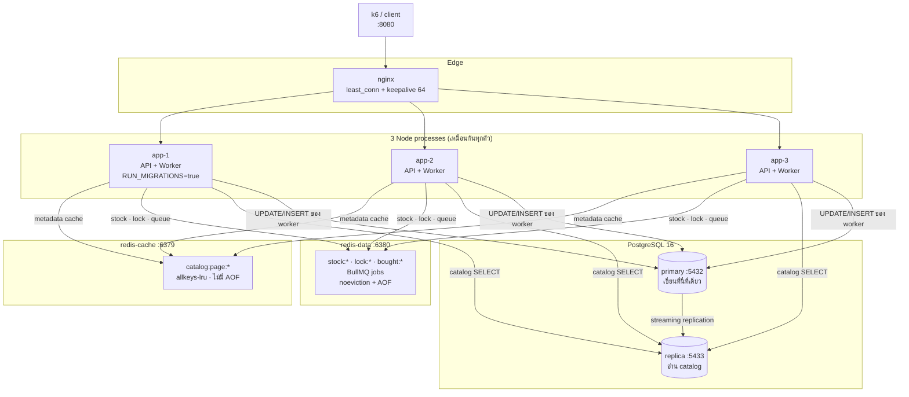
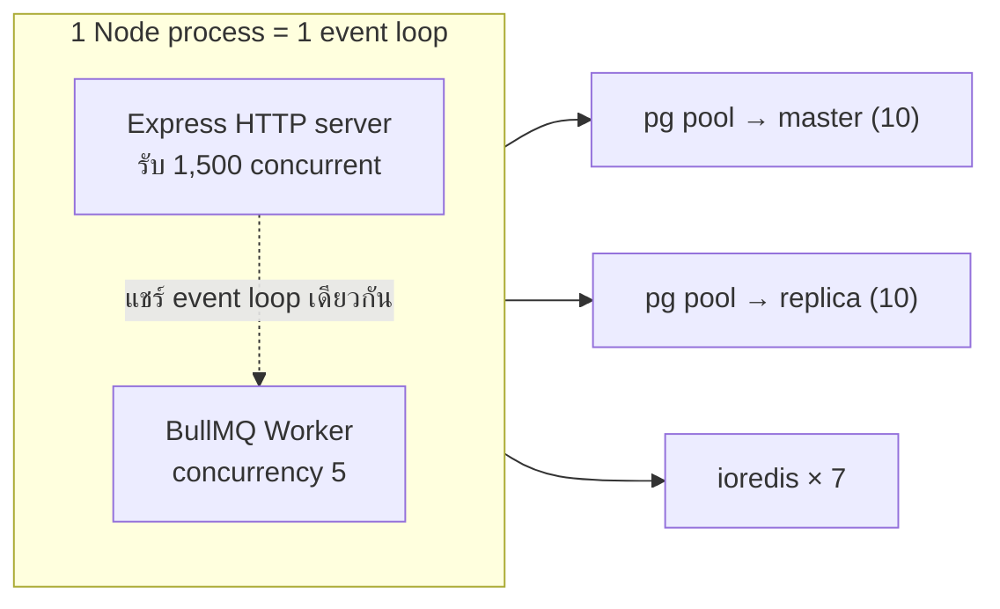
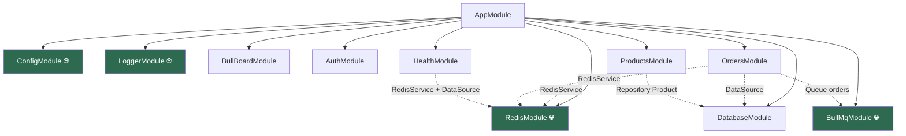
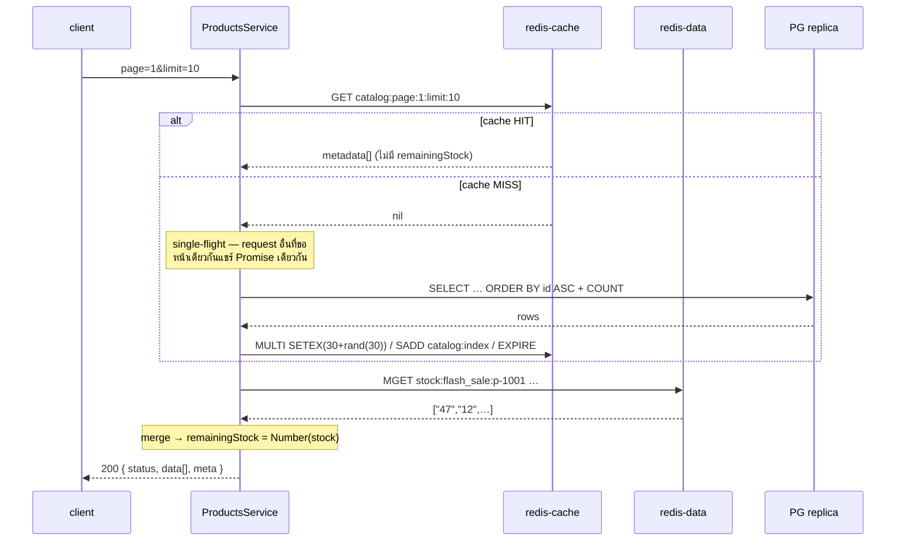
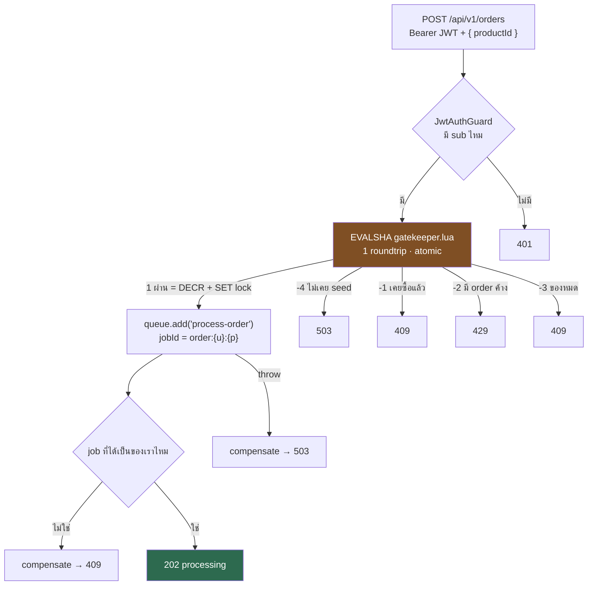
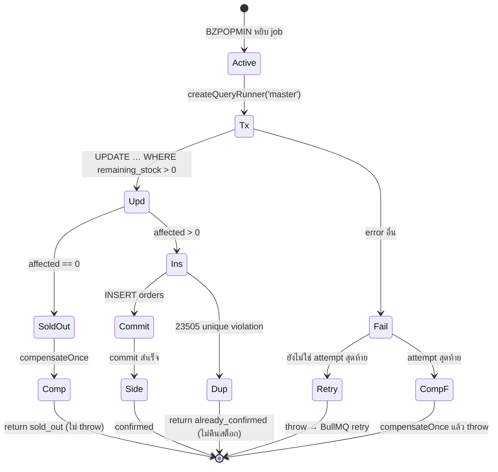
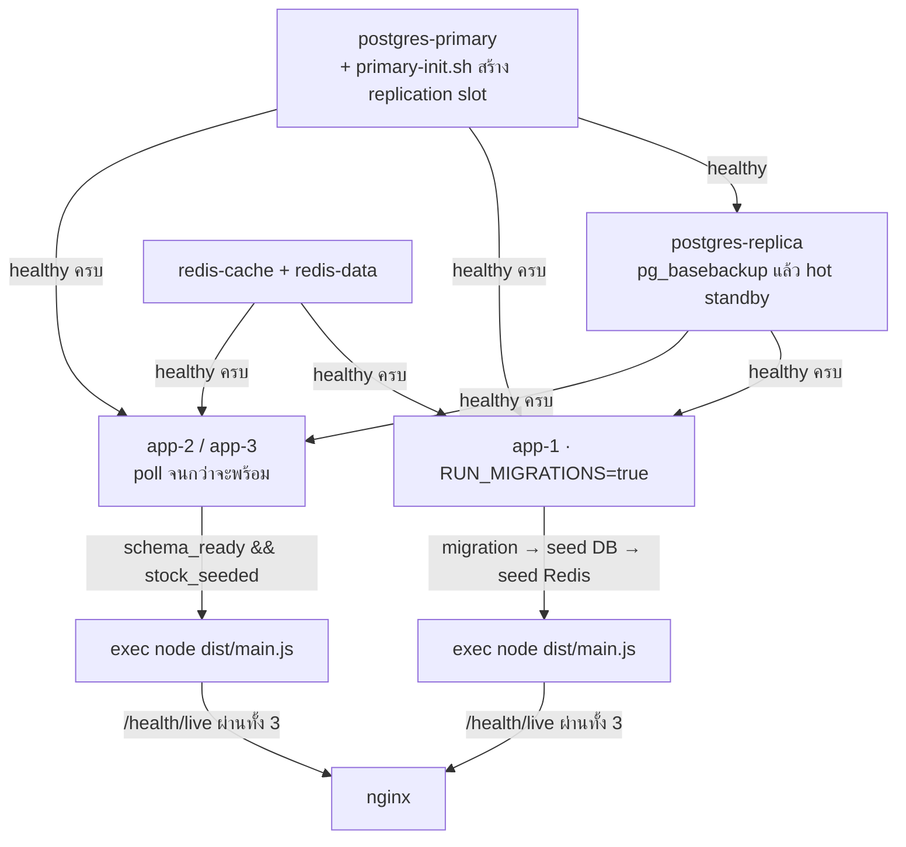

# 🧭 Codebase Primer — เดินโค้ด `flash-sale-backend` จากศูนย์

> **เอกสารนี้ตอบคำถามเดียว**: โค้ดไฟล์ไหนเรียกไฟล์ไหน และ request หนึ่งใบเดินทางผ่านอะไรบ้าง
> ไม่ใช่สเปก (สเปกคือ [`architecture.md`](../../Architecture/architecture.md)) และไม่ใช่การปูพื้นแนวคิด
> (แนวคิดอยู่ที่ [`architecture-primer.md`](../../Architecture/architecture-primer.md) — เขียนตอนยังไม่มีโค้ด)
>
> ทุก `file:line` ในเอกสารนี้อ้างจากโค้ดจริง ณ 2026-08-26

---

## 0. 🚪 30 วินาทีแรก — 5 อย่างที่ต้องรู้ก่อน

1. **มี process จริงแค่ 3 ตัว** (app-1/2/3) — API กับ BullMQ worker **อยู่ใน process เดียวกัน** ไม่ได้แยก
2. **มี Redis 2 ตัวคนละหน้าที่** — `redis-cache` เป็นแคชล้วน (หายได้), `redis-data` เก็บสต็อกกับคิว (หายไม่ได้)
3. **สต็อกมี 2 ที่**: counter ใน Redis (เร็ว ใช้กันคนเข้าคิว) และคอลัมน์ใน PostgreSQL (ช้า เป็นความจริง)
4. **`POST /orders` ไม่แตะ DB เลย** — มันคุยกับ Redis 3 ครั้งแล้วตอบ 202 ส่วน DB เป็นงานของ worker ทีหลัง
5. **`remainingStock` ไม่เคยถูกแคช** — อ่านสดจาก Redis ทุก request แล้วเอาไป merge กับ metadata ที่แคชไว้

---

## 1. 🗺️ กล่องทั้งหมดในระบบ



**กฎที่อ่านจากรูปนี้ได้เลย**: ลูกศรไป `primary` มีเส้นเดียว และมันมาจาก worker เท่านั้น
ถ้าวันหนึ่งมีโค้ดใหม่เขียน DB จากที่อื่น แปลว่าผิด

---

## 2. ⚙️ process จริงมีกี่ตัว — จุดที่คนเข้าใจผิดบ่อยที่สุด

**API และ worker คือ process เดียวกัน** ไม่ได้แยกคนละ container

- `OrdersProcessor` เป็น provider ธรรมดาของ `OrdersModule` (`src/orders/orders.module.ts:17`)
- `@nestjs/bullmq` สร้าง `Worker` ขึ้นมาตอน Nest bootstrap ใน process เดิม
- container รันคำสั่งเดียว: `node dist/main.js` (`Dockerfile:61`)



**ผลที่ตามมาจริง**:
- worker ที่ทำงานหนักจะทำให้ HTTP ช้าลง และกลับกัน
- BullMQ ต่ออายุ lock ของ job ด้วย `setTimeout` ทุก 15 วินาที **บน event loop เดียวกันนี้** — ถ้า event loop ตัน job จะ "stall"
- `WORKER_CONCURRENCY` ถูกอ่านตอน **decorate class** (`src/orders/orders.processor.ts:38`) ซึ่งเกิดก่อน `ConfigService` โหลด `.env` → แก้ใน `.env` ไม่มีผล เห็นเฉพาะ env จริงของ container

---

## 3. 📁 แผนที่ไฟล์ (48 ไฟล์ใน `src/`)

| โฟลเดอร์ | ไฟล์ | หน้าที่ |
| :--- | :--- | :--- |
| **root** | `main.ts` | ตั้ง ValidationPipe, pino, filter, mount Bull-Board, `listen()` |
| | `app.module.ts` | ประกอบ 9 module เข้าด้วยกัน |
| **auth/** | `auth.controller.ts` | `POST /api/v1/auth/token` |
| | `auth.service.ts` | `jwtService.sign({sub: userId})` — ไม่แตะ DB/Redis |
| | `jwt.strategy.ts` | verify token, `validate()` คืน `{userId}` แบบ **zero I/O** |
| | `jwt-auth.guard.ts` | `AuthGuard('jwt')` |
| **products/** | `products.controller.ts` | `GET /api/v1/products` |
| | `products.service.ts` | **หัวใจ read path** — cache-aside + single-flight + stock overlay |
| | `entities/product.entity.ts` | NUMERIC → number transformer |
| **orders/** | `orders.controller.ts` | `POST /api/v1/orders` → 202 |
| | `orders.service.ts` | **Tier 1+2** — Lua gatekeeper แล้ว enqueue |
| | `orders.processor.ts` | **Tier 3** — worker เขียน DB |
| | `errors/sold-out.error.ts` | ตัวบอกว่า "ล้มเหลวถาวร ห้าม retry" |
| **redis/** | `redis.module.ts` | สร้าง client 2 ตัว (cache / data) |
| | `redis.service.ts` | ทุกคำสั่ง Redis ผ่านที่นี่ |
| | `redis.keys.ts` | **สร้าง key ทุกตัวที่นี่ที่เดียว** ห้ามต่อ string เอง |
| | `lua/*.lua` | 4 สคริปต์ atomic |
| **config/** | `database.config.ts` | replication master/slaves + poolSize |
| | `env.validation.ts` | ตรวจ env ตอน boot, พังทันทีถ้าผิด |
| **database/** | `data-source.ts` | DataSource สำหรับ CLI migration (**master อย่างเดียว**) |
| | `migrate-and-seed.ts` | สคริปต์ที่ container เรียกตอน boot |
| | `migrations/…-InitSchema.ts` | DDL ทั้งหมด |
| **seed/** | `seed.ts` | JSON → DB |
| | `seed-redis.ts` | DB → Redis counter (`SET … NX`) |
| **health/** | `health.controller.ts` | `/health/live` (ไม่แตะอะไร), `/health/ready` (เช็ค 4 อย่าง) |
| **common/**, **logger/** | middleware, interceptor, filter, pino | correlation ID + JSON log |
| **bullmq_config/**, **bull_board/** | | ตั้ง queue `orders` + dashboard |

---

## 4. 🔗 Module graph



🌐 = `@Global()` — module อื่นใช้ได้โดยไม่ต้อง `imports` (เส้นประคือ dependency ที่ไม่มี import จริง)

> ⚠️ **`registerQueue('orders')` ถูกเรียก 3 ที่** (`bullmq.module.ts:41`, `bull-board.module.ts:9`, `orders.module.ts:14`)
> Nest 11 แยก dynamic module ด้วย object identity → **ไม่ dedupe** → ได้ `Queue` object 3 ตัว
> = **6 connection ไป redis-data ต่อ container** (18 ทั้งคลัสเตอร์) แทนที่จะเป็น 4

---

## 5. 🎫 เส้นทางที่ 1 — `POST /api/v1/auth/token` (ง่ายที่สุด)

```
nginx → pino genReqId → CorrelationIdMiddleware → ValidationPipe
      → AuthController.createToken  (auth.controller.ts:16)
      → AuthService.issueToken      (auth.service.ts:17)
      → jwtService.sign({sub})      HS256
      → 200 { status:'success', accessToken }
```

**network call: ศูนย์** ไม่มี DB ไม่มี Redis — โจทย์ระบุว่า endpoint นี้ไม่ถูกวัด performance
`userId` อะไรก็ได้ ไม่มีตาราง `users` ในระบบ (ตั้งใจ — ดู `architecture.md` §3.1.4)

---

## 6. 📖 เส้นทางที่ 2 — `GET /api/v1/products` (read path)



### 3 อย่างที่ต้องเข้าใจตรงนี้

**① แคชเก็บ metadata อย่างเดียว ไม่เก็บ `remainingStock`**
`ProductMetadata` (`products.service.ts:19-26`) มี `productId, name, price, availableStock, isFlashSaleActive, fallbackRemainingStock`
ตัวที่ตอบกลับไปคือ `MGET` สดทุกครั้ง — **นี่คือคำตอบของ "เงื่อนไขสำคัญ" ในโจทย์**
แคชจึงอยู่ได้เป็นนาทีโดยไม่ต้องล้างทุกครั้งที่มีคนซื้อ

**② เรียก Redis 2 ครั้งแบบ serial ไม่ใช่ parallel**
เพราะรายชื่อ `productIds` ที่จะเอาไป `MGET` มาจากผลของ `GET` รอบแรก (`products.service.ts:79-80`)
ต้นทุนจริงประมาณ 0.4–1 ms — ไม่ใช่จุดที่ควรไปปรับ

**③ cache กับ stock ปฏิบัติต่อ error คนละแบบ**

| ล้มเหลว | เกิดอะไร | ที่ |
| :--- | :--- | :--- |
| `redis-cache` ล่ม | กลืน error → ถือว่า miss → ไปอ่าน DB | `redis.service.ts:215-220` |
| `redis-data` ล่ม | **โยน 503** ไม่ยอมตอบเลข | `products.service.ts:114-123` |

ข้อ 2 เป็นประเด็นที่ reviewer เถียงกัน — ดู [Q&A ข้อ 3](02-design-review-qa.md#3-read-path-ควร-503-หรือ-ตอบเลขเก่า)

---

## 7. 🛒 เส้นทางที่ 3 — `POST /api/v1/orders` (write path, 6 ทางออก)



### `gatekeeper.lua` — ทำไมต้องเป็น Lua

Redis เป็น single-thread **ระหว่างรัน Lua** ทั้งสคริปต์จึงเป็นก้อนเดียวที่แทรกไม่ได้

```lua
local raw = redis.call('GET', KEYS[2])
if raw == false then return -4 end            -- ยังไม่ seed ≠ ของหมด
if redis.call('EXISTS', KEYS[3]) == 1 then return -1 end   -- bought
if redis.call('EXISTS', KEYS[1]) == 1 then return -2 end   -- lock
if tonumber(raw) <= 0 then return -3 end                   -- sold out
redis.call('DECR', KEYS[2])
redis.call('SET', KEYS[1], ARGV[2], 'PX', ARGV[1])
return 1
```

ถ้าแยกเป็น 4 คำสั่ง ioredis: request สองใบจะสลับกันระหว่างเช็คกับ `DECR` → TOCTOU

**บรรทัด `if raw == false then return -4`** สำคัญกว่าที่เห็น — ถ้าเขียน `tonumber(GET(k) or '0')` แบบที่เห็นทั่วไป
"ไม่มี key" จะกลายเป็น "สต็อก 0" → Redis restart เมื่อไหร่ ระบบตอบ "ของหมด" ตลอดกาลโดยไม่มีใครรู้

### ✅ จุดที่เคยเป็นบั๊ก และแก้ไปแล้ว (2026-08-26)

เดิมตรวจว่า job เป็นของเราไหมโดยเทียบ `job.data.requestToken` จากสิ่งที่ `queue.add()` คืนมา
**ซึ่งใช้ไม่ได้** — BullMQ ไม่เคยอ่าน `data` กลับจาก Redis `Job.create()` เขียนกลับแค่ `job.id`
(`node_modules/bullmq/dist/cjs/classes/job.js:124-135`) → เงื่อนไขนั้นเป็น false เสมอ = เช็คตาย

ตอนนี้ `orders.service.ts` **อ่าน job กลับจาก Redis** ด้วย `queue.getJob(jobId)`
(`Job.fromId` → `HGETALL`) แล้วเทียบ token ที่ *เก็บอยู่จริง* — round trip เท่าเดิมกับ `getState()` ที่ถอดออก
และถ้าอ่านกลับไม่ได้ **จะไม่คืนสต็อก** (คืนผิดตอนของขายไปแล้วแย่กว่าไม่คืน)

ที่มาและการถกเถียงอยู่ใน [Q&A ข้อ 1](02-design-review-qa.md#1-blocker-b-ที่คิดว่าปิดแล้ว-ยังเปิดอยู่)

---

## 8. ⚙️ เส้นทางที่ 4 — Worker (`orders.processor.ts`)



### 4 จุดที่ต่างจากโค้ดที่เขียนกันทั่วไป

**① `createQueryRunner('master')`** (`:56`)
`defaultMode: 'slave'` (`config/database.config.ts:47`) แปลว่า repository ธรรมดา**วิ่งไป replica**
ซึ่งมี lag → worker อ่านสต็อกเก่า → race ทันที บรรทัดนี้คือสิ่งเดียวที่กันไว้

**② `UPDATE … WHERE remaining_stock > 0` แล้วเช็ค `affected === 0`** (`:63-71`)
ไม่มี `SELECT` ก่อน จึงไม่มี TOCTOU
PostgreSQL READ COMMITTED จะ **ประเมิน `WHERE` ใหม่** หลังรอ row lock (EvalPlanQual)
คนที่ 51 จึงเห็น `remaining_stock = 0` และได้ `affected = 0`
**นี่คือบรรทัดเดียวที่ทำให้ oversell เป็นไปไม่ได้** โดยมี `CHECK (remaining_stock >= 0)` เป็นพื้นรองอีกชั้น

**③ side effect หลัง commit อยู่นอก try/catch ของ transaction** (`:125-135`)
ถ้าอยู่ข้างใน: Redis สะดุดหลัง DB commit → โค้ดจะไป "คืนสต็อก" ทั้งที่ขายไปแล้ว → **oversell**
และ 3 บรรทัดในนั้นเรียงลำดับสำคัญ (`markBought` → `releaseInFlightLock` → `invalidateCatalogCache`)
แต่ **ไม่มีคอมเมนต์บอกไว้** — สลับ 2 ตัวแรกแล้วจะมีช่องให้ retry เข้ามาเจอ "ไม่มี lock ไม่มี bought แต่ stock > 0"

**④ ล้มเหลวถาวร `return` ไม่ `throw`** (`:92`, `:108`)
`SoldOutError` และ `23505` retry ไปก็ไม่มีทางสำเร็จ มีแต่เปลือง attempt

### ตารางสรุปว่าใครคืนสต็อกบ้าง

| กรณี | DB | Redis | คืนสต็อก? |
| :--- | :--- | :--- | :--- |
| สำเร็จ | −1 | −1 (จาก gatekeeper) | ไม่ ✅ ตรงกัน |
| ของหมด (`affected=0`) | rollback | −1 | **ไม่คืน** → ปล่อยให้ Redis ลู่ลงเข้าหา DB (ดูหมายเหตุ) |
| `23505` | rollback | −1 | **ไม่คืน** → Redis ต่ำกว่า DB ถาวร ⚠️ |
| ล้ม attempt 1–2 | rollback | −1 | ไม่คืน (จะ retry) ✅ |
| ล้ม attempt 3 | rollback | −1 | **คืน** → ตรงกัน |

> **ทำไม sold-out ถึงไม่คืน**: `affected = 0` แปลว่า Redis บอก "ผ่าน" แต่ DB บอก "หมด"
> = Redis สูงกว่า DB อยู่ก่อนแล้ว ถ้าคืนจะดันขึ้นอีก → ปล่อยคนถัดไป → ตาย sold-out อีก → คืนอีก **วนไม่จบ**
> counter จะลู่เข้าหา 1 ไม่มีวันถึง 0 (ตกเกณฑ์ §9.3 ข้อ 4) การไม่คืนทำให้มันลู่ลงหา DB แล้วหยุดเอง

---

## 9. 🔀 ใครคุยกับ datastore ไหน

### `redis-cache` (:6379, `allkeys-lru`, ไม่มี AOF)
| คำสั่ง | ใครเรียก |
| :--- | :--- |
| `GET catalog:page:{p}:limit:{l}` | `redis.service.ts:213` |
| `MULTI SETEX + SADD + EXPIRE` | `redis.service.ts:236-242` |
| `SMEMBERS catalog:index` → `DEL` | `redis.service.ts:257-261` (worker เรียกหลังขายสำเร็จ) |

### `redis-data` (:6380, `noeviction` + AOF)
| คำสั่ง | ใครเรียก |
| :--- | :--- |
| `EVALSHA gatekeeper.lua` | `orders.service.ts` ทุก POST |
| `MGET stock:flash_sale:*` | `products.service.ts` **ทุก GET** ← 99% ของโหลด |
| `EVALSHA compensate*.lua` | service (enqueue ล้ม) / worker (ล้มถาวร) |
| `SET bought:{p}:{u}` (ไม่มี TTL) | worker หลัง commit |
| BullMQ ทั้งหมด | `add`, `BZPOPMIN`, move-to-*, Bull-Board |

### PostgreSQL
| ไป primary | ไป replica |
| :--- | :--- |
| transaction ของ worker (`createQueryRunner('master')`) | catalog `getManyAndCount()` (2 queries) |
| migration + seed (`data-source.ts` ไม่มี replication เลย) | `/health/ready` ฝั่ง slave |
| `/health/ready` ฝั่ง master | |

---

## 10. 🔌 Connection topology

**ต่อ 1 container:**

| อะไร | จำนวน | ไปไหน |
| :--- | :--- | :--- |
| pg pool (master) | 10 | primary |
| pg pool (slave) | 10 | replica |
| ioredis `REDIS_CACHE_CLIENT` | 1 | redis-cache |
| ioredis `REDIS_DATA_CLIENT` | 1 | redis-data |
| BullMQ `Queue` × 3 | 3 | redis-data |
| BullMQ `Worker` (main + blocking) | 2 | redis-data |

**ทั้งคลัสเตอร์**: `3 × 10 = 30` ไป primary · `3 × 10 = 30` ไป replica · `3 × 6 = 18` ไป redis-data · `3` ไป redis-cache

> ⚠️ สูตรใน `architecture.md` §8 (`instances × (1+replicas) × poolSize ≤ 80% ของ max_connections`)
> **มิติผิด** — มันบวก connection ที่ไปคนละ server แล้วเทียบกับ limit ของ server เดียว
> ค่าที่ถูกคือ 30 บน primary และ 30 บน replica **แยกกัน** (ดู [Q&A ข้อ 6](02-design-review-qa.md#6-worker-กับ-api-แย่ง-connection-pool-กันจริงไหม))

---

## 11. 🚀 ลำดับตอน `podman compose up -d`



**app-1** รัน `dist/database/migrate-and-seed.js` แบบ synchronous ก่อน start server
**app-2/3** วน poll ทุก 2 วิ (สูงสุด 240 วิ) เช็ค 2 อย่าง: ตาราง `products` มีแถว **และ** มี key `stock:flash_sale:*`
(ใช้ `SCAN` ไม่ใช่ `KEYS`) — ข้อสองสำคัญเพราะ seed DB เสร็จก่อน seed Redis ถ้าไม่รอจะมีช่วงที่ตอบ 503

> ⚠️ **ไม่มีทาง reset** — `seed.ts` ใช้ `ON CONFLICT DO UPDATE` ที่ไม่แตะ `remaining_stock`,
> `seed-redis.ts` ใช้ `SET … NX`, `bought:` ไม่มี TTL → **ยิง k6 รอบสองได้ 409 ทั้งหมด**
> ทางเดียวคือ `podman compose down -v` ซึ่งลบ volume ของ Postgres ไปด้วย → replica ต้อง basebackup ใหม่

---

## 12. 📊 ค่าคงที่ที่ต้องรู้

| ค่า | เท่าไหร่ | ที่ | พังยังไงถ้าผิด |
| :--- | :--- | :--- | :--- |
| `jobId` | `order:{userId}:{productId}` | `orders.service.ts:41` | ไม่ deterministic → คนเดียวสั่งได้หลายใบ |
| queue | `orders` | `bullmq.module.ts:5` + `orders.service.ts:36` (ซ้ำ 2 ที่) | คนละชื่อ → job ไม่มีใครกิน |
| catalog TTL | `30 + rand(0..30)` วิ | `redis.service.ts:231` | ไม่มี jitter → key หมดอายุพร้อมกัน |
| lock TTL | 30,000 ms | `env.validation.ts:123` | สั้นไป → ยิงซ้ำได้ก่อน job จบ |
| `compensated:` TTL | 300 วิ | `redis.service.ts` | ต้องครอบ retry chain ของ job เดียว (~2 วิ) เท่านั้น |
| debounce ล้างแคช | 1,000 ms | `redis.service.ts` | ต่ำไป = ล้างแคช 50 ครั้งรวดตอน burst |
| `commandTimeout` | 1,000 ms | `redis.module.ts` | **ไม่มี = คำสั่งค้าง `catch` ไม่ทำงาน → 504** |
| worker concurrency | 5 | `orders.processor.ts:38` | อ่านตอน decorate → `.env` ไม่มีผล |
| pool size | 10 ต่อ pool | `database.config.ts:51` | เกิน ~16 จะชน `max_connections=100` |
| BullMQ attempts | 3, backoff exp 200 ms | `orders.service.ts:119` | เป็นตัวกำหนดว่า `isFinalAttempt` เมื่อไหร่ |
| `removeOnComplete` | `{count: 5000}` | `orders.service.ts:121` | ต่ำไป → job เก่าหาย → dedup พัง |
| nginx read timeout | 5 s | `nginx.conf:81` | p99 เกิน 5 วิ กลายเป็น 504 |

### Lua return code → HTTP

| code | ความหมาย | HTTP |
| :--- | :--- | :--- |
| `1` | ผ่าน (DECR + SET lock แล้ว) | **202** |
| `-1` | เคยซื้อแล้ว | 409 |
| `-2` | มี order ค้างอยู่ (กดรัว) | **429** |
| `-3` | ของหมด | 409 |
| `-4` | ยังไม่เคย seed counter | **503** |

`-3` กับ `-4` ต้องแยกกันให้ชัด: อันหนึ่งคือ "ขายหมดแล้ว" อีกอันคือ "ระบบพัง"

---

## 13. ❓ คำถามที่คนอ่านโค้ดนี้มักงง

**Q: ทำไม `POST /orders` ตอบ 202 ไม่ใช่ 201?**
เพราะ order ยังไม่เกิดขึ้นจริงตอนตอบ — มันแค่เข้าคิว 201 แปลว่า "สร้างแล้ว" ซึ่งจะโกหก
โจทย์บังคับ 202 และ k6 กลุ่มอื่น assert ค่านี้

**Q: `availableStock` กับ `remainingStock` ต่างกันยังไง?**
`availableStock` = สต็อกตั้งต้นจาก seed **ไม่เคยเปลี่ยน** · `remainingStock` = คงเหลือจริง นับถอยหลัง
ตัวแรกมาจากแคช ตัวหลังมาจาก Redis สดๆ

**Q: ถ้า Redis counter กับ DB ไม่ตรงกันจะรู้ได้ยังไง?**
`redis-cli -p 6380 GET stock:flash_sale:p-1001` เทียบกับ `SELECT remaining_stock`
ถ้าไม่เท่ากัน = compensation มีรูรั่ว **ไม่มีอะไรใน runtime จับให้อัตโนมัติ**

**Q: ทำไมไม่มีตาราง `users`?**
`/auth/token` ออก token ให้ `userId` อะไรก็ได้โดยไม่แตะ DB ถ้ามี FK บน `orders.user_id`
จะ INSERT ไม่ผ่านสักใบ (ตั้งใจ — `architecture.md` §3.1.4)

**Q: 429 คือ error หรือเปล่า?**
ไม่ใช่ มันคือหลักฐานว่า in-flight lock ทำงาน โจทย์บอกให้จำลองการกดรัว ห้ามนับเป็น error ใน k6 threshold

**Q: ยิง k6 รอบสองเลยได้ไหม?**
**ไม่ได้** ต้อง `RESET_CONFIRM=yes pnpm run reset` ก่อน — `seed` ใช้ `ON CONFLICT` ที่ไม่แตะ `remaining_stock`,
`seed:redis` ใช้ `SET … NX`, `bought:` ไม่มี TTL → re-seed ซ้ำกี่รอบก็ไม่เปลี่ยนอะไร ได้ 409 ล้วน

**Q: worker ตายกลางทางจะเป็นยังไง?**
BullMQ จะเห็นว่า job "stalled" หลัง 30 วิ แล้วโยนกลับเข้าคิว **แต่ถ้า stall ครั้งที่ 2 มันจะ fail ทันที
โดยไม่เรียก handler เลย** → `compensateOnce` ไม่ถูกเรียก → สต็อกหาย 1 ชิ้น

**Q: อยากดูว่าคิวเป็นยังไงตอน run?**
`http://localhost:8080/admin/queues` (Basic Auth) — แต่**อย่ากดปุ่ม Retry** ระหว่างเก็บผล
มันจะปลุก job ที่คืนสต็อกไปแล้วให้กลับมาสำเร็จ ทำให้ Redis สูงกว่า DB

---

## 14. 📎 อ่านต่อ

| ไฟล์ | เมื่อไหร่ |
| :--- | :--- |
| [`02-design-review-qa.md`](02-design-review-qa.md) | reviewer 3 คนถกอะไรกัน ดีไซน์ตรงไหนยังมีจุดอ่อน |
| [`architecture.md`](../../Architecture/architecture.md) | สเปก (ถ้าโค้ดขัดกับเอกสาร เอกสารถูก) |
| [`architecture-primer.md`](../../Architecture/architecture-primer.md) | ปูพื้นแนวคิด (ไม่ใช่โค้ด) |
| [`CLAUDE.md`](../../../CLAUDE.md) | §4 invariant 11 ข้อ · §0.1 สิ่งที่ยังไม่ได้ทำ |
