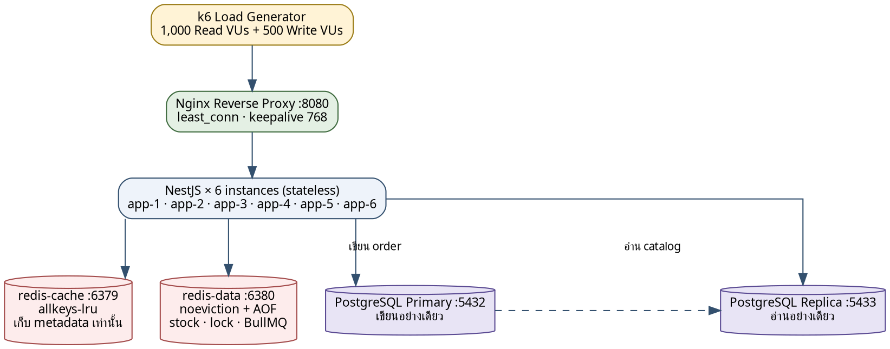
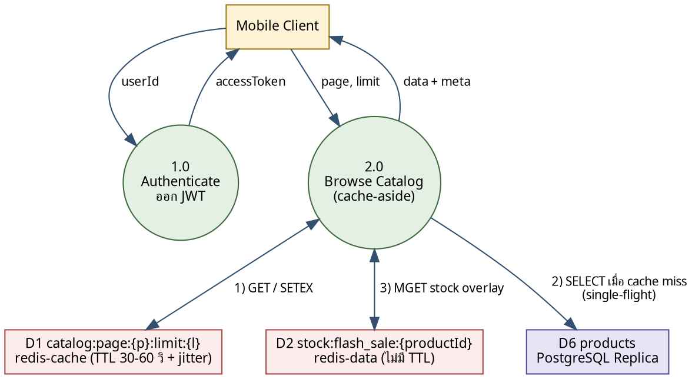
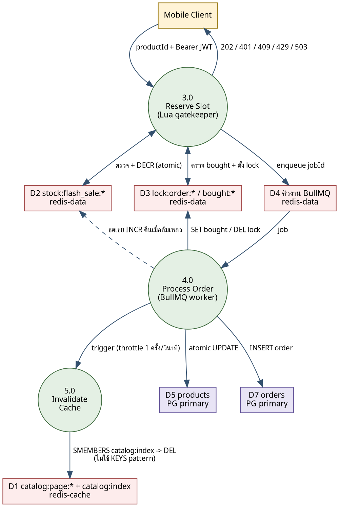
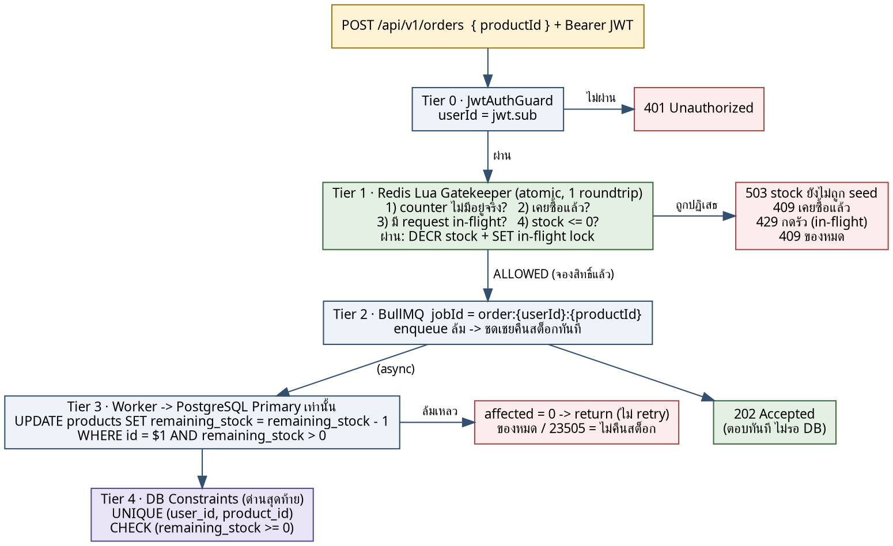

<!--
ไฟล์นี้คือ source ของรายงาน — แก้ที่นี่ที่เดียว แล้วค่อย gen เป็น DOCX/PDF
diagram เก็บเป็นซอร์ส Graphviz ในบล็อก ```dot
render: dot -Tpng -Gdpi=170 fig/arch.dot -o fig/arch.png
ช่องที่ต้องเติมเอง ค้นคำว่า TODO (มี 4 จุด)
-->

<div align="center">

# รายงานโครงงานย่อย (Mini Project)

## ระบบ Flash Sale ที่รองรับผู้ใช้จำนวนมากพร้อมกัน<br>โดยไม่เกิดการขายเกินจำนวนสินค้า

**Flash Sale System: High-Concurrency Backend Architecture and Performance Testing**

รายวิชา Mobile Backend Architecture & Performance Testing

Repository: https://github.com/tophbeifong123/mini-project-backend-mobile

<br>

**จัดทำโดย**

<!-- TODO (1/4): ใส่ชื่อสมาชิกตรงนี้ รายละเอียดหน้าที่อยู่ในหัวข้อ 5 -->

____________________________________

**เสนอ**

____________________________________
อาจารย์ผู้สอนประจำรายวิชา

<br>

คณะวิศวกรรมศาสตร์ มหาวิทยาลัยสงขลานครินทร์

30 สิงหาคม 2569

</div>

<div style="page-break-after: always;"></div>

---

## 1. Diagram สถาปัตยกรรมของระบบ

ระบบต้องรับภาระที่ขัดแย้งกันสองอย่างพร้อมกัน คือผู้ใช้ 1,000 คนเปิดดูสินค้าพร้อมกันและต้องเห็นสต็อกที่สดเสมอ (อ่านหนัก) ขณะที่ผู้ใช้ 500 คนแย่งซื้อสินค้า 50 ชิ้นโดยห้ามขายเกินและห้ามใครได้เกิน 1 ชิ้น (เขียนหนัก) สถาปัตยกรรมจึงแยกภาระทั้งสองออกจากกันในทุกชั้น

### 1.1 ภาพรวมของระบบ



**ภาพที่ 1** สถาปัตยกรรมภาพรวมของระบบ Flash Sale

| องค์ประกอบ | เหตุผลที่ต้องมี |
|---|---|
| Nginx (least_conn, keepalive 768) | กระจายโหลดไปตัวที่มี connection ค้างน้อยที่สุด · keepalive กันการสร้าง TCP handshake ใหม่ทุกคำขอ |
| NestJS × 6 instances | stateless ทั้งหมด ไม่มี session/counter ใน RAM จึงขยายจำนวนได้อิสระโดยคำตอบไม่เพี้ยน |
| redis-cache (allkeys-lru) | เก็บ metadata ที่แทบไม่เปลี่ยน หายได้ไม่เสียหาย เพราะ fallback ไป DB ได้ |
| redis-data (noeviction + AOF) | เก็บ stock counter, lock, คิวงาน ซึ่งหายไม่ได้เด็ดขาด จึงต้องแยกอินสแตนซ์ออกจากตัวแคช |
| PostgreSQL Primary / Replica | Replica รับ read ทั้งหมด · การเขียนและตัดสต็อกใช้ Primary เท่านั้น เพราะ replica มี lag ซึ่งทำให้เกิด race condition |

> **ทำไมต้องมี Redis สองตัว** — ถ้าใช้ตัวเดียวที่ตั้ง `allkeys-lru` เมื่อ memory เต็ม Redis จะ evict key ทิ้ง ถ้าตัวที่โดน evict คือ `stock:flash_sale:*` หรือ job ใน BullMQ ระบบจะพังแบบเงียบโดยไม่มี error เลย จึงแยก `redis-data` ตั้ง `noeviction` — เต็มเมื่อไหร่ให้ปฏิเสธการเขียนไปเลย ดีกว่าลบข้อมูลสำคัญทิ้ง

### 1.2 Data Flow — เส้นทางการอ่าน



**ภาพที่ 2** Data Flow Diagram — เส้นทางการอ่าน (Read Path)

### 1.3 Data Flow — เส้นทางการเขียน



**ภาพที่ 3** Data Flow Diagram — เส้นทางการเขียน (Write Path)

Process 3.0 และ 4.0 คือสองจุดเดียวในระบบที่แตะสต็อก การพิสูจน์ความถูกต้องทั้งหมดจึงโฟกัสที่สองจุดนี้

**เทคโนโลยีที่ใช้** — Node.js 22 · NestJS 11 · Nginx alpine · PostgreSQL 16 (Primary + Streaming Replica) · Redis 7 × 2 · BullMQ · JWT (HS256, stateless) · Jest 30 (43 unit tests ผ่านทั้งหมด) · k6 · Docker/Podman Compose · ชั้น Observability ในตัว (Bull-Board + `/admin/insights` + `/admin/metrics`)

<div style="page-break-after: always;"></div>

---

## 2. กลยุทธ์ Cache Invalidation และการป้องกันการสั่งซื้อซ้ำซ้อน

### 2.1 ปัญหา — remainingStock เปลี่ยนเร็วมากแต่ถูกอ่านหนักมาก

`remainingStock` ลดจาก 50 เหลือ 0 ภายในไม่กี่ร้อยมิลลิวินาที แต่ถูกอ่านโดยคน 1,000 คนพร้อมกัน ทางเลือกที่ผิดมี 3 แบบ

- เก็บใน DB แล้วอ่านสดทุกครั้ง → DB รับภาระอ่านไม่ไหว
- แคชทั้ง object รวม `remainingStock` → ทุกครั้งที่มีคนซื้อต้องล้างแคช = แคชพังตลอดช่วง flash sale ซึ่งเป็นช่วงที่ต้องการแคชมากที่สุดพอดี
- เก็บใน memory ของแอป → 6 instance ตอบตัวเลขไม่ตรงกัน

### 2.2 วิธีแก้ — แยกข้อมูลตามอัตราการเปลี่ยนแปลง (Cache-Aside + Stock Overlay)

| ชนิดข้อมูล | ตัวอย่างฟิลด์ | เก็บที่ | อายุ |
|---|---|---|---|
| Metadata (แทบไม่เปลี่ยน) | productId, name, price, availableStock, isFlashSaleActive | redis-cache → `catalog:page:{p}:limit:{l}` | TTL 30–60 วินาที + jitter |
| Stock (เปลี่ยนตลอด) | remainingStock | redis-data → `stock:flash_sale:{productId}` | ไม่มี TTL (noeviction) |

**ตารางที่ 1** การแยกข้อมูลตามอัตราการเปลี่ยนแปลง

```text
GET /api/v1/products?page=1&limit=10
  |
  +- 1) GET catalog:page:1:limit:10 --> HIT  --> ได้ metadata[] ทันที
  |                                 +-- MISS --> single-flight --> อ่าน Replica DB
  |                                              --> SETEX + jitter --> metadata[]
  |
  +- 2) MGET stock:flash_sale:p-1001, p-1002, ...   (1 roundtrip ได้ครบทุกตัว)
  |
  +- 3) merge: { ...metadata, remainingStock: Number(stockValue) }
```

metadata นอนอยู่ในแคชได้นานเป็นนาทีโดยไม่ต้องล้างเลยแม้จะมีคนซื้อไปแล้ว 50 คน ส่วน `remainingStock` ถูกอ่านสดจาก counter ทุกคำขอด้วยต้นทุนเพียง 1 คำสั่ง MGET ผลคือ **Cache Hit Ratio 97.63%** โดยตัวเลขสต็อกที่ผู้ใช้เห็นไม่เคยเก่าเลย

**ทำไม counter ถึงตรงกับ DB เสมอ** — Redis counter ไม่ใช่สำเนาของ DB แต่เป็นตัวจองสิทธิ์ล่วงหน้า ฝั่งเขียน DECR counter *ก่อน* ที่งานจะเข้าคิว ฝั่งอ่านก็อ่าน counter ตัวเดียวกัน ส่วน worker ตัดสต็อกจริงใน DB ทีหลัง เลข DB จึงตามหลัง Redis เสมอไม่มีทางแซง จึงไม่มีสถานการณ์ที่ผู้ใช้เห็นของเหลือแต่กดซื้อไม่ได้ มีแต่เห็นของหมดเร็วกว่าความจริงเล็กน้อย ซึ่งเป็นทิศทางที่ปลอดภัย

**เมื่ออ่าน counter ไม่ได้ ให้ degrade ไม่ใช่ล้ม** — ถ้า `MGET` ล้มเหลว ระบบจะไม่ตอบ 503 แต่ตกกลับไปใช้ `fallbackRemainingStock` ซึ่งเป็นค่า `remaining_stock` จาก DB ณ ตอนที่แคชถูกสร้าง พร้อมนับจำนวนและ log ระดับ error ไว้ทุกครั้ง เหตุผลคือ read path **ไม่ใช่พื้นผิวของความถูกต้อง** — ไม่มีใครได้ของจาก response ของ `GET` ตัวตัดสินว่าใครได้ของคือ `gatekeeper.lua` ฝั่งเขียนเท่านั้น เลขที่เก่าไปชั่วครู่จึงทำให้ขายเกินไม่ได้ ในทางกลับกันการโยน 503 จะทำให้ reader ทั้ง 1,000 คนอ่านอะไรไม่ได้เลย

### 2.3 กลยุทธ์ Cache Invalidation

**หลักการ — ของที่ไม่ต้องล้างคือของที่ดีที่สุด**

| ข้อมูล | ต้อง invalidate ตอนมีคนซื้อไหม | เพราะอะไร |
|---|---|---|
| Metadata (ชื่อ/ราคา) | ไม่ต้อง | คนซื้อไม่ได้ทำให้ชื่อหรือราคาสินค้าเปลี่ยน |
| remainingStock | ไม่ต้อง | ไม่ได้ถูกแคชตั้งแต่แรก — worker DECR counter ตัวเดียวกับที่ read path อ่าน จึงเห็นค่าใหม่ทันที |

**ตารางที่ 2** ข้อมูลที่ต้อง/ไม่ต้อง invalidate

**กรณีที่ยังต้อง invalidate จริง** — เฉพาะเมื่อข้อมูลสินค้าเปลี่ยนจริง เช่น แก้ชื่อ/ราคา หรือ `isFlashSaleActive` เปลี่ยน โดยใช้ลำดับ update DB ให้เสร็จก่อน แล้วค่อย DEL cache (ไม่ใช่ลบก่อน) และพึ่ง TTL เป็นตาข่ายนิรภัยเสมอเผื่อคำสั่งลบล้มเหลว

**ปัญหาที่เจอจริงและวิธีแก้ (Distributed Throttle)** — worker ยังคงสั่ง invalidate หลังตัดสต็อกเพื่อรองรับกรณีสินค้าเปลี่ยนสถานะ แต่ของ 50 ชิ้นหมดภายใน window ~300 ms = สั่งล้างแคชทั้งก้อน 50 ครั้งรวดในจังหวะที่ผู้อ่าน 1,000 คนกำลังยิงอยู่พอดี → Hit Ratio ตกทันที แก้ 2 รอบ

1. **26 ส.ค.** ใส่ trailing debounce ไม่เกิน 1 ครั้ง/วินาที (trailing = ถ้าคำขอล้างตกอยู่ใน window ที่เพิ่งล้างไป จะถูกจองเป็นรอบท้ายไว้แทนการทิ้ง)
2. **28 ส.ค.** พบว่า debounce รอบแรกอยู่ใน memory ของแต่ละ process แยกกัน ทั้ง 6 instance จึงยังล้างพร้อมกันได้สูงสุด 6 ครั้ง/วินาที จึงเปลี่ยนเป็น distributed throttle จองสิทธิ์ผ่าน Redis: `SET catalog:flush_throttle 1 PX 1000 NX` → ล้างข้ามทั้ง 6 instance ไม่เกิน 1 ครั้ง/วินาทีจริง

ผล: **Cache Hit Ratio 88.2% → 97.63%**

**สิ่งที่กลไกนี้รับประกันได้จริง (และสิ่งที่รับประกันไม่ได้)** — สิ่งที่รับประกันได้คือ *เพดานอัตราการล้าง* ไม่เกิน 1 ครั้ง/วินาทีทั้งคลัสเตอร์ ส่วนที่รับประกันไม่ได้คือ "ทุกคำสั่ง invalidate จะมีรอบล้างตามมาเสมอ" เพราะที่ `redis.service.ts:326-333` โค้ดตั้ง `lastCatalogFlushAt = now` **ก่อน** จะไปขอสิทธิ์จาก `tryAcquireFlushThrottle()` และเมื่อขอสิทธิ์ไม่ได้ (มี instance อื่นถือสิทธิ์รอบนั้นอยู่) เมธอดจะ `return` ออกไปเลยโดยไม่จองรอบ trailing ไว้ — คำสั่งล้างของ instance นั้นจึงหายไป ทั้งที่ตัวมันได้ประทับเวลาว่า "เพิ่งล้างไปแล้ว" เรียบร้อย รูปแบบเดียวกันเกิดซ้ำในรอบ trailing ที่ `:342-346`

ในทางปฏิบัติผลกระทบตอนนี้ยังจำกัดมาก เพราะ (1) ระบบไม่มีเส้นทางใดที่แก้ `name` / `price` / `isFlashSaleActive` ขณะรัน คำสั่งล้างที่วิ่งอยู่จริงทั้งหมดจึงเป็นการล้างเผื่อไว้หลังตัดสต็อก และ (2) `remainingStock` ไม่ได้ถูกแคชอยู่แล้ว แต่ถูก overlay สดจาก Redis ทุกคำขอ (หัวข้อ 2.2) การล้างที่หายไปจึงไม่ทำให้ผู้ใช้เห็นสต็อกเก่า อย่างไรก็ตามถ้าวันหนึ่งมี endpoint แก้ข้อมูลสินค้าเพิ่มเข้ามา จุดนี้ต้องถูกแก้ก่อน ไม่เช่นนั้นตาข่ายนิรภัยที่เหลืออยู่จะมีแค่ TTL 30–60 วินาทีเท่านั้น

**ล้างแคชโดยไม่ใช้ `KEYS` — Live-Key Index** — ทุกครั้งที่เขียน `catalog:page:{p}:limit:{l}` ระบบจะ `SADD` ชื่อ key นั้นลง SET กลาง `catalog:index` ไปด้วยใน `MULTI` เดียวกัน เวลาล้างจึงเป็น `SMEMBERS catalog:index` แล้ว `DEL` เฉพาะ key ที่ยังมีชีวิตจริง ไม่ต้องสแกนทั้ง keyspace ตัว `catalog:index` เองก็ตั้ง TTL ไว้ (`base + jitter + 60` วินาที) เพราะ key ที่ไม่มี TTL ใน redis-cache คือ memory leak

**การกัน Cache Stampede** — ใช้ 2 มาตรการ (1) *single-flight* ใน 1 process ถ้ามีคำขอหน้าเดียวกันเข้ามาพร้อมกันตอน cache miss จะแชร์ Promise เดียวกัน query DB ครั้งเดียว (2) *TTL jitter* `ttl = 30 + random(0..30)` วินาที เพื่อไม่ให้ key ที่เซ็ตพร้อมกันตอน warm-up หมดอายุพร้อมกัน

> **สิ่งที่จงใจไม่ทำ**
> - ไม่ใช้ L1 in-memory LRU cache ที่เก็บ `remainingStock` — ถ้าเก็บไว้ใน RAM ของแต่ละ instance แม้เพียง 1–2 วินาที ทั้ง 6 instance จะตอบสต็อกไม่ตรงกัน ซึ่งขัดเงื่อนไขของโจทย์โดยตรง
> - ห้ามใช้ `KEYS pattern` ล้างแคช — เป็นคำสั่ง O(N) ที่บล็อก Redis ทั้งตัว ใช้ SCAN หรือ key ที่คำนวณตรงได้แทน

### 2.4 การป้องกันการสั่งซื้อซ้ำซ้อนและการขายเกิน (4-Tier Defense)



**ภาพที่ 4** การป้องกัน 4 ชั้น (4-Tier Defense)

#### Tier 1 — Atomic Lua Gatekeeper (ชั้นที่ตัดสินจริง)

รวม 3 การตรวจ + 2 การเขียน ไว้ใน 1 roundtrip ที่ atomic เนื่องจาก Redis เป็น single-threaded ระหว่างรัน Lua script จึงไม่มีทางที่คำขอ 500 รายการจะแทรกสลับกันได้

```lua
-- gatekeeper.lua
-- KEYS[1] lock:order:{userId}:{productId}   in-flight mutex
-- KEYS[2] stock:flash_sale:{productId}      fast stock counter
-- KEYS[3] bought:{productId}:{userId}       committed flag
-- ARGV[1] lock_ttl_ms      ARGV[2] requestToken (random per request)

local raw = redis.call('GET', KEYS[2])
if raw == false then
    return -4            -- STOCK_NOT_INITIALIZED --> 503
end
if redis.call('EXISTS', KEYS[3]) == 1 then
    return -1            -- ALREADY_PURCHASED --> 409
end
if redis.call('EXISTS', KEYS[1]) == 1 then
    return -2            -- REQUEST_IN_FLIGHT --> 429
end
if tonumber(raw) <= 0 then
    return -3            -- SOLD_OUT --> 409
end
redis.call('DECR', KEYS[2])
redis.call('SET', KEYS[1], ARGV[2], 'PX', ARGV[1])
return 1                 -- ALLOWED
```

**สามชั้นของการกันซื้อซ้ำ ทำงานคนละช่วงเวลา**

| กลไก | กันอะไร | ช่วงเวลาที่คุ้มครอง |
|---|---|---|
| `bought:{productId}:{userId}` | คนที่ซื้อสำเร็จแล้วกดซ้ำ | ถาวร (ไม่มี TTL) |
| `lock:order:{userId}:{productId}` | คนกดรัวขณะคำสั่งเดิมยังประมวลผลไม่เสร็จ | 30 วินาที (TTL) |
| `UNIQUE (user_id, product_id)` | ทุกอย่างข้างบนพลาดหมด | ถาวร — ระดับฐานข้อมูล |

**ตารางที่ 3** กลไกกันสั่งซื้อซ้ำ 3 ชั้น

รายละเอียดที่พลาดง่าย 2 จุด

- **ทำไม `-4` (STOCK_NOT_INITIALIZED) ถึงสำคัญ** — โค้ดแบบ `tonumber(redis.call('GET', k) or '0')` จะแปลง "ไม่มี key" เป็น "สต็อกเหลือ 0" ถ้า Redis restart หรือ key ถูก evict ระบบจะตอบของหมดตลอดกาลโดยไม่มีใครรู้ว่าผิดปกติ การแยกโค้ดแล้วตอบ 503 แทน 409 ทำให้ปัญหาโผล่บน dashboard ทันที
- **ทำไม requestToken ต้องสุ่มใหม่ทุกคำขอ** — เดิมใช้ jobId เป็น token แต่ jobId เป็นค่า deterministic (`order:{userId}:{productId}`) จึงซ้ำทุกครั้งที่คนเดิมขอของเดิม ทำให้ compare-and-delete แยกไม่ออกว่า lock ที่จะลบเป็นของคำขอไหน

#### Tier 2 — ตอบ 202 ทันที ไม่รอ DB

Controller ห้ามเขียน DB แบบ synchronous เด็ดขาด เมื่อ gatekeeper อนุมัติจะส่งงานเข้าคิว BullMQ แล้วตอบ 202 ทันที `jobId` เป็นค่า deterministic ทำให้ BullMQ ปฏิเสธงานซ้ำได้เองอีกชั้น และถ้า `queue.add()` ล้มเหลว *หลัง* Lua DECR ไปแล้ว ต้อง INCR คืนทันที ไม่งั้นสต็อก 1 ชิ้นจะหายถาวรและ `remainingStock` จะไม่มีวันลงถึง 0

**กับดักที่ต้องปิดเพิ่ม — BullMQ dedup ไม่ throw** เมื่อเจอ `jobId` ซ้ำ BullMQ จะ **คืน job เดิมกลับมาเงียบ ๆ** ไม่โยน error ดังนั้น `try/catch` รอบ `queue.add()` จึงไม่มีวันทำงานในเคสนี้ ถ้าปล่อยไว้จะได้ 202 ทั้งที่ไม่มี job ใหม่วิ่ง = สต็อกหายถาวร 1 ชิ้น ระบบจึงต้อง **อ่าน job กลับจาก Redis** ด้วย `queue.getJob(jobId)` แล้วเทียบ `requestToken` ที่เก็บอยู่จริงกับของคำขอนี้

- ตรงกัน → job ของเราจะรัน ปล่อยผ่านตอบ 202
- ไม่ตรง → เราโดน dedup, DECR รอบนี้ไม่มีใครมาใช้ → **คืนสต็อกแล้วตอบ 409**
- อ่านกลับไม่ได้ (`getJob` คืน `null`) → **ห้ามคืน** เพราะการคืนผิดตอนที่ของขายไปแล้วทำให้ Redis สูงกว่า DB แล้วปล่อยคนที่ 51 เข้ามา ซึ่งแย่กว่าไม่คืน

> ห้ามเทียบกับ `job.data` ที่ `add()` คืนกลับมา — ค่านั้นคือ object ที่เราส่งเข้าไปเอง BullMQ ไม่เคยอ่าน `data` กลับจาก Redis ให้ จึงตรงกันเสมอและกลายเป็นการเช็คที่ไม่มีความหมาย

#### Tier 3 — Worker ตัดสต็อกจริง

```sql
UPDATE products
   SET remaining_stock = remaining_stock - 1
 WHERE id = $1 AND remaining_stock > 0;
```

หัวใจอยู่ที่การเช็ค `affected === 0` แทนการ SELECT มาดูก่อน — การอ่านค่ามาเช็คใน JavaScript แล้วค่อยเขียนคือช่องโหว่ TOCTOU ที่จะเกิด race condition ทันทีเมื่อมี worker หลายตัว กฎที่ขาดไม่ได้อีก 3 ข้อ

- เขียนผ่าน `createQueryRunner('master')` เท่านั้น — เผลออ่านจาก replica ที่มี lag = race condition
- Permanent failure ต้อง `return` ไม่ใช่ `throw` — ของหมดหรือ unique violation (23505) retry ไปกี่ครั้งก็ไม่สำเร็จ
- Side effect หลัง `commitTransaction()` ต้องอยู่นอก try/catch ของ transaction — ไม่งั้นถ้า side effect ล้ม จะเข้า catch แล้วคืนสต็อกทั้งที่ขายไปแล้ว = oversell

#### Tier 4 — Database Constraints

```sql
CONSTRAINT uq_user_product_order UNIQUE (user_id, product_id)
CONSTRAINT chk_positive_stock    CHECK  (remaining_stock >= 0)
CONSTRAINT chk_stock_ceiling     CHECK  (remaining_stock <= available_stock)
```

ต่อให้ Redis พัง worker มีบั๊ก หรือมี process แปลกปลอมเขียนเข้ามา DB ก็ยังปฏิเสธ ทุกชั้นข้างบนคือ optimization เพื่อไม่ให้ traffic มาถึงตรงนี้ ส่วนตรงนี้คือความถูกต้อง

### 2.5 นโยบายการชดเชยสต็อก (Compensation)

| สถานการณ์ | คืนสต็อกไหม | เหตุผล |
|---|---|---|
| enqueue ล้มหลัง DECR | คืน | ไม่มีใครจะมาใช้สิทธิ์ที่จองไว้ |
| gatekeeper timeout เอง | คืนถ้าจองจริง | ใช้ค่าใน `lock:order:*` เป็นหลักฐานแทนการเดา |
| โดน BullMQ dedup (token ไม่ตรง) | คืน แล้วตอบ 409 | DECR รอบนี้ไม่มี job มาใช้ เพราะ job ที่อยู่ในคิวเป็นของคำขออื่น |
| ยืนยัน job ไม่ได้ (`getJob` = null) | ไม่คืน | ยืนยันไม่ได้ ≠ เป็นของคนอื่น · คืนผิดตอนของขายไปแล้ว = Redis สูงกว่า DB → ปล่อยคนที่ 51 เข้ามา |
| ของหมดตอน worker ตัดสต็อก | ไม่คืน | Redis สูงกว่า DB อยู่ก่อนแล้ว ถ้าคืนจะดันขึ้นอีก → ปล่อยคนถัดไปเข้ามา → ตายอีก → วนไม่จบ counter ไม่มีวันถึง 0 |
| 23505 unique violation | ไม่คืน | งานนี้เคยสำเร็จไปแล้ว = idempotency |
| transient error (deadlock/timeout) | คืนเฉพาะ attempt สุดท้าย | ถ้าคืนตอน attempt แรกแล้ว retry สำเร็จทีหลัง Redis จะสูงกว่า DB ถาวร |

**ตารางที่ 4** นโยบายการชดเชยสต็อก

> **บทเรียนจากการยิงจริง (27 ส.ค.)** — `gatekeeper()` ไม่มี try/catch และ commandTimeout ยกเลิกเฉพาะฝั่ง client → Lua DECR ไปแล้วแต่แอปไม่รู้ → ไม่ชดเชย → สต็อกหายไป 8 ชิ้นจาก 50 ทำให้ `remainingStock` ค้างที่ 8 ตลอดกาล แก้โดยเขียน `compensate-if-reserved.lua` ที่ใช้ค่าใน `lock:order:*` เป็นหลักฐานว่าจองจริงหรือไม่ แทนการเดา

<div style="page-break-after: always;"></div>

---

## 3. ผลลัพธ์จาก Load Test Dashboard

**รูปแบบการทดสอบ** — Read-heavy 1,000 concurrent VUs ยิง `GET /api/v1/products` และ Write-heavy 500 concurrent VUs ยิง `POST /api/v1/orders` แย่งของ 50 ชิ้น

> HTTP 409 (ของหมด/เคยซื้อแล้ว) และ 429 (กดรัว) **ไม่นับเป็น error** เพราะเป็นพฤติกรรมที่ถูกต้องตามการออกแบบ การนับสองสถานะนี้เป็น error คือความเข้าใจผิดที่ทำให้ pass rate ในการทดสอบรอบแรก ๆ ต่ำผิดปกติ

### 3.1 สรุปผลตัวชี้วัด

| ตัวชี้วัด | ผลที่ได้ | เกณฑ์ |
|---|---|---|
| Throughput สูงสุด | 2,548.70 req/s | — |
| k6 Checks Pass Rate | 99.96% (จาก 400,346 checks) | > 99% |
| Read Latency p(95) | 469.79 ms | < 500 ms |
| Write Latency p(95) | 317.34 ms | < 500 ms |
| Cache Hit Ratio | 97.63% | ≥ 70% |
| สินค้าขายเกิน (Oversell) | 0 ชิ้น | ต้องเป็น 0 |
| จำนวนออเดอร์ที่สำเร็จ | 50 จาก 50 ชิ้นพอดี | 50 |
| ผู้ซื้อที่ไม่ซ้ำกัน | 50 คน (ไม่มีใครได้ 2 ชิ้น) | 50 |

**ตารางที่ 5** สรุปผลตัวชี้วัดเทียบเกณฑ์ (Local, 6 instances หลังปรับจูน — 28 ส.ค. 2569)

### 3.2 k6 Summary Dashboard

<!-- TODO (2/4): แคปหน้าจอ k6 วางไฟล์เป็น fig/k6-summary.png -->


**ภาพที่ 5** ผลสรุปการทดสอบจาก k6 Summary Dashboard

ค่าที่ต้องอ่านจากภาพมี 4 จุด (1) บรรทัด `checks` แสดงอัตราการผ่าน 99.96% จาก 400,346 checks (2) `http_req_duration` p(95) ฝั่งอ่าน 469.79 ms ต่ำกว่าเกณฑ์ 500 ms (3) p(95) ฝั่งเขียน 317.34 ms (4) `http_reqs` คำนวณเป็น throughput ได้ 2,548.70 req/s ส่วนจำนวน 409/429 ที่เห็นในสรุปเป็นพฤติกรรมที่ออกแบบไว้ ไม่ใช่ความล้มเหลว

### 3.3 Bull-Board — สถานะคิวงาน

<!-- TODO (3/4): แคปหน้าจอ Bull-Board ตอน Completed = 50 วางไฟล์เป็น fig/bullboard.png -->


**ภาพที่ 6** สถานะคิวงานจาก Bull-Board (Completed = 50)

ใช้ยืนยันความถูกต้องฝั่งคิวงาน สิ่งที่ต้องเห็นคือ Completed = 50 พอดี ตรงกับจำนวนสินค้าที่มี, Failed = 0 และไม่มีงานค้างใน Active/Waiting เมื่อการทดสอบจบ ถ้า Completed > 50 แปลว่าขายเกิน และถ้า Failed ไม่เป็นศูนย์ต้องตรวจว่าชดเชยสต็อกคืนครบหรือไม่

### 3.4 สถิติ Cache Hit / Miss

<!-- TODO (4/4): แคปผลจาก ./scripts/cache-stats.sh วางไฟล์เป็น fig/cache-stats.png -->


**ภาพที่ 7** สถิติ Cache Hit/Miss จาก `./scripts/cache-stats.sh`

แสดง `keyspace_hits` และ `keyspace_misses` ของ redis-cache หลังจบการทดสอบ คำนวณเป็น Cache Hit Ratio ได้ 97.63% ค่านี้คือหลักฐานโดยตรงว่ากลยุทธ์ในหัวข้อ 2 ได้ผล — metadata ยังอยู่ในแคชตลอดช่วงที่สต็อกเปลี่ยน 50 ครั้ง เพราะระบบไม่ได้ล้างแคชตามทุกการสั่งซื้อ

### 3.5 พัฒนาการของระบบ 3 รอบการทดสอบ

| ตัวชี้วัด | รอบ 1: 3 instances | รอบ 2: 6 instances | รอบ 3: 6 instances + tuning |
|---|---|---|---|
| Throughput | — | ~1,860 req/s | 2,548.70 req/s (+37%) |
| Contract Violations | 1,409,758 ครั้ง | 0 | 0 |
| Checks Pass Rate | 25.92% | 74.08% | 99.96% |
| Read Latency p(95) | timeout | ~346 ms | 469.79 ms |
| Write Latency p(95) | timeout | ~9,568 ms | 317.34 ms |
| Cache Hit Ratio | — | ~88.2% | 97.63% |
| RAM ต่อ instance | ไม่จำกัด | ไม่จำกัด | จำกัด 512 MB (ใช้จริง 60–90 MB) |
| Orders Accepted (202) | 50 | 50 | 50 พอดี |

**ตารางที่ 6** พัฒนาการของระบบตลอด 3 รอบการทดสอบ

ข้อสังเกต: ความถูกต้องของข้อมูล (50/50 และ oversell = 0) ผ่านตั้งแต่รอบแรก เพราะการป้องกันอยู่ที่ Redis Lua + DB constraints ซึ่งไม่ขึ้นกับจำนวน instance สิ่งที่ปรับปรุงในรอบ 2–3 คือประสิทธิภาพและความเสถียรภายใต้โหลด

### 3.6 ผลการยิงข้ามเครือข่ายไปยัง Cloud VM (172.30.58.5:8080)

| ตัวชี้วัด | flash-sale.js (Ramping) | loadtest.js (Spike) | เกณฑ์ |
|---|---|---|---|
| Orders Accepted (202) | 50 รายการ | 50 รายการ | 50 พอดี |
| Overselling | 0 ชิ้น | 0 ชิ้น | ต้องเป็น 0 |
| Orders Conflicted (409) | 65,478 | 465 | — |
| Orders Throttled (429) | สกัดผ่าน Lock | 105 | — |
| Checks Pass Rate | 99.46% | 99.99% | > 99% |
| Infra Failure Rate | 0.46% | 0.01% | < 1% |
| Throughput | 1,274.4 req/s | — | — |
| Cache Hit Ratio | 94.47% | 94.47% | ≥ 70% |

**ตารางที่ 7** ผลการทดสอบข้ามเครือข่ายไปยัง Cloud VM

Throughput ต่ำกว่าเครื่อง Local เพราะยิงข้ามเครือข่ายจริง จึงมี network latency เป็นตัวแปรที่ไม่มีในการทดสอบ localhost แต่ความถูกต้องของข้อมูลยังผ่านครบทุกข้อ

### 3.7 การพิสูจน์ความถูกต้องของข้อมูล

```sql
-- 1) สต็อกต้องเป็น 0 พอดี ไม่ติดลบ ไม่มีเหลือ
SELECT remaining_stock FROM products WHERE id = 'p-1001';           -- 0

-- 2) ต้องมี 50 ออเดอร์ จากผู้ใช้ 50 คนที่ไม่ซ้ำกัน
SELECT COUNT(*), COUNT(DISTINCT user_id) FROM orders WHERE product_id = 'p-1001';  -- 50 | 50

-- 3) ต้องไม่มีใครได้เกิน 1 ชิ้น
SELECT user_id, COUNT(*) FROM orders WHERE product_id = 'p-1001'
 GROUP BY user_id HAVING COUNT(*) > 1;                              -- 0 rows
```

```bash
# 4) Redis counter ต้องตรงกับ DB
redis-cli -p 6380 GET stock:flash_sale:p-1001                       # "0"
```

ผลการทดสอบทุกรอบผ่านครบทั้ง 4 ข้อ — **Zero Overselling 100%**

**ขอบเขตที่ unit test ครอบไม่ถึง** — ชุด unit test เป็นหลักฐานของตรรกะระดับ service/processor เท่านั้น สิ่งที่มันครอบไม่ถึงและต้องพึ่งการยิง k6 จริงเป็นหลักฐานแทนมี 3 เรื่อง คือ (1) ตัว Lua script เอง (`gatekeeper.lua`, `compensate*.lua`) ซึ่งรันบน Redis ไม่ได้รันใน Jest (2) การบังคับใช้ `userId` จาก JWT claim `sub` แทนค่าที่ส่งมาใน body (Tier 0 ในหัวข้อ 2.4) และ (3) พฤติกรรมของ controller ที่ต้องตอบ 202 ทันที นอกจากนี้ `orders.processor.spec.ts` สร้าง job ทดสอบโดยไม่ใส่ `requestToken` เส้นทาง compare-and-delete จึงถูกทดสอบเฉพาะกิ่ง fallback (`requestToken ?? jobId`) ไม่ใช่กิ่งที่ใช้จริงตอนรัน

### 3.8 Observability — ตรวจความถูกต้องแบบสดโดยไม่ต้องรันคำสั่งเอง

การพิสูจน์ในหัวข้อ 3.7 ต้องเปิด `psql` และ `redis-cli` รันเองทีละคำสั่ง ซึ่งใช้ได้ตอนตรวจหลังจบการทดสอบ แต่ใช้ไม่ได้ตอนกำลังยิงอยู่ ระบบจึงมีชั้น observability ในตัวเพิ่มมาอีก 3 หน้า ทั้งหมดอยู่ใต้ Basic Auth เดียวกัน (ครอบที่ prefix `/admin` ใน `main.ts` ทีเดียว จะได้ไม่มีทางเผลอเปิดหน้าใดหน้าหนึ่งทิ้งไว้)

| หน้า | ใช้ดูอะไร |
|---|---|
| `/admin/queues` | Bull-Board — Waiting / Active / Completed / Failed พร้อมกราฟ metrics รายนาทีของ worker |
| `/admin/insights` | ตารางเทียบ **Redis counter กับ DB สด ๆ ทุก 3 วินาที** ต่อสินค้าทุกตัว พร้อมคอลัมน์ `drift`, จำนวน order/ผู้ซื้อไม่ซ้ำ, event loop lag, replication lag, สถานะ pool |
| `/admin/metrics` | Prometheus exposition format (ยังไม่มี Prometheus ในสแตก — ดูดไปใช้ทีหลังได้) |

**ตารางที่ 8** หน้า observability ที่มีในระบบ

**การอ่านค่า `drift` (= `redisRemaining − dbRemaining`)** — ค่า **ติดลบเป็นเรื่องปกติ** เพราะแปลว่ามี job ค้างอยู่ในคิว (Redis จองสิทธิ์ล่วงหน้าไปแล้วแต่ worker ยังไม่ได้ตัด DB) ส่วนค่าที่ **เป็นบวกคืออันตราย** เพราะแปลว่า Redis สูงกว่า DB ซึ่งจะปล่อยให้คนที่ 51 เข้ามาซื้อของที่ไม่มีแล้ว

ตัวนับที่เก็บครอบคลุมทุก exit path ของหัวข้อ 2.4–2.5 รวมถึงสองกรณีที่มองไม่เห็นจาก log ปกติ คือ `orders_deduped_total` (โดน BullMQ dedup แล้วคืนสต็อก) และ `orders_job_unverified_total` (ยืนยัน job ไม่ได้ จึงจงใจไม่คืน) และตัวที่ต้องเฝ้าเป็นอันดับแรกคือ `stock_compensation_failures_total` — **ถ้าไม่เป็นศูนย์แปลว่าสต็อกรั่วจริง** ต้องตามเก็บด้วยมือ แต่ค่าศูนย์ยังสรุปไม่ได้ว่าไม่รั่ว ด้วยเหตุผลในกรอบถัดไป

> **ข้อจำกัดที่ต้องรู้ก่อนใช้ตัวนับนี้ — "เป็นศูนย์" ยังไม่ใช่หลักฐานว่าไม่รั่ว** ตัวนับนี้ถูกยิงจาก **เส้นทาง enqueue เท่านั้น** (`orders.service.ts:261` และ `:280`) ส่วนเส้นทาง worker ไม่เคยยิงมันเลย เพราะที่ `orders.processor.ts:126` โค้ดบวก `stock_compensated_total` **ก่อน** จะ `await compensateOnce(...)` และ `await` ตัวนั้นไม่มี `try/catch` คลุม ผลคือถ้าการชดเชยฝั่ง worker ล้มเหลว มันจะถูกนับเป็น "ชดเชยสำเร็จ" ไปแล้วหนึ่งครั้ง ขณะที่ตัวนับความล้มเหลวยังคงเป็นศูนย์ พูดอีกแบบคือตัวนับนี้ **จำเป็นแต่ไม่เพียงพอ** — ค่าที่ไม่เป็นศูนย์เชื่อได้ว่ารั่วจริง แต่ค่าศูนย์เชื่อไม่ได้ว่าไม่รั่ว ตัวจับความจริงที่ยังใช้ได้ในกรณีนี้คือคอลัมน์ `drift` ใน `/admin/insights` และการตรวจตามหัวข้อ 3.7 หลังจบการทดสอบ

> ตัวนับถูกออกแบบเป็น **write-behind** — `inc()` เป็น synchronous ล้วน (บวกลง Map ใน RAM) แล้ว flush ลง hash บน redis-data ทุก 1 วินาที เก็บบน Redis เพราะทั้ง 6 instance ต้องบวกลงถังใบเดียวกัน ถ้าเก็บใน RAM อย่างเดียวหน้าแดชบอร์ดจะเห็นแค่ 1 ใน 6 ของทราฟฟิก **ห้ามเปลี่ยนไปเรียก `HINCRBY` ตรง ๆ ในเส้นทางร้อน** ที่ 1,500 rps จะเพิ่มภาระ redis-data อีก 1,500 ops/s บน connection เดียวกับ gatekeeper

<div style="page-break-after: always;"></div>

---

## 4. ตารางเปรียบเทียบผลลัพธ์กับกลุ่มเพื่อน

การเปรียบเทียบใช้สคริปต์ k6 ชุดเดียวกันและพารามิเตอร์โหลดเดียวกันทั้งสองกลุ่ม เปลี่ยนเฉพาะ `BASE_URL` เพื่อให้ตัวแปรที่ต่างกันเหลือแค่ตัวระบบ โดยยึด API Contract กลางตามที่โจทย์กำหนด (202 รับเข้าคิว · 401 ไม่มี/JWT ผิด · 409 เคยซื้อแล้วหรือของหมด · 429 กดรัว · 503 stock ยังไม่ seed · 400 productId ผิดรูปแบบ)

> หมายเหตุสำหรับกลุ่มที่จะมายิงระบบเรา: การส่ง field เกินมา เช่น `{"productId":"p-1001","quantity":1}` จะได้ 202 ตามปกติ ระบบจะตัด field ส่วนเกินทิ้งเงียบ ๆ ไม่ตอบ 400 (ทดสอบยืนยันแล้ว 29 ส.ค. 2569)

<!-- TODO: เติมคอลัมน์ "กลุ่ม ____" หลังยิงข้ามกลุ่มเสร็จ -->

| ตัวชี้วัด | กลุ่มเรา | กลุ่ม ____________ | หมายเหตุ |
|---|---|---|---|
| Throughput (req/s) | 2,548.70 |  |  |
| Read Latency p(95) | 469.79 ms |  |  |
| Write Latency p(95) | 317.34 ms |  |  |
| Checks Pass Rate | 99.96% |  |  |
| Orders Accepted (202) | 50 / 50 |  |  |
| Oversell | 0 ชิ้น |  | ตัวชี้วัดสำคัญที่สุด |
| Cache Hit Ratio | 97.63% |  |  |
| Infra Failure Rate | 0.01–0.46% |  | ควรน้อยกว่า 1% |

**ตารางที่ 9** เปรียบเทียบผลการยิง Load Test ระหว่างกลุ่ม

### 4.1 แนวทางวิเคราะห์สาเหตุของคอขวด

| อาการที่สังเกตได้จากผลการยิง | สาเหตุที่เป็นไปได้ | วิธีตรวจสอบยืนยัน |
|---|---|---|
| Oversell > 0 หรือมีคนได้เกิน 1 ชิ้น | เช็คสต็อกแบบอ่านมาดูก่อนแล้วค่อยเขียน (TOCTOU) หรือไม่มี UNIQUE constraint ระดับ DB | รันคำสั่งตรวจในหัวข้อ 3.7 และดูว่าการตัดสต็อกเป็น atomic UPDATE หรือไม่ |
| Write Latency สูงมาก (หลักวินาที) | เขียน DB แบบ synchronous ใน request แทนการเข้าคิว หรือ transaction ถือ lock นาน | ดูว่า endpoint ตอบ 202 ทันที หรือรอจนเขียนเสร็จแล้วตอบ 201 |
| Read Latency สูง + Cache Hit Ratio ต่ำ | แคชทั้ง object รวม remainingStock จึงต้องล้างแคชทุกครั้งที่มีคนซื้อ | ดูอัตรา hit/miss เฉพาะช่วงที่สินค้ากำลังถูกซื้อ |
| 502 / 504 จำนวนมาก | instance ไม่พอ หรือ nginx ตัด backend ออกจาก retry amplification | ดู error log ของ nginx และค่า `max_fails` / `proxy_next_upstream` |
| Throughput ตันแม้ CPU ของ DB ยังว่าง | คอขวดอยู่ที่ Node.js event loop ของแต่ละ instance ไม่ใช่ที่ DB | เทียบการใช้ CPU ของ app container กับ PostgreSQL และ Redis ระหว่างยิง |

**ตารางที่ 10** แนวทางวิเคราะห์คอขวด

**คอขวดของระบบเรา** — จุดที่ตันก่อนเสมอคือ **Node.js event loop** ของแต่ละ instance ไม่ใช่ PostgreSQL หรือ Redis เพราะ Redis เป็น single-threaded แต่คำสั่งที่ใช้ทั้งหมดเป็น O(1) และ PostgreSQL ใช้ connection pool แค่ 6 instances × 8 = 48 จาก `max_connections = 100` **ต่อเซิร์ฟเวอร์** (TypeORM replication สร้าง pool แยกต่อ master และต่อ replica จึงเป็น 48/100 บน primary และ 48/100 บน replica ไม่ใช่ 96 รวมกัน) จึงยังมี headroom เหลือมากตอนที่ app instance ตันแล้ว เพดานที่วัดได้คือ ~1,500 req/s ที่ 400 VUs (p95 = 237 ms, error = 0) ตอนใช้ 3 instances และขึ้นเป็น 2,548 req/s หลังขยายเป็น 6 instances พร้อมปรับจูน

**คอขวดที่ยังเหลืออยู่ (ข้อจำกัดที่รู้ตัว)**

- `proxy_read_timeout 10s` — ดันค่าขึ้นจากเดิมแล้ว แต่เป็นการซ่อนอาการ ไม่ได้แก้เหตุ ถ้า upstream ช้าเกิน 10 วินาทีก็ยังเป็น 504 เหมือนเดิม
- **ตรวจ drift ระหว่าง Redis กับ DB ได้แล้ว แต่ยังไม่มีตัวซ่อมอัตโนมัติ** — `/admin/insights` (หัวข้อ 3.8) เทียบให้ทุก 3 วินาที และ `/admin/metrics` เปิดค่า drift ออกมาเป็น gauge แต่ระบบ **จงใจไม่ซ่อมเอง** เพราะการ `INCR` คืนโดยไม่รู้สาเหตุคือการปล่อยคนที่ 51 เข้ามา · ข้อจำกัดที่เหลือคือยังไม่มีใครเฝ้าหน้าจอให้ ต้องเปิดดูเอง
- Job stall เกิน `maxStalledCount` — ถ้า event loop ตันเกิน 30 วินาที BullMQ จะทิ้ง job เป็น failed โดยไม่เรียก handler → ไม่มีการชดเชย → สต็อกหาย 1 ชิ้น
- **ถ้าต่อ DB ไม่ติด จะไม่มีการชดเชยเลย** — ที่ `orders.processor.ts:63-64` คำสั่ง `connect()` และ `startTransaction()` อยู่ **นอก** `try` ที่เปิดในบรรทัด 67 ทั้ง `finally` ที่คืน query runner และบล็อก `isFinalAttempt` → `compensateOnce` ในบรรทัด 125-133 จึงไม่ครอบสองบรรทัดนี้ ถ้า primary สะดุดจังหวะที่ worker กำลังจะเปิด transaction สต็อก 1 หน่วยที่ `gatekeeper.lua` จองไว้ใน Redis แล้วจะไม่ถูกคืน ผลคือ counter ค้างที่ 1 ออเดอร์ได้ 49 จาก 50 และตกเกณฑ์ Data Integrity ข้อ 4 ในหัวข้อ 3.7
- **เส้นทางอ่านไม่มีทางถอยเมื่อ replica ล่ม** — `products.service.ts:231-236` (ตัวคิวรีที่เติมแคช) ไม่มี `try/catch` คลุมเลย ต่างจาก `readStocks()` ที่ `:148-167` ซึ่ง degrade อย่างระมัดระวังเมื่ออ่าน Redis ไม่ได้ ประกอบกับ `database.config.ts:48` ตั้ง `defaultMode: 'slave'` โดยไม่มี failover กลับไปที่ master ถ้า replica พัง หน้าที่ยังอยู่ในแคชจะทยอยหมดอายุตาม TTL 30–60 วินาที แล้วภายในราวหนึ่งนาที `GET /api/v1/products` จะตอบ 500 ทุกใบ — บน endpoint เดียวกับที่ถูกวัดผลด้วย 1,000 VUs พูดให้ตรงคือระบบออกแบบมาให้ทน Redis ล่มได้ แต่ยังถือ replica เป็น dependency ที่ขาดไม่ได้
- **`/health/ready` ไม่ได้ถูกต่อเข้ากับอะไรเลย** — คอมเมนต์ที่ `health.controller.ts:47-53` เขียนไว้ว่าให้ nginx ถอด instance ออกจาก pool เมื่อได้ 503 แต่ในความเป็นจริงยังไม่มีใครเรียกใช้ endpoint นี้ healthcheck ของทั้ง 6 บริการใน compose ชี้ไปที่ `/health/live` ทั้งหมด (`docker-compose.yml:243,306,369,432,495,558`) ขณะที่ nginx OSS ไม่มี active health check และ passive health check ก็ถูกปิดไว้โดยเจตนาด้วย `max_fails=0` (`nginx.conf:57-62`) ด้วยเหตุนี้ instance ที่ต่อ DB ไม่ได้แล้วจะยังคงอยู่ใน pool และเสิร์ฟ 500 ต่อไป

**สรุปผลการวิเคราะห์เปรียบเทียบ** (เขียนหลังได้ตัวเลขของกลุ่มเพื่อน)

....................................................................................

....................................................................................

....................................................................................

#### ข้อจำกัดด้านความปลอดภัยของสภาพแวดล้อมทดสอบ

สแตกนี้ถูกตั้งค่าไว้สำหรับการทดสอบบนเครื่องตัวเอง เมื่อจะยกไปวางบนเครือข่ายเดียวกับกลุ่มอื่นในวันยิงข้ามกลุ่ม มีสามจุดที่ควรรัดกุมก่อน

- **พอร์ตของ datastore เปิดออกทุก interface** — `docker-compose.yml:46,102,145,171` publish PostgreSQL `5432`/`5433` และ Redis ทั้งสองตัวออกมาโดยไม่ผูกกับ interface ใด ประกอบกับ `redis/redis-data.conf:10` ตั้ง `protected-mode no` และไม่มี `requirepass` ผลคือใครก็ตามที่อยู่บนวง LAN เดียวกันสามารถสั่ง `SET stock:flash_sale:p-1001 9999` ใส่ตรง ๆ ได้ ซึ่งเท่ากับข้ามการป้องกันทั้ง 4 ชั้นในหัวข้อ 2.4 ที่ตัว source of truth เลย **วิธีปิด**: ผูกพอร์ตที่ publish ไว้กับ `127.0.0.1` (เช่น `127.0.0.1:6380:6379`) — คำสั่ง `redis-cli -p 6380 GET` ในหัวข้อ 3.7 และ `pnpm run seed:redis` ยังทำงานจากโฮสต์ได้ตามปกติ มีเพียง `8080:80` เท่านั้นที่ต้องเปิดสู่ภายนอกจริง
- **รหัสผ่าน Bull-Board เป็นค่า `admin`/`admin` ที่ hardcode ไว้** — ทั้ง 6 บริการกำหนดค่านี้เป็นสตริงตรง ๆ ไม่ใช่ `${VAR}` (`docker-compose.yml:230-231` และอีก 5 ชุดที่เหมือนกัน) และ `env.validation.ts:133,137` ก็ตั้ง default เป็น `'admin'` ไว้อีกชั้น `getOrThrow()` จึงไม่มีวัน throw แม้ไม่ได้ตั้งค่าใด ๆ ข้อควรรู้คือการแก้ `.env` **ไม่มีผล** กับ container ต้องแก้ที่ `docker-compose.yml` เท่านั้น
- **ส่วนที่ตรวจแล้วว่าแน่นดี** — การครอบ Basic Auth ที่ prefix `/admin` เพียงจุดเดียวใน `main.ts:47` ถูกทดสอบด้วยรูปแบบ URL ที่ใช้หลบ middleware 11 แบบ (สลับตัวพิมพ์ใหญ่-เล็ก, URL-encoding, สแลชซ้อน, dot-segment) **ไม่มีรูปแบบใดเล็ดลอดผ่าน guard ไปได้** จุดที่ต้องแก้จึงเป็นตัวรหัสผ่านและพอร์ตที่เปิดไว้ ไม่ใช่วิธีการ mount

<div style="page-break-after: always;"></div>

---

## 5. สมาชิกในกลุ่มและการแบ่งหน้าที่

<!-- TODO: เติมชื่อ–นามสกุล รหัสนักศึกษา และหน้าที่ -->

| ลำดับ | ชื่อ–นามสกุล | รหัสนักศึกษา | หน้าที่รับผิดชอบ |
|---|---|---|---|
| 1 |  |  |  |
| 2 |  |  |  |
| 3 |  |  |  |
| 4 |  |  |  |
| 5 |  |  |  |

**ตารางที่ 11** รายชื่อสมาชิกและการแบ่งหน้าที่

ตัวอย่างขอบเขตงานสำหรับกรอกในคอลัมน์หน้าที่รับผิดชอบ

- **สถาปัตยกรรมและ Infrastructure** — docker compose, Nginx, PostgreSQL Primary/Replica, ตั้งค่า Redis สองอินสแตนซ์
- **Read Path และกลยุทธ์แคช** — cache-aside, stock overlay, single-flight, TTL jitter, distributed throttle
- **Write Path และความถูกต้องของข้อมูล** — Lua gatekeeper, BullMQ worker, การชดเชยสต็อก, DB constraints
- **Authentication และ API Contract** — JWT, DTO validation, จัดการรหัสสถานะให้ตรงสเปกกลาง
- **Load Testing และการวิเคราะห์ผล** — สคริปต์ k6, เก็บผล Dashboard, วิเคราะห์คอขวด, จัดทำรายงาน
